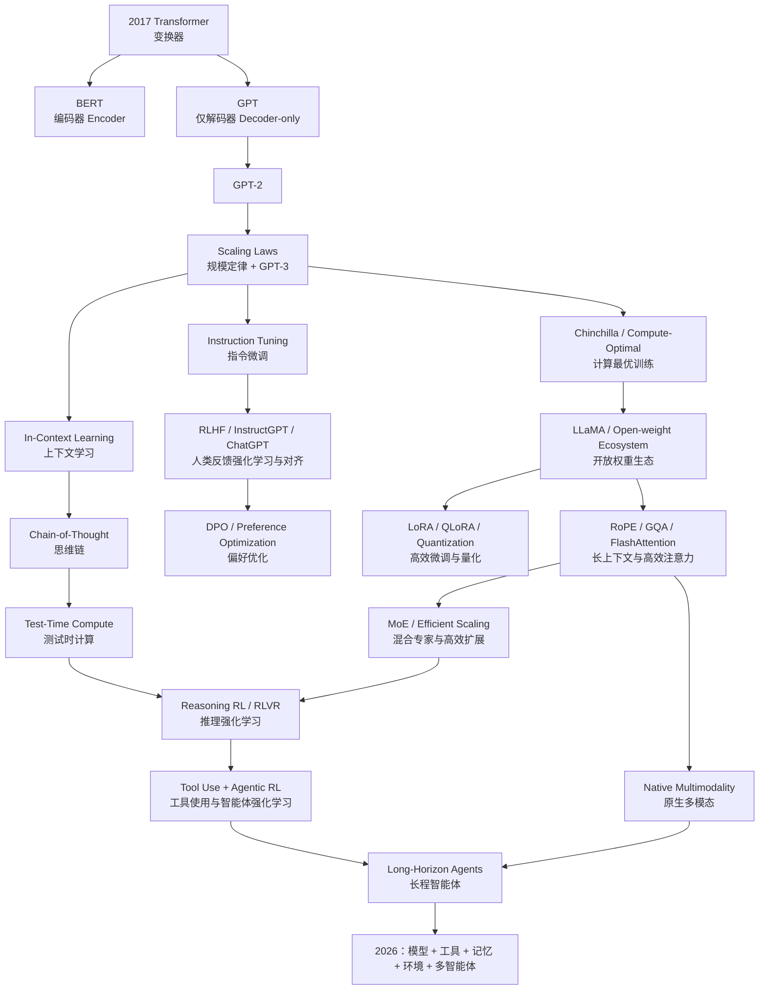

# 大语言模型发展史与技术原理

## 从 Transformer、GPT‑3 到推理模型与智能体 AI（Agentic AI）

> **版本**：v1.0 · 2026-09-14  
> **定位**：面向希望真正理解大语言模型（Large Language Model, LLM）发展脉络、数学机制、训练工程与前沿方向的系统教材。  
> **写作语言**：**中文为主，英文术语为辅**。第一次出现的重要术语尽量给出“中文名称（English Term）”，后续保留学界常用英文缩写。  
> **时间边界**：历史事实与技术状态更新至 **2026 年 9 月 14 日**；快速变化的产品信息会明确标注时间截面。

这不是一份“模型名单”，也不是把论文摘要串起来的编年史。本书试图回答一条更重要的问题：

> **从“预测下一个词元（token）”出发，研究者究竟经历了哪些瓶颈、做出了哪些关键选择，才一步步得到今天能够推理、看图、调用工具、写代码、执行长程任务的模型？**

阅读本书时，应始终把一个模型拆成六层来看：

1. **目标函数（Objective）**：它究竟优化什么？
2. **表示与架构（Representation & Architecture）**：词元（token）、注意力（attention）、前馈网络（FFN）、混合专家（MoE）、视觉编码器等如何组织？
3. **数据（Data）**：预训练、指令、偏好、可验证任务和环境轨迹分别提供了什么监督？
4. **优化（Optimization）**：AdamW、Muon、PPO、DPO、GRPO、RLVR 等到底改变哪一步？
5. **系统（Systems）**：并行训练、键值缓存（KV Cache）、FlashAttention、量化、推测解码如何决定实际可训练/可部署性？
6. **产品与智能体（Product & Agent）**：检索增强生成（RAG）、工具调用、浏览器、代码执行、记忆（memory）、多智能体怎样把“模型”变成“系统”？

---

## 仓库目录 / Repository Structure

> 路径名保留简洁英文，保证 Git、命令行、引用链接和后续自动化稳定；**所有面向读者的目录与标题采用中文优先的双语形式**。

| 路径 | 中文名称 | 用途 |
|---|---|---|
| [`book/`](book/) | **教材正文** | 从 Transformer 前传一直讲到 2026 年前沿 |
| [`appendices/`](appendices/) | **附录** | 数学基础、MiniGPT、后训练数学推导 |
| [`code/`](code/) | **教学代码** | 从零实现与可运行实验代码 |
| [`figures/`](figures/) | **教材图谱与插图** | 机制图、数据流图、时间线 |
| [`references/`](references/) | **参考文献与资料索引** | 原论文、官方技术报告、模型卡与官方资料 |
| [`scripts/`](scripts/) | **教材维护脚本** | 数学公式兼容、排版与内容维护工具 |
| [`.github/`](.github/) | **自动化工作流** | GitHub Actions 自动检查与格式规范化 |

---

## 全书目录 / Table of Contents

| 篇章 | 中文主题 | 关键英文术语 | 文件 |
|---|---|---|---|
| 导读 | 怎样用这本书真正学会大语言模型 | LLM Learning Guide | [`book/00-preface.md`](book/00-preface.md) |
| 第一篇 | **从 Seq2Seq 到 Transformer：大模型真正的技术起点** | Seq2Seq, Attention, Transformer, GPT, BERT | [`book/01-foundations-transformer.md`](book/01-foundations-transformer.md) |
| 第二篇 | **规模定律、GPT‑3、上下文学习与 Chinchilla** | Scaling Laws, GPT‑3, In-Context Learning, Compute-Optimal Training | [`book/02-scaling-gpt3.md`](book/02-scaling-gpt3.md) |
| 第三篇 | **指令微调、对齐、RLHF、ChatGPT 与 DPO** | Instruction Tuning, Alignment, RLHF, Preference Optimization | [`book/03-alignment-chatgpt.md`](book/03-alignment-chatgpt.md) |
| 第四篇 | **现代大模型架构组件** | RoPE, RMSNorm, SwiGLU, GQA, FlashAttention, KV Cache | [`book/04-modern-architecture.md`](book/04-modern-architecture.md) |
| 第五篇 | **开源大模型革命与高效微调** | LLaMA, Mistral, LoRA, QLoRA, Quantization | [`book/05-open-source-efficient-ft.md`](book/05-open-source-efficient-ft.md) |
| 第六篇 | **检索增强、多模态、工具调用与智能体** | RAG, Multimodality, Tool Use, Agent | [`book/06-rag-multimodal-agent.md`](book/06-rag-multimodal-agent.md) |
| 第七篇 | **混合专家与中国大模型路线** | MoE, GLM, Qwen, DeepSeek, Kimi, MiniMax | [`book/07-moe-china.md`](book/07-moe-china.md) |
| 第八篇 | **推理模型时代** | Chain-of-Thought, Test-Time Compute, RLVR, R1, Thinking Models | [`book/08-reasoning-era.md`](book/08-reasoning-era.md) |
| 第九篇 | **大模型训练系统** | Data, ZeRO, FSDP, Megatron, Parallelism, Stability | [`book/09-training-systems.md`](book/09-training-systems.md) |
| 第十篇 | **大模型推理与服务系统** | vLLM, PagedAttention, Continuous Batching, Speculative Decoding | [`book/10-inference-systems.md`](book/10-inference-systems.md) |
| 第十一篇 | **评测、安全、幻觉与数据污染** | Evaluation, Safety, Hallucination, Contamination | [`book/11-evaluation-safety.md`](book/11-evaluation-safety.md) |
| 第十二篇 | **2026 前沿：原生智能体、多模态、超长上下文与 Transformer 之后** | Native Agents, Multimodality, Long Context, Post-Transformer | [`book/12-frontier-2026.md`](book/12-frontier-2026.md) |
| 附录 A | **数学基础：线性代数、概率、信息论与优化** | Math Foundations | [`appendices/A-math.md`](appendices/A-math.md) |
| 附录 B | **从零实现 MiniGPT：训练与自回归推理** | MiniGPT Implementation | [`appendices/B-minigpt.md`](appendices/B-minigpt.md) |
| 附录 C | **后训练数学：RLHF、DPO、GRPO、RLVR 推导速查** | Post-Training Mathematics | [`appendices/C-post-training-math.md`](appendices/C-post-training-math.md) |
| 资料索引 | **时间线、术语表与核心论文索引** | Timeline, Glossary, References | [`references/README.md`](references/README.md) |

---

## 贯穿全书的技术总图

---

## 每章怎么读

每个核心技术按固定次序讲解：

**问题出现 → 历史背景 → 数据流 / 张量形状（shape）→ 数学 → 手算或最小例子 → 工程实现 → 代表论文/模型 → 局限 → 下一代技术为什么出现。**

书中会明确区分三类“进步”：

- **模型/算法进步（Model / Algorithm）**：改变学习目标、表示、训练或推理算法；
- **系统进步（Systems）**：数学函数可能不变，但通过内存、通信、计算核（kernel）、并行策略显著扩大可行规模；
- **产品/脚手架进步（Product / Scaffold）**：模型本身未必变化，但通过检索、工具、记忆（memory）、智能体循环（agent loop）获得新的系统能力。

把这三类混在一起，是理解大模型发展史最常见的错误之一。

---

## 中文与英文术语规则

本书不追求把所有术语强行翻译成中文，而采用“**中文帮助理解，英文保证与论文世界对齐**”的原则：

- 第一次出现：**上下文学习（In-Context Learning, ICL）**；
- 后续正文：可以直接写 **ICL** 或“上下文学习”；
- 已高度约定俗成的模型/方法名：Transformer、GPT、BERT、LoRA、MoE、RLHF 等保持英文；
- 容易造成理解障碍的普通英文词：优先给中文，例如 token → **词元（token）**、agent → **智能体（Agent）**、alignment → **对齐（alignment）**；
- 公式、变量、API、类名、函数名、代码路径不强行中文化。

---

## 引用原则

正文中的关键历史事实、定量结论、架构参数与方法来源都尽量直接链接到：

1. 原论文 / arXiv；
2. 官方技术报告、模型卡（model card）、系统卡（system card）；
3. 官方代码仓库与发布说明；
4. 只有在没有一手材料时，才使用高质量二手来源。

模型厂商自报基准测试（benchmark）会明确写成“官方报告称”而不是当作独立事实；不同模型之间若测试设置不同，不做未经控制的横向排名。

---

## 学习目标

读完后，你应该能把一个新模型报告翻译成真正的技术问题。例如看到：

> `400B-A32B MoE + GQA/MLA + 256K context + SFT + preference training + RLVR + tool use`

能够立即追问：

- 总参数与每个词元（token）激活参数分别是多少？路由器（router）如何工作？
- KV Cache 的真实占用是什么，GQA/MLA 压缩了哪一维？
- 256K 是训练长度、外推长度还是产品允许长度？长上下文是否通过有效性评测？
- SFT 学的是模仿，偏好优化（preference optimization）学的是偏好，RLVR 又在哪些可验证任务上提供新信号？
- “智能体能力（Agent Capability）”来自基础模型（base model）、后训练（post-training）、工具协议，还是智能体脚手架（agent scaffold）？
- 基准测试（benchmark）提升是否伴随更高测试时计算（test-time compute）？

当这些问题成为直觉，大语言模型就不再是一串产品名，而是一套可拆解、可复现、可质疑的技术系统。
