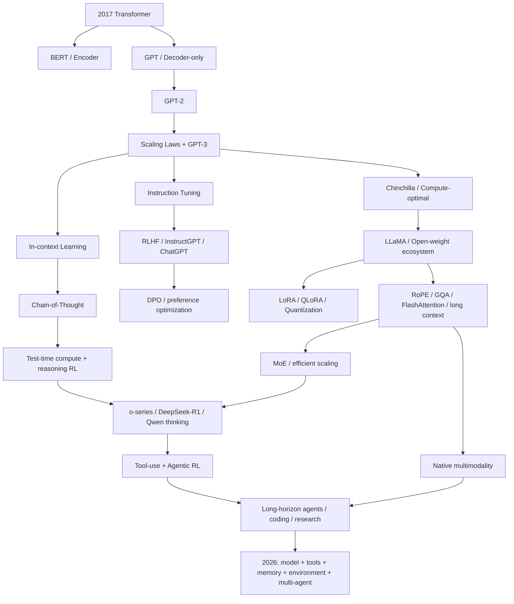

# 大语言模型发展史与技术原理：从 Transformer、GPT‑3 到推理模型与 Agentic AI

> **版本**：v1.0 · 2026-09-14  
> **定位**：面向希望真正理解大语言模型（LLM）发展脉络、数学机制、训练工程与前沿方向的系统教材。  
> **写作语言**：中文为主，保留必要英文术语。  
> **时间边界**：历史事实与技术状态更新至 **2026 年 9 月 14 日**；快速变化的产品信息会明确标注时间截面。

这不是一份“模型名单”，也不是把论文摘要串起来的编年史。本书试图回答一条更重要的问题：

> **从“预测下一个 token”出发，研究者究竟经历了哪些瓶颈、做出了哪些关键选择，才一步步得到今天能够推理、看图、调用工具、写代码、执行长程任务的模型？**

阅读本书时，应始终把一个模型拆成六层来看：

1. **目标函数**：它究竟优化什么？
2. **表示与架构**：token、attention、FFN、MoE、视觉编码器等如何组织？
3. **数据**：预训练、指令、偏好、可验证任务和环境轨迹分别提供了什么监督？
4. **优化**：AdamW、Muon、PPO、DPO、GRPO、RLVR 等到底改变哪一步？
5. **系统**：并行训练、KV Cache、FlashAttention、量化、推测解码如何决定实际可训练/可部署性？
6. **产品与智能体**：RAG、工具调用、浏览器、代码执行、memory、多智能体怎样把“模型”变成“系统”？

---

## 全书结构

| Part | 主题 | 文件 |
|---|---|---|
| 0 | 导读：怎样用这本书真正学会 LLM | [`book/00-preface.md`](book/00-preface.md) |
| I | Transformer 前传、Attention、GPT/BERT 分岔 | [`book/01-foundations-transformer.md`](book/01-foundations-transformer.md) |
| II | Scaling Laws、GPT‑3、ICL、Chinchilla 与数据 | [`book/02-scaling-gpt3.md`](book/02-scaling-gpt3.md) |
| III | Instruction Tuning、RLHF、ChatGPT、DPO | [`book/03-alignment-chatgpt.md`](book/03-alignment-chatgpt.md) |
| IV | 现代 LLM 架构：RoPE、RMSNorm、SwiGLU、GQA、FlashAttention、KV Cache | [`book/04-modern-architecture.md`](book/04-modern-architecture.md) |
| V | 开源革命与高效微调：LLaMA、Mistral、LoRA、QLoRA、量化 | [`book/05-open-source-efficient-ft.md`](book/05-open-source-efficient-ft.md) |
| VI | RAG、多模态、工具使用与 Agent | [`book/06-rag-multimodal-agent.md`](book/06-rag-multimodal-agent.md) |
| VII | MoE 与中国大模型路线：GLM、Qwen、DeepSeek、Kimi、MiniMax 等 | [`book/07-moe-china.md`](book/07-moe-china.md) |
| VIII | 推理模型时代：CoT、test-time compute、RLVR、R1、o 系列、混合思考 | [`book/08-reasoning-era.md`](book/08-reasoning-era.md) |
| IX | 训练系统：数据、并行、ZeRO/FSDP、Megatron、精度与稳定性 | [`book/09-training-systems.md`](book/09-training-systems.md) |
| X | 推理系统：vLLM、PagedAttention、continuous batching、量化、speculative decoding | [`book/10-inference-systems.md`](book/10-inference-systems.md) |
| XI | 评测、安全、幻觉、数据污染与“benchmark 是否等于智能” | [`book/11-evaluation-safety.md`](book/11-evaluation-safety.md) |
| XII | 2026 前沿：原生 Agent、多模态、超长上下文、稀疏注意力与 Transformer 之后 | [`book/12-frontier-2026.md`](book/12-frontier-2026.md) |
| A | 数学基础：线性代数、概率、信息论、优化 | [`appendices/A-math.md`](appendices/A-math.md) |
| B | 从零实现 MiniGPT：训练与自回归推理 | [`appendices/B-minigpt.md`](appendices/B-minigpt.md) |
| C | RLHF / DPO / GRPO / RLVR 推导速查 | [`appendices/C-post-training-math.md`](appendices/C-post-training-math.md) |
| D | 时间线、术语表与核心论文索引 | [`references/README.md`](references/README.md) |

---

## 贯穿全书的总图

---

## 每章怎么读

每个核心技术按固定次序讲解：

**问题出现 → 历史背景 → 数据流/shape → 数学 → 手算或最小例子 → 工程实现 → 代表论文/模型 → 局限 → 下一代技术为什么出现。**

书中会明确区分三类“进步”：

- **模型/算法进步**：改变学习目标、表示、训练或推理算法；
- **系统进步**：数学函数可能不变，但通过内存、通信、kernel、并行策略显著扩大可行规模；
- **产品/脚手架进步**：模型本身未必变化，但通过检索、工具、memory、agent loop 获得新的系统能力。

把这三类混在一起，是理解大模型发展史最常见的错误之一。

---

## 引用原则

正文中的关键历史事实、定量结论、架构参数与方法来源都尽量直接链接到：

1. 原论文 / arXiv；
2. 官方技术报告、模型卡、system card；
3. 官方代码仓库与发布说明；
4. 只有在没有一手材料时，才使用高质量二手来源。

模型厂商自报 benchmark 会明确写成“官方报告称”而不是当作独立事实；不同模型之间若测试设置不同，不做未经控制的横向排名。

---

## 学习目标

读完后，你应该能把一个新模型报告翻译成真正的技术问题。例如看到：

> `400B-A32B MoE + GQA/MLA + 256K context + SFT + preference training + RLVR + tool use`

能够立即追问：

- 总参数与每 token 激活参数分别是多少？router 如何工作？
- KV Cache 的真实占用是什么，GQA/MLA 压缩了哪一维？
- 256K 是训练长度、外推长度还是产品允许长度？长上下文是否通过有效性评测？
- SFT 学的是模仿，preference optimization 学的是偏好，RLVR 又在哪些可验证任务上提供新信号？
- “Agent 能力”来自 base model、post-training、工具协议，还是 agent scaffold？
- benchmark 提升是否伴随更高 test-time compute？

当这些问题成为直觉，大模型就不再是一串产品名，而是一套可拆解、可复现、可质疑的技术系统。
