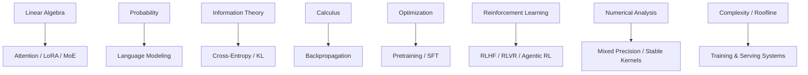

# Appendix A　大语言模型所需数学基础：从矩阵到概率、优化与强化学习

> 这不是一本独立的数学教材，而是一份“读 LLM 论文够用、推公式不迷路”的数学地图。所有符号都尽量回到 Transformer、Scaling、RLHF、MoE、LoRA 与推理系统中使用。

---

# A.1　标量、向量、矩阵与张量

## 标量

$$
x\in\mathbb R.
$$

例如一个 loss：

$$
L=2.31.
$$

## 向量

$$
x\in\mathbb R^d.
$$

一个 token 的 hidden state 可以写：

$$
h_t\in\mathbb R^d.
$$

## 矩阵

$$
X\in\mathbb R^{m\times n}.
$$

一段长度为 $T$ 的 hidden states：

$$
X\in\mathbb R^{T\times d}.
$$

## 张量

加入 batch 后：

$$
X\in\mathbb R^{B\times T\times d}.
$$

多头 attention：

$$
Q\in\mathbb R^{B\times h\times T\times d_h}.
$$

第一条习惯：**看到公式先在旁边写 shape。**

---

# A.2　矩阵乘法：Transformer 里最重要的操作

若：

$$
A\in\mathbb R^{m\times n},
\qquad
B\in\mathbb R^{n\times p},
$$

则：

$$
C=AB\in\mathbb R^{m\times p}.
$$

元素：

$$
C_{ij}=\sum_{k=1}^{n}A_{ik}B_{kj}.
$$

例如：

$$
X:[B,T,d],
\qquad
W_Q:[d,d],
$$

则：

$$
Q=XW_Q:[B,T,d].
$$

这里 batch 和 sequence 两维可以理解为大量并行行向量。

---

# A.3　点积、相似度与 Attention

两个向量：

$$
x,y\in\mathbb R^d.
$$

点积：

$$
x^Ty=\sum_i x_iy_i.
$$

若写成长度与夹角：

$$
x^Ty=\|x\|_2\|y\|_2\cos\theta.
$$

所以点积同时受：

- 向量方向；
- 向量长度

影响。

cosine similarity 则把长度归一：

$$
\cos(x,y)=
\frac{x^Ty}{\|x\|_2\|y\|_2}.
$$

Embedding retrieval 常用 cosine / inner product；attention 则使用 scaled query-key inner product。

---

# A.4　转置与 $QK^T$

若：

$$
Q,K\in\mathbb R^{T\times d_h},
$$

那么：

$$
K^T\in\mathbb R^{d_h\times T}.
$$

所以：

$$
QK^T\in\mathbb R^{T\times T}.
$$

其中：

$$
(QK^T)_{ij}=q_i^Tk_j.
$$

因此第 $i$ 行第 $j$ 列就是：

> query position $i$ 与 key position $j$ 的相似度。

这就是为什么 attention score matrix 的两个轴都是 sequence position。

---

# A.5　Norm：向量有多“大”？

L1：

$$
\|x\|_1=\sum_i|x_i|.
$$

L2：

$$
\|x\|_2=
\sqrt{\sum_i x_i^2}.
$$

Frobenius norm：

$$
\|W\|_F=
\sqrt{\sum_{ij}W_{ij}^2}.
$$

梯度裁剪经常使用 global norm：

$$
g\leftarrow
 g\cdot
\min\left(1,\frac{c}{\|g\|}\right).
$$

若梯度 norm 超过阈值 $c$，整体按比例缩小。

---

# A.6　均值、方差与标准差

均值：

$$
\mu=\frac1n\sum_i x_i.
$$

方差：

$$
\sigma^2=
\frac1n\sum_i(x_i-\mu)^2.
$$

标准差：

$$
\sigma=\sqrt{\sigma^2}.
$$

LayerNorm 就是在 hidden dimension 内使用这些统计量。

RMS：

$$
\mathrm{RMS}(x)
=\sqrt{\frac1n\sum_i x_i^2}.
$$

RMSNorm 则直接按 RMS 做尺度归一化。

---

# A.7　指数与对数：为什么机器学习到处是 $\log$

指数：

$$
e^{a+b}=e^ae^b.
$$

对数：

$$
\log(ab)=\log a+\log b.
$$

概率序列的联合概率往往是很多小数相乘：

$$
p(x_1,\ldots,x_T)
=
\prod_t p(x_t|x_{<t}).
$$

取 log：

$$
\log p(x_{1:T})
=
\sum_t\log p(x_t|x_{<t}).
$$

乘法变加法，更稳定也更方便优化。

所以语言模型训练通常最大化 log-likelihood，而不是直接最大化概率乘积。

---

# A.8　Softmax：从 Logits 到概率

给定 logits：

$$
z=[z_1,\ldots,z_K].
$$

softmax：

$$
p_i=rac{e^{z_i}}{\sum_j e^{z_j}}.
$$

性质：

$$
p_i>0,
\qquad
\sum_i p_i=1.
$$

若所有 logits 同时加常数 $c$：

$$
\mathrm{softmax}(z+c)=\mathrm{softmax}(z).
$$

因此数值实现常减最大值：

$$
p_i=
\frac{e^{z_i-m}}
{\sum_j e^{z_j-m}},
\quad m=\max_jz_j.
$$

这避免指数溢出。

---

# A.9　LogSumExp：数值稳定里极其重要的技巧

定义：

$$
\mathrm{LSE}(z)=
\log\sum_i e^{z_i}.
$$

稳定形式：

$$
\mathrm{LSE}(z)
=m+\log\sum_i e^{z_i-m},
$$

其中：

$$
m=\max_i z_i.
$$

LogSoftmax：

$$
\log p_i
=z_i-\mathrm{LSE}(z).
$$

CrossEntropy 通常直接使用 log-softmax 的 fused/stable implementation，而不是先算概率再手动取 log。

---

# A.10　概率：随机变量与条件概率

联合概率：

$$
p(x,y).
$$

边缘概率：

$$
p(x)=\sum_y p(x,y).
$$

条件概率：

$$
p(y|x)=\frac{p(x,y)}{p(x)}.
$$

乘法公式：

$$
p(x,y)=p(y|x)p(x).
$$

语言模型使用 chain rule：

$$
p(x_1,\ldots,x_T)
=
\prod_{t=1}^Tp(x_t|x_{<t}).
$$

这不是 Transformer 特有，而是概率分解本身。

---

# A.11　Bayes 定理

$$
p(z|x)
=
\frac{p(x|z)p(z)}{p(x)}.
$$

其中：

- $p(z)$：prior；
- $p(x|z)$：likelihood；
- $p(z|x)$：posterior。

ICL 的某些理论解释把 prompt demonstrations 看成 evidence，模型推断 latent task：

$$
p(z|D_{demo}).
$$

需要强调：这是解释框架，不代表 Transformer 显式保存了一张 textbook Bayes table。

---

# A.12　期望与方差

离散随机变量：

$$
\mathbb E[X]=\sum_x xp(x).
$$

方差：

$$
\mathrm{Var}(X)
=
\mathbb E[(X-\mathbb E[X])^2].
$$

强化学习的目标经常写：

$$
J(\theta)
=
\mathbb E_{\tau\sim\pi_\theta}[R(\tau)].
$$

即：在当前策略产生的轨迹分布上，最大化期望回报。

---

# A.13　熵：分布有多不确定？

离散熵：

$$
H(P)
=-\sum_i p_i\log p_i.
$$

若分布非常尖锐：

```text
[0.99, 0.005, 0.005]
```

熵低。

若接近均匀：

```text
[0.34, 0.33, 0.33]
```

熵高。

Temperature 会改变 softmax 分布熵：

$$
p_i(T)=
\frac{e^{z_i/T}}
{\sum_j e^{z_j/T}}.
$$

一般 $T\uparrow$ 会让分布更平。

---

# A.14　Cross-Entropy：训练分类与语言模型的核心

真实分布 $P$，模型分布 $Q$：

$$
H(P,Q)
=-\sum_i P(i)\log Q(i).
$$

若 label 是 one-hot，正确类别 $y$：

$$
P(y)=1,
$$

则：

$$
H(P,Q)=-\log Q(y).
$$

这就是 next-token cross-entropy。

---

# A.15　KL Divergence：两个分布差多远？

$$
D_{KL}(P\Vert Q)
=
\sum_iP(i)\log\frac{P(i)}{Q(i)}.
$$

性质：

$$
D_{KL}(P\Vert Q)\ge0,
$$

且：

$$
D_{KL}(P\Vert Q)
e D_{KL}(Q\Vert P).
$$

所以它不是距离 metric。

RLHF 中常惩罚新 policy 偏离 reference：

$$
R=r-\beta D_{KL}(\pi_\theta\Vert\pi_{ref}).
$$

直觉：

> 获得更高 reward，但不要把原模型的语言分布破坏得太远。

---

# A.16　Cross-Entropy、Entropy 与 KL 的关系

$$
H(P,Q)=H(P)+D_{KL}(P\Vert Q).
$$

训练数据分布 $P$ 固定，因此最小化 cross-entropy 等价于最小化：

$$
D_{KL}(P\Vert Q_\theta).
$$

从这个角度，最大似然训练是在让模型分布逼近数据分布。

---

# A.17　Maximum Likelihood Estimation

数据：

$$
D=\{x^{(1)},\ldots,x^{(N)}\}.
$$

MLE：

$$
\theta^*
=
\arg\max_\theta
\prod_i p_\theta(x^{(i)}).
$$

取 log：

$$
\theta^*
=
\arg\max_\theta
\sum_i\log p_\theta(x^{(i)}).
$$

等价于最小化 negative log-likelihood。

语言模型本质上就是超高维条件分布的 MLE/近似 MLE 系统之一。

---

# A.18　微分：梯度到底是什么？

标量函数：

$$
y=f(x).
$$

导数：

$$
\frac{dy}{dx}
=
\lim_{\Delta x\to0}
\frac{f(x+\Delta x)-f(x)}{\Delta x}.
$$

多变量：

$$
L=f(\theta_1,\ldots,\theta_n).
$$

梯度：

$$
\nabla_\theta L
=
\begin{bmatrix}
\frac{\partial L}{\partial\theta_1}\\
\vdots\\
\frac{\partial L}{\partial\theta_n}
\end{bmatrix}.
$$

它指向局部上升最快方向，因此 gradient descent 使用：

$$
\theta\leftarrow\theta-\eta\nabla_\theta L.
$$

---

# A.19　Chain Rule：Backprop 的数学核心

若：

$$
y=f(u),
\qquad
u=g(x),
$$

则：

$$
\frac{dy}{dx}
=
\frac{dy}{du}\frac{du}{dx}.
$$

深层神经网络：

$$
x\to h_1\to h_2\to\cdots\to L.
$$

梯度沿 computation graph 反向应用 chain rule。

Backpropagation 不是一个不同于微积分的神秘算法，而是**高效复用中间导数的 chain-rule 计算过程**。

---

# A.20　Jacobian

向量函数：

$$
y=f(x),
\quad
x\in\mathbb R^n,
\quad
y\in\mathbb R^m.
$$

Jacobian：

$$
J_{ij}
=
\frac{\partial y_i}{\partial x_j}.
$$

因此：

$$
J\in\mathbb R^{m\times n}.
$$

深层网络梯度涉及 Jacobian 连乘，这正是 RNN vanishing/exploding gradient 的数学根源之一。

---

# A.21　一个 Softmax + Cross-Entropy 的漂亮梯度

设：

$$
p=\mathrm{softmax}(z),
$$

真实 one-hot label：

$$
y.
$$

cross entropy：

$$
L=-\sum_i y_i\log p_i.
$$

最终可得：

$$
\frac{\partial L}{\partial z_i}
=p_i-y_i.
$$

这极其直观。

若正确类别 $i$：

$$
y_i=1,
$$

则：

$$
\frac{\partial L}{\partial z_i}=p_i-1<0,
$$

gradient descent 会把正确 logit 往上推。

错误类别：

$$
y_j=0,
$$

则：

$$
\frac{\partial L}{\partial z_j}=p_j>0,
$$

更新会把错误 logit 往下压。

---

# A.22　SGD 与 Mini-Batch

完整数据梯度：

$$
\nabla L
=
\frac1N\sum_{i=1}^N\nabla\ell_i.
$$

数据太大，因此使用 mini-batch：

$$
\hat g
=
\frac1B\sum_{i\in\mathcal B}\nabla\ell_i.
$$

它是 noisy estimate。

适度 stochasticity 不是 bug；它是现代训练的基本组成。

---

# A.23　Momentum

$$
v_t=\beta v_{t-1}+(1-\beta)g_t,
$$

$$
\theta_{t+1}=	heta_t-\eta v_t.
$$

直觉像给更新加惯性：

- 抵消高频噪声；
- 沿长期一致方向加速。

---

# A.24　Adam / AdamW

Adam 一阶矩：

$$
m_t=\beta_1m_{t-1}+(1-\beta_1)g_t.
$$

二阶矩：

$$
v_t=\beta_2v_{t-1}+(1-\beta_2)g_t^2.
$$

偏差修正后：

$$
\hat m_t=\frac{m_t}{1-\beta_1^t},
$$

$$
\hat v_t=\frac{v_t}{1-\beta_2^t}.
$$

更新：

$$
\theta_{t+1}
=
\theta_t-\eta
\frac{\hat m_t}{\sqrt{\hat v_t}+\epsilon}.
$$

AdamW 把 weight decay 与 adaptive gradient update 解耦。[Loshchilov & Hutter, 2017](https://arxiv.org/abs/1711.05101)

---

# A.25　Learning Rate

$$
\eta
$$

控制单步更新尺度。

太大：

- loss spike；
- divergence。

太小：

- 学得慢；
- compute 浪费。

大模型通常配 warmup + decay。

学习率不是越小越安全，因为训练预算有限：

$$
\text{optimization quality}
$$

与：

$$
\text{time/compute budget}
$$

必须一起考虑。

---

# A.26　矩阵秩与 LoRA

矩阵：

$$
W\in\mathbb R^{m\times n}.
$$

rank 是其线性独立行/列空间维度。

若：

$$
\mathrm{rank}(W)=r,
$$

则它可以被表示为低维因子乘积。

LoRA 使用：

$$
\Delta W=BA,
$$

其中：

$$
B\in\mathbb R^{m\times r},
\qquad
A\in\mathbb R^{r\times n}.
$$

参数量从：

$$
mn
$$

降到：

$$
r(m+n).
$$

当 $r\ll m,n$ 时非常省。

---

# A.27　SVD：理解低秩近似

任意矩阵：

$$
W=U\Sigma V^T.
$$

其中 singular values：

$$
\sigma_1\ge\sigma_2\ge\cdots.
$$

取前 $r$ 项：

$$
W_r=U_r\Sigma_rV_r^T
$$

给出经典意义下最优的 rank-$r$ 近似之一。

LoRA 并不是先对真实 $\Delta W$ 做 SVD 再截断，而是直接把可训练更新参数化为低秩因子；但 SVD 提供了“为什么低秩压缩可能有效”的线性代数背景。

---

# A.28　特征值与稳定性直觉

方阵：

$$
Av=\lambda v.
$$

$v$ 是 eigenvector，$\lambda$ 是 eigenvalue。

在重复线性动力系统：

$$
x_t=A^tx_0,
$$

如果最大特征值绝对值：

$$
|\lambda_{max}|>1,
$$

某些方向可能指数增长；若都小于 1，则衰减。

这对理解 RNN dynamics、优化稳定性、线性 state-space 模型都很重要。

---

# A.29　凸优化与非凸优化

凸函数满足：

$$
f(\lambda x+(1-\lambda)y)
\le
\lambda f(x)+(1-\lambda)f(y).
$$

深度神经网络训练是高度非凸的。

所以我们没有保证：

$$
\text{gradient descent}\rightarrow\text{global optimum}.
$$

现代大模型训练之所以成功，很大程度依赖：

- overparameterization；
- architecture；
- initialization；
- normalization；
- optimizer；
- data scale

共同形成一个实际可优化的 landscape。

---

# A.30　强化学习的基本对象：MDP

Markov Decision Process：

$$
(\mathcal S,\mathcal A,P,R,\gamma).
$$

- $s_t$：state；
- $a_t$：action；
- $P(s_{t+1}|s_t,a_t)$：transition；
- $r_t$：reward；
- $\gamma$：discount factor。

LLM 生成可以写：

$$
s_t=(x,y_{<t}),
$$

$$
a_t=y_t.
$$

Agent 则把 state 扩展为工具和环境 observation。

---

# A.31　Return

$$
G_t
=
\sum_{k=0}^{\infty}\gamma^k r_{t+k}.
$$

episodic LLM task 中常把最终 reward 放在 sequence 结尾。

例如数学题：

```text
中间 tokens → reward 0
最终答案正确 → reward 1
```

此时 credit assignment 很稀疏。

---

# A.32　Value Function

状态价值：

$$
V^\pi(s)
=
\mathbb E_\pi[G_t|s_t=s].
$$

动作价值：

$$
Q^\pi(s,a)
=
\mathbb E_\pi[G_t|s_t=s,a_t=a].
$$

Advantage：

$$
A^\pi(s,a)=Q^\pi(s,a)-V^\pi(s).
$$

直觉：

> 这个动作比当前状态下“通常水平”好多少？

PPO 等算法用 advantage 控制 policy update 方向。

---

# A.33　Policy Gradient

目标：

$$
J(\theta)
=
\mathbb E_{\tau\sim\pi_\theta}[R(\tau)].
$$

经典 policy gradient：

$$
\nabla_\theta J
=
\mathbb E\left[
\sum_t
\nabla_\theta\log\pi_\theta(a_t|s_t)
A_t
\right].
$$

解释：

- $A_t>0$：提高这个动作 log-prob；
- $A_t<0$：降低这个动作 log-prob。

这正是 reasoning RL 中“成功轨迹以后更容易被生成”的数学核心之一。

---

# A.34　Importance Ratio

PPO 常定义：

$$
r_t(\theta)
=
\frac{\pi_\theta(a_t|s_t)}
{\pi_{old}(a_t|s_t)}.
$$

如果：

$$
r_t>1,
$$

说明新 policy 更偏好这个动作。

如果：

$$
r_t<1,
$$

说明新 policy 降低它概率。

PPO clip 防止：

$$
r_t
$$

一次偏离 1 太远。

---

# A.35　Bradley–Terry Preference Model

给两个回答 $y_1,y_2$，标量 reward：

$$
r_1,r_2.
$$

假设：

$$
P(y_1\succ y_2)
=
\sigma(r_1-r_2).
$$

若：

$$
r_1=r_2,
$$

则：

$$
P=0.5.
$$

若：

$$
r_1-r_2\rightarrow+\infty,
$$

则：

$$
P\rightarrow1.
$$

Reward Model 和 DPO 都建立在类似 pairwise preference 结构上。

---

# A.36　数值精度：FP32、BF16、FP16、FP8

浮点数一般包含：

- sign；
- exponent；
- mantissa。

粗略地：

### FP32

范围与精度都高，4 bytes。

### FP16

2 bytes，mantissa 较多但 exponent 较窄，容易 overflow。

### BF16

2 bytes，与 FP32 一样使用 8-bit exponent，因此 dynamic range 大，但 mantissa 更少。

### FP8

1 byte，需要更积极 scaling / accumulation strategy。

训练时常见策略：

```text
low precision storage / matmul
+
higher precision accumulation
+
scaling
```

---

# A.37　为什么 Floating Point 加法不满足严格结合律？

理论实数：

$$
(a+b)+c=a+(b+c).
$$

浮点数因为每一步都舍入：

$$
\mathrm{fl}(\mathrm{fl}(a+b)+c)
$$

可能不等于：

$$
\mathrm{fl}(a+\mathrm{fl}(b+c)).
$$

所以：

- 并行 reduction 顺序；
- GPU kernel；
- distributed world size

都可能产生微小数值差异。

这也是“固定随机种子不一定能获得 bitwise identical 大规模训练”的原因之一。

---

# A.38　复杂度记号

$$
O(n)
$$

描述渐近增长阶，不是精确运行时间。

Full attention：

$$
O(T^2d)
$$

不意味着序列翻倍后 wall-clock 一定严格变四倍，因为：

- kernel utilization；
- memory；
- parallelism；
- hardware

都会改变常数项。

算法复杂度与真实硬件性能必须同时看。

---

# A.39　FLOPs、Bandwidth、Arithmetic Intensity

算术强度：

$$
AI
=
\frac{\text{FLOPs}}
{\text{Bytes transferred}}.
$$

AI 高：更可能 compute-bound。

AI 低：更可能 memory-bound。

LLM Prefill 的大 GEMM 常有较高 AI；单 token Decode 常有较低 AI，因此更受 HBM bandwidth 约束。

Roofline model 就是在：

$$
\text{compute peak}
$$

与：

$$
\text{bandwidth}\times AI
$$

之间判断性能上限。

---

# A.40　一张数学地图



如果这七块基础能够自由切换，绝大多数 LLM 论文里的数学就不再神秘。

---

# A.41　建议手算清单

必须真正手算至少一次：

1. 一个 $2\times2$ matrix multiplication；
2. 一个 3-token self-attention；
3. softmax；
4. cross-entropy；
5. softmax-cross-entropy gradient $p-y$；
6. 两层线性网络 chain rule；
7. Adam 两步更新；
8. KL divergence；
9. LoRA 参数量；
10. Bradley–Terry reward loss；
11. PPO ratio；
12. GRPO group-normalized advantage。

真正做完这些，再读模型论文，公式会从符号变成计算。

---

# A.42　练习

### 练习 A1

设：

$$
A=
\begin{bmatrix}
1&2\\3&4
\end{bmatrix},
\quad
B=
\begin{bmatrix}
2&0\\1&3
\end{bmatrix}.
$$

计算 $AB$、$BA$，并解释为什么矩阵乘法一般不交换。

### 练习 A2

手算：

$$
\mathrm{softmax}([1,2,3]).
$$

再手算 temperature $T=0.5,2$ 的结果，比较 entropy。

### 练习 A3

真实类别为第 2 类，模型概率：

$$
p=[0.1,0.7,0.2].
$$

计算 cross-entropy 与 logits gradient $p-y$。

### 练习 A4

计算：

$$
P=[0.5,0.4,0.1],
\quad
Q=[0.4,0.4,0.2]
$$

的 $D_{KL}(P\Vert Q)$ 与 $D_{KL}(Q\Vert P)$，验证不对称。

### 练习 A5

设 LoRA：

$$
W\in\mathbb R^{8192\times8192},
\quad r=32.
$$

计算 full matrix 与 LoRA trainable parameter 数量及比例。

### 练习 A6

reward：

$$
r=[1.0,0.8,0.2,-0.4].
$$

手算 mean、std 和 normalized group advantages，理解 GRPO 的 relative baseline。

---

# 推荐基础来源

- Goodfellow, Bengio & Courville, **Deep Learning**, 2016: https://www.deeplearningbook.org/
- Bishop, **Pattern Recognition and Machine Learning**, 2006.
- Murphy, **Probabilistic Machine Learning**, 2022–2023: https://probml.github.io/pml-book/
- Sutton & Barto, **Reinforcement Learning: An Introduction**, 2nd ed.: http://incompleteideas.net/book/the-book-2nd.html
- Loshchilov & Hutter, **Decoupled Weight Decay Regularization**, 2017: https://arxiv.org/abs/1711.05101
