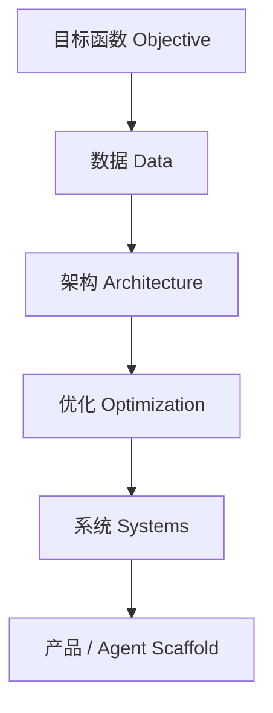
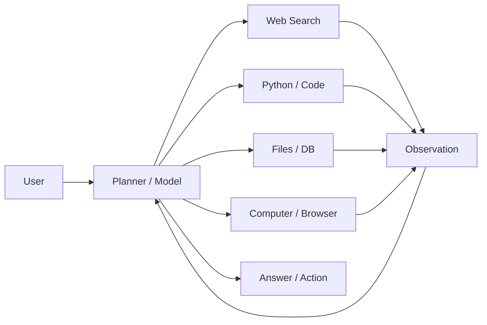

# Part 0　导读：怎样真正学会大语言模型

> **本章目标**：建立全书的统一观察框架。你不需要在这一章记模型参数，而要先学会“怎么看一个模型”。

大语言模型的发展史很容易被写成产品时间线：GPT‑3、ChatGPT、GPT‑4、LLaMA、DeepSeek、Qwen、Claude、Gemini……这种记法的问题是，一旦再来一个新模型，旧知识马上显得过时。真正稳定的知识不是产品名，而是**问题—机制—代价—新问题**之间的因果链。

本书因此不会从“某年某月某公司发布了某模型”开始，而从一个更朴素的问题开始：

> **为什么一个以 next-token prediction 为主要预训练目标的神经网络，最后能够表现出问答、编程、翻译、推理、工具调用和长程任务执行能力？**

截至 2026 年，这个问题仍没有一个简单、完备、被所有研究者接受的理论答案。我们已经有大量经验规律、局部理论和工程事实，却不能把“能力涌现”粗暴解释为“参数多了就智能”。这也是本书的第一条原则：**把已证实的事实、经验规律与解释性假说分开。**

---

## 0.1　先建立六层模型观

面对任意 LLM，不妨先画六层。



### 第一层：目标函数

预训练最常见的目标仍是自回归语言建模：

\[
\mathcal{L}_{\text{LM}}
= -\sum_{t=1}^{T}\log p_\theta(x_t\mid x_{<t}).
\]

但“今天的大模型”并不只经历这一项损失。一个现代模型的生命周期往往包含：

\[
\text{Pretrain}
\rightarrow \text{SFT}
\rightarrow \text{Preference Optimization}
\rightarrow \text{RL / RLVR / Agentic RL}.
\]

因此，问“这个模型是什么架构”往往还不够；**post-training recipe** 已经成为决定模型行为的重要部分。

### 第二层：数据

同一个 Transformer，用不同数据训练，会得到完全不同的能力分布。现代数据通常至少分为：

- 大规模预训练语料；
- 代码、数学、科学等高价值领域数据；
- 指令—回答数据；
- 人类或 AI 偏好对；
- 可自动验证的数学/代码任务；
- 工具调用轨迹；
- 浏览器、终端、软件工程或其他环境交互轨迹；
- 图像、音频、视频等多模态数据。

**数据不是“喂给模型的材料”这么简单，而是在定义模型被奖励去学习什么。**

### 第三层：架构

今天“Transformer”三个字已经掩盖了大量变化：

- Pre-Norm / RMSNorm；
- GELU → SwiGLU 等 gated FFN；
- absolute position → RoPE；
- MHA → MQA / GQA / MLA；
- Dense FFN → sparse MoE；
- full attention → sliding-window / block sparse / linear-hybrid attention；
- 文本单模态 → 原生多模态；
- 普通 residual → 新型 residual / routing 结构。

这些变化有的改善模型质量，有的主要改善训练稳定性，有的几乎完全是为了**内存带宽与推理吞吐**。

### 第四层：优化

Adam/AdamW 长期占据主流，但大模型训练中的“优化”还包括：

- learning-rate schedule；
- weight decay；
- gradient clipping；
- warmup；
- batch / token budget；
- mixed precision；
- optimizer state sharding；
- 新优化器，如 Muon 系列；
- RL 阶段中的 PPO、GRPO 及其他 policy optimization 方法。

很多模型“训练秘诀”并不是一个漂亮的新公式，而是**把巨大系统稳定训练数周或数月而不炸掉**。

### 第五层：系统

一个数学上正确的模型，不代表能被经济地训练和部署。系统层包括：

- data / tensor / pipeline / sequence / expert parallelism；
- ZeRO、FSDP；
- FlashAttention；
- KV Cache；
- PagedAttention；
- continuous batching；
- quantization；
- speculative decoding；
- disaggregated prefill/decode；
- GPU/NPU/TPU 的通信与 kernel 优化。

**FlashAttention 是理解“算法没有变，速度却能发生代际变化”的最佳案例之一。**它计算的是 exact attention，却通过 IO-aware tiling 减少 HBM 与片上 SRAM 之间的数据搬运。原论文见 [Dao et al., 2022](https://arxiv.org/abs/2205.14135)。

### 第六层：产品与 Agent Scaffold

到 2025–2026 年，一个用户感知到的“AI 能力”往往已经不能归因于单次模型前向：



于是必须区分：

\[
\text{Model capability}\neq \text{System capability}.
\]

一个 coding benchmark 的提高，可能来自更强 base model，也可能来自更好的检索、更长的运行时间、更优的 agent loop、更高的 token budget 或更多次尝试。若不控制这些变量，排名很容易被误读。

---

## 0.2　不要把“ChatGPT”与“GPT‑3”混成一个概念

GPT‑3 是 2020 年发表的 175B 参数自回归语言模型，核心历史意义之一是系统展示了随着规模扩大而显著增强的 zero-shot、one-shot 与 few-shot / in-context learning 能力。[Brown et al., 2020](https://arxiv.org/abs/2005.14165)

ChatGPT 则于 2022 年 11 月 30 日作为对话系统发布，官方说明其训练使用了与 InstructGPT 相近的 RLHF 方法，并针对对话数据做了调整。[OpenAI, 2022](https://openai.com/index/chatgpt/)

所以更准确的历史链是：

```text
GPT-3：规模 + 自回归预训练 + ICL
        ↓
Instruction tuning / InstructGPT：让模型“按人的意图做事”
        ↓
RLHF：用偏好信号塑造行为
        ↓
ChatGPT：对话形式 + 对齐模型 + 大规模真实用户反馈闭环
```

这一点极其重要，因为它揭示了一个长期主题：

> **“知道很多”与“会按要求使用这些知识”是两件不同的事。**

InstructGPT 论文中，1.3B 参数模型的输出在人类偏好评测上可以胜过 175B GPT‑3，正好说明“参数规模”不能独自解释用户体验。[Ouyang et al., 2022](https://arxiv.org/abs/2203.02155)

---

## 0.3　三种“能力提升”必须分开

### 0.3.1　训练后模型真的变了

例如 SFT、DPO、RL 后，参数 \(\theta\) 发生更新：

\[
\theta \leftarrow \theta - \eta\nabla_\theta \mathcal{L}.
\]

这是最直观的“学习”。

### 0.3.2　参数没变，但上下文让行为改变

GPT‑3 将 in-context learning 推到主流视野：给定 prompt 中的若干示例，模型在**不做梯度更新**的情况下改变输出策略。[Brown et al., 2020](https://arxiv.org/abs/2005.14165)

形式上：

\[
p_\theta(y\mid x, D_{\text{demo}})
\]

中的 \(\theta\) 没有变化，但条件上下文 \(D_{\text{demo}}\) 改变了分布。

这就是为什么“模型在 prompt 里学会一个任务”与“模型参数被训练了”必须区分。

### 0.3.3　模型没变，外部系统让任务成功率提高

RAG、工具调用、搜索、代码执行、memory 都属于此类。系统能力可以写成一个交互过程：

\[
(s_t, o_t) \xrightarrow{\pi_\theta} a_t
\xrightarrow{\text{environment}} o_{t+1}.
\]

此时我们研究的不再只是 \(p(y\mid x)\)，而是一个策略在环境中的轨迹：

\[
\tau=(o_0,a_0,o_1,a_1,\ldots,o_T).
\]

这一步正是从 chatbot 走向 agent 的概念跃迁。

---

## 0.4　“推理”这个词至少有四种含义

大模型领域对 reasoning 的使用非常混乱。本书会区分：

1. **能力层 reasoning**：任务需要多步关系推导；
2. **文本层 reasoning trace**：模型生成 chain-of-thought 或 scratchpad；
3. **计算层 test-time compute**：在回答前消耗更多 token、采样、搜索或验证；
4. **训练层 reasoning RL**：用可验证奖励或过程/结果反馈，让模型学会更有效的解题策略。

2022 年 Chain-of-Thought prompting 表明，给大型模型提供中间推理示例可以显著改善一些算术、常识和符号推理任务。[Wei et al., 2022](https://arxiv.org/abs/2201.11903)

到 2024 年 OpenAI o1，官方开始明确强调：性能会随更多**训练期 RL compute** 和更多**测试期思考 compute** 提升。[OpenAI, 2024](https://openai.com/index/learning-to-reason-with-llms/)

到 2025 年 DeepSeek-R1，开源技术报告进一步展示了大规模 RL 可以在没有预先 SFT 的 R1-Zero 上诱导出一系列推理行为，而正式 R1 再通过 cold start 与多阶段训练解决可读性、语言混杂等问题。[DeepSeek-AI, 2025/2026](https://arxiv.org/abs/2501.12948)

因此，“reasoning model”不是简单的“会写更长 CoT 的模型”。真正的问题是：

> **额外计算被用在何处？训练信号是什么？搜索空间是什么？是否有 verifier？最终提升来自模型内部策略变化还是外部搜索？**

---

## 0.5　理解长上下文时，不要只看“128K / 1M”

上下文长度至少有五个不同概念：

- tokenizer 后允许输入的最大 token 数；
- 预训练实际覆盖的长度分布；
- 长上下文 continued training 的长度；
- 位置编码可外推的理论/工程长度；
- 模型真正能够**有效利用**信息的长度。

因此：

\[
\text{context window} \not\Rightarrow \text{effective context utilization}.
\]

Gemini 1.5 在 2024 年将 1M token 长上下文推入主流产品讨论，并报告了在长序列 needle-in-a-haystack 等测试上的结果；Google 也明确指出其架构采用 MoE。[Google, 2024](https://blog.google/innovation-and-ai/products/google-gemini-next-generation-model-february-2024/)

到 2026 年，百万 token 级上下文已出现在多条公开模型线上，但评价标准已经从“能塞进去多少”转向：**prefill 成本、KV/状态成本、远距离信息检索、跨段推理、长程 agent 记忆是否可靠。**

---

## 0.6　理解 benchmark：先问实验条件，再看数字

看到一个榜单分数时，至少检查：

| 变量 | 为什么重要 |
|---|---|
| pass@1 / pass@k | 多采样本身会提高成功率 |
| 是否使用 CoT | 改变 test-time compute |
| thinking budget | 同一模型不同预算不可直接比 |
| 是否使用工具 | 搜索、Python、代码执行会改变任务定义 |
| agent scaffold | SWE-bench 一类任务高度依赖执行框架 |
| 数据污染 | benchmark 可能进入预训练或后训练集 |
| verifier / reranking | 生成 1000 个候选再筛与单样本不是同一问题 |
| closed vs open model | 无法核验训练数据时应谨慎下结论 |

例如 OpenAI 2024 年公布 o1 评测时同时报告了单样本、64 样本共识、1000 样本重排等不同设置；这些数字代表的是不同计算预算下的系统性能，不应混成一个“模型智商”。[OpenAI, 2024](https://openai.com/index/learning-to-reason-with-llms/)

---

## 0.7　这本书为什么大量使用 shape

Transformer 公式如果没有 tensor shape，很容易停留在符号层。

设：

- batch size：\(B\)
- 序列长度：\(T\)
- hidden size：\(d\)
- attention head 数：\(h\)
- head dimension：\(d_h=d/h\)
- vocabulary：\(|V|\)

一个 decoder-only 模型的基本数据流：

```text
Token IDs                 [B, T]
    ↓ Embedding
Hidden                    [B, T, d]
    ↓ Wq/Wk/Wv
Q,K,V                     [B, h, T, dh]
    ↓ QKᵀ
Attention logits          [B, h, T, T]
    ↓ mask + softmax
Attention probabilities   [B, h, T, T]
    ↓ ×V
Context                   [B, h, T, dh]
    ↓ concat + Wo
Hidden                    [B, T, d]
    ↓ FFN / MoE
Hidden                    [B, T, d]
    ↓ ...N layers...
Logits                    [B, T, |V|]
```

后面讲 GQA、MLA、KV Cache、tensor parallel 时，我们只需问一句：

> **哪一个 shape 被改了？哪一块 tensor 被复制、分片、压缩或避免写回显存？**

很多看似复杂的系统论文会立即变得清楚。

---

## 0.8　建议的学习法：四遍，而不是一遍看完

**第一遍：历史因果。** 只回答“为什么出现下一代方法”。

**第二遍：矩阵与公式。** 所有 Q/K/V、loss、KL、policy objective 自己推一次。

**第三遍：实现。** 完成附录中的 MiniGPT，再逐步加入 RoPE、GQA、KV Cache、LoRA、DPO 等。

**第四遍：论文攻击。** 对每个新模型问：

- 真正新的是什么？
- 哪些只是 recipe / scale / engineering？
- baseline 是否公平？
- 额外 test-time compute 是否隐藏？
- 结论能否被更小实验 falsify？

第四遍完成后，你才开始从“学习者”变成“研究者”。

---

## 0.9　一句话总览 2017–2026

如果必须把近十年的演进压缩成一句话，可以写成：

> **Transformer 让大规模并行序列建模成为可能；GPT 系列证明自回归预训练可以随规模获得广泛迁移能力；Scaling Laws 把规模化变成工程路线；Chinchilla 和数据工程修正了“只堆参数”；instruction tuning 与 RLHF 把基础模型变成可用助手；开源生态让架构与训练 recipe 快速扩散；MoE、GQA/MLA、FlashAttention 与量化持续压低单位智能的计算成本；CoT、RL 与 test-time compute 把竞争重心从“预训练规模”推向“推理过程”；多模态、工具调用、环境交互和长程 Agent 又把问题从单次文本生成扩展为持续决策系统。**

下一章开始，我们回到这一切真正的技术起点：**在 Transformer 出现以前，序列模型到底哪里不够好？Attention 又究竟解决了什么？**
