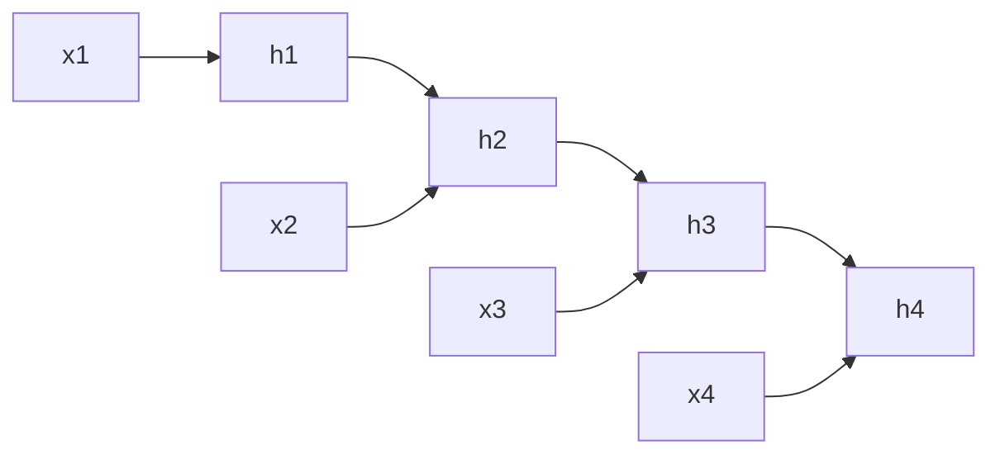
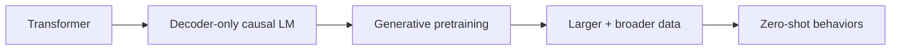

# 第一篇（Part I）　从 Seq2Seq 到 Transformer：大模型真正的技术起点

> **本章主线**：为什么 RNN/LSTM 式序列建模会遇到结构性瓶颈？Attention 最初解决的是什么问题？Transformer 为什么能成为大规模预训练的基础？GPT、BERT 又为什么沿两条不同路线分叉？

---

# 1　Transformer 之前：序列模型为什么需要“记忆”

语言天然是序列。给定 token 序列

$$
x_1,x_2,\ldots,x_T,
$$

我们希望模型在位置 $t$ 形成一个状态 $h_t$，使它包含之前信息。最朴素的循环神经网络写作：

$$
h_t=\phi(W_xx_t+W_hh_{t-1}+b).
$$

这条式子的直觉非常自然：当前位置的信息 $x_t$ 与上一时刻的记忆 $h_{t-1}$ 合并，形成新记忆。

问题也埋在这里：**时间依赖被强制串行化。**



计算 $h_4$ 之前必须先得到 $h_3$，得到 $h_3$ 前又必须得到 $h_2$。这使序列维度上的并行训练受限。

另一方面，长期依赖需要梯度跨许多时间步传播。若反向传播中的 Jacobian 连乘长期小于 1，就容易形成 vanishing gradient；长期大于 1，则可能 exploding gradient。LSTM/GRU 通过门控机制缓和这一问题，却没有取消串行依赖。

在机器翻译中，2014 年的 Seq2Seq 工作使用一个 LSTM encoder 将输入序列压成固定维度向量，再由另一个 LSTM decoder 逐步生成译文。[Sutskever, Vinyals & Le, 2014](https://arxiv.org/abs/1409.3215)

结构可以抽象成：

```text
I love robotics .
      │
      ▼
Encoder RNN/LSTM
      │
      ▼
 fixed vector c
      │
      ▼
Decoder RNN/LSTM
      │
      ▼
我 喜欢 机器人 。
```

这里有一个非常明显的瓶颈：**整句话的信息要被压进一个固定向量 $c$**。

---

# 2　Attention 最初不是为了“取代一切”，而是为了摆脱固定向量瓶颈

Bahdanau 等人在 2014 年直接指出：将整段源序列压入固定长度向量可能成为神经机器翻译的瓶颈，于是让 decoder 在生成每个目标 token 时，都能“软搜索”源序列中最相关的位置。[Bahdanau, Cho & Bengio, 2014](https://arxiv.org/abs/1409.0473)

假设 encoder 得到：

$$
h_1,h_2,\ldots,h_T.
$$

当 decoder 生成第 $i$ 个词时，不再只拿一个固定的 $c$，而是计算：

$$
e_{ij}=a(s_{i-1},h_j),
$$

$$
\alpha_{ij}=\frac{\exp(e_{ij})}{\sum_k\exp(e_{ik})},
$$

$$
c_i=\sum_j\alpha_{ij}h_j.
$$

注意这里的 $\alpha_{ij}$ 是一个**内容相关的动态权重**。

例如翻译：

```text
The   robot   picked   up   the   cup
 ↓      ↓       ↓      ↓    ↓     ↓
0.02   0.03    0.05   0.10 0.15  0.65
                              ↑
                     生成“杯子”时
```

decoder 不必要求一个固定向量永久保存所有细节，而是在需要时重新读取 source representations。

这就是 attention 的核心思想：

> **不是把所有历史平均揉成一个记忆，而是对当前问题动态决定“看哪里”。**

---

# 3　2017 Transformer：把 Attention 从辅助模块变成主干

2017 年《Attention Is All You Need》提出 Transformer：在 encoder-decoder 架构中，用 attention 与逐位置前馈网络取代 recurrent / convolutional 主干。[Vaswani et al., 2017](https://arxiv.org/abs/1706.03762)

Transformer 的真正历史价值不只是“效果好”，而是让序列建模更适合大规模并行硬件。

## 3.1　Self-Attention 的第一性问题

对同一序列中的每个 token，我们希望它问三个问题：

- **Query：我现在想找什么？**
- **Key：我这里有什么特征可以被别人匹配？**
- **Value：如果别人关注我，我应该传递什么信息？**

设输入矩阵：

$$
X\in\mathbb{R}^{T\times d}.
$$

线性投影：

$$
Q=XW_Q,\quad K=XW_K,\quad V=XW_V.
$$

若单头维度为 $d_k$，则

$$
Q,K\in\mathbb{R}^{T\times d_k},\qquad V\in\mathbb{R}^{T\times d_v}.
$$

attention score：

$$
S=\frac{QK^\top}{\sqrt{d_k}}.
$$

再做行方向 softmax：

$$
A=\mathrm{softmax}(S).
$$

最终：

$$
O=AV.
$$

把它放进 shape：

```text
X            [T, d]
│
├─ ×WQ ───▶ Q [T, dk]
├─ ×WK ───▶ K [T, dk]
└─ ×WV ───▶ V [T, dv]

QKᵀ          [T, T]
  ↓ /√dk
Scores       [T, T]
  ↓ softmax
A            [T, T]
  ↓ ×V
O            [T, dv]
```

最值得注意的是 $[T,T]$：

> 每个位置都能直接与所有位置建立一跳关系。

RNN 中从位置 1 把信息传到位置 $T$ 需要经过约 $T$ 次状态转移；full self-attention 的路径长度可以是 1。

---

## 3.2　为什么要除以 $\sqrt{d_k}$

假设 query 与 key 的每个分量近似独立、均值 0、方差 1。

内积：

$$
q\cdot k=\sum_{i=1}^{d_k}q_ik_i.
$$

其方差会随 $d_k$ 增长，约为：

$$
\mathrm{Var}(q\cdot k)\propto d_k.
$$

若不缩放，维度大时 score 的绝对值会很大，softmax 很容易进入极尖锐区域：

$$
\mathrm{softmax}([0,1,20])\approx[0,0,1],
$$

导致梯度变差。

除以 $\sqrt{d_k}$ 使 score 的尺度更稳定。

---

## 3.3　一个最小手算例子

设两个 token 的二维向量已经被投影成：

$$
Q=
\begin{bmatrix}
1&0\\
0&1
\end{bmatrix},
\quad
K=
\begin{bmatrix}
1&0\\
1&1
\end{bmatrix},
\quad
V=
\begin{bmatrix}
2&0\\
0&4
\end{bmatrix}.
$$

首先：

$$
QK^\top=
\begin{bmatrix}
1&1\\
0&1
\end{bmatrix}.
$$

因为 $d_k=2$：

$$
S=\frac{1}{\sqrt2}
\begin{bmatrix}
1&1\\
0&1
\end{bmatrix}.
$$

第一行两个 score 一样，因此 softmax 后约为：

$$
[0.5,0.5].
$$

于是第一个 token 的输出：

$$
o_1=0.5[2,0]+0.5[0,4]=[1,2].
$$

这不是“把另一个词复制过来”，而是**根据相关性对 value 做动态线性组合**。

---

# 4　Multi-Head Attention：为什么不是一个大头？

单头 attention 只有一套相似性空间。Multi-Head Attention（MHA）将 hidden dimension 分成多个子空间：

$$
\mathrm{head}_i=
\mathrm{Attention}(XW_i^Q,XW_i^K,XW_i^V).
$$

再拼接：

$$
\mathrm{MHA}(X)=
\mathrm{Concat}(\mathrm{head}_1,\ldots,\mathrm{head}_h)W^O.
$$

在 batch 形式中：

```text
X                    [B,T,d]
        ↓ projections
Q,K,V                 [B,T,h,dh]
        ↓ transpose
Q,K,V                 [B,h,T,dh]
        ↓ QKᵀ
scores                [B,h,T,T]
        ↓ softmax × V
context               [B,h,T,dh]
        ↓ transpose + concat
context               [B,T,d]
        ↓ WO
output                [B,T,d]
```

多个头并不保证每个头都会学出人类可命名的“语法头”“指代头”，但它提供了多个独立的 query-key 子空间，使不同关系能够并行表示。

---

# 5　Causal Mask：GPT 与普通双向 Self-Attention 的关键分界

若目标是预测下一个 token，位置 $t$ 不能偷看未来：

$$
p(x_t\mid x_1,\ldots,x_{t-1}).
$$

因此 decoder-only Transformer 使用 causal mask：

$$
M_{ij}=
\begin{cases}
0,&j\le i\\
-\infty,&j\gt i.
\end{cases}
$$

attention 变成：

$$
A=\mathrm{softmax}\left(
\frac{QK^\top}{\sqrt{d_k}}+M
\right).
$$

四个 token 时，mask 类似：

$$
M=
\begin{bmatrix}
0&-\infty&-\infty&-\infty\\
0&0&-\infty&-\infty\\
0&0&0&-\infty\\
0&0&0&0
\end{bmatrix}.
$$

图示：

```text
        key position
        1   2   3   4
q=1     ✓   ×   ×   ×
q=2     ✓   ✓   ×   ×
q=3     ✓   ✓   ✓   ×
q=4     ✓   ✓   ✓   ✓
```

若训练时忘掉 causal mask，模型可以直接看到答案右侧上下文，training loss 会非常漂亮，但自回归生成时未来 token 不存在，训练与推理条件严重不一致。

---

# 6　位置：Attention 本身不知道顺序

如果只计算 $QK^\top$，self-attention 对 token 排列具有置换等变性质。换句话说，它天然知道“有哪些 token”，却不天然知道“谁在前谁在后”。

原 Transformer 使用 sinusoidal positional encoding：

$$
PE_{(pos,2i)}=\sin\left(pos/10000^{2i/d}\right),
$$

$$
PE_{(pos,2i+1)}=\cos\left(pos/10000^{2i/d}\right).
$$

再与 token embedding 相加：

$$
H_0=E_{token}+E_{position}.
$$

后来 LLM 主流会逐步转向 RoPE 等方式；我们在 Part IV 专门推导。

---

# 7　FFN：Transformer 不只是 Attention

每个 Transformer block 通常还包含逐 token 的前馈网络：

$$
\mathrm{FFN}(x)=W_2\sigma(W_1x+b_1)+b_2.
$$

原 Transformer 用 ReLU，hidden expansion 通常把维度从 $d$ 放大到 $d_{ff}$，再投影回来。

```text
[B,T,d]
   ↓ W1
[B,T,dff]
   ↓ activation
[B,T,dff]
   ↓ W2
[B,T,d]
```

注意：FFN 对每个 token 独立地做相同变换；token 之间的信息交换主要发生在 attention。

可以把 Transformer block 粗略理解成：

> **Attention：从别的位置取信息；FFN：对当前位置已有的信息做非线性计算。**

这也是后来 MoE 常常替换 FFN 而不是 attention 的一个直觉基础：不同 token 可以选择不同的“计算专家”。

---

# 8　Residual + Normalization：深层网络为什么还能训练

经典结构有 residual connection：

$$
y=x+F(x).
$$

它提供近似 identity path，使深层网络更易优化。

原 Transformer 常写作 Post-LN：

$$
y=\mathrm{LN}(x+F(x)).
$$

后来很多 LLM 更偏好 Pre-Norm：

$$
y=x+F(\mathrm{Norm}(x)).
$$

Pre-Norm 通常更利于深网络稳定训练。现代 LLM 还大量使用 RMSNorm；详见 Part IV。

---

# 9　完整 Encoder-Decoder Transformer

原始 Transformer 是机器翻译架构，并不是 GPT 那种纯 decoder。

Encoder block：

```text
Input
  ↓
Self-Attention
  ↓
FFN
  ↓
(repeat N times)
```

Decoder block：

```text
Previous target tokens
  ↓
Masked Self-Attention
  ↓
Cross-Attention  ← Encoder outputs
  ↓
FFN
  ↓
(repeat N times)
```

cross-attention 中：

- Query 来自 decoder hidden states；
- Key / Value 来自 encoder outputs。

因此它回答的是：

> “当前正在生成的目标 token，应该从源序列的哪些表示中读取信息？”

---

# 10　为什么 Transformer 特别适合走向“大模型”

## 10.1　训练并行性

RNN 在序列方向上存在严格依赖：

$$
h_t=f(h_{t-1},x_t).
$$

self-attention 在训练时可以一次对整段序列计算 Q/K/V 和 score matrix。

这非常适合 GPU/TPU 的矩阵乘法能力。

## 10.2　长距离路径短

RNN 从 token 1 到 token $T$ 的信息传递路径大致随 $T$ 增长；full attention 是直接连接。

## 10.3　代价：$T^2$

标准 attention 的 score matrix：

$$
QK^\top\in\mathbb{R}^{T\times T}.
$$

因此计算与中间存储会随序列长度快速增长：

$$
O(T^2).
$$

这一缺陷在 2017 年不是最主要的问题，却会在 128K、1M context 时代成为核心矛盾，催生 FlashAttention、sparse attention、linear attention、hybrid architecture 等大量工作。

---

# 11　2018 GPT‑1：把“生成式预训练 + 下游微调”系统化

2018 年 OpenAI 的《Improving Language Understanding by Generative Pre-Training》把两个已有思想结合起来：Transformer 与无监督生成式预训练。[Radford et al., 2018](https://cdn.openai.com/research-covers/language-unsupervised/language_understanding_paper.pdf)

核心路线：

```text
大量未标注文本
     ↓
Autoregressive LM pretraining
     ↓
通用 Transformer 表示
     ↓
特定任务 supervised fine-tuning
```

预训练目标：

$$
L_1(U)=\sum_i\log P(u_i\mid u_{i-k},\ldots,u_{i-1};\Theta).
$$

随后在下游有标签任务上加入任务目标。

GPT‑1 的历史意义并不是“第一个 Transformer”，而是非常明确地把一个后来持续至今的范式做出来：

> **先在海量通用数据上学，再在任务数据上适配。**

今天的 SFT、LoRA、domain adaptation 都可以在这条思想线上找到祖先。

---

# 12　2018 BERT：为什么 Encoder 路线一度统治 NLP

BERT 使用 Transformer encoder，通过 Masked Language Modeling（MLM）获得双向上下文表示。[Devlin et al., 2018](https://arxiv.org/abs/1810.04805)

与 causal LM 不同，BERT 可以同时使用左侧和右侧信息。

例如句子：

```text
The robot picked up the [MASK].
```

模型可利用：

```text
左边：robot / picked / up / the
右边：句尾等信息
```

来预测被 mask 的 token。

这使 BERT 很适合：

- 分类；
- 序列标注；
- span-based QA；
- 表示学习。

但它不是天然的左到右生成器。

于是 2018–2020 年左右形成三种典型路线：

| 路线 | 典型模型 | Attention 可见范围 | 主要用途 |
|---|---|---|---|
| Encoder-only | BERT | 双向 | 理解、分类、表示 |
| Decoder-only | GPT | 因果单向 | 自回归生成 |
| Encoder-Decoder | T5 | encoder 双向 + decoder 因果 + cross-attn | 条件生成 |

T5 后来进一步把各种 NLP 任务统一为 text-to-text 形式。[Raffel et al., 2019/2020](https://arxiv.org/abs/1910.10683)

---

# 13　2019 GPT‑2：从“预训练再微调”走向“一个模型做很多任务”

GPT‑2 的论文标题就是《Language Models are Unsupervised Multitask Learners》。OpenAI 报告它在不做任务特定训练的情况下，已经表现出初步的阅读理解、翻译、问答和摘要能力。[OpenAI, 2019](https://openai.com/index/better-language-models/)

它仍然做一个极其朴素的事情：

$$
\max_\theta \sum_t \log p_\theta(x_t\mid x_{\lt t}).
$$

变化主要来自：

- 模型更大；
- 数据规模更大、更广；
- 任务可以被自然语言上下文化地表达。

这里埋下了 GPT‑3 最重要的思想伏笔：

> 如果训练文本本身包含许多“任务描述—答案”“问题—回答”“文章—摘要”模式，那么一个足够大的语言模型，是否可以直接在上下文里识别任务，而不再为每个任务更新参数？

GPT‑3 会把这个问题推到新的尺度。

---

# 14　Decoder-only 为什么最终成为通用 LLM 主线

这不是因为 encoder 或 encoder-decoder “失败了”。它们今天仍然有大量用途。

decoder-only 的优势更多来自一个极具扩展性的统一接口：

$$
\text{任意上下文 tokens}\rightarrow\text{继续预测 tokens}.
$$

分类可以写成生成：

```text
Review: this movie is excellent.
Sentiment: positive
```

翻译可以写成生成：

```text
English: I love robotics.
Chinese: 我喜欢机器人。
```

问答可以写成生成：

```text
Question: ...
Answer: ...
```

代码、数学证明、工具调用 JSON，同样都可以序列化成 token。

因此，decoder-only 提供了一个统一世界观：

> **只要问题和答案都能被编码成序列，就可以转写成条件 next-token prediction。**

它并不证明 next-token prediction 是“智能的最终形式”，但它极大降低了统一训练接口的复杂度。

---

# 15　训练一个 causal LM 时，标签到底是什么？

假设 token IDs：

```text
[BOS, I, love, robots, EOS]
```

训练时实际上做 shift：

```text
input : BOS    I      love    robots
label : I      love   robots  EOS
```

若 logits：

$$
Z\in\mathbb{R}^{B\times T\times |V|},
$$

标签：

$$
y\in\mathbb{N}^{B\times T}.
$$

每个位置做 cross entropy：

$$
\mathcal L
=-\frac1{BT}\sum_{b,t}
\log\frac{\exp Z_{b,t,y_{b,t}}}
{\sum_v\exp Z_{b,t,v}}.
$$

这意味着一段长度 $T$ 的文本，一次 forward 可以同时提供约 $T$ 个 next-token training targets。

训练时是并行的：

```text
BOS  I     love   robots
 ↓   ↓      ↓       ↓
 I  love  robots    EOS
```

推理时则是串行自回归：

```text
[BOS]
  ↓
I
  ↓ append
[BOS, I]
  ↓
love
  ↓ append
[BOS, I, love]
  ↓
robots
```

这一区别非常重要：

> **Transformer 训练在 sequence positions 上可以并行；自回归 decode 却天然存在 token-by-token 依赖。**

后来的 KV Cache、speculative decoding、multi-token prediction 都在与这个推理瓶颈搏斗。

---

# 16　Softmax 与 Cross-Entropy：模型究竟“学”了什么

最后一层把 hidden state $h_t\in\mathbb R^d$ 投影到词表：

$$
z_t=W_{vocab}h_t+b.
$$

得到：

$$
z_t\in\mathbb R^{|V|}.
$$

softmax：

$$
p(v\mid x_{\le t})
=\frac{e^{z_v}}{\sum_j e^{z_j}}.
$$

若正确下一个 token 为 $y$，loss：

$$
\ell=-\log p(y\mid x_{\le t}).
$$

假设模型给正确 token 的概率从 0.1 提高到 0.8：

$$
-\log 0.1\approx2.303,
\qquad
-\log 0.8\approx0.223.
$$

训练不断提高真实语料中正确 continuation 的概率。

但这也提醒我们：

> 模型并没有直接被训练去“说真话”“帮助用户”“写无 bug 代码”“遵守价值规范”。

这些行为如果与训练分布中的 next-token statistics 相关，可能部分出现；但要稳定地按人类意图输出，后面还需要 instruction tuning 与 preference alignment。

---

# 17　为什么“预测下一个 token”可能学到世界结构？

这是一个必须谨慎回答的问题。

假设文本来自某个潜在世界状态 $z$：

$$
z\rightarrow x_1,x_2,\ldots,x_T.
$$

为了很好地预测：

$$
p(x_t\mid x_{\lt t}),
$$

模型往往需要隐式估计对未来有帮助的潜在因素，例如：

- 当前主题；
- 实体身份；
- 语法结构；
- 说话者意图；
- 世界事实；
- 代码状态；
- 数学约束。

从信息论直觉看，如果某个潜变量能显著减少未来 token 的条件熵：

$$
H(X_t\mid X_{\lt t},Z)
\lt 
H(X_t\mid X_{\lt t}),
$$

那么学习某种关于 $Z$ 的内部表示可能有助于降低语言建模 loss。

但要注意三个边界：

1. **有预测价值的表示不一定等于人类可解释的世界模型；**
2. **文本中的相关性不自动等于因果理解；**
3. **训练目标允许“统计捷径”时，模型不必学到我们希望的机制。**

因此，本书不会简单说“next-token prediction 自然产生智能”，而会一路追踪：什么能力是 scale 后出现的，什么能力需要 post-training，什么又依赖工具和环境反馈。

---

# 18　从 Transformer 到 GPT‑3，真正缺的最后一块：Scale

到 2019 年，关键组件已经基本到位：



但问题仍然是：

> **继续扩大模型、数据与计算，能力会怎样变化？是否存在可预测规律？**

2020 年初，Scaling Laws for Neural Language Models 开始给出经验答案；几个月后 GPT‑3 将模型扩大到 175B，并把 in-context learning 推到整个领域的中心。

下一章，我们正式进入“大模型”时代。

---

# 本章小结

1. Seq2Seq/RNN 的核心限制包括序列串行依赖和固定向量瓶颈。
2. Bahdanau attention 让 decoder 动态读取 source states，而不是只依赖一个压缩向量。
3. Transformer 把 attention 变为主干，极大提升训练并行性，并缩短长距离依赖路径。
4. Self-attention 的核心是：

$$
\mathrm{softmax}\left(\frac{QK^\top}{\sqrt{d_k}}\right)V.
$$

5. GPT 使用 causal mask，因此适合自回归生成；BERT 使用双向 encoder，更适合理解与表示任务。
6. GPT‑1 建立“生成式预训练 + 下游适配”范式；GPT‑2 展示更多无需任务特定训练的行为。
7. decoder-only 的最大工程/产品优势之一，是把极多任务统一成“给定 token 前缀，继续生成 token”。
8. 训练可以并行预测整段位置，而自回归推理仍然 token-by-token，这一矛盾会持续影响后续系统设计。

---

# 本章练习

### 练习 1：手算 attention

自行设定 $T=3,d_k=2$ 的 Q/K/V，完整计算：

$$
QK^\top\rightarrow /\sqrt{d_k}
\rightarrow \text{causal mask}
\rightarrow \text{softmax}
\rightarrow AV.
$$

要求标出每一步 shape。

### 练习 2：破坏 causal mask

在一个 tiny GPT 中删除 causal mask。比较：

- training loss；
- validation loss；
- autoregressive generation。

解释为什么训练指标可能变好，而生成彻底失效。

### 练习 3：Encoder 与 Decoder 的选择

分别为下列任务选择 encoder-only、decoder-only 或 encoder-decoder，并解释：

- 情感分类；
- 自由对话；
- 文本翻译；
- embedding 检索；
- 代码补全。

不要只写“哪个模型效果好”，要从可见上下文和输出形式解释。

---

# 核心来源

- Sutskever, Vinyals & Le, **Sequence to Sequence Learning with Neural Networks**, 2014: https://arxiv.org/abs/1409.3215
- Bahdanau, Cho & Bengio, **Neural Machine Translation by Jointly Learning to Align and Translate**, 2014: https://arxiv.org/abs/1409.0473
- Vaswani et al., **Attention Is All You Need**, 2017: https://arxiv.org/abs/1706.03762
- Radford et al., **Improving Language Understanding by Generative Pre-Training**, 2018: https://cdn.openai.com/research-covers/language-unsupervised/language_understanding_paper.pdf
- Devlin et al., **BERT**, 2018: https://arxiv.org/abs/1810.04805
- Radford et al., **Language Models are Unsupervised Multitask Learners**, 2019: https://openai.com/index/better-language-models/
- Raffel et al., **Exploring the Limits of Transfer Learning with a Unified Text-to-Text Transformer**, 2019/2020: https://arxiv.org/abs/1910.10683
