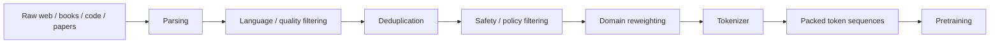
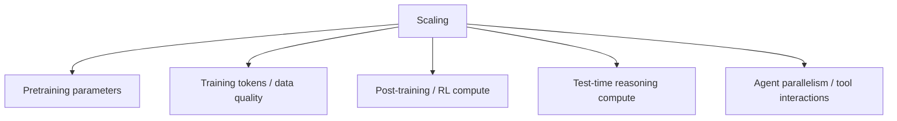

# Part II　Scaling Laws、GPT‑3、In-Context Learning 与 Chinchilla：真正进入“大模型”时代

> **本章主线**：为什么 2020 年是一个分水岭？Scaling Laws 改变了研究组织方式，GPT‑3 把 in-context learning 推到主流视野，而 Chinchilla 又为什么迫使行业重新理解“更大”？

---

# 1　2020 年前后，研究问题发生了什么变化？

在 GPT‑1/GPT‑2 阶段，大家已经知道：

- Transformer 可以做通用序列建模；
- 大规模无标注预训练能迁移到很多任务；
- decoder-only causal LM 可以统一生成接口。

真正悬而未决的问题变成：

> **如果继续增加参数、数据与算力，性能是随机碰运气，还是存在可预测规律？**

这看似是一个经验问题，实际上会决定整个行业的资本与工程路线。如果规模扩大有稳定回报，那么“训练更大的模型”就不只是研究灵感，而会变成可以规划的工程项目。

---

# 2　Scaling Laws：把“堆模型”变成可估计的工程

Kaplan 等人的 2020 年工作研究了语言模型 cross-entropy loss 与模型参数规模 $N$、数据规模 $D$、训练计算量 $C$ 之间的关系，观察到在相当宽的范围内存在近似幂律趋势。[Kaplan et al., 2020](https://arxiv.org/abs/2001.08361)

可以用抽象形式写：

$$
L(N)\approx L_\infty + aN^{-\alpha},
$$

$$
L(D)\approx L_\infty + bD^{-\beta},
$$

$$
L(C)\approx L_\infty + cC^{-\gamma}.
$$

不要把这里的形式误解成物理定律。它是**经验标度规律**：在特定模型族、数据分布、训练 recipe 与规模范围内，loss 呈现近似平滑的幂律下降。

这一发现的巨大现实意义是：

```text
训练很多小模型
      ↓
拟合 scaling curve
      ↓
估计更大规模的 loss / compute trade-off
      ↓
决定昂贵大训练是否值得做
```

这是一种“先用小实验预测巨型实验”的研究组织方法。

后来 GPT‑4 技术报告也强调，其团队构建了在不同 scale 上表现可预测的基础设施与优化方法，并使用远小于最终训练规模的模型去预测部分最终能力。[OpenAI, 2023](https://arxiv.org/abs/2303.08774)

---

# 3　参数、数据、计算：三个量不能混成一个“Scale”

我们常说“scale up”，但至少有三种完全不同的扩大：

$$
N=\text{number of parameters},
$$

$$
D=\text{number of training tokens},
$$

$$
C=\text{training compute}.
$$

对 dense Transformer，一个常见的粗略估计是训练 FLOPs 与 $ND$ 同阶：

$$
C\propto ND,
$$

具体常数受 forward/backward、架构和实现影响。

这意味着预算固定时存在资源分配问题：

```text
同样的总算力

方案 A：更大的 N × 较少的 D
方案 B：较小的 N × 更多的 D
```

哪一种更优？Kaplan-era 与 Chinchilla-era 的差异，正围绕这个问题展开。

---

# 4　GPT‑3：175B 不是最重要的数字

2020 年 GPT‑3 论文《Language Models are Few-Shot Learners》训练了 175B 参数的自回归语言模型，并将 zero-shot / one-shot / few-shot 评测系统化。[Brown et al., 2020](https://arxiv.org/abs/2005.14165)

它最重要的历史意义不是单纯“参数第一次到了 175B”，而是让整个领域认真面对一个现象：

> **模型可以在推理时通过 prompt 中的自然语言说明和示例，改变任务行为，而不更新参数。**

---

# 5　Zero-shot、One-shot、Few-shot 到底分别是什么

假设我们希望做情感分类。

## 5.1　Zero-shot

```text
Classify the sentiment as positive or negative.
Review: The movie was surprisingly moving.
Sentiment:
```

没有示例，只有任务描述。

## 5.2　One-shot

```text
Review: I hated it.
Sentiment: negative

Review: The movie was surprisingly moving.
Sentiment:
```

提供一个输入输出示例。

## 5.3　Few-shot

```text
Review: I hated it.
Sentiment: negative

Review: Wonderful acting.
Sentiment: positive

Review: It was painfully slow.
Sentiment: negative

Review: The movie was surprisingly moving.
Sentiment:
```

提供多个 demonstration。

关键是：

$$
\theta_{\text{before}}=\theta_{\text{after}}.
$$

参数没有更新。

改变的是条件：

$$
p_\theta(y\mid x)
\quad\rightarrow\quad
p_\theta(y\mid D_{demo},x).
$$

这就是 in-context learning（ICL）最重要的表面现象。

---

# 6　为什么 ICL 令人震惊？

传统 supervised learning 是：

```text
Dataset
  ↓
Gradient descent
  ↓
New parameters θ'
  ↓
Perform task
```

ICL 则是：

```text
Examples placed in prompt
       ↓
Same frozen parameters θ
       ↓
Different hidden-state trajectory
       ↓
Perform task
```

因此可以把它看成两种时间尺度：

### 慢学习

发生在训练阶段：

$$
\theta\leftarrow\theta-\eta\nabla_\theta L.
$$

### 快适应

发生在 forward pass 内：

$$
h_{1:T}=f_\theta(x_{1:T}).
$$

模型没有改权重，却在 activation 中根据上下文形成暂时策略。

这也是后来把 Transformer 与“meta-learning”“fast weights”“implicit inference”联系起来的原因之一。

---

# 7　ICL 到底是怎么发生的？目前没有单一终极解释

我们需要把“现象”和“机制理论”分开。

## 7.1　隐式 Bayesian inference 视角

Xie 等人的理论工作提出：如果预训练文档由某些潜在概念生成，模型可以在测试 prompt 中根据 demonstrations 推断潜在概念，从而形成 ICL。[Xie et al., 2021](https://arxiv.org/abs/2111.02080)

抽象地：

$$
z\sim p(z),
$$

$$
(x_i,y_i)\sim p(x,y\mid z).
$$

给几个 demonstration 后，模型相当于形成：

$$
p(z\mid D_{demo}),
$$

再据此预测新样本。

这并不意味着真实 GPT 内部严格执行 textbook Bayesian inference，但提供了一种解释框架。

## 7.2　Induction Heads 视角

机制可解释性研究发现，一类 attention head 可以实现类似：

```text
[A][B] ... [A]  → predict [B]
```

的模式复制行为，被称为 induction head，并提出它们与 in-context learning 的出现有关。[Olsson et al., 2022](https://arxiv.org/abs/2209.11895)

直觉上，一个 head 可以：

1. 找到之前相同 token / pattern；
2. 看那个位置后面跟了什么；
3. 把对应 continuation 复制到当前预测中。

这是一种非常具体的“上下文算法”。

## 7.3　更一般的观点

现代 LLM 的 ICL 很可能不是单一 head 或单一算法就能解释。模型可以利用：

- 格式匹配；
- 语义任务识别；
- pattern completion；
- latent task inference；
- 检索式行为；
- 在 activation 空间中的临时计算。

所以最安全的结论是：

> **ICL 是清楚存在的行为现象；其完整内部机制仍是开放研究问题。**

---

# 8　Prompt Engineering 为什么会突然重要

当模型可以在上下文中识别任务，输入文本本身就开始承担“临时程序”的作用。

过去：

```text
Task definition → write code / fine-tune model
```

GPT‑3 之后越来越多变成：

```text
Task definition → express as tokens → model adapts in context
```

于是出现 prompt engineering。

但需要避免一个误区：

> Prompt engineering 不是魔法语言。

它本质是在改变模型条件概率中的 conditioning context：

$$
p_\theta(y\mid \underbrace{x_{instruction},x_{examples},x_{context}}_{prompt}).
$$

格式、顺序、示例、角色设定都会改变隐藏状态，因此影响后续 token distribution。

---

# 9　Tokenization：模型看见的从来不是“词”

LLM 的实际输入不是字符串：

```text
"unbelievable"
```

而是 tokenizer 输出的整数序列。

### 9.1　为什么不用完整单词词表？

若每个词一个 token，会遇到：

- 生僻词；
- 新词；
- 姓名；
- 拼写变化；
- 多语言；
- 代码标识符。

若每个字符一个 token，则序列会很长。

subword tokenization 在二者间折中。

BPE 被神经机器翻译广泛用于把稀有词拆成子词。[Sennrich, Haddow & Birch, 2015](https://arxiv.org/abs/1508.07909)

SentencePiece 则允许直接从 raw text 学习语言无关的 subword segmentation。[Kudo & Richardson, 2018](https://arxiv.org/abs/1808.06226)

### 9.2　Tokenizer 会真实影响能力和成本

假设：

```text
英文句子 → 10 tokens
中文句子 → 18 tokens
```

即使语义信息类似，后者会带来：

- 更长 context 占用；
- 更多 attention compute；
- 更多 decode steps；
- 更高 API token 成本；
- 某些语言更难形成高效词素表示。

所以 multilingual model 的 tokenizer 设计不是“小工具问题”。

Llama 3 把 vocabulary 扩展到 128K，并在官方模型卡中说明其预训练规模超过 15T tokens；这类变化同时影响多语言效率、代码表示和模型 embedding/output head 的参数规模。[Meta, 2024](https://ai.meta.com/research/publications/the-llama-3-herd-of-models/)

---

# 10　Perplexity：语言模型最原始的评价量之一

若平均 token negative log-likelihood 为：

$$
L=-\frac1T\sum_t\log p(x_t\mid x_{<t}),
$$

perplexity 定义为：

$$
PPL=e^L.
$$

直觉上，如果模型每一步都像在“等概率从 $k$ 个选项里猜”，PPL 大致像 $k$。

例如：

$$
L=\log 10
\Rightarrow
PPL=10.
$$

但不要把 perplexity 直接等价为聊天质量：

- tokenizer 不同，PPL 不宜直接横比；
- general-domain PPL 不代表 instruction following；
- 对齐后的模型可能 sacrifice 一些纯 LM likelihood，换取更符合人类意图的行为。

---

# 11　训练数据不是“越多越好”，数据分布决定模型会成为什么

一个预训练 corpus 通常经历：



### 11.1　Deduplication 为什么重要

重复数据可能造成：

- 某些样本被过度加权；
- benchmark 泄漏；
- 训练资源浪费；
- memorization 风险增加。

### 11.2　质量过滤为什么重要

一个 token 并不等价于另一个 token。

高质量教材、代码、数学推导与自动生成 spam 对能力的贡献可能不同。

因此后来行业从：

> “我有多少 TB 网页”

逐步转向：

> “哪些 token 值得占用我的昂贵 compute budget？”

这会成为 2024–2026 模型竞争的核心：**data curation、synthetic data、verifiable data、agent trajectories**。

---

# 12　Chinchilla：参数更大，不一定是固定算力下的最佳选择

2022 年 DeepMind 的 Chinchilla 论文重新研究固定 compute budget 下模型参数和训练 token 的最优配置。[Hoffmann et al., 2022](https://arxiv.org/abs/2203.15556)

核心发现可以用一句话概括：

> 当时许多大型语言模型相对于参数规模训练 token 不够，处于 **undertrained** 状态。

论文训练的 Chinchilla 约 70B 参数，但使用约 1.4T tokens；在与 280B 参数 Gopher 近似训练计算预算下，Chinchilla 在许多任务上更好。

这改变了行业直觉：

```text
旧直觉：预算增加 → 尽量把参数做得更大

新直觉：预算增加 → 参数 N 与训练数据 D 都必须合理扩张
```

在 Chinchilla 的经验拟合区域内，compute-optimal 的 $N$ 与 $D$ 都会随 compute 增长，而不是把绝大部分新增预算只放到参数数目。

---

# 13　为什么 Chinchilla 会推动 LLaMA 这类“小而训得久”的模型

这一步非常关键。

假设我们有两个模型：

```text
Model A：175B，训练 token 较少
Model B： 70B，训练 token 更多
```

在训练 FLOPs 接近时，B 可能具有更好的 loss。

更重要的是：**推理成本与模型参数量高度相关。**

部署时每生成一个 token，都要读取/计算大量权重。于是，一个“较小但充分训练”的模型不仅训练表现可能更合理，还可能拥有显著更低的 serving cost。

LLaMA 2023 年明确强调在给定推理预算下的模型规模选择，并训练 7B–65B 模型于万亿级 token；其 13B 模型在论文中的多数 benchmark 上超过 GPT‑3 175B。[Touvron et al., 2023](https://arxiv.org/abs/2302.13971)

这并不能简单归因于 Chinchilla 一项工作，但二者共同代表了范式转换：

> **“大模型”不再只是比较参数量，而要比较训练 token、数据质量和最终 inference economics。**

---

# 14　一个简单的 compute allocation 思想实验

假设训练计算粗略满足：

$$
C=kND.
$$

预算固定：

$$
C=C_0.
$$

那么：

$$
D=\frac{C_0}{kN}.
$$

把 $N$ 提高 10 倍，就意味着在其他条件不变时只能使用约 1/10 的 token 数。

所以不能问：

> “300B 一定比 30B 强吗？”

而要问：

> “300B 用多少 token、什么数据、多少总 compute、什么 recipe？30B 又是多少？”

这正是为什么“参数量排行榜”越来越没有解释力。

---

# 15　Scaling 与“涌现”：一个必须保持克制的争论

2022 年有工作把某些小模型几乎不会、大模型突然表现明显的任务称为 **emergent abilities**。[Wei et al., 2022](https://arxiv.org/abs/2206.07682)

这种现象容易形成一种流行叙事：

```text
不断加参数
  ↓
到某个阈值
  ↓
突然“冒出”全新智能
```

但 2023 年 Schaeffer 等人指出，部分所谓突变可能来自 evaluation metric 的非线性或离散性：底层能力可以平滑改善，而 exact-match 等指标在跨过某个阈值后才突然显示为“成功”。[Schaeffer, Miranda & Koyejo, 2023](https://arxiv.org/abs/2304.15004)

例如假设生成一个 5 步答案，每一步正确率都从：

$$
0.6\rightarrow0.7\rightarrow0.8\rightarrow0.9.
$$

若 benchmark 只有“五步全对才算 1”，整体成功率约：

$$
0.6^5=0.078,
$$

$$
0.7^5=0.168,
$$

$$
0.8^5=0.328,
$$

$$
0.9^5=0.590.
$$

底层每一步只是在平滑提高，最终 exact-match 却看起来像“突然能做了”。

因此本书采用保守表述：

> **规模扩大确实会带来广泛能力提升；某些能力表现出非线性阈值现象，但“涌现”是否代表内部机制发生离散相变，需要逐任务、逐指标验证。**

---

# 16　GPT‑3 最终暴露了什么问题？

GPT‑3 证明了 scale + ICL 的巨大潜力，同时暴露一个关键缺陷：

> **语言建模目标与“帮助用户完成任务”并不相同。**

预训练数据里可能有：

- 高质量答案；
- 错误答案；
- 争吵；
- 广告；
- 小说；
- 恶意文本；
- 论坛胡言乱语。

最大化：

$$
\log p_\theta(x_t\mid x_{<t})
$$

只要求模型拟合这些文本分布，而没有一个变量明确说：

```text
“用户真正想让我怎么回答？”
```

因此会出现：

- prompt 很敏感；
- 指令遵循不稳定；
- 容易续写而不是回答；
- 可能输出不符合人类偏好的内容；
- “知道答案”但不一定以用户需要的格式给出。

这就把行业推向下一个阶段：**instruction tuning + human preference alignment。**

---

# 17　从 GPT‑3 到现代 LLM：Scaling 思想并没有消失，而是扩展了

到 2026 年，“scale”至少有五个维度：



2020 年主要问：

> 更多参数与预训练算力能带来什么？

2024 年 reasoning models 开始问：

> 回答一个问题时多花多少推理计算值得？

2025–2026 年 agentic systems 又开始问：

> 一个任务允许几十、几百、几千次工具调用和多个并行 agent 后，能力如何 scaling？

所以“大模型 scaling”已经从**权重规模**扩张到**训练期、推理期和环境交互期的计算分配问题**。

---

# 本章小结

1. Scaling Laws 将语言模型性能与模型规模、数据、计算之间的经验关系系统化，使超大训练更可规划。
2. GPT‑3 的核心历史意义之一是把 ICL 变成主流范式：无需梯度更新，仅通过 prompt demonstration 适应任务。
3. ICL 的完整机制尚无单一公认解释；Bayesian inference、induction heads 等提供了不同层面的理论与机制证据。
4. tokenizer 决定模型真正看到的离散序列，并影响多语言能力、上下文利用和成本。
5. Chinchilla 说明固定计算预算下，许多旧模型参数太大而训练 token 不够；参数和数据需要共同扩张。
6. 参数量不是能力的充分统计量；至少还要看 token 数、数据质量、训练 recipe、总 compute 与推理成本。
7. “涌现能力”应谨慎解释：部分非线性可能来自任务本身，部分可能来自评价指标。
8. GPT‑3 之后最大的缺口变成 alignment：模型会续写文本，不代表它天然会按人的意图做事。

---

# 本章练习

### 练习 1：固定 compute 分配

假设：

$$
C=6ND.
$$

固定 $C=6\times10^{21}$，分别取：

$$
N=10^9,10^{10},10^{11}.
$$

计算对应 $D$，讨论三个方案的潜在优缺点。

### 练习 2：ICL 与 Fine-tuning 的差别

设计一个三分类任务：

- 方案 A：prompt 中放 5 个示例；
- 方案 B：用 1000 个样本 fine-tune。

从参数更新、推理成本、灵活性、稳定性、灾难性遗忘风险等维度比较。

### 练习 3：Tokenizer 实验

选择中文、英文和代码各一段，使用两个不同 tokenizer 统计 token 数。计算相同语义内容对应的 token inflation，并讨论对 128K context 的实际影响。

### 练习 4：制造一个“假涌现”

令单步正确率随 scale 平滑增长，定义“连续得分”和“整题全对”两个 metric。画出二者随 scale 的曲线，观察离散指标如何制造阈值感。

---

# 核心来源

- Kaplan et al., **Scaling Laws for Neural Language Models**, 2020: https://arxiv.org/abs/2001.08361
- Brown et al., **Language Models are Few-Shot Learners**, 2020: https://arxiv.org/abs/2005.14165
- Xie et al., **An Explanation of In-context Learning as Implicit Bayesian Inference**, 2021: https://arxiv.org/abs/2111.02080
- Hoffmann et al., **Training Compute-Optimal Large Language Models**, 2022: https://arxiv.org/abs/2203.15556
- Olsson et al., **In-context Learning and Induction Heads**, 2022: https://arxiv.org/abs/2209.11895
- Wei et al., **Emergent Abilities of Large Language Models**, 2022: https://arxiv.org/abs/2206.07682
- Schaeffer et al., **Are Emergent Abilities of Large Language Models a Mirage?**, 2023: https://arxiv.org/abs/2304.15004
- Touvron et al., **LLaMA**, 2023: https://arxiv.org/abs/2302.13971
- Sennrich et al., **Neural Machine Translation of Rare Words with Subword Units**, 2015: https://arxiv.org/abs/1508.07909
- Kudo & Richardson, **SentencePiece**, 2018: https://arxiv.org/abs/1808.06226
