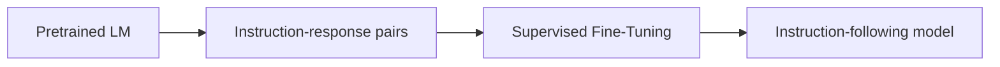
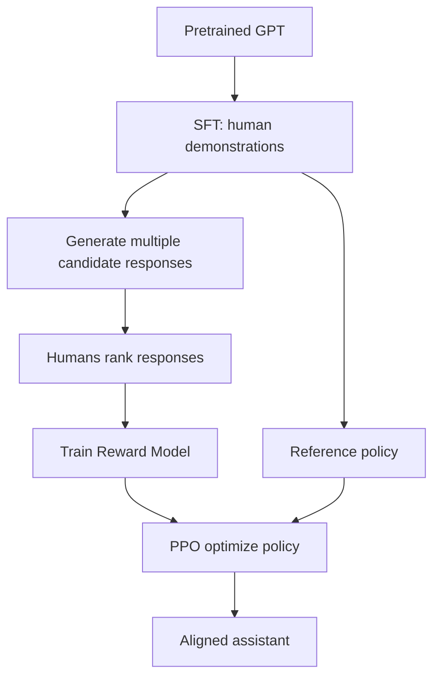
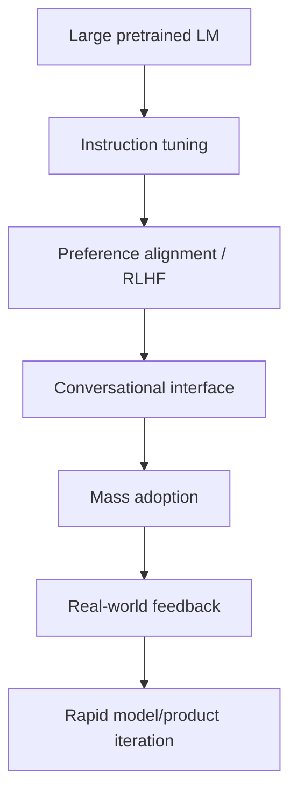
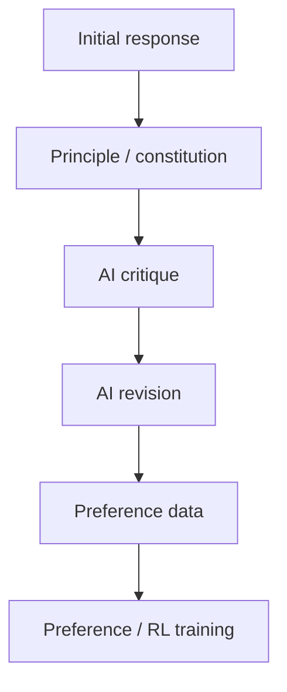
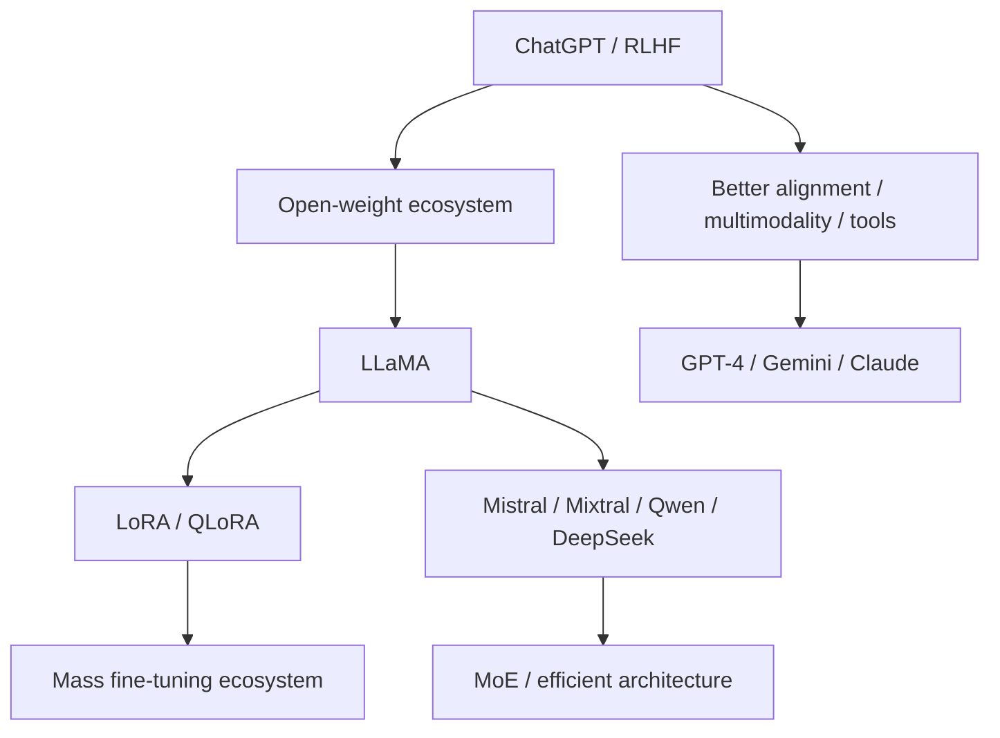

# Part III　从 GPT‑3 到 ChatGPT：Instruction Tuning、RLHF 与偏好优化

> **本章主线**：GPT‑3 已经“会很多东西”，为什么还不能直接成为好用的助手？Instruction tuning 改变了什么？RLHF 为什么需要 Reward Model 与 PPO？DPO 又为什么能绕过显式 RL？这一阶段真正把“语言模型”改造成了“遵循人类意图的助手”。

---

# 1　GPT‑3 的问题：会续写，不等于会帮你做事

预训练语言模型优化的是：

$$
\mathcal L_{\text{LM}}
=-\sum_t\log p_\theta(x_t\mid x_{\lt t}).
$$

这个目标只要求：**真实语料里的下一个 token 概率尽可能高。**

但用户真正希望的是：

```text
用户指令
  ↓
理解意图
  ↓
选择合适行为
  ↓
给出有帮助、相关、格式正确且尽可能安全的回答
```

两者并不等价。

假设 prompt 是：

```text
Q: 法国的首都是什么？
A:
```

网页语料中可能出现：

```text
A: 巴黎。
A: 我不知道。
A: 这个问题太简单了。
A: 点击这里查看更多……
```

预训练只是在拟合这些文本模式，没有一个显式变量叫作“用户更喜欢哪种回答”。

这就是 **pretraining objective 与 human intent 之间的 objective mismatch**。

---

# 2　Instruction Tuning：先让模型学会“按指令完成任务”

Instruction tuning 的基本数据形式是：

$$
(x_{instruction},x_{input},y_{response}).
$$

训练仍然可以是普通 cross-entropy：

$$
\mathcal L_{\text{SFT}}
=-\sum_{t\in \text{response}}
\log p_\theta(y_t\mid x,y_{\lt t}).
$$

也就是说，**SFT（Supervised Fine-Tuning）本身并不神秘**。它仍然是在做 teacher forcing，只不过数据分布从“互联网原始文本”变成了“人类希望助手如何响应指令”的示范。



## 2.1　为什么少量高质量指令数据能明显改变行为？

预训练阶段已经获得了大量语言、知识、代码和模式能力。SFT 通常不是从零教模型“什么是法国”，而是在做一种**行为重定向**：

> 当输入看起来像用户请求时，把已有能力组织成一种助手式输出。

这也是为什么 instruction tuning 可以用远少于预训练 token 的数据，显著改变交互体验。

---

# 3　FLAN 与 T0：在 ChatGPT 之前，Instruction Tuning 已经快速发展

2021 年 FLAN 把许多 NLP 数据集重写成自然语言指令并对模型做 instruction tuning，发现对未见任务的 zero-shot 泛化可以明显提高。[Wei et al., 2021](https://arxiv.org/abs/2109.01652)

同期 T0 也探索了在大规模、多任务 prompt 数据上训练，让模型在未见任务上通过自然语言 prompt 进行 zero-shot 泛化。[Sanh et al., 2021](https://arxiv.org/abs/2110.08207)

这一步的重要思想是：

```text
过去：每个任务一个 task head / 一个 fine-tuned model

后来：
自然语言本身成为 task interface
          ↓
一个模型学习“读懂任务描述”
```

于是自然语言开始承担类似 API 的角色。

---

# 4　为什么只有 SFT 还不够？

SFT 的监督来自**一个或少量示范答案**。

但很多任务并不存在唯一正确答案。例如：

> “给这段文章写一个简洁但完整的摘要。”

两个回答都可能正确，只是一个更清楚、更简洁、更符合用户偏好。

若只用监督学习，必须先写出“标准答案”。这很昂贵，也无法表达细粒度偏好：

```text
回答 A：正确但啰嗦
回答 B：正确、简洁、结构好
回答 C：流畅但事实错误
```

相比直接写出完美答案，人类往往更容易回答：

> A 和 B 哪个更好？

这就是 preference learning 的切入口。

---

# 5　RLHF 的三阶段结构

InstructGPT 把这一流程清晰地推入 LLM 主流：[Ouyang et al., 2022](https://arxiv.org/abs/2203.02155)



三步分别是：

1. **SFT**：先让模型像助手一样回答；
2. **Reward Model（RM）**：从人类排序中学习“什么回答更受偏好”；
3. **RL**：让语言模型生成能获得更高 RM 奖励的回答，同时不要偏离 SFT/reference model 太远。

---

# 6　Reward Model：把人类排序变成一个标量函数

设 prompt 为 $x$，两个回答为：

$$
y_w=\text{preferred / winner},
$$

$$
y_l=\text{less preferred / loser}.
$$

Reward Model 输出标量：

$$
r_\phi(x,y)\in\mathbb R.
$$

常用 Bradley–Terry / logistic preference 模型：

$$
P(y_w\succ y_l\mid x)
=
\sigma\big(r_\phi(x,y_w)-r_\phi(x,y_l)\big).
$$

其中：

$$
\sigma(z)=\frac1{1+e^{-z}}.
$$

训练 loss：

$$
\mathcal L_{RM}
=-\log\sigma\left(
 r_\phi(x,y_w)-r_\phi(x,y_l)
\right).
$$

如果 preferred answer 的 reward 比 rejected answer 高很多：

$$
r_w-r_l\gg0,
$$

则：

$$
\sigma(r_w-r_l)\rightarrow1,
$$

loss 变小。

## 6.1　RM 学到的是“真理”吗？

不是。

它学到的是：

> **在训练标注分布上，人类排序的统计代理。**

如果标注者偏好有偏差、任务覆盖不足或 Reward Model 本身泛化不佳，它就可能给错误行为高分。

因此：

$$
\text{Reward Model}\neq\text{ground truth utility}.
$$

这是后面 reward hacking 的根源之一。

---

# 7　为什么语言生成可以被写成强化学习？

把一个回答生成过程看成 MDP：

- state：当前 prompt + 已生成 token；
- action：选择下一个 token；
- policy：语言模型 $\pi_\theta$；
- episode：直到 EOS；
- reward：完整回答经 RM 打分。

形式上：

$$
s_t=(x,y_{\lt t}),
$$

$$
a_t=y_t,
$$

$$
\pi_\theta(a_t\mid s_t)
=p_\theta(y_t\mid x,y_{\lt t}).
$$

最终得到：

$$
r_\phi(x,y_{1:T}).
$$

于是可以用 policy-gradient 方法优化语言模型。

---

# 8　PPO：为什么 RLHF 时代经常看到它

PPO（Proximal Policy Optimization）最初由 Schulman 等人在 2017 年提出。[Schulman et al., 2017](https://arxiv.org/abs/1707.06347)

定义新旧策略概率比：

$$
r_t(\theta)=
\frac{\pi_\theta(a_t\mid s_t)}
{\pi_{\theta_{old}}(a_t\mid s_t)}.
$$

clipped objective 的核心形式：

$$
L^{CLIP}(\theta)
=
\mathbb E_t\left[
\min\left(
 r_t(\theta)A_t,
 \mathrm{clip}(r_t(\theta),1-\epsilon,1+\epsilon)A_t
\right)
\right].
$$

直觉：

> 想往高 reward 方向更新，但一次不要走得离旧策略太远。

对 LLM 来说，这是很重要的，因为 policy 一旦被 RM 的漏洞吸引，可能快速退化。

---

# 9　为什么还要加 KL 惩罚？

如果只最大化 Reward Model：

$$
\max_\theta \mathbb E[r_\phi(x,y)],
$$

模型会寻找一切能骗高分的方法，而不是保持自然语言质量。

于是 RLHF 常加入 reference model 约束：

$$
R(x,y)
=
 r_\phi(x,y)
-
\beta
D_{KL}\left(
\pi_\theta(\cdot\mid x)
\Vert
\pi_{ref}(\cdot\mid x)
\right).
$$

直觉上：

```text
第一项：朝人类偏好方向走
第二项：别离原来那个会说正常语言的模型太远
```

$\beta$ 控制两者 trade-off。

这是一条贯穿后训练时代的思想：

> **优化新行为，同时保持一个有能力的 reference distribution。**

---

# 10　Reward Hacking：优化代理指标的经典危险

只要真正目标 $U$ 无法直接观测，我们就会构造 proxy reward：

$$
\hat U=r_\phi.
$$

然后优化：

$$
\max_\pi \mathbb E_\pi[\hat U].
$$

如果 $\hat U$ 与真正目标在训练分布上相关，但分布外存在漏洞，强优化会把策略推向漏洞。

这与 Goodhart's law 的直觉一致：

> 当一个测量指标成为优化目标后，它可能不再是好的测量指标。

LLM 中可能出现：

- 更长的回答被 RM 误判为更好；
- 过度礼貌或套话；
- 看起来有逻辑但实际错误；
- 使用 reward model 偏爱的格式；
- 找到 verifier 的边界漏洞。

因此现代 reasoning RL 尤其强调 **verifiable rewards**，但可验证也不代表没有 reward hacking；代码测试、数学答案验证器同样可能被 exploit。

---

# 11　InstructGPT：一个极具历史意义的结果

InstructGPT 的核心实验之一非常反直觉：

> 在人类偏好评测中，1.3B 的 InstructGPT 输出可以被偏好于 175B GPT‑3 的输出。

原论文：[Ouyang et al., 2022](https://arxiv.org/abs/2203.02155)

它说明：

$$
\text{parameter count}\not\equiv\text{user-perceived quality}.
$$

基础能力与行为对齐是两个不同维度。

一个模型可能拥有大量知识，却：

- 不按格式回答；
- 无视用户指令；
- 过度续写 prompt；
- 输出不相关内容。

SFT + preference optimization 可以显著改善这些行为。

---

# 12　ChatGPT：真正的革命不是“又一个 Transformer”

OpenAI 于 **2022 年 11 月 30 日**发布 ChatGPT，并说明其使用与 InstructGPT 类似的方法，通过人类反馈强化学习训练，但数据收集设置有所不同。[OpenAI, 2022](https://openai.com/index/chatgpt/)

从架构史看，它不是 2017 Transformer 级别的基础结构革命。

但从 AI 产品史看，它是一次巨大转折，因为以下因素第一次以非常低门槛组合在一起：



用户不再需要：

- 写特定模板；
- 选择 NLP 任务；
- 自己训练模型；
- 理解模型接口。

自然语言对话本身成为通用计算接口之一。

---

# 13　RLHF 的工程痛点

PPO 式 RLHF 很强，但复杂。

训练时通常需要同时维护：

- actor / policy model；
- reference model；
- reward model；
- critic / value model（具体实现可能共享或独立）。

```text
prompt
  ↓
actor rollout
  ↓
response
  ├──> reward model → scalar reward
  ├──> reference model → KL
  └──> critic → value / advantage
                  ↓
                 PPO
```

这意味着：

- 多模型显存占用；
- rollout 很昂贵；
- online sampling 吞吐低；
- RL 超参数敏感；
- reward drift / collapse 风险；
- 训练 pipeline 比普通 SFT 复杂得多。

于是研究者自然会问：

> 已经有人类 preference pair 了，能不能直接训练 policy，而不显式训练 Reward Model + PPO？

DPO 就从这里出现。

---

# 14　DPO：把偏好优化化成一个直接的分类式目标

2023 年 Direct Preference Optimization（DPO）提出：在特定 KL-regularized reward maximization 假设下，最优 policy 与 reward 之间存在闭式关系，因此可以直接从 preference pairs 优化 policy，而不需要显式 reward model 和 RL rollout。[Rafailov et al., 2023](https://arxiv.org/abs/2305.18290)

对 preference pair $(x,y_w,y_l)$，DPO loss 常写为：

$$
\mathcal L_{DPO}(\theta)
= -\mathbb E\left[
\log\sigma\left(
\beta
\left[
\log\frac{\pi_\theta(y_w\mid x)}{\pi_{ref}(y_w\mid x)}
-
\log\frac{\pi_\theta(y_l\mid x)}{\pi_{ref}(y_l\mid x)}
\right]
\right)
\right].
$$

看上去很复杂，但核心只是一句：

> **相对于 reference model，让当前 policy 更偏向 winner、较少偏向 loser。**

定义：

$$
\Delta_w=\log\pi_\theta(y_w|x)-\log\pi_{ref}(y_w|x),
$$

$$
\Delta_l=\log\pi_\theta(y_l|x)-\log\pi_{ref}(y_l|x).
$$

DPO 希望：

$$
\Delta_w\gt \Delta_l.
$$

也就是：

```text
对 winner 的相对概率 ↑
对 loser  的相对概率 ↓
```

---

# 15　DPO 为什么流行？

它把工程流程从：

```text
SFT
 ↓
Reward Model
 ↓
Online generation
 ↓
PPO
```

简化为：

```text
SFT / reference model
 ↓
Preference pairs
 ↓
Direct optimization
```

优点包括：

- 实现简单；
- 训练稳定性通常更容易控制；
- 无需显式 critic；
- 无需在线 RL rollout；
- 可以直接利用离线 preference dataset。

但它并没有让 RL 时代结束。

为什么？

因为 DPO 主要是在**已有 preference data 分布上做离线优化**。当我们希望模型通过探索找到训练数据中没有的全新 reasoning strategy，或在环境中执行多步动作时，online RL 再次变得重要。

这正是 2024–2026 reasoning / agentic RL 回归的背景之一。

---

# 16　RLAIF 与 Constitutional AI：偏好一定要全靠人给吗？

Anthropic 在 Constitutional AI 中探索使用一套自然语言原则（constitution），让模型对自己的回答进行 critique/revision，并进一步使用 AI-generated preferences 做 reinforcement learning from AI feedback（RLAIF）。[Bai et al., 2022](https://arxiv.org/abs/2212.08073)

思想可以抽象为：



它试图解决一个现实问题：

> 人类高质量标注是昂贵且难以无限扩张的。

这并不意味着 AI feedback 天然可靠。模型作为 judge 同样可能继承偏差、被提示攻击、偏爱特定风格，甚至与 generator 同源导致 correlated errors。

---

# 17　KTO、ORPO 等：偏好学习形成一个方法族

DPO 之后出现大量直接偏好学习方法。

例如 KTO（Kahneman–Tversky Optimization）试图使用更简单的 binary desirable / undesirable feedback，而不是严格配对的 winner-loser 数据。[Ethayarajh et al., 2024](https://arxiv.org/abs/2402.01306)

ORPO 则提出把 instruction tuning 与 preference optimization 更紧密地合并。[Hong et al., 2024](https://arxiv.org/abs/2403.07691)

这些方法的共同背景是：

$$
\text{human feedback}
$$

并不只有一种数据形态：

- demonstration；
- pairwise preference；
- scalar rating；
- binary like/dislike；
- critique；
- rubric score；
- verifiable outcome；
- environment reward。

现代 post-training 的本质问题之一，就是：

> **怎样把不同质量、不同成本、不同可信度的反馈信号变成稳定的模型更新？**

---

# 18　SFT、DPO、RL：不要把三者当作互相替代的宗教

一个现代训练 pipeline 往往是组合：

```text
Pretraining
    ↓
SFT / mid-training
    ↓
Preference optimization
    ↓
Reasoning RL / RLVR
    ↓
Agentic RL
```

它们解决的问题不同。

| 方法 | 主要学习信号 | 擅长什么 | 典型限制 |
|---|---|---|---|
| SFT | 正确示范 | 模仿格式、任务行为、冷启动 | 依赖高质量 target |
| DPO 类 | winner / loser | 塑造偏好、风格、选择倾向 | 离线数据上限明显 |
| RLHF/PPO | learned reward | 可在线优化 reward | 系统复杂，易 reward hacking |
| RLVR | 可验证 reward | 数学、代码、规则任务中的探索 | 可验证领域有限 |
| Agentic RL | 环境反馈 | 工具使用、长程任务策略 | rollout 极贵、credit assignment 难 |

所以后训练发展的方向不是“找到唯一终极 loss”，而是建立一个反馈信号栈。

---

# 19　Alignment 不等于 Safety

这两个词经常混用。

粗略地：

- **alignment**：模型行为是否符合设计者/用户意图与价值约束；
- **safety**：系统是否把风险控制在可接受范围内。

安全还包含模型训练之外的：

- 权限隔离；
- tool sandbox；
- prompt injection 防御；
- 数据隐私；
- audit logging；
- access control；
- red teaming；
- model/system card；
- deployment policy。

因此：

$$
\text{aligned model}\not\Rightarrow\text{safe deployed system}.
$$

当模型可以浏览网页、运行代码、写文件、操作账户后，系统安全问题会比单纯“生成一段文本”复杂得多。

---

# 20　从 ChatGPT 到下一阶段：模型不仅要“听话”，还要更高效、更开放

2022–2023 之后，大模型迅速进入两个平行方向：



下一章先不急着继续时间线，而是停下来拆现代 LLM block：

> 原始 Transformer 到底是怎样一步步变成今天常见的 **RMSNorm + RoPE + SwiGLU + GQA/MLA + FlashAttention + KV Cache** 的？

---

# 本章小结

1. Pretraining 学的是文本分布，不直接等于 instruction following。
2. Instruction tuning 用高质量示范把基础能力重组织成“助手行为”。
3. RLHF 将人类偏好通过 Reward Model 变成可优化信号。
4. Reward Model 常用 pairwise logistic loss：

$$
-\log\sigma(r_w-r_l).
$$

5. PPO 通过 clipped policy update 控制一次更新不要过大；RLHF 还常使用 KL penalty 保持策略接近 reference model。
6. Reward Model 是 human preference 的代理，不是“真理函数”，因此存在 reward hacking。
7. InstructGPT 证明行为对齐可以让较小模型在人类偏好上超过更大的纯预训练模型。
8. ChatGPT 的历史突破是 **大模型 + instruction tuning + RLHF + conversational product** 的系统组合。
9. DPO 直接从 preference pairs 优化 policy，大幅简化工程流程，但不等于 online RL 从此无用。
10. 现代 post-training 正在从单一 RLHF 走向 demonstrations、preferences、verifiers 与 environment feedback 的多信号组合。

---

# 本章练习

### 练习 1：手算 Reward Model loss

若：

$$
r_w=2.0,\quad r_l=0.5,
$$

计算：

$$
-\log\sigma(r_w-r_l).
$$

然后交换 winner/loser，再算一次，解释梯度方向。

### 练习 2：KL 的作用

构造两个 token distribution：

$$
p=[0.9,0.05,0.05],
\qquad
q=[0.4,0.3,0.3].
$$

计算：

$$
D_{KL}(p\Vert q).
$$

讨论当 $\beta$ 很大或很小时 RLHF policy 会有什么行为。

### 练习 3：DPO 的 winner/loser 相对概率

令：

$$
\pi_{ref}(y_w|x)=0.2,
\quad
\pi_{ref}(y_l|x)=0.2,
$$

$$
\pi_\theta(y_w|x)=0.4,
\quad
\pi_\theta(y_l|x)=0.1.
$$

计算 DPO logit 中：

$$
\log\frac{\pi_\theta(y_w|x)}{\pi_{ref}(y_w|x)}
-
\log\frac{\pi_\theta(y_l|x)}{\pi_{ref}(y_l|x)}.
$$

说明为什么其符号为正。

### 练习 4：区分“能力不足”和“对齐不足”

设计 5 个 prompt，分别测试：

- factual knowledge；
- instruction following；
- format following；
- refusal behavior；
- reasoning。

讨论哪些失败最可能靠 SFT/DPO 改善，哪些需要 pretraining/更强 reasoning training。

---

# 核心来源

- Christiano et al., **Deep Reinforcement Learning from Human Preferences**, 2017: https://arxiv.org/abs/1706.03741
- Schulman et al., **Proximal Policy Optimization Algorithms**, 2017: https://arxiv.org/abs/1707.06347
- Stiennon et al., **Learning to Summarize from Human Feedback**, 2020: https://arxiv.org/abs/2009.01325
- Wei et al., **Finetuned Language Models Are Zero-Shot Learners (FLAN)**, 2021: https://arxiv.org/abs/2109.01652
- Sanh et al., **Multitask Prompted Training Enables Zero-Shot Task Generalization (T0)**, 2021: https://arxiv.org/abs/2110.08207
- Ouyang et al., **Training language models to follow instructions with human feedback**, 2022: https://arxiv.org/abs/2203.02155
- OpenAI, **Introducing ChatGPT**, 2022-11-30: https://openai.com/index/chatgpt/
- Bai et al., **Constitutional AI: Harmlessness from AI Feedback**, 2022: https://arxiv.org/abs/2212.08073
- Rafailov et al., **Direct Preference Optimization**, 2023: https://arxiv.org/abs/2305.18290
- Ethayarajh et al., **KTO: Model Alignment as Prospect Theoretic Optimization**, 2024: https://arxiv.org/abs/2402.01306
- Hong et al., **ORPO: Monolithic Preference Optimization without Reference Model**, 2024: https://arxiv.org/abs/2403.07691
