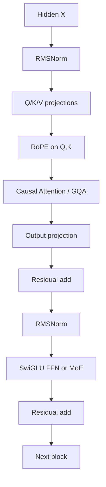
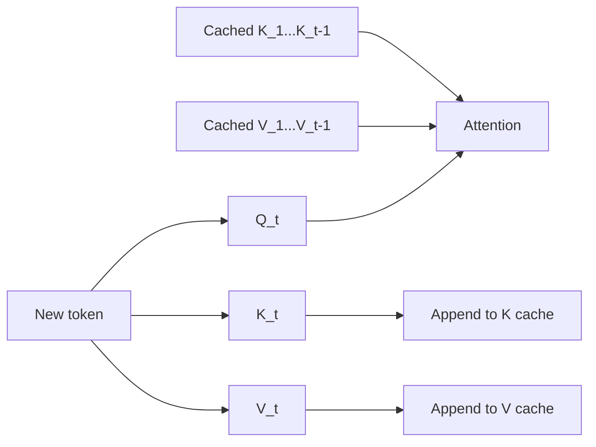

# 第四篇（Part IV）　现代 LLM Block：RoPE、RMSNorm、SwiGLU、GQA、KV Cache 与 FlashAttention

> **本章主线**：今天常见的 decoder-only LLM 与 2017 年原始 Transformer 已经相当不同。本章不按模型名罗列，而是把一个现代 block 拆成可计算的数据流，区分“改变函数表达能力的架构设计”和“数学等价但显著降低硬件代价的系统设计”。

---

# 1　先画出现代 Decoder-only Transformer 的标准骨架

一个典型现代 block 可以粗略写成：



用公式表示 Pre-Norm block：

$$
H'=H+\mathrm{Attn}(\mathrm{Norm}(H)),
$$

$$
H''=H'+\mathrm{FFN}(\mathrm{Norm}(H')).
$$

与原始 Transformer 相比，现代 LLM 常见变化包括：

| 模块 | 2017 原始 Transformer | 现代常见选择 |
|---|---|---|
| Norm | LayerNorm, Post-Norm | RMSNorm, Pre-Norm |
| Position | sinusoidal absolute PE | RoPE / variants |
| FFN | ReLU | SwiGLU / gated FFN |
| KV heads | MHA | MQA / GQA / MLA |
| Attention kernel | 直接 materialize score | FlashAttention 类 IO-aware kernel |
| FFN | dense | dense 或 MoE |
| Inference | 无重点 | KV cache / continuous batching / quantization |

理解这些模块后，看 LLaMA、Qwen、Mistral、DeepSeek 等模型的 architecture table 会容易很多。

---

# 2　LayerNorm 到 RMSNorm：究竟省掉了什么？

LayerNorm 对一个 token 的 hidden vector $x\in\mathbb R^d$ 计算：

$$
\mu=\frac1d\sum_{i=1}^d x_i,
$$

$$
\sigma^2=\frac1d\sum_i(x_i-\mu)^2,
$$

$$
\mathrm{LN}(x)_i
=\gamma_i\frac{x_i-\mu}{\sqrt{\sigma^2+\epsilon}}+\beta_i.
$$

RMSNorm 删除了显式均值中心化，使用均方根：

$$
\mathrm{RMS}(x)
=\sqrt{\frac1d\sum_i x_i^2+\epsilon},
$$

$$
\mathrm{RMSNorm}(x)_i
=\gamma_i\frac{x_i}{\mathrm{RMS}(x)}.
$$

因此它不做：

$$
x_i-\mu.
$$

RMSNorm 的原论文认为 re-centering invariance 并非 LayerNorm 成功的必要条件，并报告了计算效率优势。[Zhang & Sennrich, 2019](https://arxiv.org/abs/1910.07467)

## 2.1　手算

设：

$$
x=[3,4].
$$

忽略 $\epsilon$，且 $\gamma=[1,1]$。

则：

$$
\mathrm{RMS}(x)
=\sqrt{\frac{9+16}{2}}
=\sqrt{12.5}.
$$

所以：

$$
\mathrm{RMSNorm}(x)
=\frac{[3,4]}{\sqrt{12.5}}.
$$

注意它保留了向量的整体方向，只把尺度规整到稳定范围。

---

# 3　为什么现代 LLM 常用 Pre-Norm？

Post-Norm：

$$
y=\mathrm{Norm}(x+F(x)).
$$

Pre-Norm：

$$
y=x+F(\mathrm{Norm}(x)).
$$

Pre-Norm 中 residual path 更接近恒等映射：

$$
y=x+\text{small correction}.
$$

对非常深的网络，这通常更利于梯度传播和训练稳定性。

但不要把“Pre-Norm 一定比 Post-Norm 好”当定律。现代研究仍持续探索 residual scaling、DeepNorm、QK-Norm 等稳定性设计；模型规模、深度和 optimizer 会改变最优选择。

---

# 4　ReLU / GELU 到 SwiGLU：FFN 为什么也在进化

原始 FFN：

$$
\mathrm{FFN}(x)=W_2\mathrm{ReLU}(W_1x).
$$

现代 LLM 常使用 gated linear unit 变体。

Swish / SiLU：

$$
\mathrm{SiLU}(x)=x\sigma(x).
$$

SwiGLU 可以写成：

$$
\mathrm{SwiGLU}(x)
=
\mathrm{SiLU}(xW_g)\odot(xW_u),
$$

再 down-project：

$$
\mathrm{FFN}(x)
=
\left[
\mathrm{SiLU}(xW_g)\odot(xW_u)
\right]W_d.
$$

其中 $\odot$ 为逐元素乘法。

```text
x [B,T,d]
 ├── Wg ─→ gate [B,T,dff]
 │           ↓ SiLU
 └── Wu ─→ up   [B,T,dff]
             ↓ elementwise ×
          hidden [B,T,dff]
             ↓ Wd
          out [B,T,d]
```

GLU 变体在 Transformer 中的系统研究见 [Shazeer, 2020](https://arxiv.org/abs/2002.05202)。

直觉上，gating 允许一条分支决定“哪些 feature 通过”，另一条分支携带内容，比单一 ReLU 投影拥有更灵活的乘法交互。

---

# 5　位置编码真正要解决什么？

Self-attention 的内容相似度：

$$
q_i^\top k_j
$$

本身只关心向量内容，不天然包含 $i,j$ 的相对顺序。

一个理想的位置机制最好让 attention score 同时知道：

- token 是什么；
- 它在哪个位置；
- 两个 token 相隔多远。

RoPE（Rotary Position Embedding）正是现代 decoder-only LLM 中最有影响力的方法之一。[Su et al., 2021](https://arxiv.org/abs/2104.09864)

---

# 6　RoPE：把位置变成旋转角度

先只看二维向量：

$$
x=
\begin{bmatrix}
x_1\\x_2
\end{bmatrix}.
$$

二维旋转矩阵：

$$
R(\theta)=
\begin{bmatrix}
\cos\theta&-\sin\theta\\
\sin\theta&\cos\theta
\end{bmatrix}.
$$

位置 $m$ 的 query 被旋转：

$$
q_m'=R(m\theta)q_m.
$$

位置 $n$ 的 key：

$$
k_n'=R(n\theta)k_n.
$$

它们点积：

$$
(q_m')^\top k_n'
=q_m^\top R(m\theta)^TR(n\theta)k_n.
$$

因为旋转矩阵满足：

$$
R(a)^TR(b)=R(b-a),
$$

所以：

$$
(q_m')^\top k_n'
=q_m^\top R((n-m)\theta)k_n.
$$

关键出现了：

$$
n-m.
$$

也就是说，绝对位置经过旋转后，在 query-key 点积中自然产生了**相对位置信息**。

---

# 7　高维 RoPE：把 hidden dimension 两两配对

实际 head dimension 可能是 64、128 等。

把维度配成：

```text
(x0,x1), (x2,x3), ..., (x_{d-2},x_{d-1})
```

每一对使用不同频率 $\theta_i$ 旋转。

典型频率：

$$
\theta_i=10000^{-2i/d}.
$$

于是不同维度对应不同“位置波长”。

RoPE 不需要把位置 embedding 直接加到 token hidden state，而是作用在 Q/K 上。

```text
X
 ↓ project
Q,K
 ↓ RoPE(position)
Q',K'
 ↓ dot product
relative-position-aware attention score
```

---

# 8　长上下文为什么会让 RoPE 遇到新问题？

如果模型训练时主要见过：

$$
0\le pos \lt  4096,
$$

测试突然使用：

$$
pos=100000,
$$

旋转相位进入训练中没有覆盖的区域。

于是产生多种 context extension 方法：

- position interpolation；
- NTK-aware scaling；
- YaRN；
- LongRoPE 等。

它们本质上都在处理一个问题：

> **怎样改变位置频率/映射，让模型在更长位置范围内保持可用，而不是简单把 max_position_embeddings 改大。**

Position Interpolation 代表工作见 [Chen et al., 2023](https://arxiv.org/abs/2306.15595)，YaRN 见 [Peng et al., 2023](https://arxiv.org/abs/2309.00071)。

但要再次强调：

$$
\text{可接受长输入}
\neq
\text{真正会利用长输入}.
$$

---

# 9　从 MHA 到 MQA/GQA：问题来自推理，而不是训练公式漂亮不漂亮

标准 Multi-Head Attention：

```text
Q heads: h
K heads: h
V heads: h
```

每个 query head 有自己 K/V head。

训练时这没有大问题。但自回归推理使用 KV Cache 后，K/V 必须为每一个历史 token 保存。

设：

- batch $B$
- context length $T$
- layers $L$
- KV heads $h_{kv}$
- head dim $d_h$
- 每元素字节数 $s$

KV Cache 大致：

$$
M_{KV}
\approx
2BLTh_{kv}d_hs.
$$

前面的 2 对应 K 与 V。

所以减少 $h_{kv}$ 会直接降低 cache。

---

# 10　MQA：所有 Query Heads 共用一组 K/V

Multi-Query Attention（MQA）让：

```text
Q heads : h
K heads : 1
V heads : 1
```

即：

$$
h_{kv}=1.
$$

它大幅减少 KV Cache 和 decode 时读取 K/V 的内存带宽。相关工作见 [Shazeer, 2019](https://arxiv.org/abs/1911.02150)。

但代价可能是模型质量下降，因为所有 query heads 被迫共享同一 K/V 表示。

---

# 11　GQA：在 MHA 与 MQA 之间折中

Grouped-Query Attention（GQA）设置：

$$
1\lt h_{kv}\lt h_q.
$$

例如：

```text
8 query heads
2 KV heads

Q0,Q1,Q2,Q3 → KV0
Q4,Q5,Q6,Q7 → KV1
```

论文表明 GQA 可以在质量与 MQA 类似推理效率之间取得良好折中。[Ainslie et al., 2023](https://arxiv.org/abs/2305.13245)

shape 示例：

```text
Q : [B, hq,  T, dh]
K : [B, hkv, T, dh]
V : [B, hkv, T, dh]

hq = 32
hkv = 8
```

逻辑上每个 KV head 被 4 个 query heads 共享。

---

# 12　KV Cache：为什么推理不能每次把前文全部重算？

假设已经生成：

```text
The robot picked up the
```

现在要生成下一个 token。

若没有 KV Cache，每次都重新计算所有历史 token 在每一层的 K/V：

```text
step 1: The
step 2: The robot
step 3: The robot picked
step 4: The robot picked up
...
```

历史 token 的 K/V 在 causal Transformer 中不会因为未来 token 到来而变化，因此可以缓存。

第 $t$ 步只新算：

$$
K_t,V_t,
$$

然后与缓存：

$$
K_{1:t-1},V_{1:t-1}
$$

拼起来。



KV Cache 是现代 autoregressive serving 的基础。

它用**显存空间换重复计算**。

---

# 13　为什么 Decode 经常是“内存带宽问题”

训练/Prefill 可以用大矩阵乘法，一次处理许多 token，GPU 计算单元容易被喂满。

Decode 时每个序列通常只产生一个新 token：

```text
large weight matrices
        ↓
for just one/few new tokens
```

大量时间花在：

- 从 HBM 读取权重；
- 读取 KV Cache；
- 较小矩阵运算。

因此 decode 往往更加 **memory-bandwidth bound**。

这解释了很多看似“算法次要”的设计为什么极其重要：

- GQA / MLA 减 KV；
- quantization 减权重字节；
- batching 提高矩阵规模；
- speculative decoding 减少串行 decode steps。

---

# 14　FlashAttention：公式没变，为什么速度能大幅变化？

普通 attention：

$$
S=QK^T,
$$

$$
P=\mathrm{softmax}(S),
$$

$$
O=PV.
$$

最朴素实现会把巨大的 $S,P\in\mathbb R^{T\times T}$ 写入高带宽显存 HBM，再读回来。

而 GPU 片上 SRAM 更快但更小。

FlashAttention 的核心思想是：

> **通过 tiling，把 Q/K/V 分块搬进片上内存，在块内完成 attention 计算，避免完整 $T\times T$ score/probability matrix 反复写入 HBM。**

[Dao et al., 2022](https://arxiv.org/abs/2205.14135)

```text
Naive attention
Q,K → QKᵀ → write S to HBM
          → read S → softmax → write P
          → read P,V → O

FlashAttention
Q/K/V tiles
   ↓ SRAM
blockwise score + online softmax + accumulation
   ↓
O
```

## 14.1　最容易犯的错误

FlashAttention **不是近似 attention**。

它计算的是 exact attention（在数值精度意义下与标准算法等价），主要改变的是 IO schedule，而不是把全 attention 换成稀疏 attention。

这是一条重要的系统原则：

$$
\text{same mathematical function}
\not\Rightarrow
\text{same hardware cost}.
$$

---

# 15　Online Softmax：FlashAttention 为什么可以不保存整行 score？

softmax 看起来需要先知道全行最大值：

$$
\mathrm{softmax}(x_i)
=
\frac{e^{x_i-m}}
{\sum_j e^{x_j-m}},
\quad m=\max_jx_j.
$$

似乎必须先把整行都算完。

实际上可以分块维护：

- 当前最大值 $m$；
- 当前归一化和 $l$；
- 当前加权输出 accumulator。

当新块最大值更大时，对旧 accumulator 做重缩放。

这使 softmax 可以流式处理 block，而不必 materialize 完整 attention matrix。

理解这一点，就能理解 FlashAttention 不只是“写了一个更快 CUDA kernel”，而是**重新安排数学运算顺序以匹配 memory hierarchy**。

---

# 16　FlashAttention 不会消除 $O(T^2)$ 计算复杂度

标准 full attention 仍需计算所有 query-key pair：

$$
T^2.
$$

FlashAttention 主要减少 IO complexity 与中间显存使用。

因此当 $T$ 从：

$$
8K\rightarrow1M,
$$

即使 kernel 很优化，quadratic attention 的总计算仍会成为巨大负担。

这推动了：

- sliding-window attention；
- block sparse attention；
- recurrent/SSM hybrids；
- linear attention；
- latent / compressed memory；
- retrieval augmentation。

现代超长上下文模型往往是“算法 + kernel + hierarchy”共同作用，而不是单一技巧。

---

# 17　Sliding Window Attention：局部化换复杂度

若每个 token 只关注前面的 $w$ 个 token：

$$
O(T^2)
ightarrow O(Tw).
$$

当 $w\ll T$ 时节省巨大。

Mistral 7B 就使用 Sliding Window Attention，并结合 GQA 等设计。[Jiang et al., 2023](https://arxiv.org/abs/2310.06825)

但代价是：

> 单层里很远的 token 不能直接互相通信。

多层堆叠可以扩大有效 receptive field，但与 full attention 并不完全等价。

---

# 18　一个现代 Attention Block 的完整 Shape 追踪

设：

$$
B=2,T=4096,d=4096,
$$

$$
h_q=32,h_{kv}=8,d_h=128.
$$

输入：

$$
X:[2,4096,4096].
$$

Q：

$$
[2,4096,32\times128]
\rightarrow
[2,32,4096,128].
$$

K/V：

$$
[2,4096,8\times128]
\rightarrow
[2,8,4096,128].
$$

RoPE：

```text
Q [2,32,4096,128] → rotate pairs
K [2, 8,4096,128] → rotate pairs
```

GQA 共享：

```text
32 query heads / 8 KV heads = 4 Q heads per KV group
```

逻辑 attention output：

$$
[2,32,4096,128].
$$

concat：

$$
[2,4096,4096].
$$

output projection 后仍：

$$
[2,4096,4096].
$$

所以从 block 外面看，shape 没变；优化都发生在内部表示与存储方式中。

---

# 19　参数量快速估算：Attention 与 FFN 谁更大？

若忽略 bias，标准 MHA：

$$
W_Q,W_K,W_V,W_O\in\mathbb R^{d\times d}.
$$

约：

$$
4d^2
$$

参数。

普通 FFN 若 expansion 为 $4d$：

$$
W_1:d\rightarrow4d,
\qquad
W_2:4d\rightarrow d,
$$

约：

$$
8d^2.
$$

所以经典 Transformer 中 FFN 往往比 attention projection 占更多参数。

这也是 MoE 替换 FFN 后能够大幅增加总参数、而每 token 只激活少数专家的原因。

---

# 20　现代架构优化到底分几类？

可以分成四类。

## 20.1　优化训练稳定性

- RMSNorm / norm placement；
- residual scaling；
- QK normalization；
- optimizer / initialization。

## 20.2　优化表示能力

- SwiGLU；
- MoE；
- multimodal fusion；
- routing。

## 20.3　优化长上下文

- RoPE scaling；
- sparse/sliding attention；
- latent memory；
- retrieval。

## 20.4　优化硬件效率

- GQA / MLA；
- FlashAttention；
- quantization；
- fused kernels；
- speculative decoding。

同一个技术可能横跨多类，但这套分类有助于防止“任何速度优化都被宣传成智能突破”。

---

# 本章小结

1. 现代 decoder-only block 通常采用 Pre-Norm，并广泛使用 RMSNorm、RoPE 与 gated FFN。
2. RMSNorm 删除了 LayerNorm 的 re-centering，只按 root-mean-square 归一化尺度。
3. SwiGLU 引入 multiplicative gating，现代 LLM 常用它替代 ReLU FFN。
4. RoPE 通过对 Q/K 旋转，使点积自然依赖相对位置 $n-m$。
5. KV Cache 避免自回归生成时重复计算历史 K/V，却产生显存与带宽压力。
6. MQA/GQA 通过减少 KV heads 显著降低 KV Cache；GQA 是质量与效率的常用折中。
7. FlashAttention 主要优化 IO，而不是改变 attention 数学定义，也不会把 full attention 的 $O(T^2)$ 计算变成线性。
8. 长上下文能力不能只看支持的 max token；还必须看训练长度、位置外推、有效检索和计算成本。
9. 理解现代 LLM 架构时，最有效的方法之一就是追踪每个 tensor 的 shape 和每一步需要读写多少内存。

---

# 本章练习

### 练习 1：RoPE 手推

取：

$$
q=[1,0],\quad k=[1,0],
$$

令 $\theta=\pi/6$，分别计算位置 $m=1,n=3$ 时旋转后的点积，并验证它只与 $n-m$ 的相对角度有关。

### 练习 2：KV Cache 估算

设：

- $L=32$
- $T=32768$
- $d_h=128$
- BF16，即 $s=2$ bytes
- $B=1$

分别计算：

$$
h_{kv}=32,8,1
$$

时理论 KV Cache 大小。

### 练习 3：解释 FlashAttention

不用“更快的算法”这句话。必须从：

- HBM；
- SRAM；
- tiling；
- online softmax；
- IO complexity

五个词完整解释其优势。

### 练习 4：长上下文批判

对一个宣称“支持 1M context”的模型列出至少 8 项你会追问的实验条件。

---

# 核心来源

- Zhang & Sennrich, **Root Mean Square Layer Normalization**, 2019: https://arxiv.org/abs/1910.07467
- Shazeer, **Fast Transformer Decoding: One Write-Head is All You Need**, 2019: https://arxiv.org/abs/1911.02150
- Shazeer, **GLU Variants Improve Transformer**, 2020: https://arxiv.org/abs/2002.05202
- Su et al., **RoFormer: Enhanced Transformer with Rotary Position Embedding**, 2021: https://arxiv.org/abs/2104.09864
- Dao et al., **FlashAttention**, 2022: https://arxiv.org/abs/2205.14135
- Ainslie et al., **GQA: Training Generalized Multi-Query Transformer Models from Multi-Head Checkpoints**, 2023: https://arxiv.org/abs/2305.13245
- Chen et al., **Extending Context Window of Large Language Models via Positional Interpolation**, 2023: https://arxiv.org/abs/2306.15595
- Peng et al., **YaRN: Efficient Context Window Extension of Large Language Models**, 2023: https://arxiv.org/abs/2309.00071
- Jiang et al., **Mistral 7B**, 2023: https://arxiv.org/abs/2310.06825
