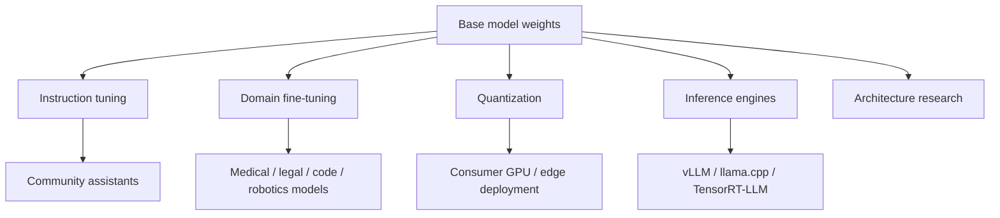
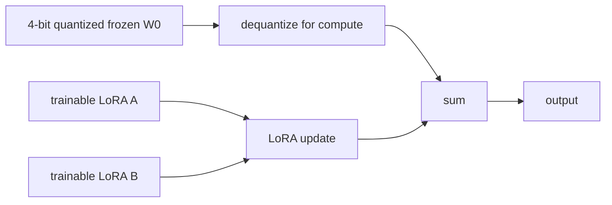
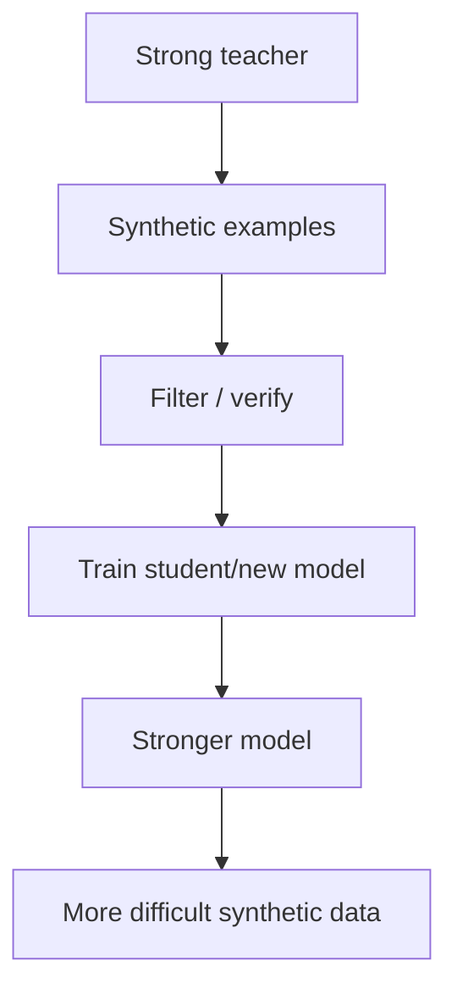

# Part V　开放权重革命与高效适配：LLaMA、Mistral、LoRA、QLoRA、量化与蒸馏

> **本章主线**：2023 年之后，大模型不再只是少数公司拥有的在线 API。开放权重模型把训练、微调、部署和架构研究扩散到整个社区；LoRA/QLoRA 又把“适配一个大模型”的门槛进一步降低。本章同时澄清一个经常混淆的概念：**open weights 不等于 open source。**

---

# 1　为什么 2023 是开放模型生态的转折点？

在 GPT‑3/ChatGPT 早期，大多数开发者主要通过 API 使用强模型。

这意味着你可以控制：

- prompt；
- sampling parameters；
- 上下文；

但无法控制：

- 模型权重；
- tokenizer / architecture；
- fine-tuning recipe；
- inference kernel；
- 部署硬件；
- 模型内部研究。

2023 年 LLaMA 的发布改变了生态节奏。原论文发布了 7B、13B、33B、65B 模型研究结果，并强调以更多 token 训练较小模型，从而兼顾性能和推理成本。[Touvron et al., 2023](https://arxiv.org/abs/2302.13971)

随后围绕开放权重模型迅速形成：



开放权重真正改变的是**研究的可操作性**。

---

# 2　Open Source 与 Open Weights 不是一回事

软件语境中的 open source 通常要求源码和许可证允许一系列使用、修改、再分发权利。

但模型包含更多组件：

- architecture code；
- inference code；
- weights；
- tokenizer；
- training data；
- training code；
- data processing pipeline；
- training recipe；
- license。

一个模型可以开放：

```text
✓ weights
✓ inference code
✓ model architecture
✗ full pretraining corpus
✗ exact training pipeline
```

所以本书尽量使用更精确的词：

> **开放权重模型（open-weight model）**

而不是把所有可下载模型都一概称为“完全开源”。

---

# 3　LLaMA：为什么更小的模型开始重新获得关注

LLaMA 继续了 Chinchilla 后的核心问题：

> 如果最终还要长期部署，为什么只追求固定训练预算下的最优模型，而不考虑 inference budget？

原论文报告 LLaMA-13B 在其多数评测上超过 GPT‑3 175B，而 65B 模型达到当时强劲水平。[Touvron et al., 2023](https://arxiv.org/abs/2302.13971)

这个结果不能简单理解成“13B 永远强于 175B”。

真正值得学的是：

$$
\text{capability}
=f(N,D,\text{data quality},\text{architecture},\text{recipe},\text{post-training}).
$$

参数量只是其中一个变量。

---

# 4　LLaMA 系列为什么对现代架构影响大？

LLaMA 采用了一组后来极其常见的设计：

- Pre-Norm；
- RMSNorm；
- SwiGLU；
- RoPE；
- decoder-only Transformer。

这些组件并不是 LLaMA 首创，但它把它们组合到一个高性能、可复现、广泛传播的模型族里。

后来 Llama 2、Llama 3 继续扩大训练数据和模型规模。Meta 的 Llama 3 技术报告描述了最大 405B dense Transformer、128K context，并系统讨论数据、scaling、instruction tuning、safety 与 multimodality extension。[Dubey et al., 2024](https://ai.meta.com/research/publications/the-llama-3-herd-of-models/)

这一时期一个重要趋势是：

> **大家开始更多比较“训练得多充分”和“后训练有多好”，而不是只比较参数。**

---

# 5　Mistral：小模型也可以靠架构与训练工程竞争

Mistral 7B 采用：

- Grouped-Query Attention；
- Sliding Window Attention；
- 适合高效推理的设计。

论文见 [Jiang et al., 2023](https://arxiv.org/abs/2310.06825)。

它代表 2023 年后的另一条趋势：

```text
不是：模型越大越好
而是：
给定显存 / latency / throughput / serving budget，
怎样获得最高能力？
```

这是一种**Pareto frontier** 思维。

如果模型 A 分数高 1%，但：

- 显存翻倍；
- latency 三倍；
- 每 token 成本四倍；

它未必是实际系统中的优胜者。

---

# 6　Fine-tuning 的基本问题：完整更新太贵了

假设模型参数：

$$
W\in\mathbb R^{d_{out}\times d_{in}}.
$$

Full Fine-Tuning 会更新所有：

$$
\theta_1,\theta_2,\ldots,\theta_N.
$$

对于一个 70B 模型，训练内存不只是 70B 个权重。

以 AdamW 为例，还可能需要：

- 参数；
- gradient；
- first moment；
- second moment；
- master weights（取决于精度方案）；
- activations。

因此训练显存可能是纯权重存储的数倍甚至更多。

于是出现 Parameter-Efficient Fine-Tuning（PEFT）：

> 冻结大部分 base model，只学习少量附加参数。

---

# 7　LoRA：把权重更新假设成低秩

LoRA（Low-Rank Adaptation）是最重要的 PEFT 方法之一。[Hu et al., 2021](https://arxiv.org/abs/2106.09685)

原权重：

$$
W_0\in\mathbb R^{d_{out}\times d_{in}}.
$$

Full FT：

$$
W=W_0+\Delta W.
$$

LoRA 假设更新可以低秩分解：

$$
\Delta W=BA,
$$

其中：

$$
A\in\mathbb R^{r\times d_{in}},
$$

$$
B\in\mathbb R^{d_{out}\times r},
$$

而：

$$
r\ll \min(d_{in},d_{out}).
$$

所以 forward：

$$
y=W_0x+BAx.
$$

训练时冻结 $W_0$，只更新 $A,B$。

---

# 8　LoRA 到底省多少参数？

假设：

$$
d_{in}=d_{out}=4096.
$$

完整矩阵参数：

$$
4096^2=16,777,216.
$$

若 LoRA rank：

$$
r=16,
$$

则训练参数：

$$
16\times4096+4096\times16
=131,072.
$$

比例：

$$
\frac{131072}{16777216}
\approx0.78\%.
$$

只对这一矩阵而言，训练参数不到 1%。

这就是 LoRA 的力量来源。

---

# 9　为什么“低秩更新”可能有效？

LoRA 论文受到一个观察启发：模型 adaptation 需要的有效更新可能位于低维子空间。

换句话说，虽然：

$$
W\in\mathbb R^{4096\times4096},
$$

但任务从“通用模型”变成“某个特定行为”时，不一定需要任意改变 1600 多万个自由度。

可以把它类比成：

> 基础模型已经拥有大部分表示，我们只需在参数空间里沿少数关键方向调整。

这不是保证所有任务的最优 $\Delta W$ 都严格低秩，而是一种极其成功的工程近似。

---

# 10　LoRA 常加在哪里？

常见 target modules：

- $W_Q$
- $W_K$
- $W_V$
- $W_O$
- FFN up/down/gate projections

更少 target：

```text
训练参数更少
↓
但 adaptation capacity 较低
```

更多 target：

```text
训练参数增加
↓
更接近 full fine-tuning flexibility
```

没有一个 rank 或 target modules 对所有任务都最优。

---

# 11　LoRA scaling：$\alpha/r$ 是什么？

实践中常写：

$$
W=W_0+\frac{\alpha}{r}BA.
$$

其中：

- $r$：rank；
- $\alpha$：LoRA scaling hyperparameter。

它让更新幅度不必随 rank 线性变化。

后续还有 rsLoRA、DoRA 等变体，试图改善不同 rank 下的 scaling 或把 magnitude/direction 分开学习，但核心思想仍来自：

$$
\Delta W\approx BA.
$$

---

# 12　Quantization：为什么模型可以不用 FP16/BF16 存每个权重？

一个 FP16/BF16 权重约 2 bytes。

70B 参数仅权重理论大小：

$$
70\times10^9\times2
\approx140\text{ GB}.
$$

若能量化到 4-bit：

$$
70\times10^9\times0.5
\approx35\text{ GB},
$$

还需额外 scale/metadata，因此实际略高。

核心思想：把连续权重映射到有限离散 level。

最简单 uniform quantization：

$$
q=\mathrm{round}\left(\frac{x-z}{s}\right),
$$

反量化：

$$
\hat x=sq+z.
$$

其中：

- $s$：scale；
- $z$：zero point。

---

# 13　Weight-only、Weight+Activation 与 KV Quantization

量化不是一种东西。

## 13.1　Weight-only

```text
Weights: INT4 / INT8
Activations: FP16/BF16
```

主要减少模型权重存储和带宽。

## 13.2　Weight + Activation

例如：

```text
W8A8
```

权重和 activation 都量化，可获得更高硬件吞吐，但 calibration 更难。

## 13.3　KV Cache Quantization

当 context 很长、batch 很大时，KV cache 本身会成为显存大户，因此可以量化 K/V。

这属于 inference-time memory optimization，不是普通 weight quantization。

---

# 14　GPTQ 与 AWQ：为什么 Post-Training Quantization 也能很强

GPTQ 使用二阶近似思想进行逐层/逐块的权重量化，目标是在不重新完整训练模型的情况下尽量控制量化误差。[Frantar et al., 2022](https://arxiv.org/abs/2210.17323)

AWQ 则强调少量显著权重/activation channel 对模型质量特别重要，并通过 activation-aware scaling 改善低比特量化。[Lin et al., 2023](https://arxiv.org/abs/2306.00978)

这类方法说明：

> 模型对不同方向/通道的量化误差敏感度并不均匀。

所以优秀量化远比简单：

```python
weight = weight.round()
```

复杂。

---

# 15　QLoRA：把“量化 base model”和“训练 LoRA”组合起来

QLoRA 2023 年提出：

> 把冻结的 base model 以 4-bit 量化形式存储，同时通过量化权重反向传播到 LoRA adapter，从而显著降低 fine-tuning 显存。[Dettmers et al., 2023](https://arxiv.org/abs/2305.14314)

结构：



核心要点包括：

- 4-bit NormalFloat（NF4）；
- Double Quantization；
- Paged Optimizers；
- LoRA adapters。

---

# 16　NF4：为什么不是普通均匀 4-bit？

神经网络权重经过训练后往往近似集中在 0 附近，而不是均匀分布。

QLoRA 的 NF4 设计针对近似正态分布权重，让有限的 16 个 4-bit level 更适合这种统计分布。

直觉：

```text
uniform 4-bit:
每个数值区间一样宽

NF4:
对“权重最常出现的区域”分配更合适的表示点
```

因此相同 4 bit，quantization error 可以更合理。

---

# 17　Double Quantization：scale 本身也占空间

Group-wise quantization 会为每组权重保存 scale。

当模型巨大时：

```text
weight 已经 4-bit
但 scale 仍然很多
```

Double Quantization 再量化这些 quantization constants，从而继续减少内存。

这是一个非常典型的系统优化：

> 当主数据已经被压得很小，原来看似微不足道的 metadata 会变成新的瓶颈。

---

# 18　Full FT、LoRA、QLoRA 怎么选？

| 方案 | 显存 | 训练自由度 | 多任务 adapter | 典型使用场景 |
|---|---:|---:|---:|---|
| Full FT | 最高 | 最高 | 差 | 大规模 continued pretraining / 有足够集群 |
| LoRA | 中低 | 中等 | 好 | instruction/domain adaptation |
| QLoRA | 很低 | 中等 | 好 | 单机/小集群微调大模型 |

不要把 LoRA 理解成“穷人的 full FT”。

它有一个实际优势：

```text
一个 base model
   ├── adapter A：医疗
   ├── adapter B：代码
   ├── adapter C：机器人
   └── adapter D：写作
```

只保存小 adapter 就能维护多个定制版本。

---

# 19　Continued Pretraining、SFT、LoRA：名字相似，目标不同

## 19.1　Continued Pretraining

继续做 LM objective：

$$
-\log p(x_t|x_{<t}).
$$

数据可能换成领域 corpus。

目标：**让 base model 更熟悉一个分布。**

## 19.2　SFT

训练 instruction-response：

```text
instruction → desired answer
```

目标：**教行为。**

## 19.3　LoRA

LoRA 是**参数更新方式**，不是数据/训练目标。

所以完全可以有：

- LoRA continued pretraining；
- LoRA SFT；
- LoRA DPO。

这是初学者最容易混淆的概念之一。

---

# 20　Distillation：从大模型向小模型转移行为

知识蒸馏的基本思想是让 student 模型学习 teacher 的输出分布或生成结果。

传统 logits distillation：

$$
\mathcal L_{KD}
= D_{KL}\left(
 p_T(\cdot|x)\Vert p_S(\cdot|x)
\right).
$$

现代 LLM 更常见的是生成式蒸馏：

```text
Teacher model
   ↓ generates
high-quality solutions / reasoning / instructions
   ↓
Student SFT / preference / RL
```

DeepSeek-R1 后的一个重要现象，就是把强 reasoning 模型产生的数据用于较小 dense/open models，从而转移部分推理行为。[DeepSeek-AI, 2025](https://arxiv.org/abs/2501.12948)

但要注意：

> student 学到“teacher 生成的轨迹”，并不自动等于重新发现 teacher 形成这些策略的训练机制。

“模仿推理结果”与“通过 RL 自己学会探索”是不同研究问题。

---

# 21　Synthetic Data：开放模型时代的数据飞轮

当强模型能生成：

- instruction；
- answer；
- code；
- critique；
- preference pair；
- reasoning trace；

就可以形成：



但 synthetic data 有三个风险：

1. teacher error 被复制；
2. distribution 变窄；
3. 模型反复学习自己的风格，真实世界覆盖下降。

所以现代数据工程越来越依赖：

- 多源生成；
- verifier；
- dedup；
- difficulty curriculum；
- 与真实数据混合。

---

# 22　开放生态真正带来的研究变化

在 API-only 世界中，你通常只能问：

> prompt 怎么写更好？

有权重后可以问：

- attention head 在干什么？
- 把 GQA 改成 MHA 会怎样？
- RoPE frequency 改了会怎样？
- LoRA 插在哪层最好？
- 某层 activation 是否存在 task representation？
- 4-bit 到底损失多少能力？
- 可以自己做 continual pretraining 吗？

所以开放权重的意义不仅是“免费使用”，而是：

> **让模型重新成为可实验的科学对象。**

---

# 本章小结

1. 2023 年以后开放权重生态显著降低了 LLM 研究、微调和部署门槛。
2. Open weights 不等于完整 open source；训练数据、训练代码和许可证都应单独检查。
3. LLaMA 强化了“较小模型 + 充分训练 + 更低推理成本”的路线。
4. Mistral 等工作强调 capability / latency / memory / cost 的 Pareto trade-off。
5. LoRA 使用：

$$
\Delta W=BA,
$$

以低秩矩阵近似任务更新，大幅减少 trainable parameters。
6. 量化通过低比特表示减少权重/activation/KV 的存储和带宽，但不同方案优化目标不同。
7. QLoRA 把 4-bit frozen base model 与 LoRA 结合，使大模型能在更小硬件上微调。
8. Continued pretraining、SFT 是训练目标/数据阶段；LoRA 是参数更新机制，三者不能混为一谈。
9. Distillation 与 synthetic data 让强模型可以生成新训练数据，但 verifier 和真实数据仍非常重要。
10. 开放权重真正重要的科学价值，是让架构、优化、解释和系统研究重新可实验。

---

# 本章练习

### 练习 1：LoRA 参数量

对：

$$
W\in\mathbb R^{8192\times8192},
$$

分别计算 rank：

$$
r=8,16,64,256
$$

时 LoRA 参数量及相对 full matrix 比例。

### 练习 2：显存估算

计算 7B、13B、70B 模型分别以：

- FP32；
- BF16；
- INT8；
- 4-bit

仅存 weights 时的理论容量。

### 练习 3：区分训练方式

你有 100GB 机器人操作文本/日志，目标是得到一个机器人领域助手。分别设计：

- continued pretraining；
- SFT；
- LoRA SFT；
- QLoRA SFT

的数据形式与目的。

### 练习 4：开放程度审计

挑一个公开模型，分别检查：

- weights；
- architecture；
- tokenizer；
- inference code；
- training code；
- training data；
- license。

最后再判断“open-source”这个词是否准确。

---

# 核心来源

- Hu et al., **LoRA: Low-Rank Adaptation of Large Language Models**, 2021: https://arxiv.org/abs/2106.09685
- Touvron et al., **LLaMA**, 2023: https://arxiv.org/abs/2302.13971
- Dettmers et al., **QLoRA: Efficient Finetuning of Quantized LLMs**, 2023: https://arxiv.org/abs/2305.14314
- Frantar et al., **GPTQ: Accurate Post-Training Quantization for Generative Pre-trained Transformers**, 2022: https://arxiv.org/abs/2210.17323
- Lin et al., **AWQ: Activation-aware Weight Quantization for LLM Compression and Acceleration**, 2023: https://arxiv.org/abs/2306.00978
- Jiang et al., **Mistral 7B**, 2023: https://arxiv.org/abs/2310.06825
- Dubey et al., **The Llama 3 Herd of Models**, 2024: https://ai.meta.com/research/publications/the-llama-3-herd-of-models/
- DeepSeek-AI, **DeepSeek-R1**, 2025/2026: https://arxiv.org/abs/2501.12948
