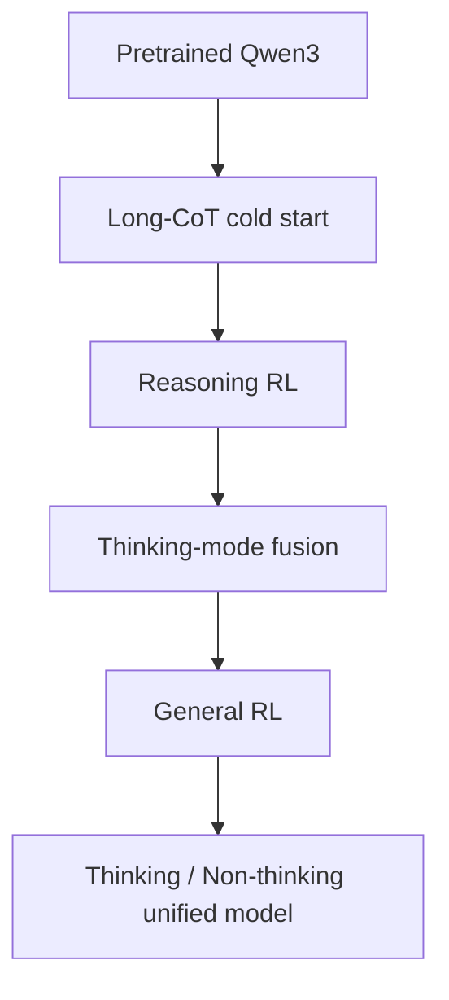
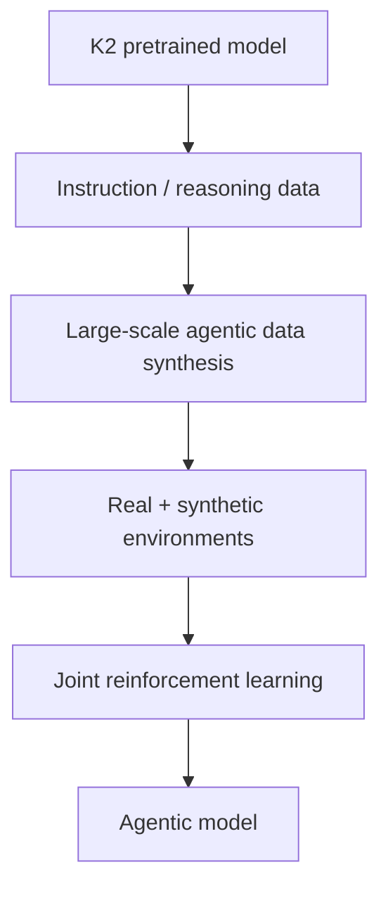

# Part VII　MoE 与中国大模型路线：从 GLM‑130B、Qwen 到 DeepSeek、Kimi 与 GLM‑5

> **本章主线**：中国大模型的发展不能被写成“国外模型的附录”。从百亿/千亿级预训练稳定性，到中英双语与开放权重生态，再到 MLA、DeepSeekMoE、Reasoning RL、Agentic Training、线性/稀疏注意力与超稀疏 MoE，中国团队逐步形成了自己的模型系统路线。本章先把 MoE 的数学讲清，再沿 2022–2026 的关键技术节点重走一次。
>
> **时间截面：2026-09-14。** 对 2026 年仍快速更新的模型，本章只把官方公开架构/训练信息作为“当前快照”，厂商自报 benchmark 不视为独立第三方结论。

---

# 1　为什么 Dense Model 会遇到一个经济学问题？

Dense Transformer 的一个基本特点是：

> 每个 token 几乎都会经过同一套全部 FFN 参数。

如果把 FFN 规模从：

$$
N\rightarrow 10N,
$$

每个 token 的计算量也会显著增加。

这导致参数规模、训练 FLOPs 与推理 FLOPs 高度耦合。

但我们真正想要的可能是：

```text
拥有巨大的“知识/技能容量”
            +
每个 token 只用其中少量计算
```

Mixture-of-Experts（MoE）就是为这种稀疏条件计算服务的核心架构之一。

---

# 2　MoE：把一个 FFN 变成很多专家

普通 FFN：

$$
y=E(x).
$$

MoE 有 $N$ 个 experts：

$$
E_1,E_2,\ldots,E_N.
$$

Router 根据 token hidden state $x$ 产生 logits：

$$
z=W_rx.
$$

再得到 routing score：

$$
p_i=\operatorname{softmax}(z)_i.
$$

只选择 top-$k$ experts：

$$
\mathcal T(x)=\operatorname{TopK}(p,k).
$$

输出：

$$
y=
\sum_{i\in\mathcal T(x)}
\tilde p_iE_i(x).
$$

若：

$$
N=128,\quad k=8,
$$

那么一个 token 只经过 8 个 routed experts，而不是全部 128 个。

---

# 3　总参数与激活参数：MoE 模型为什么必须报两个数字

假设：

```text
Total parameters:     235B
Activated per token:   22B
```

这不是说模型“只有 22B 有效参数”。

而是：

- 整个模型存储了约 235B 参数；
- 对某个具体 token，forward 只触发其中约 22B 对应的计算路径。

因此两个成本不同：

$$
\text{memory capacity}
\propto N_{total},
$$

$$
\text{per-token compute}
\propto N_{active}.
$$

MoE 的核心收益可以概括为：

> **用更高的参数容量换取没有同比例增长的每 token FLOPs。**

但权重仍然必须被存储并分布到设备上，所以 MoE 不是“免费大模型”。

---

# 4　Switch Transformer：把稀疏 MoE 推到大规模 Transformer 主线

Switch Transformer 使用非常简单的 top-1 routing：每个 token 只发送给一个 expert，并讨论如何把模型扩展到万亿参数规模。[Fedus, Zoph & Shazeer, 2021](https://arxiv.org/abs/2101.03961)

它的重要意义之一是证明：

> MoE 可以在现代 Transformer 训练里成为工程上可扩展的主干，而不是小规模实验技巧。

随后 Mixtral 等模型又把 MoE 推入开放模型生态。[Jiang et al., 2024](https://arxiv.org/abs/2401.04088)

---

# 5　MoE 最难的不是“有很多 FFN”，而是 Routing

如果 router 总偏爱 expert 7：

```text
Expert 1 : ██
Expert 2 : █
Expert 3 : ███
...
Expert 7 : ██████████████████████
```

就会出现：

- expert 7 overflow；
- 其他 GPU 空闲；
- token 被丢弃或延迟；
- experts specialization 失衡。

这就是 **load balancing**。

早期常增加 auxiliary loss，让 routing distribution 更均衡：

$$
\mathcal L
=
\mathcal L_{LM}
+\lambda\mathcal L_{balance}.
$$

问题是：

> 辅助均衡目标可能与主语言建模目标冲突。

如果 $\lambda$ 太大，router 为了“平均分流”而不再选择最适合 token 的专家。

DeepSeek-V3 后来把 **auxiliary-loss-free load balancing** 推到主流讨论，正是在处理这个矛盾。[DeepSeek-AI, 2024](https://arxiv.org/abs/2412.19437)

---

# 6　Expert Parallelism：MoE 为什么会制造 All-to-All 通信

不同专家通常放在不同 GPU：

```text
GPU0: experts 0–7
GPU1: experts 8–15
GPU2: experts 16–23
...
```

一批 token 经过 router 后必须被发送到相应设备：

```text
Tokens
  ↓ router
GPU0 token → GPU4 expert
GPU1 token → GPU2 expert
GPU5 token → GPU0 expert
...
```

这不是普通 all-reduce，而是典型 **all-to-all** traffic。

所以 MoE 的系统性能取决于：

- 路由分布；
- interconnect；
- token dispatch；
- expert placement；
- communication-compute overlap；
- capacity factor。

因此：

$$
\text{Sparse FLOPs}
\not\Rightarrow
\text{automatically fast wall-clock time}.
$$

---

# 7　中国大模型路线为什么必须从 2022 年以前的基础工作看起？

中国 NLP 团队早已在 BERT-era 做中文预训练模型，例如百度 ERNIE 系列、清华/智谱 GLM 等。

真正进入“百亿/千亿级基础模型”的阶段后，挑战开始从算法论文扩展到：

- 大规模训练稳定性；
- 中英双语数据；
- 并行系统；
- INT4/INT8 部署；
- 开放权重；
- 国产/异构硬件适配。

这条经验会直接影响后来的 ChatGLM、Qwen、DeepSeek、Kimi、GLM 等路线。

---

# 8　GLM‑130B：100B 级中英双语训练的早期系统实践

2022 年 GLM‑130B 发布为 130B 参数的中英双语预训练模型，并公开讨论了大规模训练中的 loss spikes、divergence、稳定性与量化问题。[Zeng et al., 2022](https://arxiv.org/abs/2210.02414)

这篇报告的重要价值不是今天还要把 GLM‑130B 当最强模型，而是它记录了：

> **100B 级模型真正训练起来会遇到哪些“论文公式之外”的系统问题。**

尤其包括：

- loss spike；
- 训练发散；
- 大规模并行；
- mixed precision；
- INT4 inference。

技术史上这种“失败经验公开”很有价值，因为大模型训练最危险的问题往往不会出现在最终漂亮的 architecture diagram 上。

---

# 9　2023：中文开放权重生态真正形成

2023 年中国出现多条开放/开放权重路线：

- ChatGLM；
- Baichuan / Baichuan 2；
- Qwen；
- InternLM；
- Yi；
- DeepSeek LLM / Coder 等。

它们共同做了一件事：

> 把中文、代码、多语言和指令模型的可本地部署能力从研究机构扩散到开发者社区。

例如 Baichuan 2 发布 7B/13B 模型，报告从头训练于 2.6T tokens，并发布预训练 checkpoint。[Yang et al., 2023](https://arxiv.org/abs/2309.10305)

这时行业竞争还主要围绕：

```text
Dense decoder-only Transformer
+ 更好数据
+ 中文/英文 tokenizer
+ SFT/RLHF
+ 长上下文
```

真正的架构分叉会在 2024 年明显加速。

---

# 10　Qwen 路线：从通用开放模型到统一 reasoning / agent 平台

Qwen 系列逐渐形成：

- general LLM；
- code；
- math；
- vision-language；
- audio；
- MoE；
- reasoning；
- agentic coding。

到 Qwen2.5，技术报告称其预训练数据规模达到约 18T tokens，并系统扩展了语言、代码、数学等能力。[Qwen Team, 2024](https://arxiv.org/abs/2412.15115)

到 Qwen3，路线进一步变化：

> **一个模型同时支持 Thinking 与 Non-Thinking，而不是把 reasoning model 和 chat model 完全拆开。**

Qwen3 官方技术报告和发布文档：[Yang et al., 2025](https://arxiv.org/abs/2505.09388)、[Qwen Team, 2025](https://qwenlm.github.io/blog/qwen3/)。

---

# 11　Qwen3：Dense + MoE + Hybrid Thinking

Qwen3 同时包含 dense 与 MoE 模型。

旗舰公开 MoE：

```text
Qwen3-235B-A22B
Total params ≈ 235B
Active params ≈ 22B
Experts       = 128
Activated     = 8 routed experts/token
```

官方发布还给出 Qwen3-30B-A3B：约 30B 总参数、3B 激活参数。[Qwen, 2025](https://qwenlm.github.io/blog/qwen3/)

更重要的是 post-training：



官方描述的四阶段路线包括：

1. long CoT cold start；
2. reasoning RL；
3. 将快速非思考行为融合进模型；
4. general RL 强化 instruction following、format、agent 等能力。

这说明 reasoning 已不再只是一个“特殊模型产品”，而开始变成可配置 inference mode。

---

# 12　DeepSeek‑V2：真正重要的是 MLA + DeepSeekMoE

2024 年 DeepSeek‑V2 发布：

- 236B total parameters；
- 21B activated per token；
- 128K context；
- 8.1T pretraining tokens；
- MLA；
- DeepSeekMoE。

原报告：[DeepSeek-AI, 2024](https://arxiv.org/abs/2405.04434)

DeepSeek 官方报告称，相对 DeepSeek 67B：

- KV Cache 降低 93.3%；
- 最大 generation throughput 提升到 5.76×；
- 训练成本也显著下降。

这些数字是**论文在其特定对照设置下的报告值**，应在同一配置语境里理解。

---

# 13　MLA：KV Cache 真正需要保存“完整 K/V”吗？

GQA 的思路是：

> 少存几组 K/V heads。

MLA（Multi-head Latent Attention）提出更激进的问题：

> **K/V 是否可以先压到一个低维 latent，再在计算时恢复/吸收到投影矩阵里？**

概念化地，普通 attention 对当前 token hidden state $h_t$：

$$
k_t=W_Kh_t,
\qquad
v_t=W_Vh_t.
$$

MLA 先做低秩压缩：

$$
c_t^{KV}=W^{DKV}h_t,
$$

其中：

$$
c_t^{KV}\in\mathbb R^{d_c},
\qquad d_c\ll h_{kv}d_h.
$$

再由 latent 产生 content key/value：

$$
k_t^C=W^{UK}c_t^{KV},
$$

$$
v_t^C=W^{UV}c_t^{KV}.
$$

位置相关 RoPE 部分另行处理。

Inference 时，核心缓存可以从：

```text
many full K/V vectors per token
```

压成：

```text
one low-dimensional KV latent
+ small positional key component
```

因此大幅降低 KV cache。

这里的真正思想比“某模型用了 MLA”更值得记：

> **推理状态也可以成为架构设计对象。模型不应只优化训练 FLOPs，还要从网络结构上减少 serving-time state。**

---

# 14　DeepSeekMoE：专家不只是“128 个同质 FFN”

DeepSeekMoE 强调更细粒度的 experts，并引入 shared experts 与 routed experts 的设计。[Dai et al., 2024](https://arxiv.org/abs/2401.06066)

可以抽象成：

$$
y=E_{shared}(x)
+
\sum_{i\in TopK}g_iE_i^{routed}(x).
$$

直觉：

### Shared experts

承载很多 token 都需要的通用能力。

### Routed experts

让不同 token 选择更专门化的计算路径。

如果完全没有 shared expert，通用知识可能被多个 routed expert 重复学习。

因此 shared/routed 分工是在解决：

> **哪些计算应该共享，哪些计算值得条件化？**

---

# 15　DeepSeek‑V3：MoE 开始与训练系统协同设计

DeepSeek‑V3 技术报告给出的核心规模：

$$
671B\text{ total},
\qquad37B\text{ activated/token}.
$$

预训练约：

$$
14.8T\text{ tokens}.
$$

[DeepSeek-AI, 2024](https://arxiv.org/abs/2412.19437)

其技术组合包括：

- MLA；
- DeepSeekMoE；
- auxiliary-loss-free load balancing；
- Multi-Token Prediction（MTP）；
- FP8 mixed precision training；
- 大规模通信/并行优化。

官方报告称完整训练消耗约 2.788M H800 GPU hours，并报告训练过程中没有发生需要 rollback 的不可恢复 loss spike。该数字来自官方报告，应按其硬件/实现/统计口径理解，而不是简单转换成“任何人复现只需同样成本”。

---

# 16　Auxiliary-Loss-Free Load Balancing：为什么很重要？

传统方法：

$$
\mathcal L=\mathcal L_{LM}+\lambda\mathcal L_{balance}.
$$

DeepSeek‑V3 采用的核心思想是：

> 不把强负载均衡压力直接写进主 loss，而是给每个 expert 维护动态 bias，依据近期负载调整 routing tendency。

可以概念化成：

$$
s_i(x)=r_i(x)+b_i,
$$

其中：

- $r_i(x)$：token 与 expert 的原始 affinity；
- $b_i$：为平衡负载调整的 bias。

若 expert $i$ 长期过载：

$$
b_i\downarrow.
$$

若长期欠载：

$$
b_i\uparrow.
$$

这样主语言建模目标不用直接承受很大的 balance penalty。

---

# 17　Multi-Token Prediction：为什么一定只预测下一个 token？

标准 LM：

$$
h_t\rightarrow x_{t+1}.
$$

MTP 希望让同一表示同时承担更多未来预测任务：

$$
h_t\rightarrow
x_{t+1},x_{t+2},\ldots,x_{t+k}.
$$

它可以提供更密集的训练信号，并可能提升模型对局部未来结构的表示。

在 inference system 中，多 token prediction 模块还可以与 speculative decoding 思想结合：

> 一次提出多个候选未来 token，再由主模型验证。

但训练期 MTP 的“提升表示”和推理期“真正减少 decode 串行步数”要分开讨论。

---

# 18　2025 DeepSeek‑R1：路线从“高效基础模型”转向 Reasoning RL

DeepSeek‑R1 的关键技术不再主要是 MoE 架构，而是 post-training。

报告把两个阶段区分得很清楚：[DeepSeek-AI, 2025/2026](https://arxiv.org/abs/2501.12948)

### R1-Zero

直接在 base model 上做大规模强化学习，不先依赖传统 long-CoT SFT，观察到：

- self-reflection；
- verification；
- 更长 reasoning；
- strategy adaptation

等行为随 RL 训练出现。

### R1

加入 cold-start data 与多阶段 pipeline，改善：

- readability；
- language mixing；
- general capability；
- instruction following。

它的重要历史意义是把一个问题推到领域中心：

> **复杂推理能力究竟需要多少人工 reasoning demonstration，多少又可以通过可验证 reward 与探索获得？**

下一章会专门展开。

---

# 19　MiniMax‑01：另一条路线是改变 Attention Complexity

MiniMax‑01（2025）没有把所有赌注放在传统 full attention 上，而是将 Lightning Attention 与 MoE 结合。[MiniMax, 2025](https://arxiv.org/abs/2501.08313)

报告给出 MiniMax-Text-01：

- 456B total parameters；
- 45.9B activated/token；
- 32 experts；
- training context up to 1M；
- 报告称可向 4M inference context 外推。

这里最值得注意的是研究方向：

> 当 context 从 128K 走向 1M+，只优化 KV cache 已经不够，还必须重新面对 attention 随序列增长的复杂度。

因此中国大模型路线在 2025 年以后也开始出现：

- MoE sparsity；
- KV compression；
- linear/sparse attention；
- ultra-long context

的组合设计。

---

# 20　Kimi K2：从长上下文公司走向 Agentic Training

Moonshot AI 的 Kimi 系列早期以长上下文产品得到广泛关注；Kimi K2 则在 2025 年以开放权重 MoE + agentic training 形成新的技术节点。[Moonshot AI, 2025](https://arxiv.org/abs/2507.20534)

技术报告给出：

$$
1T\text{ total parameters},
$$

$$
32B\text{ activated parameters}.
$$

预训练：

$$
15.5T\text{ tokens}.
$$

并提出 **MuonClip** optimizer：在 Muon 的基础上加入 QK-clip，目标之一是解决大规模训练 instability。

更重要的是 post-training：



这里 agent 不再只是 prompt scaffold，而是进入训练数据与 RL 环境。

---

# 21　GLM‑4.5：ARC——Agentic、Reasoning、Coding 被合并成一个目标

GLM‑4.5（2025）的技术报告把模型定位为 ARC foundation model：Agentic、Reasoning、Coding。[GLM Team, 2025](https://arxiv.org/abs/2508.06471)

报告规模：

$$
355B\text{ total},
\qquad32B\text{ active}.
$$

预训练约：

$$
23T\text{ tokens}.
$$

并支持：

- thinking；
- direct response；
- agentic tasks；
- coding；
- reasoning。

这与 Qwen3 的 hybrid thinking 有一个共同趋势：

> **“聊天模型”“推理模型”“Agent 模型”的边界正在被合并。**

---

# 22　2026 快照：GLM‑5 把重点继续推向 Long-Horizon Agentic Engineering

截至 2026-09-14，GLM‑5 官方仓库公开描述的基础 GLM‑5 规模为：

$$
744B\text{ total},
\qquad40B\text{ active}.
$$

预训练数据约：

$$
28.5T\text{ tokens}.
$$

并公开使用 DeepSeek Sparse Attention（DSA）与异步 RL infrastructure `slime`，目标是提高 RL training throughput。[Z.ai, GLM‑5 official repository](https://github.com/zai-org/GLM-5)

官方仓库当前还已经出现 GLM‑5.1 等迭代版本；由于模型仍在快速更新，本书不把厂商自报“全球第一”等 benchmark 口径写成独立事实。

真正值得关注的是方向：

> **预训练规模继续增长，但竞争焦点越来越放在长期软件工程、数百轮迭代、工具使用和异步 RL。**

---

# 23　2026 快照：Kimi K3 把“超稀疏 MoE + Hybrid Attention + Native Multimodality”推到更大规模

Moonshot AI 的官方 Kimi K3 仓库截至 2026 年公开：

- 2.8T total parameters；
- 104B activated/token；
- 93 layers；
- 896 routed experts；
- 每 token 选择 16 个 routed experts；
- 另有 2 shared experts；
- 1M context；
- 69 KDA layers + 24 Gated MLA layers；
- native vision；
- MXFP4 weights / MXFP8 activations 的 QAT 配置。

来源：[MoonshotAI/Kimi-K3](https://github.com/MoonshotAI/Kimi-K3)

这一结构非常有代表性：

```text
传统 full attention
        ↓
MLA: 压缩 KV state
        +
KDA: 更高效的长序列 attention family
        +
更稀疏、更大的 MoE
        +
native vision
        +
million-token context
```

它说明“大模型扩展”正在从单纯增加 dense parameter，变成**稀疏计算、状态压缩、长序列机制、多模态与低精度训练共同设计**。

---

# 24　中国路线的技术脉络，不应只按公司名字背

可以把它压缩成六次转折。

## 转折一：百亿/千亿级训练可行性

代表：GLM‑130B 等。

核心问题：

> 大规模训练怎么稳定跑起来？

## 转折二：中文开放生态

代表：ChatGLM、Baichuan、Qwen、InternLM、Yi。

核心问题：

> 中文、多语言、代码与本地部署如何真正普及？

## 转折三：Inference-aware architecture

代表：DeepSeek‑V2 MLA / DeepSeekMoE。

核心问题：

> 不是只看训练 loss，而从架构层优化 KV cache 与 active compute。

## 转折四：大规模稀疏训练系统

代表：DeepSeek‑V3。

核心问题：

> MoE routing、负载均衡、低精度和多 token objective 能否一起扩展？

## 转折五：Reasoning RL

代表：DeepSeek‑R1、Qwen3、GLM‑4.5。

核心问题：

> 复杂推理是否能通过 RL / verifiable reward 继续增长？

## 转折六：Agentic / Long-horizon Model

代表：Kimi K2/K3、Qwen Coder 系、GLM‑5 系等。

核心问题：

> 模型能否在真实工具环境中长期行动，而不只是一次回答？

---

# 25　国内外已经不是“谁抄谁”的单线历史

到 2024–2026 年，技术扩散明显是双向和多向的。

例如：

- RoPE、FlashAttention、MoE 等来自全球不同研究线，被各家共同采用；
- DeepSeek 的 MLA / DeepSeekMoE / R1 training 影响全球开源模型研究；
- Qwen 的 dense + MoE + hybrid thinking 形成广泛开源生态；
- Kimi 把 Muon、agentic training、hybrid attention 推入大规模实践；
- Google/OpenAI/Anthropic 持续推动原生多模态、test-time compute、tool-use 与产品系统；
- 开源社区又把这些思想快速移植到 vLLM、SGLang、llama.cpp 等推理生态。

因此今天更合理的研究方法是：

> **按机制追踪全球技术树，而不是按国家画两条互不相干的时间线。**

---

# 26　如何读一个新的 MoE 模型？

以后看到：

```text
1T-A32B
128 experts
top-8
shared experts
MLA
256K context
```

按下面顺序问：

### 参数

$$
N_{total}=?
\qquad
N_{active}=?
$$

### Routing

- top-k？
- shared experts？
- load balance？
- expert capacity？

### Attention

- MHA/GQA/MLA？
- full/sparse/linear hybrid？
- KV cache/token？

### Parallelism

- expert parallel？
- all-to-all volume？
- communication overlap？

### Training

- tokens？
- precision？
- optimizer？
- MTP？

### Post-training

- SFT？
- preference？
- reasoning RL？
- agentic environment？

只有这样，“1T 参数”才真正有技术含义。

---

# 本章小结

1. MoE 用 routing 让每个 token 只激活少数专家，从而解耦 total parameter capacity 与 per-token compute。
2. MoE 的关键困难包括 load balancing、expert specialization、all-to-all communication 与 deployment memory。
3. GLM‑130B 是中国 100B 级中英预训练与稳定性工程的重要早期公开实践。
4. 2023 年 ChatGLM、Baichuan、Qwen、InternLM、Yi 等推动中文开放权重生态成熟。
5. DeepSeek‑V2 的 MLA 从架构上压缩 KV state，DeepSeekMoE 则提高参数容量与稀疏计算效率。
6. DeepSeek‑V3 将 MLA、MoE、auxiliary-loss-free balancing、MTP、FP8 与大规模系统协同起来。
7. DeepSeek‑R1 把竞争重点进一步推进到 reasoning RL。
8. Qwen3 把 dense/MoE 与 thinking/non-thinking 融合，并公开四阶段 post-training 路线。
9. MiniMax‑01、Kimi K3 等说明长上下文开始推动 attention mechanism 本身发生变化。
10. Kimi K2、GLM‑5 等则代表“Agent 能力直接进入训练与 RL”的趋势。
11. 到 2026 年，全球 LLM 技术树已经是高度交叉的；最有价值的学习方式是跟踪机制，而不是背公司名单。

---

# 本章练习

### 练习 1：MoE Active Ratio

计算下列模型每 token 的 active ratio：

$$
\frac{N_{active}}{N_{total}}.
$$

- 235B-A22B；
- 671B-A37B；
- 1T-A32B；
- 2.8T-A104B。

讨论 active ratio 越小是否一定越好。

### 练习 2：Router Collapse

设计一个 8-expert top-2 toy MoE。假设 80% token 都选择 expert 0 和 1，讨论：

- GPU utilization；
- overflow；
- gradient distribution；
- specialization。

然后分别提出 auxiliary loss 和 dynamic bias 两种解决方案。

### 练习 3：MLA vs GQA

画出同一个 token 在：

- MHA；
- GQA；
- MLA

下需要缓存的信息，重点解释“减少 head 数”和“压缩 latent state”的差异。

### 练习 4：技术史阅读

任选 Qwen、DeepSeek、Kimi、GLM 一条线，从第一代到当前版本只记录四项：

```text
Architecture
Data
Post-training
Systems
```

禁止只写 benchmark。

---

# 核心来源

- Fedus, Zoph & Shazeer, **Switch Transformers**, 2021: https://arxiv.org/abs/2101.03961
- Zeng et al., **GLM-130B: An Open Bilingual Pre-trained Model**, 2022: https://arxiv.org/abs/2210.02414
- Yang et al., **Baichuan 2**, 2023: https://arxiv.org/abs/2309.10305
- Dai et al., **DeepSeekMoE**, 2024: https://arxiv.org/abs/2401.06066
- Jiang et al., **Mixtral of Experts**, 2024: https://arxiv.org/abs/2401.04088
- DeepSeek-AI, **DeepSeek-V2**, 2024: https://arxiv.org/abs/2405.04434
- Qwen Team, **Qwen2.5 Technical Report**, 2024: https://arxiv.org/abs/2412.15115
- DeepSeek-AI, **DeepSeek-V3 Technical Report**, 2024: https://arxiv.org/abs/2412.19437
- MiniMax, **MiniMax-01: Scaling Foundation Models with Lightning Attention**, 2025: https://arxiv.org/abs/2501.08313
- DeepSeek-AI, **DeepSeek-R1**, 2025/2026: https://arxiv.org/abs/2501.12948
- Qwen Team, **Qwen3 Technical Report**, 2025: https://arxiv.org/abs/2505.09388
- Qwen Team, **Qwen3: Think Deeper, Act Faster**, 2025: https://qwenlm.github.io/blog/qwen3/
- Moonshot AI, **Kimi K2**, 2025: https://arxiv.org/abs/2507.20534
- GLM Team, **GLM-4.5**, 2025: https://arxiv.org/abs/2508.06471
- Z.ai, **GLM-5 official repository**, current 2026 snapshot: https://github.com/zai-org/GLM-5
- Moonshot AI, **Kimi K3 official repository**, current 2026 snapshot: https://github.com/MoonshotAI/Kimi-K3
