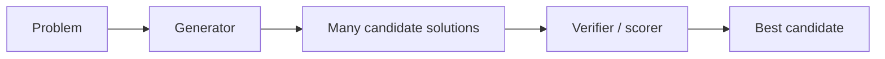
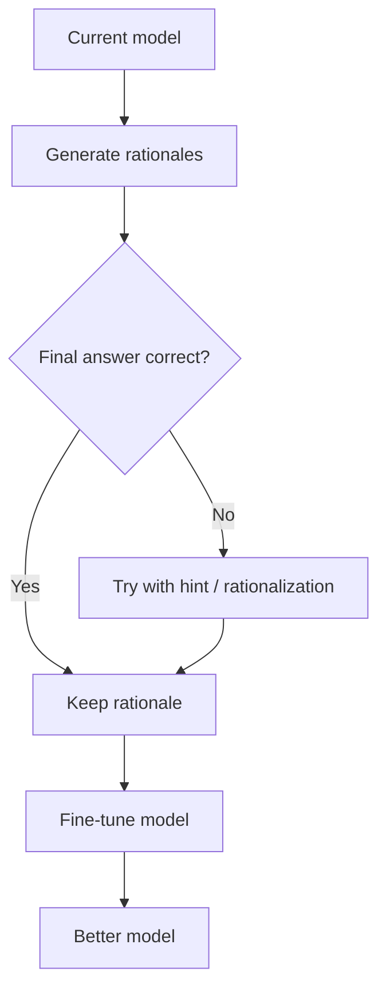

# Part VIII　推理模型时代：CoT、Verifier、GRPO、RLVR 与 Test-Time Compute

> **本章主线**：2022 年以后，“大模型推理”经历了三次明显变化：先用 prompt 诱导模型写中间步骤，再用采样/验证增加测试时计算，最后直接用强化学习塑造更有效的推理策略。2024–2026 年的关键变化，是 **scaling 不再只发生在 pretraining，训练期 reasoning RL 与测试期思考计算也开始成为新的扩展轴。**

---

# 1　先把“Reasoning”这个词拆开

今天说一个模型“会推理”，至少可能指四件不同的事。

## 1.1　任务需要多步关系计算

例如：

$$
\text{条件 A}+\text{条件 B}
\rightarrow\text{中间结论 C}
\rightarrow\text{答案 D}.
$$

这是任务属性。

## 1.2　模型生成显式中间文本

例如：

```text
Step 1: ...
Step 2: ...
Therefore: ...
```

这是 **reasoning trace / chain-of-thought** 的表面形式。

## 1.3　模型在测试时消耗更多计算

例如：

- 生成更长的内部推理；
- 采样 64 个答案；
- 搜索树；
- verifier reranking；
- 调工具反复验证。

这是 **test-time compute**。

## 1.4　模型通过训练学会新的推理策略

例如：

- reasoning SFT；
- outcome reward RL；
- process reward；
- RLVR。

这是 **reasoning post-training**。

如果不分这四层，“CoT 模型”“推理模型”“思考更久”就会被混成一个概念。

---

# 2　Chain-of-Thought：先让模型把中间步骤写出来

2022 年 Chain-of-Thought Prompting 工作发现，对足够大的语言模型提供包含中间推理过程的 few-shot examples，可以显著改善一系列算术、常识和符号推理任务。[Wei et al., 2022](https://arxiv.org/abs/2201.11903)

普通 prompt：

```text
Q: 一个人有 23 个苹果，给了朋友 7 个，又买 5 个，还剩多少？
A:
```

CoT demonstration：

```text
Q: ...
A: 先用 23-7=16，再加 5 得 21，所以答案是 21。
```

为什么这可能有帮助？

一个最终答案 token 必须一次完成很多隐含计算：

$$
x\rightarrow y.
$$

而允许 intermediate tokens 后：

$$
x\rightarrow z_1\rightarrow z_2\rightarrow\cdots\rightarrow y.
$$

每个中间 token 都可以成为新的 working state。

这意味着 autoregressive generation 本身形成一种外部 scratchpad。

---

# 3　“Let's think step by step”：Zero-Shot CoT

Kojima 等人在 2022 年发现，即使没有 few-shot reasoning examples，仅用类似“Let's think step by step”这样的 trigger，也可以显著改善一些大模型的零样本推理表现。[Kojima et al., 2022](https://arxiv.org/abs/2205.11916)

这说明模型在预训练中已经学到不少 step-by-step text pattern，只是未必会自动选择它。

这也是一个重要 distinction：

> **elicitation failure 不等于 capability absence。**

模型可能“有某种能力，但 prompt 没有把它调出来”。

后训练的一个重要目标，就是减少对脆弱 prompt trigger 的依赖。

---

# 4　Self-Consistency：一个推理轨迹不可靠，那就采样很多条

标准 greedy decoding：

$$
y^*=\arg\max_y p(y|x).
$$

Self-Consistency 改成：

1. 采样多个 reasoning paths；
2. 提取各自 final answer；
3. 多数投票。

[Wang et al., 2022](https://arxiv.org/abs/2203.11171)

例如：

```text
path 1 → 42
path 2 → 38
path 3 → 42
path 4 → 42
path 5 → 41

majority → 42
```

这第一次非常直观地展示：

$$
\text{more inference compute}
\Rightarrow
\text{better accuracy}
$$

即使模型参数完全不变。

---

# 5　为什么 Sampling 能提高能力？

假设单次采样正确概率为：

$$
p=0.6.
$$

若独立采样 5 次，多数正确概率为：

$$
P(\ge3\text{ correct})
=
\sum_{k=3}^5
\binom5k p^k(1-p)^{5-k}.
$$

数值约：

$$
0.683.
$$

这只是一个极简独立模型。真实 LLM samples 高度相关，所以收益会更小、更复杂。

但它揭示了 inference scaling 的基本来源：

> 模型的 distribution 中可能已经包含正确解，只是一次 deterministic decode 没有选中。

---

# 6　Verifier：不要只投票，能不能判断谁真正对？

如果有 100 个候选解：

$$
y_1,\ldots,y_{100},
$$

我们可以训练 verifier：

$$
v_\phi(x,y_i)
ightarrow score.
$$

再选：

$$
y^*=\arg\max_i v_\phi(x,y_i).
$$

早期数学工作已经显示 learned verifier 能提高语言模型数学解题性能。[Cobbe et al., 2021](https://arxiv.org/abs/2110.14168)

这形成经典 **generator–verifier** 架构：



---

# 7　Outcome Reward 与 Process Reward

## Outcome Reward

只看最终答案：

```text
最终答案正确 → +1
错误 → 0
```

优点：

- 容易自动验证；
- 数学、代码天然适合。

缺点：

- credit assignment 很稀疏；
- 不知道中间哪一步错了。

## Process Reward

对每个中间 step 评分：

$$
r_1,r_2,\ldots,r_T.
$$

这样反馈更密集，但需要高质量 step-level supervision。

OpenAI 的 “Let's Verify Step by Step” 系统比较了 outcome supervision 与 process supervision 在数学推理中的效果，报告 process supervision 在其设置中明显优于 outcome-only supervision。[Lightman et al., 2023](https://arxiv.org/abs/2305.20050)

---

# 8　STaR：模型能不能用自己成功的推理继续教自己？

STaR（Self-Taught Reasoner）提出一个迭代过程：[Zelikman et al., 2022](https://arxiv.org/abs/2203.14465)



它代表 reasoning data flywheel 的早期思想：

> 模型产生候选 reasoning → 自动验证 → 保留成功轨迹 → 继续训练。

这与后来的 RLVR/synthetic reasoning data 有明显思想连续性。

---

# 9　2024 OpenAI o1：Scaling 轴发生变化

OpenAI 在 2024 年 9 月公开 o1，并明确报告：

> 性能随更多 **reinforcement learning train-time compute** 和更多 **test-time thinking compute** 平滑改善。

官方来源：[OpenAI, 2024](https://openai.com/index/learning-to-reason-with-llms/)

这非常重要，因为传统 scaling 主要讨论：

$$
N,D,C_{pretrain}.
$$

现在又增加：

$$
C_{RL},
\qquad
C_{test}.
$$

于是能力函数更像：

$$
\text{Capability}
=f(N,D,C_{pretrain},C_{posttrain},C_{test}).
$$

这不是严格理论式，而是理解时代变化的概念模型。

---

# 10　Test-Time Compute 有很多种，不要只数“思考 token”

### 10.1　Long single trajectory

一个模型连续思考 20K tokens。

### 10.2　Best-of-N

独立生成 $N$ 个答案，再选最高分。

### 10.3　Majority / Self-Consistency

多个样本投票。

### 10.4　Search

Tree-of-Thought、MCTS 风格搜索、branch-and-bound 等。

### 10.5　Verifier reranking

生成器产生 candidates，独立 verifier 选。

### 10.6　Tool-augmented reasoning

运行 Python、代码测试、搜索网页、检查数据库。

这些方法的总计算与 wall-clock behavior 完全不同。

因此比较 reasoning model 时不能只问：

> “它用了多少 reasoning tokens？”

还要问：

> **采样数、搜索宽度、verifier、工具、并行度分别是多少？**

---

# 11　为什么 AIME 的 pass@1、cons@64 和 rerank@1000 不是一个指标？

OpenAI 在 o1 研究发布中公开过：

- single sample；
- 64 samples consensus；
- 1000 samples + learned scoring

等不同设置。[OpenAI, 2024](https://openai.com/index/learning-to-reason-with-llms/)

它们回答不同问题：

### pass@1

$$
\text{一次运行多强？}
$$

### consensus@64

$$
\text{64 倍左右采样预算下，多数票多强？}
$$

### rerank@1000

$$
\text{巨大搜索 + scoring budget 下，系统上限多高？}
$$

若把这些分数直接横向排序，就隐藏了 inference compute。

---

# 12　从 Human Preference RL 到 RLVR：为什么数学/代码特别适合 RL？

普通开放式写作：

> “这篇文章写得好不好？”

需要人类或 learned judge，reward 有噪声。

数学：

$$
\boxed{42}
$$

可以自动检查 final answer。

代码：

```text
unit tests pass / fail
```

可以真实执行。

所以这类任务具有 **verifiable reward**。

可以定义：

$$
r(x,y)=
\begin{cases}
1,&\text{verifier says correct}\\
0,&\text{otherwise}.
\end{cases}
$$

或更细粒度的测试通过率。

于是 RL 不再依赖一个完全 learned preference model，而可以使用外部规则/程序。

这就是 RLVR（Reinforcement Learning with Verifiable Rewards）思想的核心。

---

# 13　GRPO：为什么 reasoning RL 不一定需要一个巨大的 Critic？

DeepSeekMath 在 2024 年提出 Group Relative Policy Optimization（GRPO）。[Shao et al., 2024](https://arxiv.org/abs/2402.03300)

PPO 通常需要 value/critic 估计 advantage：

$$
A_t=R_t-V(s_t).
$$

对 LLM 来说，critic 本身可能又是一个大模型，显存昂贵。

GRPO 的核心思想是：

> 对同一个 prompt 采样一组回答，用组内 reward 的相对位置估计 advantage，从而避免额外训练一个同规模 value model。

设一个 prompt 采样：

$$
o_1,o_2,\ldots,o_G,
$$

reward：

$$
r_1,r_2,\ldots,r_G.
$$

组均值：

$$
\bar r=\frac1G\sum_i r_i.
$$

标准差：

$$
s_r=\sqrt{\frac1G\sum_i(r_i-\bar r)^2+\epsilon}.
$$

简化的 group-relative advantage：

$$
A_i=\frac{r_i-\bar r}{s_r}.
$$

高于组平均：

$$
A_i>0,
$$

低于组平均：

$$
A_i<0.
$$

然后使用类似 PPO 的 clipped policy-ratio objective，并配合 KL regularization。

---

# 14　GRPO 不是“神秘的新强化学习定律”

它可以理解成三个非常工程化的选择：

1. 同一 prompt 多采样几个 outputs；
2. 用它们之间相对 reward 做 baseline；
3. 不单独维护大型 critic。

优点：

- 省 critic memory；
- 特别适合每个 prompt 能生成多条 candidate 的 LLM；
- verifier reward 易形成相对排序。

但缺点也明显：

- 一组样本都错时，relative reward 信息弱；
- sampling cost 高；
- group size 影响 variance；
- objective normalization 细节可能带来 bias。

后续研究已经对 R1-style GRPO 的长度偏差、归一化等问题做了大量分析，因此不应把某一算法版本视为终点。

---

# 15　DeepSeek‑R1‑Zero：如果没有 Long-CoT SFT，会发生什么？

DeepSeek-R1 报告中最引人关注的实验之一是 R1-Zero：[DeepSeek-AI, 2025/2026](https://arxiv.org/abs/2501.12948)

路线：

```text
DeepSeek-V3-Base
       ↓
large-scale RL
       ↓
R1-Zero
```

即不先做传统 reasoning SFT 冷启动。

报告观察到一些随训练发展出来的行为，例如：

- 更长 reasoning；
- self-verification；
- 重新考虑策略；
- 自我纠错。

重要的是正确表述：

> 这并不证明“模型从完全没有推理能力开始，凭 RL 凭空创造了推理”。

base model 已经通过巨量预训练获得数学、代码、语言与潜在 reasoning pattern。RL 更像是在**搜索并强化已有模型分布中能获得奖励的行为策略**。

这一点在研究 R1-Zero 类方法时必须保持清楚。

---

# 16　“Aha Moment” 应怎样科学理解？

R1-Zero 报告展示了模型在训练中学会停下来重新评估某个问题的案例，社区常称“Aha moment”。

它很有启发性，但不要把一个可读例子直接解释成：

> “模型突然产生了人类式自我意识。”

更保守的解释是：

1. reward 偏好正确答案；
2. 某些 self-check / backtracking textual patterns 提高成功率；
3. policy gradient 增加这些轨迹的概率；
4. 最终在人类可读文本中表现成“等等，我需要重新检查”。

这已经是很重要的策略学习，但不需要引入超出证据的意识论结论。

---

# 17　为什么正式 R1 还需要 Cold Start？

R1-Zero 的问题包括：

- readability 差；
- language mixing；
- 输出规范不稳定。

因此 DeepSeek-R1 使用一批 cold-start long-CoT data，再进行 reasoning-oriented RL，后续还加入 rejection sampling / SFT 与更多 general RL。[DeepSeek-AI, 2025/2026](https://arxiv.org/abs/2501.12948)

这说明：

> **SFT 与 RL 不是互斥路线。**

SFT 提供一个好的初始策略分布；RL 在这个分布周围探索更高 reward 策略。

如果初始化太差，RL 可能大量算力都浪费在根本不可验证/不可读的区域。

---

# 18　Reasoning Distillation：为什么小模型突然也会“长思考”？

R1 发布了基于 Qwen/Llama 的 distilled dense models。

路线：

```text
Strong reasoning teacher
        ↓ generate reasoning trajectories
Dataset of solved problems
        ↓ SFT
Small student model
```

学生可以快速学到：

- answer format；
- decomposition；
- verification pattern；
- common math/code strategies。

但它和 RL 有本质差别：

### Distillation

学习 teacher 已知轨迹。

### RL

通过 reward 对自己采样的策略做探索与强化。

因此：

$$
\text{distilled reasoning behavior}
\neq
\text{same learning dynamics as teacher RL}.
$$

---

# 19　Qwen3：把 Thinking 和 Fast Response 放进同一个模型

Qwen3 官方公开四阶段 post-training：[Qwen Team, 2025](https://qwenlm.github.io/blog/qwen3/)

1. Long-CoT cold start；
2. Reasoning RL；
3. Thinking-mode fusion；
4. General RL。

最终同一个模型支持：

```text
/think    → 更高 reasoning budget
/no_think → 快速直接回答
```

这解决了一个产品问题：

> 不是所有问题都值得花 20 秒和几千 reasoning tokens。

于是模型使用从：

```text
choose a reasoning model or chat model
```

转向：

```text
choose a compute budget for the same model family
```

---

# 20　Thinking Budget：智能开始显式变成成本控制问题

对简单问题：

```text
2 + 2 = ?
```

投入 20K reasoning tokens 是浪费。

对困难数学证明：

```text
short decode
```

可能不够。

所以理想系统应该根据任务动态分配：

$$
C_{test}(x).
$$

即：

$$
\text{easy input}\rightarrow\text{small budget},
$$

$$
\text{hard input}\rightarrow\text{large budget}.
$$

这实际上是一个 **adaptive computation** 问题。

模型未来不仅要会解题，还要学：

> **这个题值不值得继续想？什么时候停止？什么时候应该改用工具？**

---

# 21　Reasoning Length 不等于 Reasoning Quality

一个危险的 shortcut：

$$
\text{longer CoT}\Rightarrow\text{better reasoning}.
$$

这并不成立。

模型可能：

- 重复；
- 绕圈；
- 产生无效自我怀疑；
- 为 reward 学会“看起来努力”；
- 错误后继续写很久。

一个更有意义的量是：

$$
\text{accuracy per unit compute}.
$$

例如：

$$
\frac{\Delta\text{Success Rate}}
{\Delta\text{Inference FLOPs / latency / tokens}}.
$$

reasoning research 最终必须进入 **compute efficiency**，否则只会无限延长输出。

---

# 22　Reward Hacking 在 Reasoning RL 中会是什么样？

如果 reward 只检查最终数值：

```text
answer = 42
```

模型可能用完全错误的过程碰巧得到 42。

如果代码 reward 只跑一组 public tests：

```text
hard-code public cases
```

也可能拿高分。

如果 judge model 偏爱长解释：

```text
write longer regardless of correctness
```

可能提高 learned reward。

因此 verifiable reward 也需要：

- hidden tests；
- adversarial cases；
- randomized verification；
- proof checking；
- independent judge；
- reward audits。

“可验证”只是把 reward 从人类偏好移向更客观的程序，不等于自动解决 Goodhart 问题。

---

# 23　Faithful Reasoning：写出来的 CoT 真的是模型做决定的原因吗？

这是一个重要开放问题。

模型生成：

```text
Because A, therefore B, hence answer C.
```

不代表它内部一定严格按这条文本链决定 C。

可能存在：

- post-hoc rationalization；
- hidden shortcut；
- intermediate text 与真实 computation 部分脱钩。

因此 CoT 有至少三种角色：

1. computational scratchpad；
2. user-facing explanation；
3. interpretability signal。

三者不应自动视为等价。

随着 reasoning models 发展，**chain-of-thought monitorability** 也成为独立研究问题；OpenAI 2025 年专门发布了对 CoT monitorability 的系统评估。[OpenAI, 2025](https://openai.com/index/evaluating-chain-of-thought-monitorability/)

---

# 24　Hidden Reasoning 与 User-Facing Explanation 为什么可能分开？

模型内部用于求解的长 reasoning trace 可能：

- 冗长；
- 含探索失败；
- 不适合最终用户；
- 暴露训练/安全机制；
- 不一定忠实可解释。

因此产品可能采用：

```text
internal reasoning
       ↓
summary / answer generation
       ↓
user-facing concise explanation
```

这意味着用户看到的“解释”不能直接当作模型内部所有计算的完整记录。

在科学研究中必须区分：

$$
\text{latent/internal computation}
$$

与：

$$
\text{displayed rationale}.
$$

---

# 25　从 Reasoner 到 Agent：下一次扩展发生在动作空间

reasoning model：

```text
problem
  ↓ think
answer
```

agentic reasoning：

```text
problem
  ↓ think
search / code / browse / edit
  ↓ observe
think again
  ↓ act again
...
```

这时 reward 不再只是“最终数学答案对不对”，而是：

$$
R(\tau)
$$

对整条环境轨迹打分。

于是 credit assignment 从 token-level 进一步扩展到：

- 哪个工具该调用；
- 哪个文件该读；
- 哪一步应该 rollback；
- 什么时候任务已完成。

这就是 reasoning RL 向 agentic RL 的自然延伸。

---

# 26　Reasoning Scaling 的三维图

可以把现代推理能力想成三轴：

```text
                 test-time compute
                       ↑
                      /
                     /
                    /
                   ● capability
                  /
                 /
pretraining -----→
               \
                \
                 ↓
          post-training RL
```

过去主要向右：

$$
C_{pretrain}\uparrow.
$$

现在同时：

$$
C_{RL}\uparrow,
\qquad
C_{test}\uparrow.
$$

未来 Agent 还会增加：

$$
C_{environment}\uparrow,
$$

即更多工具、模拟、搜索和真实环境交互。

---

# 27　如何公平比较两个 Reasoning Model？

至少记录：

| 变量 | 示例 |
|---|---|
| pass@1 | 单样本准确率 |
| max output tokens | 4K / 32K / 100K |
| average reasoning tokens | 实际平均计算预算 |
| samples per problem | 1 / 8 / 64 / 1000 |
| selection | greedy / majority / verifier |
| tools | none / Python / web / code execution |
| prompt | zero-shot / few-shot |
| time limit | 30 s / 30 min |
| benchmark contamination | 是否排查 |
| model mode | thinking / non-thinking |

否则“模型 A 90%，模型 B 82%”可能只是在比较不同 compute budgets。

---

# 本章小结

1. CoT 最初主要是一种 elicitation 技术：用中间 tokens 作为 scratchpad。
2. Self-Consistency、Best-of-N、Verifier 说明不更新参数也可以通过增加 test-time compute 提升能力。
3. Outcome reward 易自动化但 credit assignment 稀疏；process reward 更密集却更昂贵。
4. o1 将 train-time reasoning RL 与 test-time thinking scaling 明确推到主流。
5. RLVR 使用数学答案、代码测试等可程序验证 reward，显著降低 learned reward 的依赖。
6. GRPO 通过同 prompt 多样本的 relative reward 估计 advantage，避免同规模 critic，是 R1 类 reasoning RL 的重要方法。
7. R1-Zero 表明 large-scale RL 可以强化 base model 中已有的 reasoning strategy；这不等于从空白模型“凭空创造推理”。
8. Cold start、SFT、RL、distillation 是互补组件，不应被当作互斥路线。
9. Qwen3 等模型把 thinking/non-thinking 合并，使 reasoning budget 成为可配置资源。
10. 更长 reasoning 不一定更好；真正重要的是 accuracy / compute efficiency。
11. CoT 文本不必然是对内部因果计算的忠实解释，因此 reasoning trace 与 interpretability 必须分开研究。
12. Reasoning RL 的下一阶段是 Agentic RL：reward 开始作用于长程环境轨迹，而不只是一个最终答案。

---

# 本章练习

### 练习 1：Self-Consistency

设单样本正确率 $p=0.55$。计算 3、5、9 个独立样本多数票正确率。再解释为什么真实 LLM 的结果通常低于独立假设预测。

### 练习 2：GRPO 手算

一组 4 个答案 reward：

$$
[1,1,0,0].
$$

计算均值、标准差与 normalized group advantages。

再用：

$$
[1,0.8,0.7,0.6]
$$

重复一次，观察 relative signal 的变化。

### 练习 3：设计 Verifier

分别为：

- AIME 数学题；
- Python 算法题；
- 开放式科研综述

设计 verifier。指出哪些可以真正程序验证，哪些最终仍需要 learned/human judgment。

### 练习 4：公平 Eval

假设：

```text
Model A: pass@1 = 70%, 2K reasoning tokens
Model B: best-of-64 = 90%, 20K tokens/sample
```

说明为什么不能直接说 B “比 A 强 20 个百分点”，并设计一个 compute-normalized 对比。

---

# 核心来源

- Cobbe et al., **Training Verifiers to Solve Math Word Problems**, 2021: https://arxiv.org/abs/2110.14168
- Wei et al., **Chain-of-Thought Prompting Elicits Reasoning in Large Language Models**, 2022: https://arxiv.org/abs/2201.11903
- Wang et al., **Self-Consistency Improves Chain of Thought Reasoning**, 2022: https://arxiv.org/abs/2203.11171
- Zelikman et al., **STaR: Self-Taught Reasoner**, 2022: https://arxiv.org/abs/2203.14465
- Kojima et al., **Large Language Models are Zero-Shot Reasoners**, 2022: https://arxiv.org/abs/2205.11916
- Lightman et al., **Let's Verify Step by Step**, 2023: https://arxiv.org/abs/2305.20050
- Shao et al., **DeepSeekMath**, 2024: https://arxiv.org/abs/2402.03300
- OpenAI, **Learning to Reason with LLMs**, 2024: https://openai.com/index/learning-to-reason-with-llms/
- DeepSeek-AI, **DeepSeek-R1**, 2025/2026: https://arxiv.org/abs/2501.12948
- Qwen Team, **Qwen3**, 2025: https://qwenlm.github.io/blog/qwen3/
- OpenAI, **Evaluating chain-of-thought monitorability**, 2025: https://openai.com/index/evaluating-chain-of-thought-monitorability/
