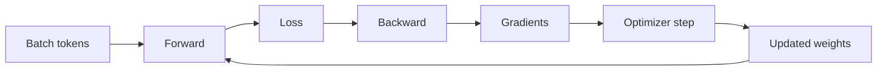
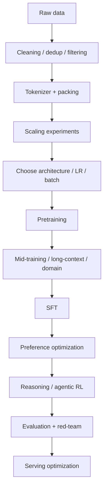

# 第九篇（Part IX）　大模型训练系统：从一张 GPU 到万卡并行

> **本章主线**：知道 Transformer 公式，并不等于能训练大模型。一个 70B/700B 模型能否稳定训练，取决于显存、通信、数据、数值精度、并行策略、故障恢复与 kernel。大规模训练本质上是一个**分布式系统与数值优化共同设计的问题**。

---

# 1　为什么“模型大小 × 2 bytes”远远不是训练显存？

假设一个模型有：

$$
P\text{ parameters}.
$$

BF16 权重仅占：

$$
2P\text{ bytes}.
$$

所以 70B 模型权重理论上约：

$$
70\times10^9\times2
=140\text{ GB}.
$$

但训练时还需要：

- gradients；
- optimizer states；
- 可能的 FP32 master weights；
- activations；
- temporary buffers；
- communication buffers。

一个经典 mixed-precision Adam 粗略账本可能是：

| 内容 | bytes / parameter（示意） |
|---|---:|
| BF16 parameter | 2 |
| BF16/FP16 gradient | 2 |
| FP32 master parameter | 4 |
| Adam first moment $m$ | 4 |
| Adam second moment $v$ | 4 |
| 合计 | ~16 |

不同框架和 optimizer 实现会不同，因此 **16 bytes/parameter 只是典型粗估，不是固定定律**。

70B × 16 bytes：

$$
\approx1.12\text{ TB},
$$

还没算 activation。

这就是为什么训练大模型首先是一个 memory distribution 问题。

---

# 2　Forward、Backward 与 Optimizer Step 的数据流

一个 training step：



对每层：

### Forward

$$
x_l\rightarrow x_{l+1}.
$$

### Backward

需要：

$$
\frac{\partial L}{\partial x_l},
\qquad
\frac{\partial L}{\partial W_l}.
$$

为了算这些梯度，很多 forward intermediate activations 必须被保留。

所以即便参数已经能塞进 GPU，activation 仍可能 OOM。

---

# 3　Batch Size 其实有三层

不要只说：

```text
batch size = 1024
```

大规模训练中通常区分：

### Micro Batch Size

单个 GPU 一次 forward/backward 实际处理的样本/token 数。

### Gradient Accumulation Steps

累积多少次 micro-batch 后再 optimizer step。

### Global Batch Size

所有 data-parallel workers 汇总后的有效 batch。

若：

$$
B_{micro}=2,
$$

$$
N_{DP}=64,
$$

$$
G=8,
$$

则：

$$
B_{global}=2\times64\times8=1024.
$$

---

# 4　Data Parallelism：最直观的并行

每张 GPU 拥有完整模型副本：

```text
GPU0: model θ + batch0
GPU1: model θ + batch1
GPU2: model θ + batch2
GPU3: model θ + batch3
```

各自计算 gradient：

$$
g_0,g_1,g_2,g_3.
$$

然后 all-reduce：

$$
g=\frac14(g_0+g_1+g_2+g_3).
$$

每个 worker 使用同一个聚合 gradient 更新，所以权重保持一致。

### 优点

- 概念简单；
- compute scaling 很直接。

### 缺点

每张卡都复制整个模型和 optimizer state。

所以当模型超过单卡显存时，纯 DP 无法解决问题。

---

# 5　ZeRO：为什么 Data Parallel 一定要复制所有状态？

ZeRO（Zero Redundancy Optimizer）由 DeepSpeed 团队提出，核心思想是把 data-parallel workers 之间重复的模型状态进行分片。[Rajbhandari et al., 2019/2020](https://arxiv.org/abs/1910.02054)

## ZeRO Stage 1

分片 optimizer states。

```text
params:      replicated
gradients:   replicated
optimizer:   sharded
```

## ZeRO Stage 2

再分片 gradients。

```text
params:      replicated
gradients:   sharded
optimizer:   sharded
```

## ZeRO Stage 3

连 parameters 也分片。

```text
params:      sharded
gradients:   sharded
optimizer:   sharded
```

如果 DP group 有 $N$ 个 GPU，理想状态下这些状态的单卡内存可以近似降低到：

$$
\frac1N.
$$

实际还受 buffers、all-gather、fragmentation 等影响。

---

# 6　FSDP：Fully Sharded Data Parallel

PyTorch FSDP 与 ZeRO-3 思想高度相关：参数在 workers 之间分片，需要某层计算时进行 all-gather，完成后再次释放/reshard。[PyTorch FSDP paper, 2023](https://arxiv.org/abs/2304.11277)

粗略流程：

```text
GPU0 stores shard 0
GPU1 stores shard 1
GPU2 stores shard 2
GPU3 stores shard 3

         ↓ before layer forward
      all-gather full layer params
         ↓ compute
      discard / reshard
```

Backward 类似地通过 reduce-scatter 聚合并分片 gradients。

这里体现一个重要 trade-off：

> **少存参数，就要多通信。**

大规模系统几乎一直在做：

$$
\text{memory}\leftrightarrow\text{communication}\leftrightarrow\text{compute}
$$

的交换。

---

# 7　Tensor Parallelism：一个矩阵太大，就把矩阵本身拆开

考虑线性层：

$$
y=xW,
\qquad
W\in\mathbb R^{d_{in}\times d_{out}}.
$$

如果 $W$ 太大，可以按列切：

$$
W=[W_1,W_2].
$$

那么：

$$
y=[xW_1,xW_2].
$$

每张 GPU 计算一部分 output features。

也可以按行切：

$$
W=
\begin{bmatrix}
W_1\\W_2
\end{bmatrix},
\quad
x=[x_1,x_2],
$$

则：

$$
y=x_1W_1+x_2W_2,
$$

最后需要 all-reduce 求和。

Megatron-LM 系统化展示了如何在 Transformer 内使用 tensor model parallelism。[Shoeybi et al., 2019](https://arxiv.org/abs/1909.08053)

---

# 8　Attention 怎样做 Tensor Parallel？

MHA 有很多 heads，因此天然可分：

```text
GPU0: heads 0–7
GPU1: heads 8–15
GPU2: heads 16–23
GPU3: heads 24–31
```

各卡局部算 Q/K/V attention，再在 output projection 等位置进行必要通信。

FFN 中：

```text
up/gate projection
```

也可沿 intermediate dimension 拆分。

Tensor Parallel 的优点：

- 单层参数被切开；
- 单个 giant layer 可跨 GPU。

缺点：

- **几乎每层都可能需要 collective communication**；
- 所以最好放在 NVLink/NVSwitch 等高速互联域内。

---

# 9　Pipeline Parallelism：把不同层放到不同设备

假设 48 层模型：

```text
GPU group 0: layers 0–11
GPU group 1: layers 12–23
GPU group 2: layers 24–35
GPU group 3: layers 36–47
```

数据像流水线一样传：

```text
microbatch 0: stage0 → stage1 → stage2 → stage3
microbatch 1:          stage0 → stage1 → stage2 → stage3
...
```

问题是 **pipeline bubble**。

最开始后面 stage 在等待；结束时前面 stage 又空闲。

使用更多 microbatches 和更精细 schedule 可以降低 bubble fraction。

---

# 10　3D Parallelism：真正大训练通常把三种并行叠起来

经典组合：

$$
N_{GPU}
=N_{DP}\times N_{TP}\times N_{PP}.
$$

例如：

$$
1024=32\times8\times4.
$$

即：

- DP = 32；
- TP = 8；
- PP = 4。

现代 MoE/长上下文还会加入：

$$
N_{EP}, N_{CP}, N_{SP}.
$$

因此真实训练 topology 可能是五维甚至更多并行维度。

---

# 11　Sequence Parallelism / Context Parallelism

Tensor Parallel 后，LayerNorm、dropout、某些 element-wise activation 可能仍复制完整 sequence activation。

Sequence Parallelism 将 sequence dimension 上的一部分计算/activation 分摊到 TP ranks。

Context Parallelism 则更直接针对超长 context：

$$
T=T_1+T_2+\cdots+T_N.
$$

不同 GPU 负责不同 token 区间，再使用 ring / all-gather 等方式完成 attention 所需信息交换。

当：

$$
T=1M,
$$

sequence 本身已经足够大，不能再认为“只切模型参数就够了”。

---

# 12　Expert Parallelism：MoE 的新维度

MoE experts 分布在不同设备：

```text
EP rank 0 → experts 0–7
EP rank 1 → experts 8–15
...
```

router 后 token 根据 destination expert 做 all-to-all dispatch。

因此 MoE training 的瓶颈经常不是 FLOPs，而是：

$$
\text{all-to-all bandwidth}.
$$

现代 MoE 系统会大量使用：

- token permutation；
- fused dispatch；
- grouped GEMM；
- communication overlap；
- hierarchical all-to-all。

---

# 13　Topology-aware Parallelism：为什么 8 卡机内和跨机不是一回事？

典型层次：

```text
GPU HBM
   ↕ NVLink / NVSwitch
same node GPUs
   ↕ InfiniBand / RoCE
other nodes
```

带宽和 latency 相差很大。

所以通常：

- 高频 layer-level TP communication 放在 node 内；
- DP 可跨节点，因为一次 step 的 gradient collective 相对更粗粒度；
- EP placement 要特别考虑 all-to-all topology。

并行策略不是纯数学组合题，而是必须映射到物理网络。

---

# 14　Activation Memory：为什么 Parameter Sharding 之后仍会 OOM？

每层 forward 产生：

- hidden states；
- Q/K/V；
- attention intermediates；
- FFN intermediates。

activation 规模粗略随：

$$
B\times T\times L\times d
$$

增长。

训练长 context 时尤其严重。

因此需要 activation checkpointing。

---

# 15　Activation Checkpointing：拿算力换显存

普通训练：

```text
Forward
store activation every layer
↓
Backward directly use stored activations
```

Checkpointing：

```text
Forward
store only selected checkpoints
↓
Backward
recompute missing forward segments
↓
compute gradient
```

所以：

$$
\text{memory}\downarrow,
\qquad
\text{compute}\uparrow.
$$

在大模型训练中，这通常是非常划算的交换。

---

# 16　Mixed Precision：为什么不用全 FP32？

FP32：4 bytes。

BF16/FP16：2 bytes。

FP8：1 byte。

降低精度可以：

- 减内存；
- 减通信量；
- 使用 Tensor Core 更高吞吐。

但同时带来：

- overflow / underflow；
- accumulation precision；
- scaling；
- quantization error。

BF16 因拥有与 FP32 相同的 8-bit exponent，在大模型训练中通常比 FP16 更容易处理 dynamic range。

---

# 17　FP8：为什么 2024 以后成为 frontier training 的关键能力？

FP8 典型格式包括：

- E4M3；
- E5M2。

不同 exponent/mantissa 分配用于不同 tensor 特性。[Micikevicius et al., 2022](https://arxiv.org/abs/2209.05433)

现代 FP8 training 往往需要：

- per-tensor / per-block scaling；
- higher-precision accumulation；
- 对 outlier 的特殊处理。

DeepSeek-V3 就把 FP8 mixed precision training 作为其系统设计的一部分。[DeepSeek-AI, 2024](https://arxiv.org/abs/2412.19437)

所以“FP8 训练”并不是简单把：

```python
tensor = tensor.to(fp8)
```

而是一整套数值与 kernel 协同设计。

---

# 18　Optimizer：AdamW 为什么贵？

Adam：

$$
m_t=\beta_1m_{t-1}+(1-\beta_1)g_t,
$$

$$
v_t=\beta_2v_{t-1}+(1-\beta_2)g_t^2.
$$

更新近似：

$$
\theta_{t+1}
=
\theta_t-\eta\frac{\hat m_t}{\sqrt{\hat v_t}+\epsilon}.
$$

每个参数需要保存两组 moments：

$$
m,v.
$$

所以 optimizer state 很大。

这推动：

- ZeRO/FSDP sharding；
- 8-bit optimizer；
- Adafactor；
- Muon/MuonClip 等新优化器研究。

Kimi K2 报告提出 MuonClip，用 QK-clip 处理大规模训练稳定性。[Moonshot AI, 2025](https://arxiv.org/abs/2507.20534)

---

# 19　Learning Rate Schedule：巨型训练不能随便“设个 1e-4”

常见结构：

```text
learning rate
     ↑
     |       /\
     |      /  \________
     |     /
     |____/________________→ steps
         warmup    decay
```

Warmup 的作用之一是避免训练初期 parameter/optimizer statistics 尚未稳定时使用过大的更新。

后面可能采用：

- cosine decay；
- linear decay；
- WSD（warmup-stable-decay）；
- constant + final decay。

大模型 recipe 中 schedule 变化可能显著影响最终效果，因此 scaling experiment 必须控制它。

---

# 20　Loss Spike：为什么万卡训练最怕它？

一次训练可能持续数周。

突然：

```text
loss 2.1
loss 2.0
loss 2.0
loss 2.1
loss 8.7
loss NaN
```

可能原因：

- bad data batch；
- exploding gradient；
- numerical overflow；
- optimizer instability；
- corrupted hardware/communication；
- MoE routing imbalance。

处理方法包括：

- gradient clipping；
- data filtering；
- dynamic loss scaling；
- checkpoint rollback；
- skip anomalous batch；
- stable initialization；
- optimizer/schedule redesign。

GLM‑130B 与 DeepSeek‑V3 技术报告都把训练稳定性作为重要主题，这说明它不是“小实现细节”。

---

# 21　Checkpoint：不只是保存一个 `model.pt`

大型 distributed checkpoint 可能包含：

- sharded parameters；
- optimizer states；
- RNG states；
- scheduler state；
- dataloader position；
- scaler state；
- training metadata。

只有保存 weights 而没有 dataloader/RNG state，恢复后训练轨迹就不再完全一致。

大规模 checkpoint 系统还要解决：

- 数 TB 写盘；
- 不阻塞 GPU 太久；
- 节点故障；
- repartition 到不同 world size。

所以 checkpointing 本身也是分布式系统。

---

# 22　数据 Pipeline：GPU 等数据就是在烧钱

训练循环真正需要：

```text
object storage / local SSD
        ↓
shard reader
        ↓
shuffle
        ↓
tokenizer / pretokenized IDs
        ↓
packing
        ↓
prefetch
        ↓
GPU batch
```

如果 I/O 太慢：

```text
GPU utilization
████████░░░░░░░░
```

昂贵 accelerator 会因为等数据而空闲。

因此常见做法：

- offline tokenization；
- binary/memory-mapped datasets；
- distributed sharding；
- async prefetch；
- sequence packing。

---

# 23　Sequence Packing：为什么短样本不能每条都 Padding 到 4K？

假设三条样本长度：

```text
600
800
1000
```

若分别 pad 到 4096：

实际有效 token：2400
计算 token：12288
```

大量 FLOPs 浪费在 PAD。

Packing 可以把多个短文档塞到同一个 sequence：

```text
[doc1][EOS][doc2][EOS][doc3][EOS]...
```

再通过 attention mask / document boundary 防止不合理跨文档注意。

这能显著提高 token throughput。

---

# 24　MFU：GPU 跑满 100% 不等于训练效率高

Model FLOPs Utilization（MFU）试图衡量：

\[
\text{实际用于模型所需 FLOPs 的吞吐}
\div
\text{硬件理论峰值 FLOPs}.
\]

GPU utilization 可能显示 100%，但 GPU 其实忙于：

- memory movement；
- inefficient small kernels；
- communication；
- padding。

MFU 更接近“有效数学计算效率”。

不过不同论文的 FLOPs accounting 口径可能不同，比较 MFU 时也应看定义。

---

# 25　Communication Overlap：为什么要边算边传？

最差 pipeline：

```text
compute
↓ stop
communication
↓ stop
compute
```

理想：

```text
compute A ─────────────
      communication A ───────
             compute B ─────────────
```

把 communication 隐藏在 compute 后面。

在：

- DP gradient all-reduce；
- MoE all-to-all；
- pipeline send/recv

中都非常重要。

这解释了为什么相同 FLOPs、相同 GPU 数，不同训练框架 wall-clock throughput 可以差很多。

---

# 26　一次完整大模型训练可以怎样分阶段？



“训练一个模型”实际上可能是几个月甚至更长的多阶段流水线，而不是一次 `trainer.train()`。

---

# 27　并行策略选择的一个实用思维顺序

面对一个新训练任务，可以按：

### 第一步：单层能否放进单卡？

不能 → TP / parameter sharding。

### 第二步：整个模型状态能否放进单卡？

不能 → FSDP/ZeRO/PP。

### 第三步：activation 是否 OOM？

→ checkpointing / sequence parallel / smaller microbatch。

### 第四步：context 是否极长？

→ context parallel / ring attention。

### 第五步：是否 MoE？

→ expert parallel + all-to-all topology。

### 第六步：哪种通信最频繁？

→ 把它放在最快互联域。

这比盲目开启所有 `--parallel-size` 参数可靠得多。

---

# 本章小结

1. 大模型训练显存远大于权重本身，optimizer state 和 activation 是主要成本。
2. Data Parallel 复制模型；ZeRO/FSDP 通过 sharding 消除冗余。
3. Tensor Parallel 拆一个层/矩阵；Pipeline Parallel 拆不同层；Expert Parallel 拆 experts；Context Parallel 拆 sequence。
4. 真实 frontier training 往往组合多种并行，而不是只用一种。
5. Activation checkpointing 用额外 recompute 换显存。
6. BF16/FP8 mixed precision 是内存、带宽和 Tensor Core 吞吐优化，但需要数值稳定设计。
7. MoE 的核心系统代价是 token dispatch 和 all-to-all，而不仅是稀疏 FLOPs。
8. 大模型训练必须 topology-aware：NVLink/NVSwitch 与跨节点网络不是同一层次。
9. loss spike、checkpoint、data pipeline、fault tolerance 都能决定一次数百万 GPU-hour 训练成败。
10. MFU 与 communication overlap 是判断集群是否真正“有效工作”的重要系统指标。

---

# 本章练习

### 练习 1：Adam 显存账本

分别按 12、16、20 bytes/parameter 的假设，估算 7B、70B、671B 模型仅 model states 所需内存，并解释差异可能来自哪里。

### 练习 2：3D Parallel

你有 256 张 GPU，设计：

\[
DP\times TP\times PP=256
\]

的三种方案，并分别讨论通信特点。

### 练习 3：ZeRO

设模型状态共 800 GB，DP=8。理想情况下 Stage 1/2/3 分别能分摊哪些部分？不要只背 stage 名称，要画每张 GPU 的状态。

### 练习 4：网络拓扑

一个节点 8×GPU，有 NVSwitch；节点间 InfiniBand。解释为什么通常不会把 TP=64 随意跨 8 个节点，而更可能让 TP 保持在高速局部域。

---

# 核心来源

- Shoeybi et al., **Megatron-LM: Training Multi-Billion Parameter Language Models Using Model Parallelism**, 2019: https://arxiv.org/abs/1909.08053
- Rajbhandari et al., **ZeRO: Memory Optimizations Toward Training Trillion Parameter Models**, 2019/2020: https://arxiv.org/abs/1910.02054
- Zhao et al., **PyTorch FSDP: Experiences on Scaling Fully Sharded Data Parallel**, 2023: https://arxiv.org/abs/2304.11277
- Narayanan et al., **Efficient Large-Scale Language Model Training on GPU Clusters Using Megatron-LM**, 2021: https://arxiv.org/abs/2104.04473
- Korthikanti et al., **Reducing Activation Recomputation in Large Transformer Models**, 2022: https://arxiv.org/abs/2205.05198
- Micikevicius et al., **FP8 Formats for Deep Learning**, 2022: https://arxiv.org/abs/2209.05433
- DeepSeek-AI, **DeepSeek-V3 Technical Report**, 2024: https://arxiv.org/abs/2412.19437
- Moonshot AI, **Kimi K2**, 2025: https://arxiv.org/abs/2507.20534
