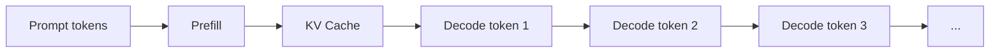
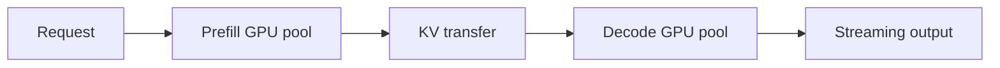
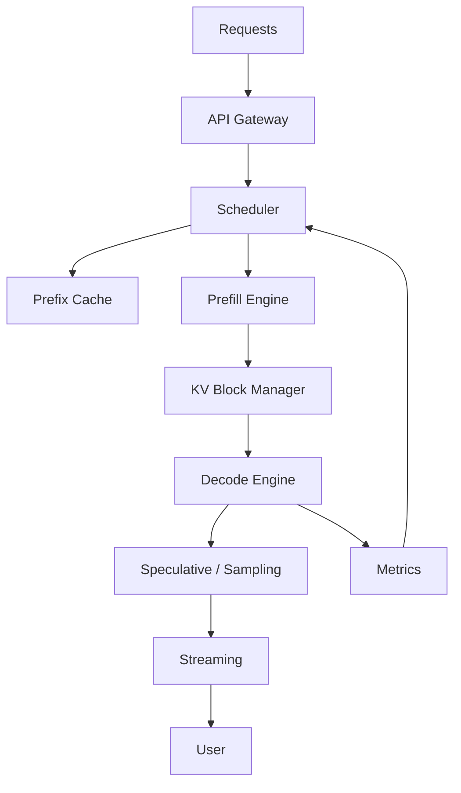

# Part X　大模型推理系统：Prefill、Decode、KV Cache、vLLM 与 Speculative Decoding

> **本章主线**：训练解决“怎样得到模型”，推理系统解决“怎样让几百、几千、几百万用户经济地使用模型”。同一组权重，在不同 serving engine 上可以有数倍吞吐差异。理解大模型产品成本，必须区分 **Prefill 与 Decode、计算瓶颈与带宽瓶颈、模型能力与系统吞吐**。

---

# 1　一次 LLM 请求其实有两个完全不同的阶段

用户输入：

```text
请阅读下面 50K token 的文档，然后回答……
```

模型要先处理全部 prompt，然后逐 token 生成。

因此推理分成：



## Prefill

一次并行处理所有 input tokens。

## Decode

每一步只生成少量新 token，并读取历史 KV Cache。

这两阶段的 hardware characteristics 很不同。

---

# 2　Prefill：更像大矩阵计算

设 input sequence length：

$$
T_{in}=32768.
$$

Transformer 可以并行处理这 32768 个位置，因此矩阵乘法尺寸很大：

```text
[X: 32768 × d] × [W: d × d]
```

GPU Tensor Cores 更容易获得高利用率。

所以 Prefill 往往更加：

> **compute-bound。**

当 context 极长时，attention complexity 和 memory 仍会成为问题，但与单 token decode 的瓶颈不同。

---

# 3　Decode：为什么生成一个 token 反而可能很低效？

生成第 $t$ 个 token：

```text
hidden [B,1,d]
   ×
huge weight matrices
```

每一步都要读取大量模型权重，却只处理一个或少数 token。

算术强度低，常见瓶颈是：

> **HBM memory bandwidth。**

一个直觉估算：若 70B BF16 模型权重约 140 GB，一次 token decode 即便不是机械地“完整搬一次 140GB”这么简单，权重带宽仍会成为极强约束。

因此 decode 优化的核心经常不是峰值 FLOPs，而是：

$$
\text{bytes moved per generated token}.
$$

---

# 4　四个 serving 指标必须区分

## 4.1　TTFT：Time To First Token

$$
\text{用户发出请求}\rightarrow\text{看到第一个输出 token}
$$

主要受：

- queueing；
- prompt length；
- prefill speed

影响。

## 4.2　TPOT / ITL

Time Per Output Token / Inter-Token Latency：

$$
\text{相邻输出 token 的时间}.
$$

主要反映 decode speed。

## 4.3　Throughput

$$
\text{tokens / second}
$$

面向服务商整体效率。

## 4.4　Tail Latency

P95 / P99 latency。

在线产品不能只看平均值，因为用户最敏感的是排队和尾延迟。

---

# 5　KV Cache：推理系统最大的动态内存之一

每层保存历史 token 的 K/V：

$$
K,V\in
\mathbb R^{B\times h_{kv}\times T\times d_h}.
$$

总 cache 粗估：

$$
M_{KV}
=2BLTh_{kv}d_hs,
$$

其中：

- 2：K + V；
- $L$：层数；
- $s$：每元素 bytes。

例如：

$$
L=80,\quad h_{kv}=8,\quad d_h=128,
$$

$$
T=131072,\quad s=2.
$$

单序列理论 KV：

$$
2\times80\times8\times131072\times128\times2
\approx42.9\text{ GB}.
$$

真实模型参数可能不同，但这个数量级说明：

> **长上下文 + 高并发 时，KV Cache 可以比权重更快吃掉剩余显存。**

---

# 6　为什么 GQA/MLA 对 Serving 特别重要

MHA：

$$
h_{kv}=h_q.
$$

GQA：

$$
h_{kv}\ll h_q.
$$

直接让：

$$
M_{KV}\propto h_{kv}
$$

下降。

MLA 更进一步，缓存低维 latent representation，而不是普通完整 K/V heads。

因此这些技术的意义不是单纯“attention 论文创新”，而是：

> **提高每张 GPU 能同时服务的 sequence 数量。**

Serving economics 会反向塑造模型 architecture。

---

# 7　传统静态 Batch 为什么不适合聊天请求？

假设：

```text
Request A: 生成 10 tokens
Request B: 生成 100 tokens
Request C: 生成 1000 tokens
```

静态 batch：

```text
A 完成后仍占一个空槽
B 完成后也继续等 C
```

造成 GPU 浪费。

在线 LLM 请求长度差异巨大，所以需要 **continuous batching**。

---

# 8　Continuous Batching：每个 Decode Step 都允许请求进出

```text
step 1: [A B C]
step 2: [A B C]
A done
step 3: [D B C]
step 4: [D B C]
B done
step 5: [D E C]
```

batch 不再等整组完成，而持续：

- 加入新 request；
- 移除已完成 request；
- 调度 prefill/decode token。

这大幅提高 GPU utilization。

---

# 9　KV Cache 的另一个问题：内存碎片

传统做法可能预先为每条 sequence 分配：

```text
max_context_size
```

但真实 sequence 长度不同。

例如：

```text
Request A reserved: 32K, used: 3K
Request B reserved: 32K, used: 18K
Request C reserved: 32K, used: 5K
```

大量空间浪费。

即使动态连续分配，也会发生 external fragmentation。

---

# 10　PagedAttention：把 KV Cache 当虚拟内存页管理

vLLM 提出 PagedAttention，把 KV Cache 分成固定大小 block，并借鉴操作系统 virtual memory 的分页思想管理逻辑 sequence 与物理显存 block 的映射。[Kwon et al., 2023](https://arxiv.org/abs/2309.06180)

```text
Logical sequence A
block 0 → physical block 17
block 1 → physical block  3
block 2 → physical block 41
```

物理 KV 不需要连续。

优势：

- 减少 fragmentation；
- 动态按需分配；
- 更容易共享 prefix blocks；
- 提高 batch capacity。

这是 vLLM 高吞吐 serving 的核心设计之一。

---

# 11　为什么 PagedAttention 不是“Attention 数学新公式”？

模型仍然计算同一 attention。

变化的是：

```text
logical token position
        ↓ block table
physical KV memory address
```

也就是说：

> PagedAttention 主要是 memory management / kernel design，而不是改变模型概率分布。

它与 FlashAttention 一样，是理解“系统创新 ≠ 模型数学创新”的典型案例。

---

# 12　Prefix Caching：很多用户的前缀其实是一样的

例如 API 的 system prompt：

```text
You are a coding assistant...
[5000 tokens of policy/docs]
```

1000 个请求都重复这 5000 tokens。

如果每次重新 prefill：

$$
1000\times5000
$$

token 计算被浪费。

Prefix Cache 可以保存该前缀计算产生的 KV：

```text
shared system prompt
      ↓ compute once
cached KV blocks
      ↓
user A suffix
user B suffix
user C suffix
```

这对：

- long system prompts；
- RAG 共享资料；
- multi-turn conversations；
- agent common context

都很有价值。

---

# 13　Prompt Caching 与 KV Cache 不要混为一谈

KV Cache：

> 单个正在生成的 sequence，为避免重复计算自己的历史 token 而保存状态。

Prefix/Prompt Cache：

> 跨请求复用相同 prompt prefix 的计算结果。

前者是自回归 decode 的基础；后者是一种 serving optimization。

---

# 14　Quantization：推理为什么尤其受益？

如果 decode 是 memory-bandwidth bound，权重从 BF16：

$$
2\text{ bytes/param}
$$

降到 INT4：

$$
0.5\text{ bytes/param}
$$

理论上每 token 需要搬的权重 bytes 大幅下降。

因此量化不仅让模型“塞得进去”，还可能提升吞吐。

但实际速度取决于：

- GPU 是否有对应 low-bit kernel；
- dequantization overhead；
- group size；
- memory layout；
- batch size；
- activation precision。

低 bit 不自动等于低 latency。

---

# 15　Tensor Parallel Serving：一张卡放不下怎么办？

70B BF16 ≈ 140 GB，仅权重就超过许多单 GPU。

TP=4：

```text
GPU0: shard W0
GPU1: shard W1
GPU2: shard W2
GPU3: shard W3
```

每层共同计算。

优点：

- 单模型跨卡；
- batch/sequence 共同享受全部 GPU 算力。

代价：

- 每层 collective communication。

因此 serving TP 同样受 NVLink/PCIe/IB topology 强烈影响。

---

# 16　Pipeline Parallel Serving：为什么通常不如训练里直观？

把层拆成 stages 可以解决权重存储，但 autoregressive decode 每 token 都必须：

```text
stage0 → stage1 → stage2 → stage3
```

如果 batch 不够大，pipeline bubble 与 inter-stage latency 会明显。

因此实际 serving 会根据：

- model size；
- interconnect；
- batch；
- latency SLA

组合 TP / PP。

---

# 17　Expert Parallel Serving：MoE 的总参数仍然得放 somewhere

一个：

$$
1T\text{-A32B}
$$

模型每 token 只算约 32B active parameters，不代表只需存 32B。

全部 1T experts 权重仍然需要分布在集群。

token routing 会触发：

$$
\text{all-to-all}.
$$

所以 MoE serving 的主要问题之一是：

> **active FLOPs 很低，但 weight placement 与 network traffic 能否跟上？**

---

# 18　Speculative Decoding：为什么自回归一定要一步一步等主模型？

标准 decode：

```text
large model → token1
large model → token2
large model → token3
large model → token4
```

每步都要启动大模型 forward。

Speculative Decoding：

```text
small draft model
   ↓ proposes
[token1, token2, token3, token4]
   ↓
large target model verifies them in parallel
   ↓
accept several tokens at once
```

代表论文：[Leviathan et al., 2022](https://arxiv.org/abs/2211.17192)、[Chen et al., 2023](https://arxiv.org/abs/2302.01318)。

通过正确的 acceptance/rejection 设计，可以在**不改变 target model 输出分布**的前提下加速采样。

---

# 19　一个 Speculative Decoding 例子

Draft 预测：

```text
The robot [picked] [up] [the] [cup]
```

Target 一次验证四个位置。

若前三个接受、第四个拒绝：

```text
accepted: picked up the
rejected: cup
```

主模型一次 decode iteration 实际推进 3 tokens。

若平均接受长度为：

$$
E[K_{accept}]>1,
$$

就减少了昂贵 target model 串行调用次数。

---

# 20　Draft Model 越强越好吗？

不是。

强 draft：

$$
acceptance\uparrow
$$

但：

$$
C_{draft}\uparrow.
$$

弱 draft：

便宜，但提案经常被拒。

最优点取决于：

$$
\frac{\text{accepted tokens}}
{\text{draft cost}+\text{verification cost}}.
$$

这又是一个 systems Pareto problem。

---

# 21　Medusa / Multi-Token Heads：能否不用独立 Draft Model？

Medusa 给 base model 增加多个 decoding heads，一次预测多个未来位置的候选 token，再用 tree attention 验证。[Cai et al., 2024](https://arxiv.org/abs/2401.10774)

另一条路线是在预训练时直接加入 Multi-Token Prediction heads，例如 DeepSeek-V3 的 MTP。

共同目标：

> 减少自回归“一次只能向前一个 token”的串行瓶颈。

---

# 22　Sampling 参数：系统快了，分布仍由解码策略决定

Logits：

$$
z_i.
$$

Temperature：

$$
p_i=
\frac{\exp(z_i/T)}
{\sum_j\exp(z_j/T)}.
$$

### $T<1$

分布更尖锐。

### $T>1$

分布更平。

Top-k：只保留最高的 $k$ 个 token。

Top-p / nucleus：保留累计概率达到 $p$ 的最小 token 集。[Holtzman et al., 2019](https://arxiv.org/abs/1904.09751)

这些参数影响：

- 多样性；
- deterministic behavior；
- reasoning sampling；
- speculative acceptance。

所以 benchmark 必须固定 decoding config。

---

# 23　Stop Conditions：为什么生成不会永远继续？

常见停止条件：

- EOS token；
- max_new_tokens；
- stop strings；
- tool-call delimiter；
- structured output grammar。

Agent 模型还可能停止于：

```text
<tool_call>...</tool_call>
```

系统执行工具后，把 observation 再加入 context，继续 decode。

因此 Agent serving 并不是一条连续 token stream，而是多次 inference 与 environment interaction 的交替。

---

# 24　Structured Decoding：JSON 为什么可以被“强制合法”？

若要求：

```json
{"name": "...", "age": 20}
```

普通模型仍可能输出非法 JSON。

Grammar-constrained decoding 可以在每一步屏蔽违反 grammar 的 tokens：

$$
z_i=-\infty
\quad\text{if token }i\text{ invalid under grammar}.
$$

这样输出在语法层面得到保证。

但：

$$
\text{valid JSON}\neq\text{semantically correct arguments}.
$$

工具安全仍需 schema validation 和权限检查。

---

# 25　Prefill / Decode Disaggregation：为什么要把两个阶段放到不同资源池？

Prefill：

- 大 GEMM；
- compute-heavy；

Decode：

- 低 arithmetic intensity；
- memory-bandwidth-heavy；
- latency sensitive。

把它们混在同一 batch 里会互相干扰。

于是出现 disaggregated serving：



代表研究包括 DistServe。[Zhong et al., 2024](https://arxiv.org/abs/2401.09670)

这体现一个趋势：

> **LLM serving 开始像数据库/云服务一样做 workload specialization。**

---

# 26　KV Transfer 会不会把好处全吃掉？

Disaggregation 后必须把 Prefill 生成的大量 KV Cache 传到 Decode workers。

所以需要：

- 高带宽网络；
- efficient KV layout；
- pipelined transfer；
- placement scheduler。

当 context 极长时，KV transfer 本身可能成为瓶颈。

因此是否分离必须根据：

$$
\text{compute saved}
>
\text{KV transfer overhead}.
$$

做系统评估。

---

# 27　Scheduling：在线服务其实是一个排队系统

请求随机到达：

$$
\lambda(t).
$$

每个请求有：

- prompt length；
- expected output length；
- priority；
- SLA；
- cache hit；
- model adapter。

Scheduler 要决定：

- 谁先 prefill；
- 谁加入 decode batch；
- 是否 preempt；
- 一个 batch 放多少 sequences。

目标不只是最大 tokens/s，还可能是：

$$
\max\text{goodput}
$$

subject to：

$$
TTFT<P99_{target},
$$

$$
TPOT<P99_{target}.
$$

---

# 28　为什么 Benchmark 的 tokens/s 不能直接代表真实生产？

离线 throughput benchmark 可以：

```text
queue 10000 requests
fill GPU forever
```

这会获得极高 throughput。

真实在线：

- 请求随机到达；
- 用户要求低 TTFT；
- prompt/output 长度分布很宽；
- 有 cache hit/miss；
- 有工具调用间歇。

因此真实系统需要同时报告：

- throughput；
- TTFT；
- TPOT；
- P99；
- concurrency；
- request length distribution。

---

# 29　单位成本：最终商业系统关心的是“完成任务多少钱”

粗粒度 token serving cost：

$$
\text{cost/token}
=
\frac{\text{GPU cost per second}}
{\text{effective tokens per second}}.
$$

但 agent 时代更有意义的是：

$$
\text{cost/successful task}.
$$

因为模型 A 可能：

```text
便宜，但需要 5 次重试
```

模型 B：

```text
单 token 贵，但一次完成
```

最终 B 可能更便宜。

所以 inference optimization 会逐渐从：

> tokens/s

走向：

> **successful work / dollar / second。**

---

# 30　一个完整 LLM Serving Stack



底层还会包含：

- CUDA/Triton kernels；
- NCCL collectives；
- TP/PP/EP；
- quantized GEMM；
- memory allocator。

这就是为什么现代 LLM 产品能力越来越依赖“模型 + inference system”的共同设计。

---

# 本章小结

1. LLM inference 必须区分 Prefill 与 Decode；前者更偏 compute-bound，后者通常更受 memory bandwidth 约束。
2. TTFT、TPOT、throughput、P99 是不同指标，不能只报 tokens/s。
3. KV Cache 随 batch、层数、context、KV heads 增长，是长上下文高并发的核心显存瓶颈。
4. GQA/MLA 的系统价值之一是从架构层减少 KV state。
5. Continuous batching 让请求可逐步加入/退出 batch，提高在线 GPU 利用率。
6. PagedAttention 用分页思想管理 KV Cache，解决 fragmentation 和动态分配问题；它不是新的 attention 数学函数。
7. Prefix caching 跨请求复用相同前缀，与单请求 KV Cache 是不同概念。
8. Speculative decoding 用小 draft/多 token head 提案，再让大模型并行验证，减少串行 target steps。
9. 量化对 decode 特别重要，因为它减少权重 bytes 与带宽压力。
10. Disaggregated serving 将 compute-heavy Prefill 与 bandwidth/latency-heavy Decode 分开，但必须承担 KV transfer。
11. Agent 时代最有意义的系统指标将逐渐从 token throughput 转向 successful task throughput 与单位任务成本。

---

# 本章练习

### 练习 1：KV Cache

分别取：

$$
T=8K,32K,128K,1M
$$

计算固定 $L,h_{kv},d_h$ 下 KV Cache 的线性增长，并画图。

### 练习 2：TTFT 与 TPOT

设计两个 workload：

- 100K input + 100 output；
- 100 input + 10K output。

解释为什么前者更关注 Prefill，后者更关注 Decode。

### 练习 3：Speculative Decoding

若 draft 每轮提议 5 tokens，平均接受 3.5 个；draft cost 相当于 target 单步的 0.2 倍。建立一个简单速度模型，估计理论收益。

### 练习 4：Serving Benchmark

为一个在线 Chat API 设计 benchmark，必须同时报告：

- arrival rate；
- input/output distribution；
- concurrency；
- TTFT；
- TPOT；
- P50/P99；
- throughput。

---

# 核心来源

- Holtzman et al., **The Curious Case of Neural Text Degeneration**, 2019: https://arxiv.org/abs/1904.09751
- Leviathan et al., **Fast Inference from Transformers via Speculative Decoding**, 2022: https://arxiv.org/abs/2211.17192
- Chen et al., **Accelerating Large Language Model Decoding with Speculative Sampling**, 2023: https://arxiv.org/abs/2302.01318
- Kwon et al., **Efficient Memory Management for Large Language Model Serving with PagedAttention (vLLM)**, 2023: https://arxiv.org/abs/2309.06180
- Cai et al., **Medusa: Simple LLM Inference Acceleration Framework with Multiple Decoding Heads**, 2024: https://arxiv.org/abs/2401.10774
- Zhong et al., **DistServe: Disaggregating Prefill and Decoding for Goodput-optimized LLM Serving**, 2024: https://arxiv.org/abs/2401.09670
