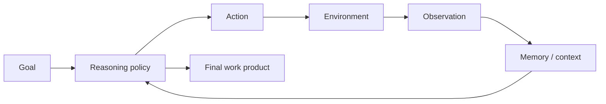
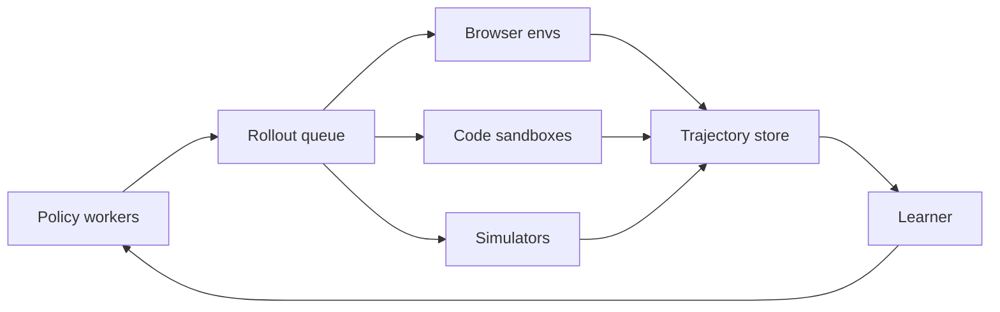
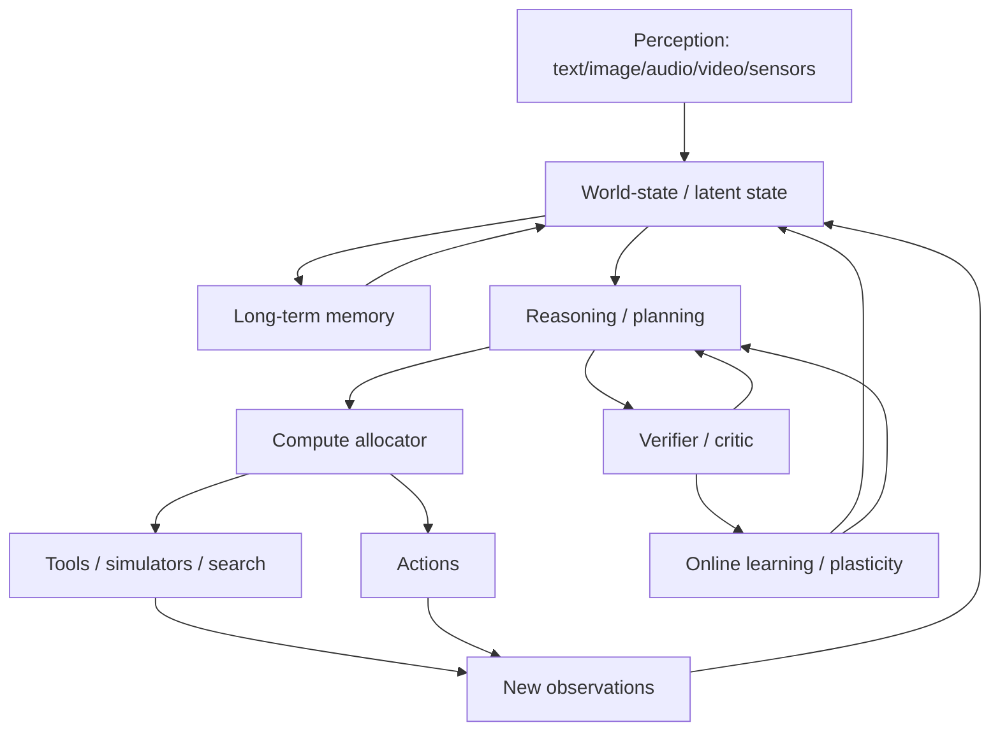

# 第十二篇（Part XII）　2026 前沿：从“大语言模型”走向可行动的通用模型系统

> **时间截面：2026-09-14。** 本章处理的是快速变化的前沿状态，因此与前面的稳定基础章节不同：具体模型名称与规格会过时，真正应该长期保留的是它们共同暴露出的技术趋势。
>
> 本章只使用公开的一手材料描述模型；厂商 benchmark 只作为“官方报告”，不当作独立第三方事实。闭源模型未公开的架构、参数量和训练细节不做猜测。

---

# 1　2026 年最大的变化：竞争对象已经不是“一个聊天模型”

如果把 2020 年 GPT‑3 的典型接口写成：

$$
\text{prompt}\rightarrow\text{text completion},
$$

2022 年 ChatGPT 变成：

$$
\text{conversation}\rightarrow\text{aligned response},
$$

而 2026 年的 frontier system 更像：

$$
\text{goal}
\rightarrow
\text{reason}
\rightarrow
\text{search / code / computer / files / tools}
\rightarrow
\text{observe}
\rightarrow
\text{re-plan}
\rightarrow\cdots
\rightarrow
\text{finished work}.
$$

因此研究对象从一个条件概率模型：

$$
p_\theta(y\mid x)
$$

逐渐扩大为一个长程闭环系统：

$$
\pi_\theta(a_t\mid o_{\le t},a_{\lt t},m_t),
$$

其中 $m_t$ 还可能包含外部 memory、检索结果、文件状态和工具执行历史。



这意味着“大语言模型”这个词已经越来越不能完整描述实际系统。

---

# 2　当前代表模型快照：不要看谁第一，要看它们共同在优化什么

截至 2026-09-14，下面列出若干**代表性**而非穷尽性的公开路线。

| 路线 | 2026 代表快照 | 公开可确认的技术信号 | 不应擅自推断的内容 |
|---|---|---|---|
| OpenAI | GPT‑6 Astra | 1.05M context、最高 128K output、可调 reasoning effort、computer use / web / file / functions | 未公开的具体内部架构、参数量 |
| Anthropic | Claude Fable 5.1 / Mythos 5.1、Opus 5、Sonnet 5 | 长程 coding/knowledge work；相同 underlying model 可配不同 safeguard/access 层 | 未公开的详细 Transformer/MoE 结构 |
| Google | Gemini 3.8 Flash、Gemini 3.5、Gemini Omni | agentic workflow、多模态、工具组合、统一 agent API | 未公开的具体网络块与训练规模 |
| DeepSeek | DeepSeek‑V4 | 1M context；V4-Pro 1.6T/49B active、V4-Flash 284B/13B active；开放权重路线 | 官方 benchmark 排名不视为独立验证 |
| Qwen | Qwen3.8 | 2.4T-A95B 与 27B 等开放模型；此前 Qwen3.x 已发展 ultra-sparse MoE / hybrid attention / multimodal agent 路线 | 不从型号名推断未公开训练细节 |
| Moonshot | Kimi K3 | 2.8T/104B active、1M context、KDA + Gated MLA、896 routed experts 中选 16、native multimodality、低精度 QAT | 厂商自报 benchmark 不等于统一第三方结论 |
| Z.ai | GLM‑5.3 / 5.3-Flash | 744B-A40B 与 320B-A18B；reasoning effort；5.3 相比 5.2 的增益明确来自 post-training；Flash 采用 hybrid sparse/linear 路线 | 公司内部榜单不可直接外推为统一排名 |

OpenAI 当前 API 文档将 GPT‑6 Astra 描述为其用于 hardest end-to-end work 的旗舰模型，公开 1,050,000-token context、128,000 max output，并把 reasoning effort 暴露为 `low/medium/high/xhigh/max`。[OpenAI API, 2026](https://developers.openai.com/api/docs/models/gpt-6-astra)

Anthropic 2026 年 9 月发布 Claude Fable 5.1 与 Mythos 5.1，并明确说明二者是**相同模型、不同 safeguard/access 配置**；这本身就是一个重要信号：frontier system 的产品分层开始由“能力 × 权限 × 风险控制”共同定义。[Anthropic, 2026](https://www.anthropic.com/claude-fable-and-mythos-5-1)

Google 在 2026 年将 Gemini 3.5 定位为“frontier intelligence with action”，随后 9 月继续发布 Gemini 3.8 Flash，把 agentic workflow、coding 和多步 reasoning 放在同一模型产品线中。[Google DeepMind, 2026-05](https://blog.google/innovation-and-ai/models-and-research/gemini-models/gemini-3-5/)、[Google DeepMind, 2026-09](https://blog.google/innovation-and-ai/models-and-research/gemini-models/3-8-flash-and-3-8-flash-cyber/)

DeepSeek‑V4 公开两个规模：V4‑Pro 为 1.6T total / 49B active，V4‑Flash 为 284B total / 13B active，并将 1M context 推入开放权重主线。[DeepSeek, 2026](https://deepseek.com/en/news/v4-preview/)

Qwen3.8 官方仓库在 2026 年 8 月发布 Qwen3.8‑2.4T‑A95B 与 Qwen3.8‑27B；它延续了 Qwen3.x 期间已经形成的 sparse MoE、hybrid attention、multimodal 与 agentic 演进方向。[QwenLM/Qwen3.8, 2026](https://github.com/QwenLM/Qwen3.8)

Kimi K3 的公开架构则非常具体：2.8T total / 104B active、93 层、896 routed experts 每 token 选择 16 个、2 shared experts、69 KDA + 24 Gated MLA、1,048,576 context，并使用 MXFP4 weights / MXFP8 activations 的量化感知训练配置。[MoonshotAI/Kimi-K3, 2026](https://github.com/MoonshotAI/Kimi-K3)

GLM‑5.3 官方仓库则提供了一个很有价值的反例：GLM‑5.3 与 5.2 使用同一个 base model，官方明确说 5.3 的增益来自 post-training。也就是说，**同一组 base capability 经过后训练，系统行为仍可发生代际变化。**[Z.ai GLM‑5, 2026](https://github.com/zai-org/GLM-5)

---

# 3　趋势一：Reasoning Effort 正在成为一等 API 参数

早期使用模型时，用户主要调：

```text
temperature
top_p
max_tokens
```

2026 年越来越常见的是：

```text
reasoning_effort = low / medium / high / max
```

这意味着 test-time computation 不再隐藏在模型内部，而开始成为显式资源。

可以把推理看成优化：

$$
\max_{c(x)}\ \mathbb E[U(x,c)]
$$

subject to：

$$
\mathbb E[\mathrm{Cost}(c)]\le B,
$$

其中 $c(x)$ 是为输入 $x$ 分配的计算预算。

真正困难的问题不是：

> “最大预算能做到多强？”

而是：

> **模型能否知道什么时候值得继续算，什么时候应该停止？**

这对应 **adaptive computation**。

---

# 4　Reasoning Budget 最终应该是“按题分配”，而不是固定档位

设任务难度潜变量：

$$
d(x).
$$

理想系统应该学：

$$
c^*(x)=f(d(x),\text{risk},\text{deadline},\text{cost}).
$$

简单问题：

$$
c^*(x)\approx\text{small}.
$$

难数学/复杂代码：

$$
c^*(x)\approx\text{large}.
$$

高风险操作则可能需要：

$$
c^*(x)=\text{reasoning}+	ext{verification}+	ext{human approval}.
$$

所以未来“thinking model”的核心不只是会想，而是**会管理自己的计算**。

---

# 5　趋势二：百万 Token 从营销数字变成系统设计约束

到 2026 年，多条公开/商业模型线已经进入约 1M-token context 范围。

但这不代表：

$$
1M\text{ context}=1M\text{ useful memory}.
$$

一个百万上下文系统必须同时解决：

1. position representation；
2. attention/state complexity；
3. KV/state memory；
4. prefill latency；
5. long-context training data；
6. effective retrieval；
7. multi-hop integration；
8. stale / contradictory information；
9. context management for agents。

真正的目标开始从：

> “我能塞 1M token。”

变成：

> **“我能否在 1M token 的长期工作状态中持续找到正确证据并保持任务一致性？”**

---

# 6　百万 Context 对 Agent 的价值并不是“无限聊天记录”

Agent 运行几百轮后，会积累：

- 工具输出；
- 终端日志；
- 文件内容；
- 错误堆栈；
- 浏览器页面；
- 中间计划；
- 已失败尝试。

如果全部原样塞进上下文：

$$
T\uparrow\uparrow,
$$

但有效信号密度：

$$
\rho_{useful}=\frac{\text{task-relevant tokens}}{T}
$$

可能不断下降。

因此真正的 long-horizon memory system 需要：

```text
raw trajectory
    ↓
importance estimation
    ↓
summary / indexing / episodic storage
    ↓
selective retrieval
    ↓
current working context
```

也就是说，**长 context 与 memory architecture 不是同一件事。**

---

# 7　趋势三：Full Attention 不再是不可动摇的唯一主干

2017–2023 的常见默认思路：

> Transformer = full self-attention。

但在 1M context 与大规模 agent trajectory 下：

$$
O(T^2)
$$

越来越难忽略。

2026 年前沿公开模型已经出现多种组合：

- MLA：压缩 KV state；
- DeepSeek Sparse Attention；
- Kimi Delta Attention（KDA）；
- Gated MLA；
- hybrid sparse + linear attention；
- sliding / block sparse attention；
- state-space / recurrent hybrid。

这不是说 Transformer 已经“死亡”，而是：

> **Attention 本身开始从一个固定层，变成一个按不同层、不同时间尺度分工的机制族。**

---

# 8　Hybrid Attention：为什么不同层不必做同一种计算？

假设：

- 局部 token 交互很频繁；
- 远距离精确 retrieval 只在部分层需要。

那么没有理由让 100 层都做昂贵的 full attention。

可以设计：

```text
Layer 1   → efficient recurrent/linear attention
Layer 2   → efficient recurrent/linear attention
Layer 3   → efficient recurrent/linear attention
Layer 4   → global attention
Layer 5   → efficient attention
...
```

Kimi K3 的 69 KDA + 24 Gated MLA 就体现这种 heterogeneous stack；GLM‑5.3‑Flash 官方也明确使用 hybrid sparse/linear 路线。[MoonshotAI/Kimi-K3](https://github.com/MoonshotAI/Kimi-K3)、[Z.ai GLM‑5](https://github.com/zai-org/GLM-5)

这可能是“后 full-attention Transformer”最重要的现实路线之一：

> 不必一次把 Transformer 全部推翻，而是逐层替换最昂贵的机制。

---

# 9　趋势四：MoE 进入“超稀疏”阶段

过去 MoE：

```text
8 experts
2 active
```

现在可以看到：

```text
hundreds of experts
teens of active experts
trillion-scale total parameters
```

例如 Kimi K3：

$$
N_{total}=2.8T,
$$

$$
N_{active}=104B,
$$

active ratio：

$$
\frac{104}{2800}\approx3.7\%.
$$

Qwen3.8‑2.4T‑A95B：

$$
\frac{95}{2400}\approx4.0\%.
$$

DeepSeek‑V4‑Pro：

$$
\frac{49}{1600}\approx3.1\%.
$$

这表明 scaling 越来越追求：

$$
\text{large representational capacity}
+
\text{small active compute fraction}.
$$

但系统代价转移到了：

- expert memory placement；
- router stability；
- all-to-all；
- expert parallel；
- heterogeneous serving。

---

# 10　“总参数越来越大”并不代表每个 Token 计算同比扩大

Dense 模型中：

$$
C_{token}\propto N_{total}.
$$

Sparse MoE 中更接近：

$$
C_{token}\propto N_{shared}+N_{selected\ experts}+N_{attention}.
$$

因此今天看到：

```text
2.8T params
```

必须立刻问：

```text
active params?
number of experts?
top-k?
shared experts?
attention cost?
```

否则参数量本身已经失去大部分解释力。

---

# 11　趋势五：原生多模态从“看图问答”走向统一世界输入

第一代视觉语言模型常是：

```text
Vision Encoder
   ↓ projector
Text LLM
```

2026 年系统目标更接近：

$$
\text{text}+\text{image}+\text{audio}+\text{video}+\text{UI state}
\rightarrow
\text{shared reasoning / action system}.
$$

Google I/O 2026 公开 Gemini Omni，强调多种输入模态与生成/编辑；Kimi K3 则公开 native vision 与长上下文；OpenAI 当前旗舰模型也把图像输入、computer use 与 end-to-end work 放入统一 API/产品能力中。[Google I/O 2026](https://blog.google/innovation-and-ai/technology/developers-tools/google-io-2026-collection/)、[MoonshotAI/Kimi-K3](https://github.com/MoonshotAI/Kimi-K3)、[OpenAI API](https://developers.openai.com/api/docs/models)

真正的研究问题变成：

> **模型有没有形成跨模态、跨时间、可用于行动的共享状态表示？**

而不是只问“图片 benchmark 准确率”。

---

# 12　趋势六：Agentic Training 从“外挂工具”进入 Post-Training 主体

早期工具使用：

```text
chat model
+ prompt
+ function schema
+ while-loop
```

2026 年更强的路线是：

```text
真实/合成环境
      ↓
long-horizon rollout
      ↓
tool observations
      ↓
trajectory rewards
      ↓
agentic RL
```

策略优化对象不再只是最终回答：

$$
r(x,y),
$$

而是整个 trajectory：

$$
R(\tau),
\quad
\tau=(o_0,a_0,o_1,a_1,\ldots,o_T).
$$

这会引入传统 LLM 训练没有的难题：

- 环境状态恢复；
- sandbox 生命周期；
- trajectory replay；
- long-horizon credit assignment；
- reward sparsity；
- tool failure；
- external nondeterminism。

---

# 13　为什么 Agentic RL 必须走向异步？

普通 SFT：

```text
GPU forward/backward
→ 下一个 batch
```

Agent rollout：

```text
model generates
→ browser waits
→ webpage loads
→ code executes
→ tests run
→ model continues
```

环境 latency 可以从毫秒到分钟。

如果训练 GPU 同步等环境：

$$
\text{GPU idle time}\uparrow.
$$

所以未来 RL infrastructure 更像分布式在线系统：



GLM‑5 官方强调其 `slime` 异步 RL infrastructure；Kimi K3 公开资料也把 million-token agentic RL、persistent rollout/sandbox state 纳入系统设计。这说明 RL infrastructure 本身正在成为核心壁垒。[Z.ai GLM‑5](https://github.com/zai-org/GLM-5)、[MoonshotAI/Kimi-K3](https://github.com/MoonshotAI/Kimi-K3)

---

# 14　趋势七：Post-Training 可以独立形成“代际升级”

过去我们容易认为：

```text
更强模型 = 更大 base model
```

但 GLM‑5.3 官方明确说明它与 5.2 使用同一 base model，增益来自 post-training。[Z.ai GLM‑5](https://github.com/zai-org/GLM-5)

这使能力分解更清楚：

$$
\text{Final capability}
=
F(
\text{base pretraining},
\text{SFT},
\text{preferences},
\text{RL},
\text{tool training},
\text{inference budget}
).
$$

因此模型版本号的变化不必对应新的基础架构。

未来研究必须更严格地区分：

> **base model innovation** 与 **post-training innovation**。

---

# 15　趋势八：Architecture 与 Serving 开始共同设计

过去模型论文先设计网络，然后 serving 团队想办法跑快。

现在越来越多设计从一开始就在问：

- KV cache/token 有多少？
- 能否低精度存权重？
- expert 是否适合分布？
- long context 如何减少 quadratic state？
- speculative decoding 怎么接？
- prefix cache 是否可共享？

Kimi K3 公开 MXFP4 weights / MXFP8 activations 的 QAT 配置，就是“训练阶段为部署低精度准备”的典型例子。[MoonshotAI/Kimi-K3](https://github.com/MoonshotAI/Kimi-K3)

这是一种 co-design：

$$
\text{Architecture}
\leftrightarrow
\text{Training precision}
\leftrightarrow
\text{Serving kernel}
\leftrightarrow
\text{Hardware}.
$$

---

# 16　趋势九：模型 API 正从“生成文本”变成“运行任务”

2026 年各家开发接口越来越强调：

- built-in web search；
- computer use；
- file search；
- functions；
- server-side state；
- background execution；
- managed agents。

OpenAI 当前 Astra API 公开支持 functions、web search、file search、computer use。[OpenAI API](https://developers.openai.com/api/docs/models/gpt-6-astra)

Google 2026 年将 Interactions API 定位为 Gemini models 与 agents 的统一入口，提供 server-side state、background execution 和 tool combination。[Google, 2026](https://blog.google/innovation-and-ai/technology/developers-tools/interactions-api-general-availability/)

这说明 API abstraction 也发生了历史变化：

```text
/completions
     ↓
/chat
     ↓
/responses / interactions
     ↓
long-running agent jobs
```

**接口形态本身在反映模型范式变化。**

---

# 17　趋势十：模型安全开始与“能力级别”绑定

普通 chatbot 的风险控制可以主要集中于生成内容。

但当模型具备：

- 漏洞发现；
- computer use；
- 自动浏览；
- 长程操作；
- 生物/化学专业推理；

安全策略必须与能力级别绑定。

OpenAI 在 2026 年 9 月说明 GPT‑6 Astra 是其第一个在自家 Preparedness Framework 下达到 **Critical cybersecurity capability** 阈值的广泛部署模型，因此增加更严格的隔离、checkpoint 加密、完整轨迹监控和 release gate。[OpenAI, 2026](https://openai.com/index/safety-overview-gpt-6-astra/)

这是 OpenAI 自身框架下的分类，而不是整个行业统一标准。

Anthropic 则用另一种产品机制：Fable 5.1 与 Mythos 5.1 为相同 underlying model，但 Mythos 通过 trusted access 提供不同的 cyber/life-science safeguard 配置。[Anthropic, 2026](https://www.anthropic.com/claude-fable-and-mythos-5-1)

两条路线共同说明：

> **未来 frontier model 的“能力、访问权、工具权、监控级别”会被联合设计。**

---

# 18　能力越强，为什么传统软件安全反而越重要？

模型能规划得更好，不会自动解决：

- credential isolation；
- least privilege；
- audit logs；
- reversible actions；
- sandboxing；
- network egress policy；
- data governance。

相反，能力提高后：

$$
P(\text{successful action}|\text{bad instruction})
$$

也可能提高。

因此 frontier AI safety 不再只是：

> “模型会不会说危险的话？”

而是：

> **“模型是否有权限把一个错误/恶意计划执行到底？”**

---

# 19　趋势十一：Benchmark 逐渐从“一次答题”变成“长程生产力”

旧 benchmark：

```text
question → answer → exact match
```

新 benchmark 更关注：

```text
repository / computer / environment
          ↓
several minutes or hours of work
          ↓
artifact / patch / task completion
```

此时评价变量增加：

$$
\text{success},
\text{time},
\text{cost},
\text{tool calls},
\text{human intervention},
\text{recovery rate}.
$$

所以最终指标很可能是：

$$
\text{Useful Work Rate}
=
\frac{\text{successful verified work}}
{\text{time}\times\text{cost}}.
$$

这比“单题准确率”更接近真实 agent productivity。

---

# 20　趋势十二：科学研究正在成为模型能力的新压力测试

当模型进入：

- 数学；
- theorem proving；
- code optimization；
- literature review；
- experiment planning；
- data analysis；

最重要的评价不应该是：

> “回答像不像专家？”

而是：

> **它是否产生了可验证的新结果？**

例如：

- 证明能否通过 proof checker；
- 代码能否通过测试且性能真的提高；
- 实验结果能否重复；
- 引用是否存在；
- 新结论是否经独立专家验证。

AI for Science 的核心必须从语言流畅度回到科学可证伪性。

---

# 21　还有哪些问题仍然没有解决？

## 21.1　Continual Learning

今天大多数 frontier model 仍然有：

```text
training phase
    ↓ freeze
inference phase
```

Agent 虽然可以把新知识写进 external memory，但权重并不会像人类一样持续安全更新。

真正的 continual learner 要解决：

- catastrophic forgetting；
- malicious experience poisoning；
- stable plasticity；
- credit assignment over months；
- rollback / auditability。

---

## 21.2　Persistent Identity / Long-Term Memory

拥有一个 1M context 仍不等于拥有数年记忆。

需要：

$$
\text{write policy}
+
\text{compression}
+
\text{retrieval}
+
\text{revision}
+
\text{forgetting}.
$$

真正难的是记忆治理，而不是数据库容量。

---

## 21.3　World Models 与 Causal Understanding

文本模型可以拟合大量世界规律，但：

$$
\text{predictive correlation}\neq\text{causal intervention model}.
$$

Agent/robotics 会逼迫模型面对：

> “如果我采取动作 $a$，环境状态会怎样变化？”

即：

$$
p(s_{t+1}|s_t,a_t).
$$

这与纯语言 continuation 有本质不同的监督结构。

---

## 21.4　Embodied Learning

互联网文本/视频主要是被动观察。

机器人需要：

```text
perception
→ action
→ physical consequence
→ error signal
→ adaptation
```

真实物理世界具有：

- partial observability；
- irreversible actions；
- contact dynamics；
- latency；
- safety constraints。

这将把 LLM 的 agent paradigm 推向更严格的 closed-loop intelligence。

---

## 21.5　Credit Assignment Across Long Horizons

如果 Agent 做了 1000 步，最终失败：

> 到底哪一步应该被惩罚？

RL 中这是：

$$
\text{long-horizon credit assignment}.
$$

仅给最终 reward：

$$
r_T=0
$$

的信息密度太低。

未来需要：

- hierarchical reward；
- process verifier；
- subgoal decomposition；
- learned world model；
- counterfactual evaluation。

---

## 21.6　Faithful Internal Reasoning

即使 reasoning model 表现极强，我们仍不知道：

- 可见 CoT 是否忠实；
- 内部 latent computation 是否可解释；
- self-report uncertainty 是否可靠；
- monitorability 是否会随着训练改变。

这是能力与安全共同关心的问题。

---

# 22　Transformer 会被“彻底取代”吗？

2026 年最稳妥的答案不是“会”或“不会”。

更准确的观察是：

> **Transformer 正在被逐块改造，而不是一夜之间被另一个统一架构消灭。**

我们已经看到：

```text
LayerNorm      → RMSNorm / other norms
ReLU FFN       → SwiGLU / MoE
MHA            → GQA / MLA
Full Attention → sparse / linear / delta / hybrid
Dense          → ultra-sparse MoE
Single-modal   → native multimodal
one-shot LM    → reasoning + agent loop
static decode  → persistent system state
```

所以“后 Transformer”最可能先表现为：

$$
\text{Transformer-like residual computation graph}
+
\text{new memory/routing/attention/state mechanisms}.
$$

而不是简单把所有组件一次全部删掉。

---

# 23　真正值得寻找的下一代范式是什么？

如果只把目标设成：

> “做一个比 Transformer benchmark 高 1% 的层。”

研究空间会非常窄。

更根本的问题可能是：

### 23.1　持续更新

模型能否在使用中学习，而不是重新离线训练？

### 23.2　结构可塑性

计算图能否根据经验增长、重组、压缩，而不只是固定参数矩阵更新？

### 23.3　长期世界状态

模型能否维持跨天、跨任务、跨环境的一致内部状态？

### 23.4　因果机制发现

模型能否通过主动干预而非文本相关性学习世界规律？

### 23.5　计算自主分配

模型能否决定：

```text
直接回答？
继续思考？
搜索？
模拟？
调用专家？
向人提问？
停止？
```

### 23.6　本体与环境适应

智能能否从“固定语言接口”扩展成可适应不同身体、传感器和动作空间的核心机制？

这些问题才可能定义真正不同于今天 LLM 的下一代系统。

---

# 24　一个可能的“智能系统栈”



今天的 frontier model 已经开始覆盖其中很多模块，但大部分仍由**模型 + 外部软件系统**拼接完成。

长期问题是：

> 哪些能力应该继续由外部系统模块化实现，哪些应该内化为统一可学习机制？

这很可能比“下一代模型叫 GPT‑7 还是 Transformer‑2”更重要。

---

# 25　2017–2026，十年技术史压缩成十二次转折

| 转折 | 核心问题 | 代表答案 |
|---|---|---|
| 1 | 序列怎样并行建模？ | Transformer |
| 2 | 无标注文本能否学通用能力？ | GPT/BERT 预训练 |
| 3 | Scale 是否有规律？ | Scaling Laws |
| 4 | 模型能否不微调就适应任务？ | GPT‑3 / ICL |
| 5 | 参数和数据怎么分配？ | Chinchilla |
| 6 | 怎么让模型真正听指令？ | SFT / RLHF / ChatGPT |
| 7 | 怎么降低训练与部署门槛？ | LLaMA / LoRA / QLoRA / open weights |
| 8 | 怎么把参数容量与计算解耦？ | MoE |
| 9 | 怎么把世界知识、视觉、工具接进来？ | RAG / multimodal / tool use |
| 10 | 怎么让模型在困难问题上“多算一些”？ | CoT / verifier / reasoning RL / RLVR |
| 11 | 怎么让一次回答变成长程行动？ | Agents / agentic training |
| 12 | 怎么让这种系统持续、经济、安全地运行？ | long context + hybrid attention + async RL + memory + system safety |

---

# 26　最后一个原则：永远把新模型翻译回机制

以后你看到新闻：

> “X‑Model 是全球最强 3T 参数多模态 Agent 模型，拥有 2M 上下文。”

不要先兴奋，也不要先否定。

先翻译：

```text
3T total → active params 是多少？
MoE       → top-k / shared experts / routing？
2M context→ training length / attention mechanism / effective utilization？
multimodal→ encoder + projector，还是更深联合训练？
agent     → 只是 tool API，还是做过 environment RL？
strongest → 哪些 eval？预算是否一致？
reasoning → test-time budget 是多少？
fast      → TTFT / TPOT / batch / hardware？
cheap     → input/output/cache/tool cost？
safe      → model behavior 还是 system access control？
```

当这种翻译成为条件反射，你就真正掌握了这十年的大模型发展。

---

# 本章小结

1. 2026 年的 frontier system 已经从“聊天模型”转向可浏览、执行、编码、操作计算机的长程 Agent。
2. reasoning effort 被显式暴露为资源参数，智能开始成为 adaptive test-time compute allocation 问题。
3. 百万 token context 越来越常见，但有效记忆需要压缩、检索和状态治理，不能用 context window 代替 memory。
4. Full Attention 正被 MLA、稀疏、线性、Delta、hybrid attention 等逐层改造。
5. MoE 进入超稀疏阶段，T-scale total parameters 与 tens-of-billions active parameters 可以同时存在。
6. 原生多模态正在从“看图问答”走向统一世界输入和行动接口。
7. Agentic RL 需要 persistent environments、长轨迹、异步 rollout 与新的 credit assignment 方法。
8. Post-training 可以在不更换 base model 的情况下形成明显代际升级。
9. Architecture、训练精度、inference kernel 与硬件正在走向 co-design。
10. Safety 正从内容过滤走向 capability-dependent access control、sandbox、monitoring 与 deployment governance。
11. 下一代范式的关键开放问题是 continual learning、结构可塑性、长期记忆、因果世界模型与 embodied learning，而不仅是继续增加参数。
12. 判断任何新模型最重要的技能，是把营销名称翻译回 objective、data、architecture、optimization、systems 和 agent scaffold 六层机制。

---

# 本章练习

### 练习 1：前沿模型拆解

任选 2026 年一个新模型，不允许先看 benchmark 排名。只按以下模板分析：

```text
Objective
Data
Architecture
Post-training
Inference system
Tool/Agent system
Safety/access model
```

最后再看 benchmark，判断分数提升最可能来自哪一层。

### 练习 2：Million-context 系统设计

设计一个需要连续工作 30 天的科研 Agent。假设每天产生 500K tokens 日志。证明为什么即使模型支持 1M context，也必须有外部 memory hierarchy。

### 练习 3：Adaptive Compute

构造三类任务：easy / medium / hard，为每类分配 reasoning tokens、采样数、verifier 和 tool budget。写出一个总成本受限下最大化正确率的优化问题。

### 练习 4：后 Transformer 研究提案

禁止直接写“用 Mamba 替换 Transformer”。先明确一个今天系统尚未解决的结构性瓶颈，然后设计：

1. 可证伪假说；
2. 最小 toy environment；
3. 强 baseline；
4. 成本相同的对照；
5. 失败后仍能得到的结论。

这才是架构研究，而不是换模块。

---

# 本章一手来源

- OpenAI, **GPT‑6 Astra**, 2026: https://openai.com/index/gpt-6-astra/
- OpenAI API, **GPT‑6 Astra model specification**, 2026: https://developers.openai.com/api/docs/models/gpt-6-astra
- OpenAI, **Safety overview: GPT‑6 Astra**, 2026: https://openai.com/index/safety-overview-gpt-6-astra/
- Anthropic, **Claude Fable 5.1 and Claude Mythos 5.1**, 2026: https://www.anthropic.com/claude-fable-and-mythos-5-1
- Anthropic, **Model system cards**, 2026: https://www.anthropic.com/system-cards
- Google DeepMind, **Gemini 3.5: frontier intelligence with action**, 2026: https://blog.google/innovation-and-ai/models-and-research/gemini-models/gemini-3-5/
- Google DeepMind, **Gemini 3.8 Flash**, 2026: https://blog.google/innovation-and-ai/models-and-research/gemini-models/3-8-flash-and-3-8-flash-cyber/
- Google, **I/O 2026 collection**, 2026: https://blog.google/innovation-and-ai/technology/developers-tools/google-io-2026-collection/
- Google, **Interactions API**, 2026: https://blog.google/innovation-and-ai/technology/developers-tools/interactions-api-general-availability/
- DeepSeek, **DeepSeek‑V4 Preview**, 2026: https://deepseek.com/en/news/v4-preview/
- DeepSeek, **API update log**, 2026: https://api-docs.deepseek.com/updates/
- QwenLM, **Qwen3.8 official repository**, 2026: https://github.com/QwenLM/Qwen3.8
- Moonshot AI, **Kimi K3 official repository**, 2026: https://github.com/MoonshotAI/Kimi-K3
- Z.ai, **GLM‑5 series official repository**, 2026: https://github.com/zai-org/GLM-5
