# 教材图谱：机制图、数据流图与时间线

> 本目录采用**作者重绘**的方式组织教材插图。图的目的不是装饰，而是让读者在看到公式之前先建立数据流、shape 和因果关系。  
> GitHub 原生支持 Mermaid；后续如导出 PDF/网页，可将这些图统一渲染为 SVG/PDF。  
> 每幅图均注明主要来源；图是本书根据来源重新组织后的解释性示意，不等同于原论文原图。

---

# 图 1　从 Transformer 到 Agentic AI 的技术主线

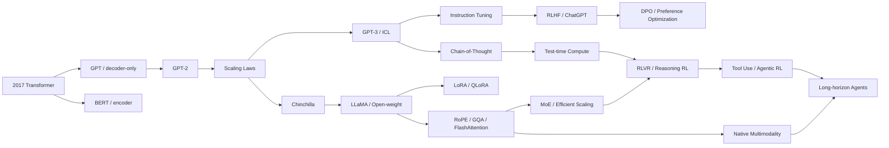

**主要来源**：Vaswani et al. (2017); Brown et al. (2020); Hoffmann et al. (2022); Ouyang et al. (2022); Touvron et al. (2023); DeepSeek-AI (2025)。

---

# 图 2　Decoder-only Transformer 的主数据流

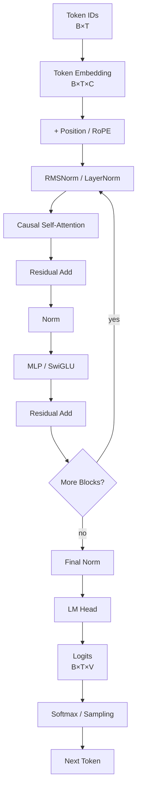

**主要来源**：Vaswani et al. (2017); GPT/LLaMA 系列公开架构。

---

# 图 3　Self-Attention 的 shape 图

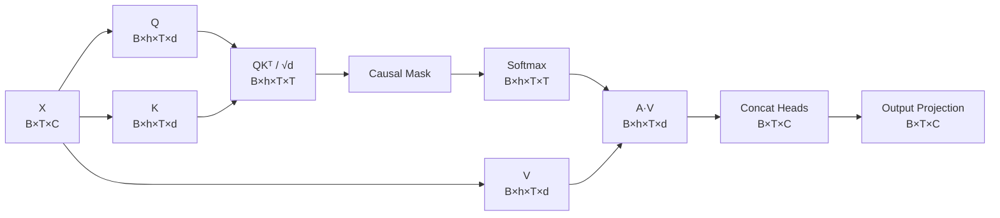

公式：

\[
\operatorname{Attention}(Q,K,V)
=
\operatorname{softmax}\left(\frac{QK^\top}{\sqrt{d_k}}+M\right)V.
\]

**主要来源**：Vaswani et al., 2017, https://arxiv.org/abs/1706.03762

---

# 图 4　预训练 → SFT → Preference → RL 的后训练栈

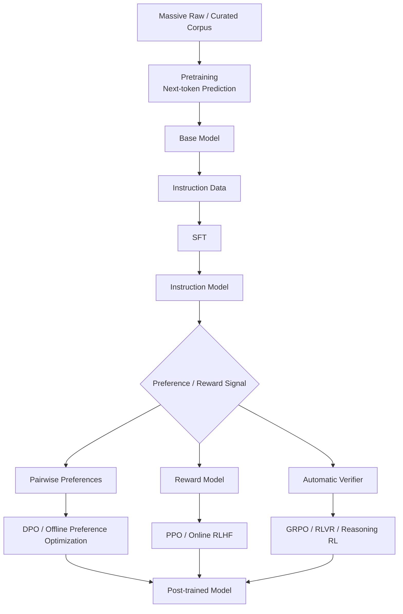

**主要来源**：Ouyang et al. (2022); Rafailov et al. (2023); Shao et al. (2024); DeepSeek-AI (2025)。

---

# 图 5　Scaling 不是一个旋钮，而是三个资源变量

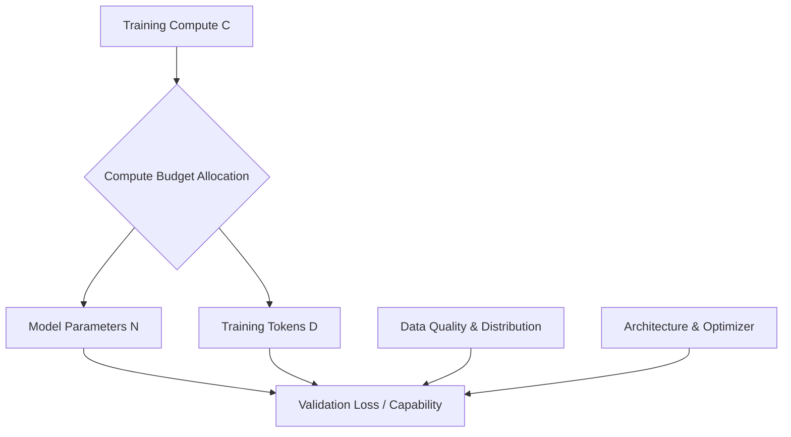

粗略地，对 dense Transformer：

\[
C\propto ND.
\]

但最终 loss 不只由 \(N,D,C\) 决定，还受数据质量、架构、优化器和训练稳定性影响。

**主要来源**：Kaplan et al. (2020); Hoffmann et al. (2022)。

---

# 图 6　MHA → GQA → MQA：KV Cache 为什么会下降

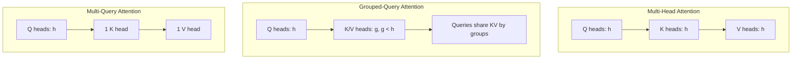

KV Cache 的每层规模可粗略理解为：

\[
O(B\cdot T\cdot h_{kv}\cdot d_h),
\]

因此降低 \(h_{kv}\) 可以显著减少 decode 阶段缓存。

**主要来源**：Shazeer (2019); Ainslie et al. (2023)。

---

# 图 7　MoE：总参数大，但每个 token 只激活部分专家

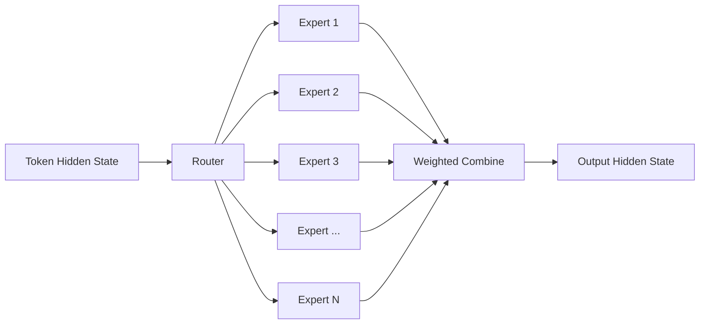

Top-k routing 的核心思想：

\[
\text{Total Parameters}\gg\text{Activated Parameters per Token}.
\]

真正的系统难点包括 expert load balance、all-to-all communication、capacity、routing stability 与 expert parallelism。

**主要来源**：Shazeer et al. (2017); Switch Transformer (2021); Mixtral (2024); DeepSeekMoE (2024)。

---

# 图 8　KV Cache：训练并行与自回归推理的分水岭

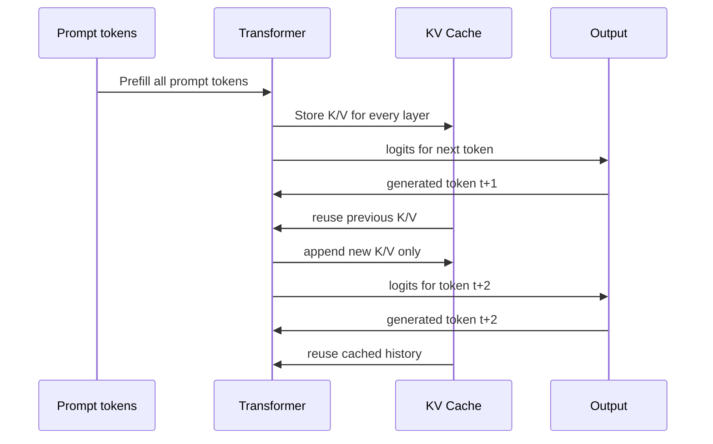

没有 KV Cache 时，生成第 \(t\) 个 token 会重复计算之前所有 token 的 K/V；有 cache 后，历史 K/V 被复用，但显存占用随上下文长度增长。

**主要来源**：标准 Transformer 自回归推理；现代 serving 系统文献，尤其 vLLM / PagedAttention。

---

# 图 9　Reasoning RL / RLVR 的闭环

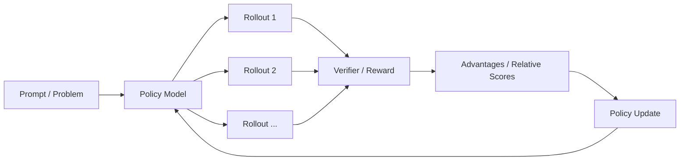

当 verifier 是数学答案、单元测试或环境成功信号时，训练可以在不依赖人工逐条打分的情况下扩展。但 verifier 设计本身会成为新的瓶颈和可攻击面。

**主要来源**：DeepSeekMath (2024); DeepSeek-R1 (2025); process/outcome supervision literature。

---

# 图 10　Agent 不等于 LLM：它是一个闭环系统

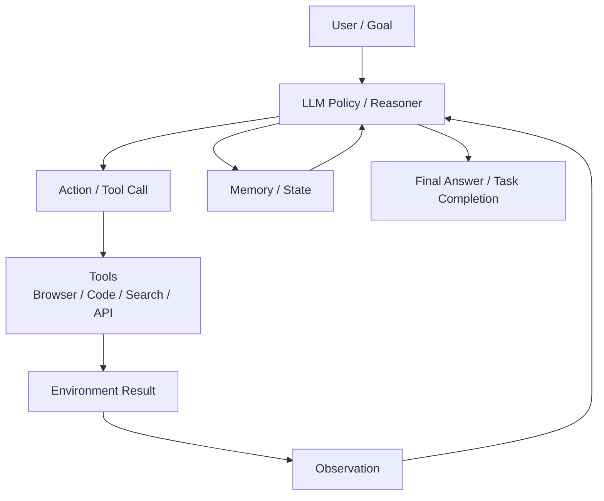

Agent 评测必须拆分：

- base model 能力；
- tool interface；
- prompt/scaffold；
- planning / memory；
- environment；
- retry budget；
- test-time compute。

**主要来源**：WebGPT (2021); ReAct (2022/2023); Toolformer (2023) 及后续 agent literature。

---

# 图 11　RAG：检索与生成是两个子系统

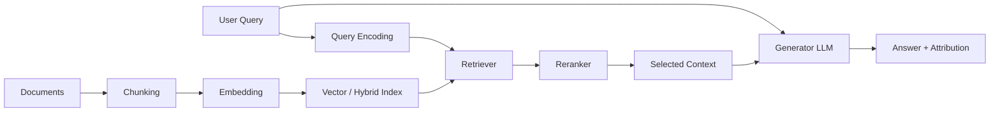

RAG 失败可能来自 retrieval，也可能来自 generation；两者必须分别评测。

**主要来源**：Lewis et al. (2020); DPR (2020); RETRO (2021/2022)。

---

# 图 12　大模型训练的多维并行

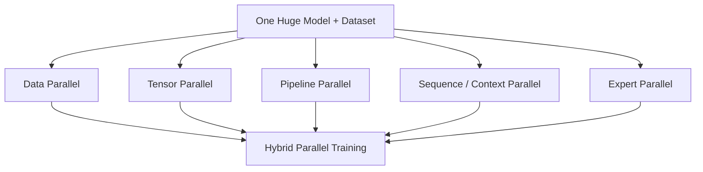

现实中的 trillion-scale 或大 MoE 训练通常是多维并行组合，并同时处理 optimizer states、activation memory、communication topology 和 fault tolerance。

**主要来源**：Megatron-LM; ZeRO; FSDP; GShard / MoE systems。

---

# 插图规范

后续正文新增图时遵循：

1. **先画数据流，再写公式**；
2. shape 尽可能标明；
3. 区分训练与推理；
4. 区分“数学变化”和“系统优化”；
5. 重绘论文机制时标 `据 X et al. (year) 重绘/整理`；
6. 不直接复制论文整图，除非许可证明确允许且确有必要；
7. 不使用来历不明的网络示意图；
8. 时效性产品架构图必须写版本和日期。

这套图谱会随着各章扩写继续增加。