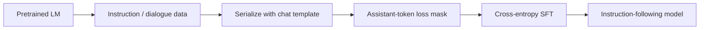
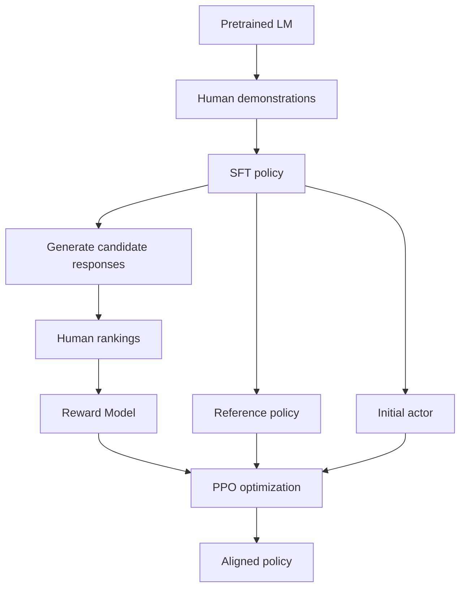
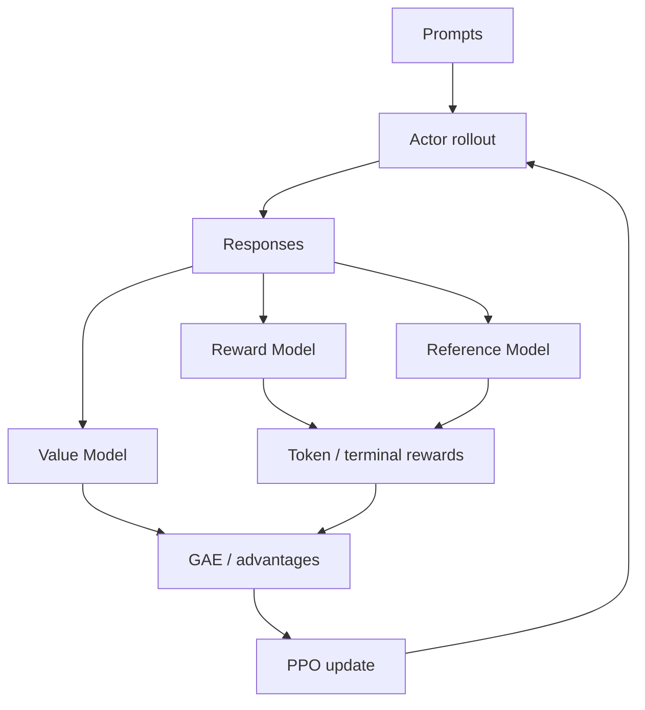
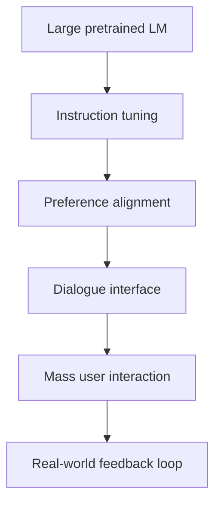
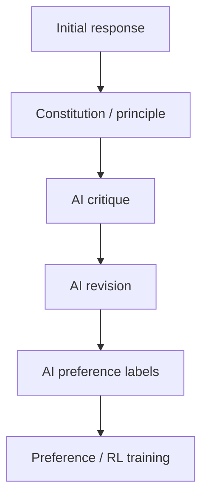
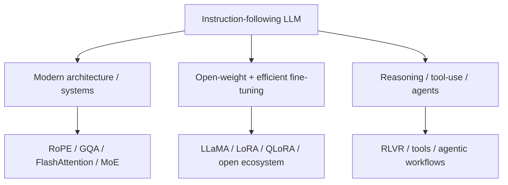

# 第三篇（Part III）　从 GPT‑3 到 ChatGPT：Instruction Tuning、RLHF、DPO 与现代后训练

> **本章主线**：GPT‑3 已经“会很多东西”，为什么还不能直接成为好用的助手？Instruction Tuning 改变了什么？RLHF 为什么需要 Reward Model、Value Model 与 PPO？DPO 为什么能绕过显式 Reward Model + online RL？为什么 2024–2025 之后 RLVR、GRPO 与 reasoning RL 又把 online RL 拉回舞台中央？本章要把这些问题一路推到**可以自己实现最小后训练系统**的粒度。

> **证据边界**：公开论文可以解释 InstructGPT、PPO-style RLHF、DPO、Constitutional AI、GRPO、DeepSeek-R1 等公开方法；但闭源 ChatGPT 及后续 OpenAI 产品的完整训练配方并未公开。除官方明确披露外，本章不根据产品行为反推私有训练细节。

---

# 1　原始问题：会续写，不等于会帮你做事

预训练语言模型优化的是 next-token prediction：

$$
\mathcal L_{\text{LM}}
=-\sum_t\log p_\theta(x_t\mid x_{\lt t}).
$$

这个目标只要求：**真实语料里的下一个 token 概率尽可能高。**

但用户真正希望的是：

```text
用户意图
  ↓
理解任务
  ↓
选择合适行为
  ↓
遵守约束 / 格式 / 安全边界
  ↓
给出有帮助、正确、相关的回答
```

两者并不等价。

假设 prompt 是：

```text
Q: 法国的首都是什么？
A:
```

互联网语料可能同时包含：

```text
A: 巴黎。
A: 我不知道。
A: 这个问题太简单了。
A: 点击这里查看更多……
```

预训练只是在拟合这些文本模式，没有一个显式变量叫作“用户真正想让模型怎么做”。

这就是：

$$
\text{pretraining objective}
\neq
\text{human intent}.
$$

InstructGPT 对这个问题的表述非常直接：把模型做大，并不会自动让它更会遵循用户意图。[Ouyang et al., 2022](https://arxiv.org/abs/2203.02155)

---

# 2　本章原始资料包

优先阅读以下一手资料：

| 主题 | 一手来源 | 本章使用它回答什么 |
|---|---|---|
| Human preference RL | Christiano et al., 2017 | 如何从人类比较学习 reward |
| PPO | Schulman et al., 2017 | 为什么要限制 policy update 幅度 |
| Summarization RLHF | Stiennon et al., 2020 | LLM 上 reward modeling + RL 的早期完整范式 |
| FLAN | Wei et al., 2021 | instruction tuning 如何提高 zero-shot task generalization |
| T0 | Sanh et al., 2021 | 多任务 prompted training |
| InstructGPT | Ouyang et al., 2022 | SFT → RM → PPO 的经典 LLM RLHF pipeline |
| ChatGPT | OpenAI, 2022 | ChatGPT 公开披露的历史训练框架边界 |
| Constitutional AI | Bai et al., 2022 | AI feedback / constitution |
| DPO | Rafailov et al., 2023 | 如何把 KL-regularized RLHF 化为直接偏好目标 |
| KTO | Ethayarajh et al., 2024 | 非严格 pairwise feedback |
| ORPO | Hong et al., 2024 | 将 instruction tuning 与 preference objective 合并 |
| GRPO / DeepSeekMath | Shao et al., 2024 | 去掉独立 critic 的 group-relative RL |
| DeepSeek-R1 | DeepSeek-AI, 2025 | reasoning RL 的公开大规模案例 |

---

# 3　Instruction Tuning：先把“语言模型”重定向成“任务模型”

Instruction tuning 的基本数据形式可以写成：

$$
(x_{instruction},x_{input},y_{response}).
$$

训练仍然是普通 teacher forcing：

$$
\mathcal L_{\text{SFT}}
=-\sum_{t\in\mathcal A}
\log p_\theta(y_t\mid x,y_{\lt t}),
$$

其中 $\mathcal A$ 是需要计算 loss 的 assistant token 集合。

也就是说，SFT（Supervised Fine-Tuning）本身并没有神秘的新优化器。真正变化的是：

> **训练分布从“互联网文本长什么样”，变成“一个好助手面对请求时应该怎样回答”。**



---

# 4　不要跳过工程细节：一条 SFT 样本到底怎样进入模型？

现代 chat model 的原始数据常类似：

```json
{
  "messages": [
    {"role": "system", "content": "You are a helpful assistant."},
    {"role": "user", "content": "解释二叉搜索树。"},
    {"role": "assistant", "content": "二叉搜索树是……"}
  ]
}
```

经过 chat template 序列化后，它才真正变成 token sequence：

```text
<system> You are a helpful assistant. </system>
<user> 解释二叉搜索树。 </user>
<assistant> 二叉搜索树是…… </assistant>
```

随后 tokenizer 得到：

$$
\text{input\_ids}\in\mathbb N^{B\times T}.
$$

典型 causal LM forward：

```text
input_ids [B,T]
      ↓
embedding
      ↓
hidden [B,T,d]
      ↓
LM head
      ↓
logits [B,T,V]
```

但 **不是每个 token 都一定进入 SFT loss**。

一种常见 assistant-only mask：

```text
system token      → ignore
user token        → ignore
assistant token   → train
padding token     → ignore
```

于是 labels 可以想成：

```text
[-100, -100, ..., -100, y1, y2, y3, ..., -100]
```

PyTorch `CrossEntropyLoss(ignore_index=-100)` 会跳过这些位置。

这件事很关键：

> **chat template、role token、EOS、loss mask 都是模型行为的一部分。**

一个训练正确但 serialization 错误的模型，部署时仍然可能表现很差。

---

# 5　为什么相对少量的高质量指令数据就能明显改变行为？

预训练已经让模型获得大量：

- 语言知识；
- 世界知识；
- 代码模式；
- 文档结构；
- 问答模式；
- 局部推理模式。

SFT 通常不是重新教模型“法国的首都是巴黎”，而是在做**行为重定向（behavioral steering）**：

> 当上下文呈现为“用户请求”时，把已有能力组织成一个 assistant response。

可以把它理解为从：

$$
p_{pretrain}(\text{text continuation})
$$

向：

$$
p_{assistant}(\text{response}\mid\text{instruction, context})
$$

重新塑形。

因此，post-training 数据量通常远小于 pretraining token 数量，却可以强烈改变可见行为。

但要注意：

> **行为重定向不能凭空制造基础模型完全没有的能力。**

如果 base model 不会某种知识或无法完成某类推理，仅靠格式化 SFT 数据并不能保证真正获得该能力。

---

# 6　FLAN 与 T0：自然语言开始成为通用任务接口

2021 年 FLAN 把大量 NLP 数据集改写成自然语言指令，并对模型进行 instruction tuning，展示了对未见任务的 zero-shot 泛化提升。[Wei et al., 2021](https://arxiv.org/abs/2109.01652)

同期 T0 也探索了大规模 multitask prompted training，让一个模型通过 prompt 理解任务，而不再为每个任务单独设计 task head。[Sanh et al., 2021](https://arxiv.org/abs/2110.08207)

范式发生了变化：

```text
过去：
数据集 A → task head A
数据集 B → task head B
数据集 C → task head C

后来：
任务描述 + 输入
       ↓
自然语言 prompt
       ↓
同一个 generative model
```

自然语言开始承担一种近似“通用 API”的角色。

---

# 7　为什么只有 SFT 还不够？

SFT 需要“目标答案”。

但很多任务没有唯一标准答案。例如：

> 给这段文章写一个简洁但完整的摘要。

可能出现：

```text
回答 A：事实正确，但很啰嗦
回答 B：事实正确，简洁、结构清楚
回答 C：非常流畅，但漏掉关键事实
回答 D：格式漂亮，但有幻觉
```

让标注者从零写一个完美答案，成本很高；但让标注者判断：

> B 和 C，哪个更好？

通常容易得多。

于是监督信号从：

$$
(x,y^*)
$$

变成：

$$
(x,y_w,y_l),
$$

其中 $y_w$ 是 preferred / winner，$y_l$ 是 rejected / loser。

这就是 preference learning 的入口。

---

# 8　RLHF 的经典三阶段结构

InstructGPT 将 LLM 时代的经典 RLHF pipeline 系统化地展示出来：[Ouyang et al., 2022](https://arxiv.org/abs/2203.02155)



可以把它拆成三个数据集 / 三种学习信号：

1. **demonstration data** → SFT；
2. **preference ranking data** → Reward Model；
3. **fresh policy rollouts** → PPO / online RL。

这三者不要混为一谈。

---

# 9　Preference Data：人类到底在标什么？

对同一个 prompt $x$，policy 可以采样多个候选：

$$
y_1,y_2,\ldots,y_K.
$$

标注者可以：

- 给出完整排序；
- 选择最好一个；
- 做 pairwise comparison；
- 打 scalar score；
- 标记 desirable / undesirable；
- 写 critique；
- 对多个维度分别打分。

经典 pairwise 数据写成：

$$
(x,y_w,y_l).
$$

真正困难的地方不是公式，而是**偏好定义**。

“更好”可能同时包含：

- correctness；
- relevance；
- completeness；
- concision；
- style；
- harmlessness；
- uncertainty calibration；
- instruction following。

如果 rubric 本身矛盾，模型不会神奇地学出一个不存在的一致效用函数。

---

# 10　Reward Model：把人类比较映射成标量

设 prompt 为 $x$，完整回答为 $y$。Reward Model 输出：

$$
r_\phi(x,y)\in\mathbb R.
$$

最常见的 pairwise 建模使用 Bradley–Terry / logistic preference 形式：

$$
P(y_w\succ y_l\mid x)
=
\sigma\left(r_\phi(x,y_w)-r_\phi(x,y_l)\right),
$$

其中：

$$
\sigma(z)=\frac{1}{1+e^{-z}}.
$$

对应 loss：

$$
\mathcal L_{RM}
=-\log\sigma\left(r_w-r_l\right).
$$

当：

$$
r_w-r_l\gg0,
$$

则：

$$
P(y_w\succ y_l)\to1.
$$

---

# 11　Reward Model 在网络里长什么样？

一种典型实现是复用 causal LM backbone，但把最后一个 token / EOS 的 hidden state 接到 scalar head：

```text
prompt + response token ids [B,T]
            ↓
        Transformer
            ↓
       hidden [B,T,d]
            ↓
      terminal hidden
          [B,d]
            ↓
       linear head
            ↓
       reward [B]
```

如果 winner 与 loser 各跑一次：

```text
winner ids [B,Tw] → RM → rw [B]
loser  ids [B,Tl] → RM → rl [B]
                         ↓
              -log sigmoid(rw - rl)
```

因此 Reward Model 不是一个神秘的“价值判断程序”；它仍然是一个神经网络，只是输出空间从 vocabulary logits 变成了一个 scalar。

---

# 12　RM 学到的是“真理”吗？

不是。

它学到的是：

> **训练标注分布上，人类偏好的统计代理。**

形式上：

$$
\text{Reward Model}
\neq
\text{ground-truth utility}.
$$

偏差可能来自：

- 标注者偏好不一致；
- rubric 不完整；
- preference data 覆盖不足；
- verbosity bias；
- style bias；
- position bias；
- domain shift；
- RM 自身泛化失败。

这为后面的 reward hacking / reward overoptimization 埋下了根源。

---

# 13　为什么语言生成可以写成强化学习？

一个 response 的 autoregressive generation 可以被视为 MDP：

- state：prompt + 已生成 token；
- action：下一个 token；
- policy：语言模型；
- episode：直到 EOS / max length；
- reward：完整 response 的 reward，加上可能的过程 reward / KL shaping。

形式化：

$$
s_t=(x,y_{\lt t}),
$$

$$
a_t=y_t,
$$

$$
\pi_\theta(a_t\mid s_t)
=p_\theta(y_t\mid x,y_{\lt t}).
$$

完整轨迹：

$$
\tau=(s_1,a_1,s_2,a_2,\ldots,s_T,a_T).
$$

最终 Reward Model 给出：

$$
r_\phi(x,y_{1:T}).
$$

于是问题变成：

$$
\max_\theta
\mathbb E_{y\sim\pi_\theta(\cdot|x)}[r_\phi(x,y)].
$$

---

# 14　Policy Gradient：为什么 reward 可以反过来训练 token policy？

最基本的 REINFORCE 思想：

$$
\nabla_\theta J(\theta)
=
\mathbb E_{\tau\sim\pi_\theta}
\left[
R(\tau)
\nabla_\theta\log\pi_\theta(\tau)
\right].
$$

而 autoregressive policy 的 trajectory log-prob 可以分解为：

$$
\log\pi_\theta(\tau)
=
\sum_t\log\pi_\theta(a_t|s_t).
$$

所以：

$$
\nabla_\theta J
=
\mathbb E
\left[
\sum_t R_t
\nabla_\theta\log\pi_\theta(a_t|s_t)
\right].
$$

直觉：

- 高回报轨迹中的动作概率提高；
- 低回报轨迹中的动作概率降低。

但直接这样做方差极大，所以实际系统需要 baseline / critic / advantage estimation。

---

# 15　Value Model 与 Advantage：PPO 里那个 critic 到底干什么？

Value model 估计：

$$
V_\psi(s_t)
\approx
\mathbb E[R_t\mid s_t].
$$

Advantage 描述：

$$
A_t
=Q(s_t,a_t)-V(s_t).
$$

它回答的不是：

> 这个状态的未来总体有多好？

而是：

> **在这个状态下，刚才这个 action 比“平均应有表现”好多少？**

最简单的一步 TD error：

$$
\delta_t
=r_t+\gamma V(s_{t+1})-V(s_t).
$$

Generalized Advantage Estimation（GAE）把未来 TD error 加权累积：

$$
\hat A_t
=
\sum_{l=0}^{T-t-1}
(\gamma\lambda)^l\delta_{t+l}.
$$

在 LLM episode 中，终局 reward 经常集中在 response 末尾，因此 advantage estimation 对稳定 credit assignment 很重要。

---

# 16　PPO：为什么不能直接把 policy 一脚踹向高 reward 区域？

PPO（Proximal Policy Optimization）由 Schulman 等人在 2017 年提出。[Schulman et al., 2017](https://arxiv.org/abs/1707.06347)

定义当前 policy 与 rollout 时旧 policy 的概率比：

$$
\rho_t(\theta)
=
\frac{\pi_\theta(a_t\mid s_t)}
{\pi_{\theta_{old}}(a_t\mid s_t)}.
$$

clipped surrogate objective：

$$
L^{CLIP}(\theta)
=
\mathbb E_t
\left[
\min
\left(
\rho_t\hat A_t,
\mathrm{clip}(\rho_t,1-\epsilon,1+\epsilon)\hat A_t
\right)
\right].
$$

直觉是：

> 可以朝高 advantage 的方向更新，但一次不要离 rollout policy 太远。

如果没有这种约束，语言模型可能在少数梯度步中快速改变 token distribution，导致训练不稳定甚至行为崩坏。

---

# 17　PPO-RLHF 的完整 loss 不只有 policy loss

一个教学级的 PPO-RLHF 总目标可以写成：

$$
\mathcal L
=
\mathcal L_{policy}
+c_v\mathcal L_{value}
-c_e\mathcal H(\pi_\theta),
$$

其中：

### Policy loss

$$
\mathcal L_{policy}
=-L^{CLIP}.
$$

### Value loss

$$
\mathcal L_{value}
=
\mathbb E_t
\left[
(V_\psi(s_t)-\hat R_t)^2
\right].
$$

### Entropy bonus

$$
\mathcal H(\pi)
=-\sum_a\pi(a|s)\log\pi(a|s).
$$

熵项鼓励一定程度的探索；具体 LLM RLHF 实现是否使用、如何权衡，取决于训练配方。

---

# 18　为什么还需要 reference model 与 KL？

如果只优化 learned reward：

$$
\max_\theta
\mathbb E[r_\phi(x,y)],
$$

policy 会不断寻找 Reward Model 的漏洞。

于是经典 RLHF 引入 reference policy：

$$
R(x,y)
=
r_\phi(x,y)
-
\beta
D_{KL}
\left(
\pi_\theta(\cdot|x)
\Vert
\pi_{ref}(\cdot|x)
\right).
$$

直觉：

```text
Reward Model：往人类偏好方向走
Reference KL：别离原来那个“正常语言模型”太远
```

这是整个 post-training 时代极其重要的一条思想：

> **优化新目标，同时对已经学到的分布施加保真约束。**

---

# 19　实际代码里常见的不是“完整词表 KL”，而是 sampled-token log-ratio

理论 KL：

$$
D_{KL}(\pi_\theta||\pi_{ref})
=
\mathbb E_{a\sim\pi_\theta}
\left[
\log\pi_\theta(a|s)-\log\pi_{ref}(a|s)
\right].
$$

对 rollout 实际采样到的 token $a_t$，可以计算：

$$
k_t
=
\log\pi_\theta(a_t|s_t)
-
\log\pi_{ref}(a_t|s_t).
$$

于是可以构造 token-level shaped reward：

$$
\tilde r_t
=-\beta k_t,
$$

并在终局再加入 RM score：

$$
\tilde r_T
\leftarrow
\tilde r_T+r_\phi(x,y).
$$

数据流就变成：

```text
每个 response token
  ├─ actor logprob
  ├─ reference logprob
  └─ KL-shaped reward

最后一个 response token
  └─ 再加 sequence-level RM reward
```

这比只写一句“加 KL penalty”更接近真实 PPO-RLHF 实现。

---

# 20　一批 PPO-RLHF 数据到底长什么样？

设：

- batch size：$B$；
- prompt 长度：$P$；
- response 最大长度：$R$；
- vocabulary：$V$。

rollout 后常见张量：

```text
prompt_ids          [B,P]
response_ids        [B,R]
attention_mask      [B,P+R]
response_mask       [B,R]
old_logprobs        [B,R]
ref_logprobs        [B,R]
values              [B,R]
rewards             [B,R]
advantages          [B,R]
returns             [B,R]
```

然后 PPO update 时重新前向 actor：

```text
input ids [B,P+R]
      ↓
actor
      ↓
logits [B,P+R,V]
      ↓ gather response token
new_logprobs [B,R]
      ↓
ratio = exp(new_logprobs - old_logprobs)
      ↓
PPO clipped loss
```

这条数据流必须真正理解，因为 RLHF 的显存、吞吐与并行问题都从这里产生。

---

# 21　PPO-RLHF 为什么工程上这么重？

经典实现中可能同时需要：

- actor / policy；
- rollout-time old policy 信息；
- reference model；
- reward model；
- critic / value model。



主要成本包括：

- rollout 是 autoregressive generation，吞吐远低于纯 teacher forcing；
- 多个大模型占用大量显存；
- actor / critic forward + backward；
- reference / RM forward；
- 需要跨卡放置与通信；
- sequence 长度变化导致 batching 更复杂；
- online data distribution 会不断变化。

因此 PPO-style RLHF 的复杂性不仅来自“RL 难调”，更来自它是一个**多模型、生成式、在线数据系统**。

---

# 22　Reward Hacking 与 Reward Overoptimization

真正想优化的目标设为 $U(x,y)$，但不可直接访问，于是训练一个 proxy：

$$
\hat U(x,y)=r_\phi(x,y).
$$

然后 policy 最大化：

$$
\max_\pi
\mathbb E_{y\sim\pi}[\hat U(x,y)].
$$

如果 proxy 在训练分布附近与真正目标相关，但存在漏洞，那么强优化会主动把 policy 推向这些漏洞。

可能表现为：

- 不必要地写得更长；
- 过度套话；
- 迎合用户错误前提；
- 使用 judge 偏爱的结构；
- 生成看起来更“严谨”但事实更差的回答；
- exploit verifier / test harness；
- 牺牲多样性以换取高 reward。

这就是为什么：

$$
\text{higher reward-model score}
\not\Rightarrow
\text{better real-world model}.
$$

Reward 只能作为训练信号，不能单独当最终质量证明。

---

# 23　InstructGPT：行为对齐可以比“单纯做大模型”更重要

InstructGPT 的经典结果之一是：

> 在论文的人类偏好评测分布上，1.3B InstructGPT 的输出可以被偏好于 175B GPT‑3 的输出。

来源：[Ouyang et al., 2022](https://arxiv.org/abs/2203.02155)

这说明：

$$
\text{parameter count}
\not\equiv
\text{user-perceived quality}.
$$

一个模型可以知识很多，却仍然：

- 不遵循格式；
- 无视用户要求；
- 把 prompt 当成文章继续续写；
- 输出不相关内容；
- 不知道什么时候该拒绝或澄清。

基础能力与行为对齐是两个不同维度。

---

# 24　ChatGPT：真正的历史转折不是“又发明了一个 Transformer”

OpenAI 于 **2022 年 11 月 30 日**发布 ChatGPT，并公开说明其使用了与 InstructGPT 相近的 RLHF 方法，但数据收集方式有所不同。[OpenAI, 2022](https://openai.com/index/chatgpt/)

从神经网络架构史看，ChatGPT 并不是 2017 Transformer 那种基础 block 革命。

但从 AI 产品史看，它把几件事组合到了极低门槛：



用户不再需要：

- 选择 NLP task；
- 自己微调模型；
- 设计专门 task head；
- 理解底层模型 API；
- 把每个任务改成固定模板。

自然语言对话成为通用的人机计算接口之一。

---

# 25　DPO 出现：能不能不显式训练 RM + PPO？

PPO-RLHF 的工程成本很高，因此一个自然问题是：

> 已经有 $(x,y_w,y_l)$ preference pairs，能不能直接更新 policy？

Direct Preference Optimization（DPO）给出了一个重要答案。[Rafailov et al., 2023](https://arxiv.org/abs/2305.18290)

它从 KL-regularized reward maximization 出发：

$$
\max_\pi
\mathbb E_{y\sim\pi(\cdot|x)}[r(x,y)]
-
\beta D_{KL}(\pi(\cdot|x)||\pi_{ref}(\cdot|x)).
$$

下面不直接背 DPO loss，而是一步步推。

---

# 26　DPO 推导第一步：写出 KL-regularized RL 的最优 policy

对固定 prompt $x$，最优 policy 满足 Gibbs / Boltzmann 形式：

$$
\pi^*(y|x)
=
\frac{1}{Z(x)}
\pi_{ref}(y|x)
\exp\left(\frac{1}{\beta}r(x,y)\right),
$$

其中：

$$
Z(x)
=
\sum_y
\pi_{ref}(y|x)
\exp\left(\frac{1}{\beta}r(x,y)\right).
$$

移项：

$$
\frac{\pi^*(y|x)}{\pi_{ref}(y|x)}
=
\frac{1}{Z(x)}
\exp\left(\frac{r(x,y)}{\beta}\right).
$$

取对数：

$$
\log\frac{\pi^*(y|x)}{\pi_{ref}(y|x)}
=
\frac{r(x,y)}{\beta}-\log Z(x).
$$

于是：

$$
r(x,y)
=
\beta
\log\frac{\pi^*(y|x)}{\pi_{ref}(y|x)}
+
\beta\log Z(x).
$$

这一步是 DPO 的核心桥梁：

> **最优 policy 相对 reference policy 的 log-ratio，可以充当隐式 reward。**

---

# 27　DPO 推导第二步：把隐式 reward 代回 Bradley–Terry

Preference model：

$$
P(y_w\succ y_l|x)
=
\sigma(r(x,y_w)-r(x,y_l)).
$$

代入：

$$
r(x,y)
=
\beta\log\frac{\pi(y|x)}{\pi_{ref}(y|x)}
+
\beta\log Z(x).
$$

winner 与 loser 的 $\beta\log Z(x)$ 会抵消：

$$
r_w-r_l
=
\beta
\left[
\log\frac{\pi(y_w|x)}{\pi_{ref}(y_w|x)}
-
\log\frac{\pi(y_l|x)}{\pi_{ref}(y_l|x)}
\right].
$$

因此 DPO loss：

$$
\mathcal L_{DPO}(\theta)
=
-\mathbb E
\left[
\log\sigma
\left(
\beta
\left[
\log\frac{\pi_\theta(y_w|x)}{\pi_{ref}(y_w|x)}
-
\log\frac{\pi_\theta(y_l|x)}{\pi_{ref}(y_l|x)}
\right]
\right)
\right].
$$

这不是“凭经验发明的一个分类 loss”，而是从特定 KL-regularized RLHF 形式推导出来的。

---

# 28　DPO 到底在推什么？

定义：

$$
\Delta_w
=
\log\pi_\theta(y_w|x)
-
\log\pi_{ref}(y_w|x),
$$

$$
\Delta_l
=
\log\pi_\theta(y_l|x)
-
\log\pi_{ref}(y_l|x).
$$

DPO 希望：

$$
\Delta_w\gt \Delta_l.
$$

也就是：

```text
相对 reference：

winner 的 probability mass   ↑
loser  的 probability mass   ↓
```

注意关键词是**相对 reference**。

如果只比较：

$$
\log\pi_\theta(y_w|x)
-
\log\pi_\theta(y_l|x),
$$

那就不是标准 DPO 的同一个目标。

---

# 29　Sequence log-prob 是怎样算出来的？

自回归模型对整个 response 的概率：

$$
\pi_\theta(y|x)
=
\prod_{t=1}^{T_y}
\pi_\theta(y_t|x,y_{\lt t}).
$$

取 log：

$$
\log\pi_\theta(y|x)
=
\sum_{t=1}^{T_y}
\log\pi_\theta(y_t|x,y_{\lt t}).
$$

实现中：

```text
prompt + chosen    → policy logits → chosen token logprobs → masked sum
prompt + rejected  → policy logits → rejected token logprobs → masked sum
prompt + chosen    → ref logits    → chosen ref logprobs    → masked sum
prompt + rejected  → ref logits    → rejected ref logprobs  → masked sum
```

关键是只对 response token 求和，而不是把 prompt token 也算进偏好目标。

---

# 30　最小 DPO：从张量到 loss

下面是教学级伪实现。它假设已经得到每条 response 的 sequence log-prob：

```python
import torch
import torch.nn.functional as F


def dpo_loss(
    policy_chosen_logps,
    policy_rejected_logps,
    ref_chosen_logps,
    ref_rejected_logps,
    beta=0.1,
):
    chosen_logratios = policy_chosen_logps - ref_chosen_logps
    rejected_logratios = policy_rejected_logps - ref_rejected_logps

    logits = beta * (chosen_logratios - rejected_logratios)
    loss = -F.logsigmoid(logits).mean()

    return loss
```

真正完整实现还需要：

- chat template；
- chosen / rejected padding；
- response mask；
- causal shift；
- `log_softmax`；
- `gather` 对应 target token；
- mixed precision；
- distributed training；
- reference model 管理。

但从数学到代码的核心映射已经在上面。

---

# 31　DPO 为什么流行？

它把：

```text
SFT
 ↓
Reward Model
 ↓
Online rollout
 ↓
Critic
 ↓
PPO
```

简化为：

```text
Policy + Reference
       ↓
Offline preference pairs
       ↓
Direct optimization
```

主要优势：

- 不需要显式 Reward Model；
- 不需要 critic；
- 训练期不需要 online generation；
- 可以像普通 supervised objective 一样 batch 化；
- pipeline 更简单；
- 调试成本显著低于 PPO-RLHF。

但这不等于：

> DPO 已经证明 online RL 不再需要。

因为它主要学习**已有 preference dataset 中包含的比较结构**。

---

# 32　DPO 的局限：离线偏好数据不是无限能力源

如果 preference dataset 只覆盖：

```text
已有策略会产生的答案附近
```

那么 DPO 很擅长做：

- style preference；
- refusal preference；
- format preference；
- helpfulness preference；
- winner-vs-loser 选择倾向。

但如果希望模型：

- 自己探索全新的推理策略；
- 在环境中尝试多步工具动作；
- 从 success/failure 中发现新 policy；
- 通过大量 rollout 找到训练集里没有出现过的 trajectory；

online RL 又会重新重要。

这正是 reasoning RL / agentic RL 回归的根本原因之一。

---

# 33　KTO、ORPO 等：反馈并不只有 winner / loser 一种形态

DPO 之后出现大量 preference optimization 方法。

例如：

- **KTO**：尝试利用 desirable / undesirable 这类不严格成对的数据。[Ethayarajh et al., 2024](https://arxiv.org/abs/2402.01306)
- **ORPO**：尝试把 instruction tuning 与 preference optimization 更紧密地融合。[Hong et al., 2024](https://arxiv.org/abs/2403.07691)

更重要的不是记住所有缩写，而是建立一个统一视角：

```text
demonstration
pairwise preference
binary feedback
scalar rating
critique
rubric score
process label
verifiable answer
unit tests
environment success
```

它们都是 feedback channel。

现代 post-training 的核心问题可以重新表述为：

> **怎样把成本不同、噪声不同、可信度不同、粒度不同的 feedback 变成稳定有效的 policy update？**

---

# 34　RLAIF 与 Constitutional AI：偏好是否必须全部来自人类？

Anthropic 的 Constitutional AI 探索了：

1. 用自然语言原则（constitution）指导模型 critique；
2. 让模型 revision；
3. 生成 AI preference data；
4. 再进行 preference / RL training。

来源：[Bai et al., 2022](https://arxiv.org/abs/2212.08073)



它解决的是 scalability 问题：

> 高质量人类标注很贵，而且无法无限扩张。

但 AI judge 也可能：

- 继承 generator 的偏差；
- 偏爱某种语言风格；
- 被 prompt injection；
- 出现 correlated errors；
- 对复杂事实做错误判断。

所以：

$$
\text{AI feedback}
\neq
\text{free ground truth}.
$$

---

# 35　从 PPO 到 GRPO：能不能去掉独立 critic？

DeepSeekMath 提出了 Group Relative Policy Optimization（GRPO），作为 PPO 的一个变体，用 group-relative signal 降低对独立 value model 的依赖。[Shao et al., 2024](https://arxiv.org/abs/2402.03300)

对一个 prompt $x$，一次采样一组 responses：

$$
y_1,\ldots,y_G.
$$

得到 reward：

$$
r_1,\ldots,r_G.
$$

教学上可以先理解成对组内 reward 标准化：

$$
\hat A_i
=
\frac{r_i-\mathrm{mean}(r_1,\ldots,r_G)}
{\mathrm{std}(r_1,\ldots,r_G)+\epsilon}.
$$

于是：

- 高于组内平均的 response 得正 advantage；
- 低于组内平均的 response 得负 advantage。

核心思想是：

> 对同一个问题，让一组候选彼此提供相对基线。

具体 GRPO 目标仍包含 policy ratio、clipping、KL 等细节；不同实现配方也可能不同，因此不能把上面的标准化式子当作“GRPO 的全部”。

---

# 36　RLVR：为什么“可验证奖励”让 reasoning RL 重新变得有吸引力？

很多自然语言质量很难客观打分：

```text
“这篇文章写得好不好？”
```

但某些任务的终局结果可以自动验证：

```text
数学题最终答案是否正确？
代码是否通过测试？
SQL 是否返回正确结果？
形式证明是否被 proof checker 接受？
环境任务是否成功完成？
```

于是 reward 可以来自 verifier，而不是 learned RM：

$$
r(x,y)
=
\begin{cases}
1,&\text{verifier accepts}\cr
0,&\text{otherwise}
\end{cases}
$$

或更细粒度地加入格式、过程、测试通过数等信号。

这类做法常被概括为 **RL with Verifiable Rewards（RLVR）**。

它的重要优势是：

> reward 不必完全依赖一个会被 policy 欺骗的主观 learned judge。

但 verifier 仍然可能有漏洞，因此：

$$
\text{verifiable}
\not\Rightarrow
\text{unhackable}.
$$

---

# 37　DeepSeek-R1：公开 evidence 表明大规模 reasoning RL 可以诱导新行为

DeepSeek-R1 技术报告给出了一个公开的大规模案例：DeepSeek-R1-Zero 在没有先做 SFT cold start 的情况下，直接进行大规模 RL，并出现显著 reasoning behavior；随后 DeepSeek-R1 为了解决 readability、language mixing 等问题，又加入 cold-start data 与多阶段训练。[DeepSeek-AI, 2025](https://arxiv.org/abs/2501.12948)

这里最值得记住的不是某一个 benchmark 数字，而是训练范式变化：

```text
传统 post-training：
已有高质量答案 / preference
       ↓
让 policy 更像这些答案

reasoning RL：
问题 + verifier / reward
       ↓
大量 rollout
       ↓
policy 自己探索可获高分的 reasoning trajectory
```

这解释了为什么 online RL 在 2024–2025 之后重新成为 LLM 后训练的重要方向。

---

# 38　SFT、DPO、RL：不要把三者当作互相替代的宗教

它们解决的问题不同。

| 方法 | 主要信号 | 最擅长 | 典型限制 |
|---|---|---|---|
| SFT | demonstration | 冷启动、格式、任务行为、知识蒸馏 | 依赖 target 质量 |
| DPO 类 | offline preference | 偏好、风格、选择倾向 | exploration 能力有限 |
| PPO/RLHF | learned reward | 在线优化偏好目标 | 系统复杂、reward hacking |
| RLVR | verifier reward | 数学、代码、规则可验证任务 | verifier 覆盖有限 |
| Agentic RL | environment outcome | 工具使用、长程决策 | rollout 贵、credit assignment 难 |

一个现代 pipeline 完全可能是：

```text
Pretraining
    ↓
Mid-training / domain adaptation
    ↓
SFT cold start
    ↓
Preference optimization
    ↓
Reasoning RL / RLVR
    ↓
Tool-use / agentic RL
    ↓
Safety tuning + system safeguards
```

所以真正的问题不是：

> SFT、DPO、RL 谁是最终赢家？

而是：

> **哪一种反馈信号应该在训练的哪一个阶段发挥作用？**

---

# 39　Alignment 不等于 Safety

这两个词经常被混在一起。

粗略地：

- **alignment**：模型行为是否符合设计目标、用户意图与价值约束；
- **safety**：完整系统是否把风险控制在可接受范围内。

当模型只能生成文本时，风险面相对有限。

当模型可以：

- 浏览网页；
- 调用 API；
- 执行 shell；
- 写文件；
- 发邮件；
- 修改代码仓库；
- 控制机器人；

安全就必须包含系统层机制：

```text
model behavior
    +
permission model
    +
sandbox
    +
authentication
    +
least privilege
    +
prompt-injection defense
    +
audit log
    +
human confirmation
    +
rate / budget limit
```

因此：

$$
\text{aligned model}
\not\Rightarrow
\text{safe deployed agent}.
$$

这条结论会在后面的 Agent 章节中继续展开。

---

# 40　评测：只看 Reward Model 分数是错误的

一个 post-trained model 至少需要多层评测。

## 40.1　任务能力

例如：

- factual QA；
- coding pass rate；
- math accuracy；
- instruction following；
- structured output validity。

## 40.2　Preference win rate

对同一 prompt 生成两个模型答案，让人类或独立 judge 比较：

$$
\mathrm{WinRate}(A,B)
=
\frac{\#(A\succ B)}{N}.
$$

但必须警惕 judge bias。

## 40.3　Safety / refusal

不能只测“拒不拒绝”，还要区分：

- 应该回答却拒绝：over-refusal；
- 应该拒绝却回答：under-refusal；
- 安全替代方案是否有帮助。

## 40.4　Regression

post-training 可能优化某些维度，却损害：

- factuality；
- calibration；
- multilingual ability；
- code；
- long-context；
- creative diversity。

所以评测必须是多目标的。

---

# 41　一个真正可实现的后训练工程分层

如果从零做一个小型 ChatGPT-like post-training stack，可以拆成：

```text
posttrain/
├── data/
│   ├── chat_template.py
│   ├── sft_dataset.py
│   ├── preference_dataset.py
│   └── collator.py
├── sft/
│   ├── loss.py
│   └── train.py
├── reward_model/
│   ├── model.py
│   ├── pairwise_loss.py
│   └── train.py
├── dpo/
│   ├── sequence_logprob.py
│   ├── loss.py
│   └── train.py
├── rl/
│   ├── rollout.py
│   ├── reward.py
│   ├── kl.py
│   ├── gae.py
│   ├── ppo_loss.py
│   └── trainer.py
└── eval/
    ├── pairwise.py
    ├── task_eval.py
    └── safety_eval.py
```

这个目录不是某个官方仓库的复制，而是本书为了机制学习给出的**教学工程分解**。

---

# 42　最小复现实验 A：只做 SFT

目标：回答一个可证伪问题：

> base LM 是否已经有能力，只是没有稳定 instruction-following behavior？

实验：

1. 选一个小 decoder-only base model；
2. 构造少量 instruction-response data；
3. assistant-only loss；
4. 比较 SFT 前后：
   - 格式遵循；
   - 问答相关性；
   - base capability 是否退化。

必须固定 decoding 参数，否则无法公平比较。

---

# 43　最小复现实验 B：训练一个 Reward Model

构造：

$$
(x,y_w,y_l).
$$

训练：

$$
\mathcal L_{RM}
=-\log\sigma(r_w-r_l).
$$

然后检查：

1. held-out pairwise accuracy；
2. response length 与 reward 的相关性；
3. format 与 reward 的相关性；
4. 人工构造 adversarial response；
5. reward 是否把明显错误但风格漂亮的回答排高。

这个实验能直接展示：

> Reward Model accuracy 高，不等于 reward 不会被 exploit。

---

# 44　最小复现实验 C：手写 DPO

不使用现成 trainer，自己完成：

```text
chosen / rejected tokenization
        ↓
response mask
        ↓
policy sequence logprob
        ↓
reference sequence logprob
        ↓
DPO logits
        ↓
-logsigmoid
        ↓
backward
```

至少打印：

```text
chosen_policy_logp
rejected_policy_logp
chosen_ref_logp
rejected_ref_logp
chosen_logratio
rejected_logratio
dpo_logit
loss
```

如果不能解释这些量，就还没有真正理解 DPO。

---

# 45　最小复现实验 D：PPO / GRPO toy environment

不要第一步就训练大模型。

先做一个离散 toy policy：

```text
state → categorical policy → action
                    ↓
                  reward
```

验证：

- policy gradient；
- baseline 降方差；
- PPO clipping；
- KL penalty；
- group-relative advantage。

再把 action space 换成 token vocabulary。

这样可以把“RL 本身的数学问题”与“LLM 系统工程问题”分离。

---

# 46　从代码层面理解：四种训练到底改了哪条数据路径？

## Pretraining

```text
raw text
 → token ids
 → next-token labels
 → CE loss
```

## SFT

```text
instruction / dialogue
 → chat template
 → token ids
 → assistant mask
 → CE loss
```

## DPO

```text
prompt + chosen/rejected
 → policy + reference
 → 4 个 sequence logprobs
 → pairwise logistic loss
```

## PPO / RLVR

```text
prompt
 → online rollout
 → reward / verifier
 → KL / advantage
 → policy update
```

真正的技术演化可以被看成：

> **训练信号与数据生成方式越来越接近最终任务本身。**

---

# 47　从 ChatGPT 到下一阶段：三个方向同时展开

ChatGPT 之后，LLM 并不是沿单一路线继续发展，而是至少出现三条相互作用的主线：



下一章先切换到**模型内部结构**：

> 原始 Transformer 怎样一步步演化成今天常见的 **RMSNorm + RoPE + SwiGLU + GQA/MLA + FlashAttention + KV Cache**？

之后再回到开源微调、RAG、多模态、reasoning 与 agents。

---

# 本章小结

1. Pretraining 优化文本分布，不直接等价于用户意图。
2. SFT 的核心仍是 causal cross-entropy，但数据分布、chat template 与 assistant loss mask 改变了模型的可见行为。
3. Instruction tuning 把自然语言逐步变成通用 task interface。
4. RLHF 将 demonstration、preference 与 online rollout 分成不同学习阶段。
5. Reward Model 常用 pairwise Bradley–Terry / logistic loss：

$$
-\log\sigma(r_w-r_l).
$$

6. Reward Model 是 preference proxy，不是真理函数，因此会产生 reward hacking 与 overoptimization 风险。
7. 在 token MDP 中，policy 就是语言模型，下一个 token 就是 action。
8. critic / value model 用来估计 baseline；advantage 决定某个采样 token 相对预期有多好。
9. PPO 通过 probability ratio clipping 限制 policy 更新幅度。
10. RLHF 中的 KL 可以通过 actor/reference 的 sampled-token log-ratio 构成 token-level shaped reward。
11. PPO-RLHF 的难点不仅是 RL，而是多模型 + online generation + 长序列 + 分布式系统。
12. InstructGPT 证明：行为后训练可以让较小模型在人类偏好上超过更大的纯预训练模型。
13. ChatGPT 的历史突破是大模型、instruction tuning、preference alignment 与对话产品的系统组合。
14. DPO 从 KL-regularized RLHF 推导出直接 preference objective，绕过显式 RM + PPO。
15. DPO 的关键量是 policy 相对 reference 的 winner / loser log-ratio。
16. DPO 简化了离线偏好优化，但不能替代需要探索的 online RL。
17. GRPO 用组内相对 reward 构造优势信号，减少对独立 critic 的依赖。
18. RLVR 利用数学答案、代码测试、环境成功等可验证信号，为 reasoning RL 提供自动 reward。
19. 现代 post-training 的本质不是寻找唯一终极 loss，而是设计一个多源 feedback stack。
20. Alignment 不等于 Safety；当模型成为 agent 后，权限、sandbox、审计和系统边界同样重要。

---

# 本章练习

## 练习 1：手算 Reward Model loss

若：

$$
r_w=2.0,\qquad r_l=0.5,
$$

计算：

$$
-\log\sigma(r_w-r_l).
$$

然后交换 winner / loser，再算一次，解释梯度方向。

---

## 练习 2：KL 的作用

构造：

$$
p=[0.9,0.05,0.05],
$$

$$
q=[0.4,0.3,0.3].
$$

计算：

$$
D_{KL}(p||q)
=
\sum_i p_i\log\frac{p_i}{q_i}.
$$

讨论 $\beta$ 很大与很小时，RLHF policy 分别更偏向 reference 还是 reward。

---

## 练习 3：手算 sampled-token KL shaping

若某个 token：

$$
\log\pi_\theta(a_t|s_t)=-1.2,
$$

$$
\log\pi_{ref}(a_t|s_t)=-1.8,
$$

且：

$$
\beta=0.1,
$$

计算：

$$
k_t
=
\log\pi_\theta-
\log\pi_{ref},
$$

以及：

$$
\tilde r_t=-\beta k_t.
$$

解释为什么 policy 比 reference 更偏爱该 token 时，KL shaping 会产生惩罚。

---

## 练习 4：DPO 的 winner / loser 相对概率

令：

$$
\pi_{ref}(y_w|x)=0.2,
\qquad
\pi_{ref}(y_l|x)=0.2,
$$

$$
\pi_\theta(y_w|x)=0.4,
\qquad
\pi_\theta(y_l|x)=0.1.
$$

计算：

$$
\log\frac{\pi_\theta(y_w|x)}{\pi_{ref}(y_w|x)}
-
\log\frac{\pi_\theta(y_l|x)}{\pi_{ref}(y_l|x)}.
$$

解释为什么符号为正。

---

## 练习 5：从 token log-prob 到 sequence log-prob

某 response 有三个 token，policy 对它们的 log-prob 分别为：

$$
[-0.2,-1.0,-0.5].
$$

求：

$$
\log\pi_\theta(y|x).
$$

再解释为什么比较不同长度 response 时，直接求和可能产生 length-related effect。

---

## 练习 6：PPO ratio

已知：

$$
\log\pi_{old}(a_t|s_t)=-2.0,
$$

$$
\log\pi_\theta(a_t|s_t)=-1.7.
$$

求：

$$
\rho_t
=
\exp(\log\pi_\theta-\log\pi_{old}).
$$

若：

$$
\epsilon=0.2,
$$

判断 ratio 是否进入 clipping 区间。

---

## 练习 7：GRPO group-relative advantage

一个 prompt 采样 4 个答案，reward：

$$
[1,1,0,0].
$$

计算均值、标准差，并写出每个样本标准化后的 group-relative advantage。

讨论：如果 4 个答案全部 reward 为 1，会发生什么？这对探索意味着什么？

---

## 练习 8：区分能力不足与对齐不足

设计 6 个 prompt，分别测试：

- factual knowledge；
- instruction following；
- format following；
- refusal behavior；
- mathematical reasoning；
- tool-use planning。

判断失败更可能通过：

- 更多 pretraining / mid-training；
- SFT；
- DPO；
- RLVR；
- agentic RL；

中的哪一种改善，并说明原因。

---

## 练习 9：Reward Hacking 攻击实验

自己构造一个简单 judge，例如偏好：

- 更长回答；
- 更多小标题；
- 出现“因此”“综上”等词。

然后让 policy / search procedure 最大化这个 judge。

观察模型输出是否越来越像“高分模板”，但真实质量没有同步提高。

---

## 练习 10：从零实现一个 Tiny DPO Trainer

要求禁止调用现成 DPO trainer，只允许使用：

- tokenizer；
- causal LM forward；
- `log_softmax`；
- `gather`；
- mask；
- `logsigmoid`；
- optimizer。

最后用单元测试验证：

> 当 chosen 的 policy-vs-reference log-ratio 增大时，loss 应下降。

---

# 核心来源

- Christiano et al., **Deep Reinforcement Learning from Human Preferences**, 2017: https://arxiv.org/abs/1706.03741
- Schulman et al., **Proximal Policy Optimization Algorithms**, 2017: https://arxiv.org/abs/1707.06347
- Schulman et al., **High-Dimensional Continuous Control Using Generalized Advantage Estimation**, 2015/2016: https://arxiv.org/abs/1506.02438
- Stiennon et al., **Learning to Summarize from Human Feedback**, 2020: https://arxiv.org/abs/2009.01325
- Wei et al., **Finetuned Language Models Are Zero-Shot Learners (FLAN)**, 2021: https://arxiv.org/abs/2109.01652
- Sanh et al., **Multitask Prompted Training Enables Zero-Shot Task Generalization (T0)**, 2021: https://arxiv.org/abs/2110.08207
- Ouyang et al., **Training language models to follow instructions with human feedback**, 2022: https://arxiv.org/abs/2203.02155
- OpenAI, **Introducing ChatGPT**, 2022-11-30: https://openai.com/index/chatgpt/
- Bai et al., **Constitutional AI: Harmlessness from AI Feedback**, 2022: https://arxiv.org/abs/2212.08073
- Rafailov et al., **Direct Preference Optimization: Your Language Model is Secretly a Reward Model**, 2023: https://arxiv.org/abs/2305.18290
- Ethayarajh et al., **KTO: Model Alignment as Prospect Theoretic Optimization**, 2024: https://arxiv.org/abs/2402.01306
- Hong et al., **ORPO: Monolithic Preference Optimization without Reference Model**, 2024: https://arxiv.org/abs/2403.07691
- Shao et al., **DeepSeekMath: Pushing the Limits of Mathematical Reasoning in Open Language Models**, 2024: https://arxiv.org/abs/2402.03300
- DeepSeek-AI, **DeepSeek-R1: Incentivizing Reasoning Capability in LLMs via Reinforcement Learning**, 2025: https://arxiv.org/abs/2501.12948
