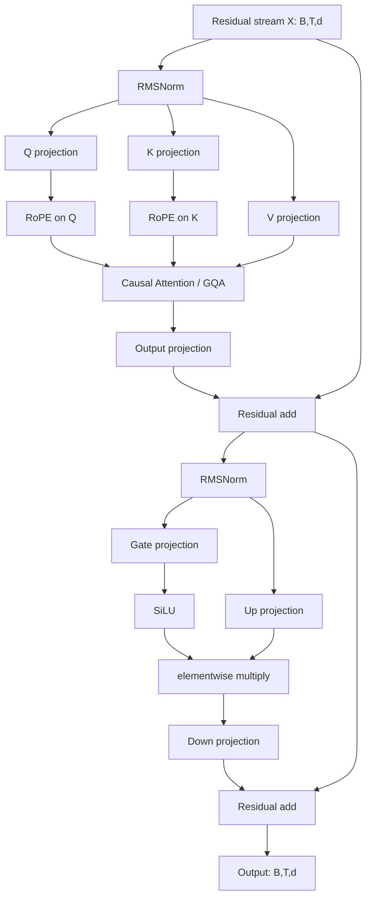

# 第四篇（Part IV）　现代 LLM Block：从张量流到 GPU——RMSNorm、RoPE、SwiGLU、GQA、MLA、KV Cache、FlashAttention 与 MoE

> **本章主线**：现代 decoder-only LLM 已经不是“把 2017 Transformer 放大”这么简单。真正决定一个模型能否训练得稳、上下文能否拉长、推理吞吐能否做高、显存能否装下足够大的 batch，往往是 **归一化、位置机制、Q/K/V 参数化、FFN 门控、KV Cache、attention kernel、稀疏专家与 serving memory manager** 共同作用的结果。
>
> 本章不按模型名字背架构表，而是从一个张量
>
> $$
> X\in\mathbb R^{B\times T\times d}
> $$
>
> 开始，一步一步追踪它如何经过现代 decoder block，并最终要求你能自己写出一个最小但结构正确的现代 LLM block。

> **证据边界**：RMSNorm、RoPE、MQA/GQA、FlashAttention、PagedAttention、DeepSeekMoE、MLA 等公开机制可以从原论文与公开实现中精确讨论。闭源前沿模型没有公开的结构细节不做反推。“现代 LLM”也不是一个唯一固定模板；dense GQA、MoE、MLA 等路线可以同时成立。

---

# 1　原始问题：Transformer 的数学形式并没有告诉你怎样造一个高效现代 LLM

2017 Transformer 给出了核心计算：

$$
\mathrm{Attention}(Q,K,V)
=
\mathrm{softmax}\left(\frac{QK^T}{\sqrt{d_h}}\right)V.
$$

但当模型变成几十层、上百层，序列长度从几百增长到数万乃至更长，并且需要在线服务大量并发请求时，会出现一系列原始论文并没有解决的问题：

```text
训练稳定性
  ├─ 深层 residual 怎样传梯度？
  ├─ normalization 放在哪里？
  └─ attention logits 会不会饱和？

表示能力
  ├─ FFN 是否还只用 ReLU？
  ├─ 位置如何表达？
  └─ 是否让不同 token 激活不同参数？

推理效率
  ├─ KV Cache 太大怎么办？
  ├─ decode 为什么 GPU 算力吃不满？
  └─ batch 为什么总被显存卡住？

长上下文
  ├─ RoPE 超过训练长度会发生什么？
  ├─ full attention 的 T² 怎么办？
  └─ “能输入 1M token”是否等于“真会使用 1M token”？

GPU 系统
  ├─ HBM 和 SRAM 的差距有多重要？
  ├─ 为什么数学完全一样，kernel 可以快几倍？
  └─ KV Cache 为什么还需要分页管理？
```

所以现代 LLM 架构必须同时从三层理解：

$$
\boxed{
\text{model function}
+
\text{memory representation}
+
\text{hardware execution}
}
$$

只看公式，会漏掉 FlashAttention、KV Cache、PagedAttention；只看 CUDA，又会漏掉 RoPE、GQA、MLA、MoE 为什么改变模型本身。

---

# 2　本章原始资料包

本章优先使用以下一手材料：

| 主题 | 一手来源 | 要回答的问题 |
|---|---|---|
| Transformer | Vaswani et al., 2017 | 原始 attention / FFN / residual 是什么 |
| RMSNorm | Zhang & Sennrich, 2019 | 为什么可以去掉 re-centering |
| MQA | Shazeer, 2019 | 为什么减少 KV heads 能加速 decode |
| SwiGLU | Shazeer, 2020 | gated FFN 为什么有效 |
| QK-Norm | Henry et al., 2020 | 为什么对 Q/K 做归一化可以控制 attention logits |
| RoPE | Su et al., 2021 | 如何让 QK 点积自然编码相对位置 |
| FlashAttention | Dao et al., 2022 | 怎样通过 IO-aware tiling 精确计算 attention |
| GQA | Ainslie et al., 2023 | 如何在 MHA 与 MQA 中折中 |
| FlashAttention-2 | Dao, 2023 | 如何进一步优化 parallelism / work partitioning |
| Mistral 7B | Jiang et al., 2023 | GQA + sliding window 的公开实例 |
| PagedAttention / vLLM | Kwon et al., 2023 | KV Cache 如何像虚拟内存一样管理 |
| DeepSeekMoE | Dai et al., 2024 | sparse experts、shared experts 与细粒度专家 |
| DeepSeek-V2 | DeepSeek-AI, 2024 | MLA 如何压缩 KV Cache |
| DeepSeek-V3 | DeepSeek-AI, 2024 | MLA + MoE 的大规模公开实例 |
| Llama 3 | Meta, 2024 | 标准 dense decoder + GQA 的公开实例 |

这一章的目标不是记住这些论文名，而是把它们放进同一个数据流。

---

# 3　先统一符号：以后所有 shape 都从这里出发

设：

- $B$：batch size；
- $T$：当前序列长度；
- $d$：model hidden dimension；
- $L$：Transformer layer 数；
- $h_q$：query head 数；
- $h_{kv}$：key/value head 数；
- $d_h$：每个 attention head 的维度；
- $d_{ff}$：FFN intermediate dimension；
- $V$：vocabulary size。

通常有：

$$
h_qd_h=d.
$$

一个 block 的输入：

$$
X:[B,T,d].
$$

最终 block 输出仍是：

$$
Y:[B,T,d].
$$

现代 block 的各种复杂设计，本质上都发生在这个接口内部。

---

# 4　先画完整数据流：一个现代 Dense Decoder Block



数学上可以压缩成：

$$
H
=
X+\mathrm{Attn}(\mathrm{Norm}(X)),
$$

$$
Y
=
H+\mathrm{FFN}(\mathrm{Norm}(H)).
$$

但后面会看到，真正的工程细节全部藏在 `Attn` 和 `FFN` 里面。

---

# 5　Residual Stream：现代 LLM 真正贯穿所有层的“主干”

把 block 写成：

$$
y=x+F(x)
$$

时，$x$ 可以沿恒等路径直接传到下一层。

这条路径非常重要：

```text
residual stream
    ├─ attention 往里面写信息
    ├─ FFN / MoE 往里面写信息
    └─ 下一层继续读取
```

从机制角度看，可以把每个 sublayer 理解成：

> 对当前 residual stream 做一次条件变换，再把“增量”写回主干。

所以现代 LLM 不是：

```text
Layer 1 完全替换表示
→ Layer 2 再完全替换
```

而更像：

```text
共享 residual state
  + attention correction
  + FFN correction
  + attention correction
  + ...
```

---

# 6　Post-Norm 与 Pre-Norm：Norm 放在哪里会改变梯度路径

Post-Norm：

$$
y=\mathrm{Norm}(x+F(x)).
$$

Pre-Norm：

$$
y=x+F(\mathrm{Norm}(x)).
$$

Pre-Norm 的 residual path 中存在非常直接的恒等映射：

$$
\frac{\partial y}{\partial x}
=
I+
\frac{\partial F(\mathrm{Norm}(x))}{\partial x}.
$$

这也是为什么深层 Transformer 中 Pre-Norm 经常表现出更好的优化稳定性。

但不要记成：

> “Pre-Norm 永远优于 Post-Norm。”

现实中还存在 residual scaling、sandwich norm、QK-Norm、DeepNorm 等不同稳定性设计。**Norm placement 是训练动力学设计，不是语法规则。**

---

# 7　LayerNorm 到 RMSNorm：究竟删掉了哪一步？

LayerNorm 对单个 token hidden vector：

$$
x\in\mathbb R^d
$$

计算：

$$
\mu
=
\frac1d\sum_{i=1}^{d}x_i,
$$

$$
\sigma^2
=
\frac1d\sum_{i=1}^{d}(x_i-\mu)^2,
$$

$$
\mathrm{LN}(x)_i
=
\gamma_i
\frac{x_i-\mu}{\sqrt{\sigma^2+\epsilon}}
+\beta_i.
$$

RMSNorm 则计算：

$$
\mathrm{RMS}(x)
=
\sqrt{
\frac1d\sum_{i=1}^{d}x_i^2
+\epsilon
},
$$

$$
\mathrm{RMSNorm}(x)_i
=
\gamma_i
\frac{x_i}{\mathrm{RMS}(x)}.
$$

它删除了显式 re-centering：

$$
x_i-\mu.
$$

RMSNorm 原论文的核心观察是：LayerNorm 的成功并不一定需要 re-centering invariance。[Zhang & Sennrich, 2019](https://arxiv.org/abs/1910.07467)

---

# 8　RMSNorm 的 shape：它不混 token，只沿最后一维归一化

输入：

```text
X [B,T,d]
```

计算均方：

```text
mean(X², dim=-1, keepdim=True)
→ [B,T,1]
```

乘逆均方根：

```text
X * rsqrt(mean(X²)+eps)
→ [B,T,d]
```

再乘可学习 scale：

```text
gamma [d]
→ broadcast
→ [B,T,d]
```

所以 RMSNorm：

- 不在 batch 维混合样本；
- 不在 sequence 维混合 token；
- 只对每个 token 自己的 hidden vector 归一化。

---

# 9　RMSNorm 最小 PyTorch 实现

```python
import torch
import torch.nn as nn

class RMSNorm(nn.Module):
    def __init__(self, dim: int, eps: float = 1e-6):
        super().__init__()
        self.weight = nn.Parameter(torch.ones(dim))
        self.eps = eps

    def forward(self, x: torch.Tensor) -> torch.Tensor:
        # x: [..., d]
        rms_inv = torch.rsqrt(x.pow(2).mean(dim=-1, keepdim=True) + self.eps)
        return x * rms_inv * self.weight
```

测试时至少检查：

```python
x = torch.randn(2, 16, 128)
y = RMSNorm(128)(x)
assert y.shape == x.shape
```

注意：生产实现可能为了数值稳定性、低精度训练和 kernel fusion 使用不同内部 dtype 或 fused kernel，但数学功能相同。

---

# 10　FFN 为什么占这么多参数？

原始 Transformer FFN：

$$
\mathrm{FFN}(x)
=
W_2\,\mathrm{ReLU}(W_1x).
$$

如果：

$$
d_{ff}=4d,
$$

则忽略 bias 后参数量约为：

$$
d\cdot4d+4d\cdot d
=8d^2.
$$

而标准 MHA 的 Q/K/V/O projection 约为：

$$
4d^2.
$$

所以经典 Transformer 中，**FFN 本来就常常比 attention projection 占更多参数**。

这也是为什么：

- 改 FFN 激活函数影响很大；
- 把 FFN 换成 MoE 可以极大增加总参数量；
- 但不必让每个 token 都计算全部参数。

---

# 11　SwiGLU：把 FFN 从单通道激活改成乘法门控

SiLU / Swish：

$$
\mathrm{SiLU}(z)=z\sigma(z).
$$

SwiGLU 常写为：

$$
G=xW_g,
$$

$$
U=xW_u,
$$

$$
H=\mathrm{SiLU}(G)\odot U,
$$

$$
Y=HW_d.
$$

shape：

```text
x       [B,T,d]
 ├─ Wg → [B,T,dff] → SiLU ─┐
 └─ Wu → [B,T,dff] ────────×
                             ↓
                         [B,T,dff]
                             ↓ Wd
                         [B,T,d]
```

GLU 变体的系统研究见 [Shazeer, 2020](https://arxiv.org/abs/2002.05202)。

与普通 ReLU FFN 相比，它引入了显式乘法交互：

> 一条支路决定 gate，另一条支路携带 value-like feature。

---

# 12　一个容易忽略的参数量问题：SwiGLU 有三块矩阵

普通 FFN 两块矩阵：

$$
2dd_{ff}.
$$

SwiGLU 三块矩阵：

$$
3dd_{ff}.
$$

如果还直接使用：

$$
d_{ff}=4d,
$$

那么参数量会变成：

$$
12d^2,
$$

明显大于经典 FFN 的：

$$
8d^2.
$$

如果希望大致保持参数量相当，可令：

$$
3d\,d_{ff}
\approx
8d^2,
$$

得到：

$$
d_{ff}
\approx
\frac{8}{3}d.
$$

实际模型通常还会根据 tensor core、并行切分或实现习惯把 intermediate size round 到方便的倍数。

这解释了为什么不能看到 `intermediate_size` 不是 $4d$ 就认为“FFN 缩小了很多”——**先看它是不是 gated FFN。**

---

# 13　SwiGLU 最小实现

```python
class SwiGLU(nn.Module):
    def __init__(self, dim: int, hidden_dim: int):
        super().__init__()
        self.gate = nn.Linear(dim, hidden_dim, bias=False)
        self.up = nn.Linear(dim, hidden_dim, bias=False)
        self.down = nn.Linear(hidden_dim, dim, bias=False)

    def forward(self, x):
        return self.down(torch.nn.functional.silu(self.gate(x)) * self.up(x))
```

数据流一定要在脑中对应：

```text
[B,T,d]
   ↓ gate / up
两个 [B,T,dff]
   ↓ elementwise ×
[B,T,dff]
   ↓ down
[B,T,d]
```

---

# 14　Attention Projection：先别急着算 softmax，先看 Q/K/V 到底有多大

对输入：

$$
X:[B,T,d],
$$

Query projection：

$$
W_Q:\mathbb R^d\rightarrow\mathbb R^{h_qd_h}.
$$

因此：

$$
Q:[B,T,h_qd_h]
\rightarrow
[B,h_q,T,d_h].
$$

如果是 GQA，K/V 不再必须有 $h_q$ 个 heads：

$$
W_K,W_V:
\mathbb R^d
\rightarrow
\mathbb R^{h_{kv}d_h}.
$$

所以：

```text
Q [B,hq, T,dh]
K [B,hkv,T,dh]
V [B,hkv,T,dh]
```

这是理解 MHA、MQA、GQA、KV Cache 的起点。

---

# 15　位置编码真正要解决什么？

单纯的内容点积：

$$
q_i^Tk_j
$$

并不知道：

- $i$ 是第几个 token；
- $j$ 是第几个 token；
- $i$ 和 $j$ 相隔多远。

如果把输入 token 任意置换，而没有任何位置机制，self-attention 本身无法区分很多排列关系。

因此必须向网络注入顺序。

RoPE 的巧妙之处在于：

> 不直接把 position embedding 加到 residual stream，而是对 Q/K 做与位置相关的旋转，让最终点积天然含有相对位移。

[Su et al., 2021](https://arxiv.org/abs/2104.09864)

---

# 16　RoPE 二维推导：先把位置看成旋转角

二维旋转矩阵：

$$
R(\phi)
=
\begin{bmatrix}
\cos\phi & -\sin\phi\\
\sin\phi & \cos\phi
\end{bmatrix}.
$$

位置 $m$ 的 query：

$$
q'_m=R(m\omega)q_m.
$$

位置 $n$ 的 key：

$$
k'_n=R(n\omega)k_n.
$$

点积：

$$
(q'_m)^Tk'_n
=
q_m^TR(m\omega)^TR(n\omega)k_n.
$$

旋转矩阵满足：

$$
R(a)^TR(b)=R(b-a).
$$

于是：

$$
(q'_m)^Tk'_n
=
q_m^TR((n-m)\omega)k_n.
$$

最终只出现：

$$
n-m.
$$

这就是 RoPE 的核心性质：

> 用绝对位置驱动旋转，但在 QK 点积中自然形成相对位置依赖。

---

# 17　高维 RoPE：把 head dimension 两两配对

设：

$$
d_h=128.
$$

可以把维度组织成 64 个二维平面：

```text
(x0,x1)
(x2,x3)
...
(x126,x127)
```

第 $j$ 对使用频率：

$$
\omega_j
=
\theta_{base}^{-2j/d_h}.
$$

位置 $m$ 的角度：

$$
\phi_{m,j}=m\omega_j.
$$

不同 pair 使用不同频率，因此同时具有短周期与长周期位置变化。

---

# 18　RoPE 的最小张量实现

下面使用 even/odd 配对的教学写法：

```python
def apply_rope(x, cos, sin):
    # x:   [B,H,T,D]
    # cos: [1,1,T,D/2]
    # sin: [1,1,T,D/2]
    x_even = x[..., 0::2]
    x_odd = x[..., 1::2]

    y_even = x_even * cos - x_odd * sin
    y_odd = x_even * sin + x_odd * cos

    y = torch.stack((y_even, y_odd), dim=-1)
    return y.flatten(-2)
```

这里最重要的不是背代码，而是知道：

```text
RoPE 不改变 shape
Q [B,H,T,D] → [B,H,T,D]
K [B,H,T,D] → [B,H,T,D]
```

不同公开实现可能采用不同维度排列 convention，因此从 checkpoint 搬权重时必须匹配原模型实现，不能只凭“都叫 RoPE”就互换。

---

# 19　长上下文：为什么只把 max_position_embeddings 改大通常不够？

假设训练主要见过：

$$
0\le m\lt4096.
$$

现在直接测试：

$$
m=100000.
$$

RoPE 相位进入模型几乎没有训练过的区域。

所以出现了多种 context extension 方法：

- Position Interpolation；
- NTK-aware / dynamic scaling 类方法；
- YaRN；
- LongRoPE；
- 继续长上下文训练。

它们虽然细节不同，但都在处理：

> 怎样重新映射位置或频率，让模型在扩大位置范围后仍能工作？

Position Interpolation：[Chen et al., 2023](https://arxiv.org/abs/2306.15595)

YaRN：[Peng et al., 2023](https://arxiv.org/abs/2309.00071)

必须区分：

$$
\text{API accepts long input}
\neq
\text{effective long-context reasoning}.
$$

真正的长上下文评测还要看：

- 训练长度；
- position scaling；
- retrieval accuracy；
- long-range dependency；
- distractor robustness；
- latency；
- KV memory；
- attention compute。

---

# 20　MHA、MQA、GQA：真正差别首先在 KV heads

## Multi-Head Attention

```text
Q heads : hq
K heads : hq
V heads : hq
```

即：

$$
h_{kv}=h_q.
$$

## Multi-Query Attention

```text
Q heads : hq
K heads : 1
V heads : 1
```

即：

$$
h_{kv}=1.
$$

MQA 由 Shazeer 在快速 Transformer decoding 工作中系统提出。[Shazeer, 2019](https://arxiv.org/abs/1911.02150)

## Grouped-Query Attention

```text
Q heads : hq
K heads : hkv
V heads : hkv
```

满足：

$$
1\lt h_{kv}\lt h_q.
$$

[Ainslie et al., 2023](https://arxiv.org/abs/2305.13245)

例如：

```text
hq  = 32
hkv = 8

每 4 个 query heads 共用一组 K/V
```

Meta 在 Llama 3 的公开说明中也明确采用 GQA 来提高推理效率。

---

# 21　GQA 不只是“cache 小”：Q/K/V projection 参数量也会改变

若：

$$
h_qd_h=d,
$$

则：

$$
W_Q:\ d\times d.
$$

K/V projection 大小：

$$
W_K,W_V:\ d\times(h_{kv}d_h).
$$

Output projection：

$$
W_O:\ d\times d.
$$

所以 attention projection 参数量约为：

$$
2d^2+2d(h_{kv}d_h).
$$

MHA 时：

$$
h_{kv}d_h=d,
$$

得到：

$$
4d^2.
$$

GQA 减少 $h_{kv}$ 后，K/V projection 参数也会减少。

---

# 22　GQA 的“共享”在 toy code 里可以 repeat，但生产 kernel 不应该真的复制 cache

教学实现常这样做：

```python
def repeat_kv(x, n_rep):
    # x: [B,Hkv,T,D]
    return x.repeat_interleave(n_rep, dim=1)
```

如果：

```text
K [B,8,T,128]
```

重复 4 次后逻辑上变成：

```text
[B,32,T,128]
```

然后可以和 32 个 query heads 一一做 attention。

但要明确：

> **这只是教学上的逻辑展开。**

高效 GQA kernel 会让多个 Q heads 直接读取共享的 K/V head，而不是把 K/V Cache 真正物理复制成 4 份，否则就失去了节省内存带宽的意义。

---

# 23　KV Cache：为什么历史 K/V 可以复用？

考虑 causal decoder。

在第 $t$ 个生成步骤，新 token 到来时：

$$
q_t,k_t,v_t
$$

需要计算。

但是旧 token $j\lt t$ 的：

$$
k_j,v_j
$$

由旧 hidden state 已经决定，不会因为未来 token 出现而改变。

因此可以缓存：

$$
K_{1:t-1},V_{1:t-1}.
$$

新一步只做：

```text
new token
  ↓
Q_t, K_t, V_t
  ↓
append K_t/V_t to cache
  ↓
Q_t attends to cached K_1:t / V_1:t
```

如果没有 cache，每一步都要重新算历史 token 的 K/V，浪费巨大。

---

# 24　KV Cache 的标准 shape

每一层常可抽象为：

```text
K cache [B,hkv,T,dh]
V cache [B,hkv,T,dh]
```

于是全部 $L$ 层的元素数量约：

$$
N_{KV}
=
2BLTh_{kv}d_h.
$$

若每个元素占 $s$ bytes：

$$
M_{KV}
=
2BLTh_{kv}d_hs.
$$

这条公式极其重要。

MHA：

$$
h_{kv}=h_q,
$$

GQA：

$$
h_{kv}\ll h_q,
$$

MQA：

$$
h_{kv}=1.
$$

因此 GQA/MQA 的关键系统收益可以直接从这个公式看出来。

---

# 25　KV Cache 手算：为什么长上下文时它能吃掉大量显存

假设：

$$
B=1,
\quad
L=32,
\quad
T=32768,
\quad
d_h=128,
$$

BF16：

$$
s=2\text{ bytes}.
$$

### MHA：$h_{kv}=32$

$$
M_{KV}
=
2\times1\times32\times32768\times32\times128\times2.
$$

约为：

$$
17.18\times10^9\text{ bytes}
\approx16\text{ GiB}.
$$

### GQA：$h_{kv}=8$

只有 MHA 的四分之一：

$$
\approx4\text{ GiB}.
$$

### MQA：$h_{kv}=1$

约：

$$
0.5\text{ GiB}.
$$

这只是单个请求、单 batch 的理论 cache，不包含模型权重、activation workspace、allocator overhead 等其他显存。

现在就能直观看出：

> **为什么 KV architecture 会直接决定 serving 最大并发。**

---

# 26　Prefill 与 Decode：同一个 Transformer，硬件行为完全不同

LLM inference 应该拆成两个阶段。

## Prefill

输入整个 prompt：

```text
T 个 prompt tokens
↓
一次并行前向
↓
建立全部层的 KV Cache
```

特点：

- 大矩阵乘法多；
- token 并行度高；
- full attention 需要处理大量 QK pair；
- 更容易得到较高 GPU compute utilization。

## Decode

每一步通常只有一个新 token：

```text
1 new token
↓
遍历全部层
↓
读大量模型权重 + 历史 KV
↓
生成 1 token
```

特点：

- 单步 token 数非常少；
- 要反复读大模型权重；
- 要读取不断增长的 KV Cache；
- 很容易变成 memory-bandwidth bound。

这就是为什么“训练很快的 kernel”不一定等价于“decode 很快”。

---

# 27　为什么 Decode 常常是内存带宽问题？

假设一个线性层：

$$
y=xW.
$$

训练/prefill 时有很多 token：

$$
X:[N,d],
$$

一次 GEMM 可以复用读取进来的 $W$。

但单请求 decode 时近似：

$$
x:[1,d].
$$

每生成一个 token 都必须再次读取很大的权重矩阵。

于是每字节数据对应的 FLOPs 数量下降，arithmetic intensity 低。

Roofline 模型的直觉是：

$$
\text{performance}
\le
\min(
\text{peak FLOPs},
\text{bandwidth}\times\text{arithmetic intensity}
).
$$

当 arithmetic intensity 太低时，再多 Tensor Core 峰值也救不了，瓶颈会落在 HBM bandwidth。

所以：

- quantization 减少读取字节；
- GQA/MLA 减少 KV 字节；
- batching 提高权重复用；
- speculative decoding 增加每轮有效 token；

都可能直接改善 decode 吞吐。

---

# 28　FlashAttention：数学没变，但 IO schedule 完全变了

标准 attention：

$$
S=QK^T,
$$

$$
P=\mathrm{softmax}(S),
$$

$$
O=PV.
$$

朴素实现可能 materialize：

$$
S,P\in\mathbb R^{T\times T}
$$

并多次在 HBM 中读写。

FlashAttention 的关键思想：

> 把 Q/K/V 分块搬入更快但容量更小的片上 SRAM，块内计算 score、softmax 与 output accumulation，避免完整 attention matrix 反复落到 HBM。

[Dao et al., 2022](https://arxiv.org/abs/2205.14135)

```text
Naive
Q,K
 ↓
S = QKᵀ
 ↓ write HBM
read S
 ↓ softmax
P
 ↓ write HBM
read P,V
 ↓
O

FlashAttention
Q/K/V tiles
 ↓ SRAM
score tile
 ↓ online softmax
partial O
 ↓ accumulate
final O
```

最重要的一句话：

> **FlashAttention 不是稀疏 attention，也不是近似 attention。它主要是在数值等价意义下重排精确 attention 的 IO。**

---

# 29　Online Softmax：为什么不保存整行也能得到正确结果？

一行 score：

$$
s_1,\ldots,s_T.
$$

稳定 softmax 使用：

$$
m=\max_j s_j,
$$

$$
l=\sum_j e^{s_j-m}.
$$

输出：

$$
o
=
\frac{
\sum_j e^{s_j-m}v_j
}{l}.
$$

现在分块处理。

假设旧块维护：

- running max $m_{old}$；
- running denominator $l_{old}$；
- running numerator $o_{old}$。

新块最大值为 $m_{blk}$，先更新：

$$
m_{new}
=
\max(m_{old},m_{blk}).
$$

旧统计量需要重缩放：

$$
l_{new}
=
e^{m_{old}-m_{new}}l_{old}
+
\sum_{j\in blk}e^{s_j-m_{new}}.
$$

numerator 同理：

$$
o_{new}
=
e^{m_{old}-m_{new}}o_{old}
+
\sum_{j\in blk}e^{s_j-m_{new}}v_j.
$$

最终：

$$
\mathrm{output}
=
\frac{o_{final}}{l_{final}}.
$$

这就是 online softmax 能够分块流式执行的数学基础。

---

# 30　FlashAttention-2：同一个 IO-aware 思路还可以继续优化线程分工

FlashAttention-2 并不是简单改个版本号。

它继续从 GPU 执行结构上优化：

- 减少 non-matmul FLOPs；
- 增加 thread block parallelism；
- 改善 warp 之间的 work partitioning；
- 减少 shared-memory communication。

原论文：[Dao, 2023](https://arxiv.org/abs/2307.08691)

这再次说明：

$$
\text{same high-level equation}
\neq
\text{same kernel efficiency}.
$$

理解前沿 LLM 系统时，不能只停在 Python 层。

---

# 31　FlashAttention、KV Cache、PagedAttention 是三件不同的事

它们经常被初学者混在一起。

## FlashAttention

解决：

> **一个 attention operator 内部怎样减少 HBM IO？**

核心：tiling + online softmax + kernel scheduling。

## KV Cache

解决：

> **autoregressive decode 时怎样不重复计算历史 K/V？**

核心：保存历史层级状态。

## PagedAttention

解决：

> **大量并发请求的动态 KV Cache 怎样高效分配 GPU 显存？**

核心：把逻辑连续的 KV Cache 映射到非连续的物理 block，类似虚拟内存分页。

三者作用层级不同：

```text
FlashAttention → operator execution
KV Cache       → autoregressive reuse
PagedAttention → serving memory management
```

---

# 32　PagedAttention：为什么一个 cache 还需要“操作系统式分页”？

真实在线请求长度不同：

```text
request A: prompt 120 tokens, output 300
request B: prompt 3000 tokens, output 20
request C: prompt 900 tokens, output still growing
```

如果提前为每个请求分配最大连续 KV buffer，会出现：

- internal fragmentation；
- external fragmentation；
- 过度预留；
- batch size 被显存浪费限制。

vLLM 的 PagedAttention 把 KV Cache 划分为固定大小 block：

```text
logical KV blocks
0 → physical block 17
1 → physical block  3
2 → physical block 21
...
```

逻辑 token 顺序保持连续，但物理显存不要求连续。

原论文：[Kwon et al., 2023](https://arxiv.org/abs/2309.06180)

这是一个非常典型的例子：

> **LLM serving 开始借鉴操作系统的虚拟内存思想。**

---

# 33　FlashAttention 不会把 full attention 的计算复杂度从平方变成线性

full attention 仍需处理所有 query-key pairs：

$$
O(T^2).
$$

FlashAttention 可以大幅降低中间显存与 IO，却不会凭空删除这些 pair。

所以超长上下文继续推动：

- sliding-window attention；
- block sparse attention；
- retrieval；
- compressed / latent memory；
- recurrent / state-space hybrids；
- hierarchy。

这也是为什么：

> “用了 FlashAttention”不能回答“1M context 为什么算得动”。

---

# 34　Sliding Window Attention：把单层通信范围限制为窗口 $w$

如果每个 token 只看最近 $w$ 个 token：

$$
O(T^2)
\rightarrow
O(Tw).
$$

当：

$$
w\ll T,
$$

计算量可以显著降低。

Mistral 7B 是公开使用 sliding-window attention 与 GQA 的代表工作之一。[Jiang et al., 2023](https://arxiv.org/abs/2310.06825)

代价是：

> 单层中远距离 token 不能直接建立 attention edge。

多层可以扩大 effective receptive field，但它和单层 full attention 并不数学等价。

---

# 35　MLA：为什么不只是“把 KV heads 继续减少”？

GQA 的思路是：

> 减少 K/V heads 数量。

MLA（Multi-head Latent Attention）的思路进一步变成：

> **不缓存完整 K/V 表示，而是缓存一个低维联合 latent representation。**

DeepSeek-V2 定义：

$$
c_t^{KV}
=
W^{DKV}h_t,
$$

其中：

$$
c_t^{KV}\in\mathbb R^{d_c},
\qquad
d_c\ll h_qd_h.
$$

再从 latent 上投影出内容 key/value：

$$
k_t^C=W^{UK}c_t^{KV},
$$

$$
v_t^C=W^{UV}c_t^{KV}.
$$

最关键的是：推理时不必缓存完整 $k_t^C,v_t^C$，而可以缓存：

$$
c_t^{KV}.
$$

原始 MLA 机制：[DeepSeek-V2, 2024](https://arxiv.org/abs/2405.04434)

---

# 36　MLA 的 cache 公式：从“每 head 的 K/V”变成“共享 latent + positional key”

MHA 每 token、每层 cache 元素约：

$$
2h_qd_h.
$$

GQA：

$$
2h_{kv}d_h.
$$

DeepSeek-V2 MLA 还需要一个独立承载 RoPE 的 key 分量，所以每 token、每层 cache 近似：

$$
d_c+d_h^R.
$$

其中：

- $d_c$：KV compression latent dimension；
- $d_h^R$：decoupled RoPE key dimension。

因此 MLA 的优化对象已经不是简单的：

$$
h_{kv}.
$$

而是直接重新设计：

> **cache 中究竟应该保存什么状态。**

---

# 37　为什么 MLA 要做 Decoupled RoPE？

如果直接对低秩恢复后的 content key 使用 RoPE：

$$
k_t^C=W^{UK}c_t^{KV},
$$

随后再做位置相关旋转，那么 $W^{UK}$ 与位置算子耦合。

这会破坏一个重要的 inference 优化：

> 把某些 up-projection 吸收到其它线性投影中，避免每步显式恢复完整 K/V。

DeepSeek-V2 因此把位置部分拆出来：

```text
content path
c_KV → compressed content representation

position path
hidden → small RoPE key
```

最终每个 head 的 key 可以看成：

$$
k_{t,i}
=
[k_{t,i}^C;k_t^R].
$$

query 同样包含 content 与 RoPE 部分。

于是：

- content 可以继续做低秩 cache；
- position information 由独立的小维度路径携带。

这是一种很典型的 **model-system co-design**：

> 架构不是只为表达能力设计，还为了让 inference 代数重排成立。

---

# 38　从 GQA 到 MLA：真正应该比较的是“每 token 要保存多少状态”

可以把 attention cache 路线写成：

```text
MHA
每个 Q head 都有独立 K/V
      ↓
MQA / GQA
多个 Q head 共享 K/V
      ↓
MLA
K/V 先进入共享低维 latent
cache latent，而不是完整 K/V
```

因此不要只问：

> “哪一个 attention 更先进？”

应该问：

1. 每 token、每层要缓存多少元素？
2. decode 时每步要读取多少字节？
3. 是否需要重构 K/V？
4. 能否做权重吸收 / kernel fusion？
5. 表达能力与训练稳定性有什么代价？
6. 目标硬件上实际吞吐如何？

---

# 39　MoE：为什么可以把“总参数量”和“每 token 计算量”部分解耦？

Dense FFN：

```text
每个 token
↓
同一个 FFN
↓
所有 FFN 参数都参与计算
```

Mixture-of-Experts：

```text
每个 token
↓
router
↓
选择少数 experts
↓
只计算被选中的 experts
```

设共有 $E$ 个 experts：

$$
E_1,\ldots,E_E.
$$

router 输出 logits：

$$
g(x)=W_rx\in\mathbb R^E.
$$

选 top-$k$ experts：

$$
\mathcal S(x)=\mathrm{TopK}(g(x),k).
$$

输出：

$$
y
=
\sum_{i\in\mathcal S(x)}
\alpha_i(x)E_i(x).
$$

因此可以做到：

$$
\text{total parameters}
\gg
\text{activated parameters per token}.
$$

Switch Transformer 是 sparse MoE 大规模化的代表工作之一。[Fedus et al., 2021](https://arxiv.org/abs/2101.03961)

---

# 40　MoE 的最小 Router 数据流

设：

```text
X [B,T,d]
```

先 flatten token：

```text
Xf [N,d]
N = B*T
```

router：

```text
router logits [N,E]
```

top-k：

```text
expert_ids     [N,k]
expert_weights [N,k]
```

之后执行 token dispatch：

```text
token 0 → expert 3, expert 7
token 1 → expert 2, expert 7
token 2 → expert 3, expert 5
...
```

expert 输出再按 gate weight 聚合回原 token。

最小教学伪代码：

```python
logits = router(x_flat)              # [N,E]
topv, topi = logits.topk(k, dim=-1)  # [N,k]
weights = topv.softmax(dim=-1)

out = torch.zeros_like(x_flat)

for e, expert in enumerate(experts):
    token_idx, slot_idx = torch.where(topi == e)
    if token_idx.numel() == 0:
        continue

    y_e = expert(x_flat[token_idx])
    w_e = weights[token_idx, slot_idx].unsqueeze(-1)
    out.index_add_(0, token_idx, y_e * w_e)
```

这个实现很慢，但它把 **router → dispatch → expert compute → combine** 的机制说清楚了。

---

# 41　MoE 真正难的地方不是 top-k，而是系统通信

如果 experts 分布在不同 GPU：

```text
GPU0 tokens
  ├─ expert on GPU0
  ├─ expert on GPU3
  └─ expert on GPU6
```

那么路由之后通常需要大规模 token exchange。

典型瓶颈包括：

- all-to-all communication；
- expert load imbalance；
- hot experts；
- token dropping / capacity；
- small GEMM；
- communication-computation overlap；
- expert parallel placement。

所以 MoE 的“每 token FLOPs 少”不自动意味着 wall-clock 一定快。

必须区分：

$$
\text{algorithmic FLOPs}
\neq
\text{distributed execution cost}.
$$

---

# 42　DeepSeekMoE：为什么要区分 Shared Experts 与 Routed Experts？

DeepSeekMoE 的两个核心设计之一，是把部分知识放入 shared experts，其余由 routed experts 专门化。[Dai et al., 2024](https://arxiv.org/abs/2401.06066)

抽象地：

```text
                 ┌─ shared expert(s) ─┐
input token ─────┤                    ├─ combine
                 └─ routed experts ───┘
```

直觉：

- shared experts 承担更通用、重复的能力；
- routed experts 更有空间产生 specialization。

DeepSeekMoE 还把专家做得更细粒度，以便一个 token 能组合更灵活的专家子集。

这和 MLA 一样，说明现代架构优化常常不是只改一个公式，而是在重新决定：

> **什么信息共享、什么参数条件激活、什么状态需要长期保存。**

---

# 43　Dense GQA 家族与 MLA-MoE 家族：现代 LLM 并不存在唯一标准 block

可以粗略画成两条常见路线。

## Dense decoder 路线

```text
RMSNorm
 ↓
GQA + RoPE
 ↓
residual
 ↓
RMSNorm
 ↓
SwiGLU
 ↓
residual
```

公开例子包括 Llama 3 这类相对标准的 decoder-only Transformer。

## MLA + MoE 路线

```text
RMSNorm
 ↓
MLA + decoupled RoPE
 ↓
residual
 ↓
RMSNorm
 ↓
shared + routed experts
 ↓
residual
```

DeepSeek-V2/V3 是公开代表。

因此以后看一个模型架构时，不能再只问：

> “它是不是 Transformer？”

更应该逐模块问：

```text
Norm 是什么？
Position mechanism 是什么？
Q heads / KV heads 是多少？
Cache 保存什么？
Attention kernel 是什么？
FFN 是 dense 还是 MoE？
MoE top-k / shared experts 怎么做？
Prefill / decode 怎么执行？
```

---

# 44　完整 Shape 追踪：一个 GQA Dense Block

设：

$$
B=2,
\quad
T=4096,
\quad
d=4096,
$$

$$
h_q=32,
\quad
h_{kv}=8,
\quad
d_h=128,
$$

$$
d_{ff}=11008.
$$

输入：

```text
X [2,4096,4096]
```

RMSNorm：

```text
Xn [2,4096,4096]
```

Q：

```text
[2,4096,4096]
→ reshape
[2,32,4096,128]
```

K/V：

```text
[2,4096,1024]
→ reshape
[2,8,4096,128]
```

RoPE：

```text
Q [2,32,4096,128]
K [2, 8,4096,128]
```

逻辑 GQA：

```text
4 Q heads / KV head
```

attention output：

```text
[2,32,4096,128]
```

concat：

```text
[2,4096,4096]
```

output projection：

```text
[2,4096,4096]
```

residual add：

```text
H [2,4096,4096]
```

第二个 RMSNorm：

```text
Hn [2,4096,4096]
```

SwiGLU：

```text
gate [2,4096,11008]
up   [2,4096,11008]
  ↓ multiply
a    [2,4096,11008]
  ↓ down
ffn  [2,4096,4096]
```

最终 residual：

```text
Y [2,4096,4096]
```

block 外部 shape 从头到尾没变：

$$
[B,T,d]
\rightarrow
[B,T,d].
$$

但内部计算与内存行为已经完全不同于 2017 的朴素 Transformer。

---

# 45　参数量快速估算：先学会不用代码看 config

## GQA Attention

$$
N_{attn}
\approx
2d^2+2d(h_{kv}d_h).
$$

## SwiGLU

$$
N_{ffn}
\approx
3dd_{ff}.
$$

## RMSNorm

每个 norm 只有大约：

$$
d
$$

个 scale 参数，和 $d^2$ 级别矩阵相比很小。

如果有 $L$ 层，可粗略估计：

$$
N_{layers}
\approx
L(N_{attn}+N_{ffn}).
$$

再加：

- token embedding；
- LM head；
- 可能的 weight tying；
- bias / router / experts；
- 其它特殊模块。

看到一个 `config.json` 时，应该能先手算出大致参数规模，再用代码验证。

---

# 46　最小 GQA Attention：教学参考实现

下面代码故意不用 FlashAttention，让数据流完全可见。

```python
import math
import torch
import torch.nn as nn

class NaiveGQA(nn.Module):
    def __init__(self, dim: int, n_heads: int, n_kv_heads: int):
        super().__init__()
        assert dim % n_heads == 0
        assert n_heads % n_kv_heads == 0

        self.dim = dim
        self.n_heads = n_heads
        self.n_kv_heads = n_kv_heads
        self.head_dim = dim // n_heads
        self.n_rep = n_heads // n_kv_heads

        self.q_proj = nn.Linear(dim, n_heads * self.head_dim, bias=False)
        self.k_proj = nn.Linear(dim, n_kv_heads * self.head_dim, bias=False)
        self.v_proj = nn.Linear(dim, n_kv_heads * self.head_dim, bias=False)
        self.o_proj = nn.Linear(dim, dim, bias=False)

    def forward(self, x):
        B, T, D = x.shape

        q = self.q_proj(x).view(B, T, self.n_heads, self.head_dim).transpose(1, 2)
        k = self.k_proj(x).view(B, T, self.n_kv_heads, self.head_dim).transpose(1, 2)
        v = self.v_proj(x).view(B, T, self.n_kv_heads, self.head_dim).transpose(1, 2)

        # 教学用逻辑展开；高效 kernel 不应真的物理复制 KV cache。
        k = k.repeat_interleave(self.n_rep, dim=1)
        v = v.repeat_interleave(self.n_rep, dim=1)

        scores = torch.matmul(q, k.transpose(-2, -1)) / math.sqrt(self.head_dim)

        causal = torch.triu(
            torch.ones(T, T, dtype=torch.bool, device=x.device),
            diagonal=1,
        )
        scores = scores.masked_fill(causal, float("-inf"))

        probs = torch.softmax(scores, dim=-1)
        out = torch.matmul(probs, v)

        out = out.transpose(1, 2).contiguous().view(B, T, D)
        return self.o_proj(out)
```

下一步只要在 Q/K 上插入 RoPE，就已经接近一个现代 dense attention reference implementation。

---

# 47　把 RMSNorm + GQA + SwiGLU 拼成最小现代 Decoder Block

```python
class DecoderBlock(nn.Module):
    def __init__(self, dim, n_heads, n_kv_heads, hidden_dim):
        super().__init__()
        self.attn_norm = RMSNorm(dim)
        self.attn = NaiveGQA(dim, n_heads, n_kv_heads)
        self.ffn_norm = RMSNorm(dim)
        self.ffn = SwiGLU(dim, hidden_dim)

    def forward(self, x):
        x = x + self.attn(self.attn_norm(x))
        x = x + self.ffn(self.ffn_norm(x))
        return x
```

这几行代码非常重要，因为它把大量模型名还原成同一个机制骨架：

```text
residual stream
  ↓ normalize
attention correction
  ↓ add
residual stream
  ↓ normalize
FFN correction
  ↓ add
residual stream
```

生产模型会再加入：

- RoPE；
- KV Cache；
- efficient GQA kernel；
- fused RMSNorm；
- FlashAttention / SDPA；
- tensor parallel；
- quantization；
- checkpointing；
- MoE / MLA 等。

但骨架已经在这里。

---

# 48　从“能跑”到“正确”：最小 Block 至少要做哪些单元测试？

## Shape test

```python
x = torch.randn(2, 128, 512)
block = DecoderBlock(512, 8, 2, 1365)
y = block(x)
assert y.shape == x.shape
```

## Causal test

改变未来 token：

```text
position > t
```

不应该改变位置 $t$ 的输出。

## GQA equivalence test

用显式 `repeat_interleave` reference 与一个不复制 KV 的 optimized implementation 对比数值。

## RoPE test

二维 toy case 手算旋转结果，与实现输出对齐。

## Cache equivalence test

比较：

```text
full-prefix forward
```

与：

```text
prefill + token-by-token cached decode
```

对应位置 logits 应在数值误差范围内一致。

## FlashAttention equivalence test

同一 Q/K/V：

```text
naive attention
vs
FlashAttention / SDPA
```

在允许的浮点误差内一致。

这一步非常关键：

> **系统优化必须先证明没有偷偷改变模型语义。**

---

# 49　真正实现 KV Cache 时，数据流会怎样变化？

训练 reference attention：

```text
X [B,T,d]
↓
Q,K,V for all T
↓
causal attention
```

cached decode 第 $t$ 步：

```text
x_t [B,1,d]
↓
q_t [B,hq,1,dh]
k_t [B,hkv,1,dh]
v_t [B,hkv,1,dh]
↓
append cache
K_cache [B,hkv,t,dh]
V_cache [B,hkv,t,dh]
↓
q_t attends to entire cache
↓
out_t [B,1,d]
```

注意：

- query 不需要缓存；
- K/V 需要逐层缓存；
- cache length 每生成一个 token 增加 1；
- positional index 必须使用真实绝对 decode position，而不能每步都从 0 开始做 RoPE。

这是手写 generation 时最容易犯的 bug 之一。

---

# 50　QK-Norm：为什么 attention logits 也可能需要稳定化？

标准 attention score：

$$
s_{ij}
=
\frac{q_i^Tk_j}{\sqrt{d_h}}.
$$

如果 Q/K norm 变得很大，logit magnitude 会增大，softmax 可能高度饱和。

QK normalization 的一类思路是先对 query/key 做归一化，再控制 attention scale。[Henry et al., 2020](https://arxiv.org/abs/2010.04245)

抽象写成：

$$
\hat q
=
\frac{q}{\|q\|},
\qquad
\hat k
=
\frac{k}{\|k\|},
$$

$$
s
=
\alpha\hat q^T\hat k.
$$

现代模型中具体 QK normalization 形式可能不同，因此阅读 config / code 时必须看真实实现，而不能只根据名字推断。

它说明一个更一般的原则：

> 训练规模增大以后，稳定性设计会从 residual stream 一直深入到 attention score 本身。

---

# 51　训练时的 Attention 与推理时的 Attention：不要把 kernel 路径混为一谈

训练：

```text
Q,K,V 都覆盖整个 sequence
需要 backward
通常不使用 inference KV cache
可能使用 FlashAttention + recomputation/checkpointing
```

Prefill：

```text
整段 prompt 一次 forward
不 backward
建立 KV cache
```

Decode：

```text
每步少量新 token
读取历史 KV
不 backward
极度关注 latency / bandwidth
```

同一个模型甚至可能在三种阶段调用不同 kernel。

所以看到 benchmark 时必须问：

> 测的是 training throughput、prefill throughput，还是 decode tokens/s？

这三种数字不能直接互换。

---

# 52　现代架构优化可以分成五层，而不是一个“大杂烩技巧表”

## 52.1　训练稳定性

- Pre-Norm / norm placement；
- RMSNorm；
- QK-Norm；
- initialization；
- residual scaling。

## 52.2　表示与条件计算

- SwiGLU；
- MoE；
- shared / routed experts；
- routing。

## 52.3　位置与长上下文

- RoPE；
- RoPE scaling；
- sliding / sparse attention；
- retrieval / hierarchy。

## 52.4　推理状态压缩

- MQA；
- GQA；
- MLA；
- KV quantization / compression。

## 52.5　硬件与 serving

- FlashAttention；
- fused kernels；
- PagedAttention；
- continuous batching；
- quantization；
- speculative decoding。

这套分类的价值在于：

> 不再把“模型能力创新”和“系统效率创新”混成一件事。

---

# 53　最常见的十个误解

## 误解 1：FlashAttention 是近似 attention

错。它的核心目标是 exact attention 的 IO-aware 实现。

## 误解 2：用了 KV Cache 就把 attention 复杂度变成 O(1)

错。历史 K/V 不需要重算，但新 query 仍要读取并关注历史 cache。

## 误解 3：GQA 就是把 K/V tensor repeat 几次

错。repeat 是教学 reference；高效 kernel 的重点恰恰是不做物理复制。

## 误解 4：支持 1M token 就代表 1M token 全部有效

错。API 长度、训练长度、有效信息利用能力、算力成本是四件不同的事。

## 误解 5：MoE 的总参数越大，每 token FLOPs 就越大

错。MoE 正是在尝试把总参数与 activated compute 解耦。

## 误解 6：MoE FLOPs 少，所以一定延迟低

错。通信、routing、负载不均和 small GEMM 都可能成为瓶颈。

## 误解 7：MLA 只是 GQA 的另一种名字

错。MLA 改的是 cache representation，本质是 low-rank latent compression。

## 误解 8：RMSNorm 只是为了少一次减法，所以影响很小

不完整。它改变了 normalization 定义；速度只是其中一个维度。

## 误解 9：SwiGLU 的 hidden size 应该照搬 4d

错。因为它有三块 projection，参数量预算不同。

## 误解 10：所有“Transformer block”都可以只看 config 猜实现

错。真正行为还取决于：

- tensor layout；
- RoPE convention；
- cache layout；
- fused kernel；
- parallelism；
- quantization；
- serving runtime。

---

# 54　怎样读一个真实开源 LLM 的代码？

以后拿到任何模型仓库，按以下顺序读，而不是从 `generate()` 一头扎进去。

```text
config
  ↓
hidden size / layers / heads / kv heads / intermediate size
  ↓
model embedding
  ↓
decoder layer
  ├─ norm
  ├─ attention
  │   ├─ q/k/v projections
  │   ├─ RoPE
  │   ├─ cache update
  │   └─ attention kernel
  └─ FFN / MoE
      ├─ router
      └─ experts
  ↓
final norm
  ↓
lm head
```

同时画 shape：

```text
input_ids [B,T]
↓ embedding
hidden [B,T,d]
↓ layer 0
hidden [B,T,d]
...
↓ final norm
hidden [B,T,d]
↓ lm head
logits [B,T,V]
```

只要这条主线清楚，任何复杂优化都只是其中某一个局部模块。

---

# 55　最小复现实验 A：自己证明 GQA 真的减少 KV Cache

固定：

```text
L = 32
d = 4096
hq = 32
dh = 128
T = 32768
BF16
```

只改变：

```text
hkv = 32, 16, 8, 4, 1
```

计算：

$$
M_{KV}=2BLTh_{kv}d_hs.
$$

画：

```text
x: hkv
y: KV cache GiB
```

你会得到严格线性关系。

然后再问：

> 参数量、质量和 decode kernel throughput 是否也线性变化？

答案通常不是。

---

# 56　最小复现实验 B：Naive Attention vs SDPA / FlashAttention

固定：

- $B$；
- $H$；
- $d_h$；
- dtype；
- hardware。

逐渐增加：

$$
T=512,1024,2048,4096,8192,\ldots
$$

测量：

- runtime；
- peak memory；
- forward numerical error；
- backward numerical error（训练实验）。

目标不是得到某个固定倍数，而是验证：

> 当 $T$ 增大时，避免 materialize 大型 $T\times T$ 中间矩阵为什么越来越重要？

---

# 57　最小复现实验 C：Full Prefix 与 KV Cached Decode 数值一致性

步骤：

1. 随机初始化一个小 decoder；
2. 输入长度 16 的 prompt，一次性 full forward；
3. 再用前 15 token prefill；
4. 第 16 token 使用 cache decode；
5. 对比最后位置 logits。

要求：

$$
\mathrm{logits}_{full,last}
\approx
\mathrm{logits}_{cached,last}.
$$

如果不一致，优先检查：

- causal mask；
- RoPE position id；
- cache append axis；
- head layout；
- dtype；
- GQA mapping。

这是自己实现 LLM inference 时最有价值的单元测试之一。

---

# 58　最小复现实验 D：SwiGLU 参数量公平对比

比较：

### ReLU FFN

$$
d_{ff}=4d.
$$

参数约：

$$
8d^2.
$$

### SwiGLU

寻找：

$$
d_{ff}
$$

使：

$$
3dd_{ff}\approx8d^2.
$$

得到：

$$
d_{ff}\approx\frac83d.
$$

然后在同参数预算下比较：

- training loss；
- throughput；
- activation memory。

这样才是公平的机制实验，而不是把更大参数的 SwiGLU 与更小的 ReLU FFN 直接比。

---

# 59　最小复现实验 E：MoE Router 到底有没有发生负载塌缩？

记录每个 expert 收到的 token 数：

$$
n_1,n_2,\ldots,n_E.
$$

可视化 expert utilization。

如果出现：

```text
expert 0: 43%
expert 1:  2%
expert 2:  1%
...
```

则可能存在严重 imbalance。

进一步记录：

- router entropy；
- top-k probability；
- dropped tokens；
- per-expert batch size；
- communication volume。

MoE 不能只看最终 validation loss；**router 本身也是一个需要诊断的动态系统。**

---

# 60　从本章到真正“从零写现代 LLM”的代码路线

建议实现顺序：

```text
M0  tokenizer-independent tensor tests
    ↓
M1  RMSNorm
    ↓
M2  SwiGLU
    ↓
M3  naive causal MHA
    ↓
M4  RoPE
    ↓
M5  GQA
    ↓
M6  decoder block
    ↓
M7  stacked decoder + embedding + LM head
    ↓
M8  autoregressive generate
    ↓
M9  KV Cache
    ↓
M10 SDPA / FlashAttention replacement
    ↓
M11 paged / continuous serving concepts
    ↓
M12 MoE
    ↓
M13 MLA reference implementation
```

每一步都先保证：

$$
\text{reference implementation correctness}
$$

再优化：

$$
\text{kernel / memory / distributed efficiency}.
$$

不要一开始就写 Triton kernel，否则一旦输出错了，很难判断是数学错、layout 错还是 kernel 错。

---

# 61　从代码层面看，2017 Transformer 到现代 LLM 到底发生了什么？

可以压缩成这一张图：

```text
2017 Transformer

LayerNorm / Post-Norm
sinusoidal absolute position
MHA
ReLU FFN
naive attention materialization
无重点讨论 KV serving
        │
        ▼
现代 Dense LLM

RMSNorm / Pre-Norm
RoPE
GQA
SwiGLU
FlashAttention
KV Cache
Paged serving
        │
        ▼
现代高效稀疏 / latent 路线

MLA / compressed KV state
MoE / sparse activation
shared + routed experts
hardware-aware model-system co-design
```

真正的演化不是“Transformer 被替换掉了”，而是：

> **Transformer 的每一个内部子模块都被重新设计，以适配更深网络、更长上下文、更大参数规模和更严格的硬件约束。**

---

# 62　本章之后：为什么下一步自然会进入 LLaMA、LoRA 与开源生态？

理解现代 block 之后，才有资格真正回答：

- LoRA 到底插在哪些矩阵？
- 为什么有人只 LoRA Q/V，有人 LoRA 全 projection？
- QLoRA 为什么能显著降低训练显存？
- `target_modules=[q_proj,k_proj,v_proj,o_proj,gate_proj,up_proj,down_proj]` 到底对应什么？
- 一个 7B/8B 模型的参数都分布在哪里？
- 为什么同样叫 8B，KV Cache 和 serving 性能可能完全不同？

所以下一章将转向：

> **开源模型生态、LLaMA、LoRA、QLoRA、PEFT、量化，以及如何真正把一个基础模型改造成自己的模型。**

---

# 本章小结

1. 现代 LLM 必须同时从模型函数、内存表示与硬件执行三层理解。
2. residual stream 是贯穿 decoder layers 的主干，各 sublayer 向其中写入 correction。
3. Pre-Norm 提供更直接的 residual gradient path；RMSNorm 去掉显式 re-centering。
4. SwiGLU 用乘法门控替代单一 ReLU FFN；因为有三块 projection，不能直接照搬经典 $4d$ hidden size 做参数公平比较。
5. RoPE 通过旋转 Q/K，使 attention dot-product 自然依赖相对位置 $n-m$。
6. 长上下文不是把 `max_position_embeddings` 改大；位置外推、训练长度与有效利用能力必须分开评测。
7. MQA/GQA 的核心之一是减少 KV heads，从而降低 projection 参数、KV Cache 和 decode memory traffic。
8. KV Cache 的近似显存公式为：

$$
M_{KV}=2BLTh_{kv}d_hs.
$$

9. Prefill 更像高并行 GEMM workload；decode 更容易受模型权重与 KV Cache 的内存带宽限制。
10. FlashAttention 通过 tiling 与 online softmax 减少 HBM IO，并不把 exact full attention 改成近似 attention。
11. FlashAttention、KV Cache、PagedAttention 分别处在 operator、autoregressive reuse、serving memory manager 三个不同层级。
12. full attention 的 $O(T^2)$ pair computation 并不会因为 FlashAttention 自动消失。
13. MLA 不只是减少 KV heads，而是重新定义 cache representation：保存低维 KV latent 与独立 position component。
14. MoE 用 router 让每个 token 只激活少数 experts，使总参数量与每 token activated compute 部分解耦。
15. MoE 的真实系统瓶颈常来自 all-to-all communication、load imbalance 与 expert placement。
16. Dense GQA 和 MLA-MoE 都是现代 LLM 的有效路线，不存在唯一“标准 block”。
17. 最可靠的学习方法是持续追踪 shape、参数量、cache 元素、字节数和数据流，而不是只记模型名。
18. 所有 kernel / cache 优化都应该先通过 reference implementation 的数值等价测试。

---

# 本章练习

## 练习 1：RMSNorm 手算

设：

$$
x=[3,4],
$$

忽略 $\epsilon$，并令：

$$
\gamma=[1,1].
$$

计算 RMSNorm 输出，并与 LayerNorm 输出比较。

---

## 练习 2：SwiGLU 参数预算

若：

$$
d=4096,
$$

计算：

1. 经典 $4d$ ReLU FFN 参数量；
2. hidden size 也取 $4d$ 时 SwiGLU 参数量；
3. 若要求 SwiGLU 与经典 FFN 参数量近似相同，$d_{ff}$ 应取多少。

---

## 练习 3：RoPE 手推

取：

$$
q=[1,0],
\qquad
k=[1,0],
$$

令：

$$
\omega=\pi/6,
$$

位置：

$$
m=1,
\qquad
n=3.
$$

分别旋转 q/k，并验证点积只依赖：

$$
n-m=2.
$$

---

## 练习 4：GQA 参数量

设：

$$
d=4096,
\quad
h_q=32,
\quad
d_h=128.
$$

分别计算：

$$
h_{kv}=32,8,1
$$

时 Q/K/V/O projection 的近似总参数量。

---

## 练习 5：KV Cache

设：

- $B=1$；
- $L=32$；
- $T=32768$；
- $d_h=128$；
- BF16，2 bytes。

分别计算：

$$
h_{kv}=32,8,1
$$

的理论 cache GiB。

然后把：

$$
B=16
$$

再算一次，解释为什么 serving batch size 很容易被 KV Cache 限制。

---

## 练习 6：Online Softmax

把 score 分成两块：

$$
[1,2]
$$

和：

$$
[3,4].
$$

手算 running max、running denominator 的更新，并验证最终 softmax denominator 等于一次性计算结果。

---

## 练习 7：区分 FlashAttention / KV Cache / PagedAttention

分别用一句话说明它们优化的对象，然后画出三者在 inference stack 中的位置。

---

## 练习 8：MLA 与 GQA

不要写“MLA cache 更小”就结束。

必须比较：

- GQA 保存什么；
- MLA 保存什么；
- RoPE 为什么会妨碍低秩 weight absorption；
- decoupled RoPE 怎样解决这个问题。

---

## 练习 9：MoE Router

设 4 个 experts，top-2 routing。

对 5 个 token 自己构造 router logits，计算 softmax / top-2，并统计每个 expert 收到多少 token。

然后人为构造一个 routing collapse case。

---

## 练习 10：实现最小现代 Decoder

从零实现：

```text
Embedding
↓
2 × DecoderBlock
  RMSNorm
  RoPE-GQA
  RMSNorm
  SwiGLU
↓
Final RMSNorm
↓
LM Head
```

要求：

- 不使用 Hugging Face model class；
- 可以使用 PyTorch tensor / Linear；
- 先实现 naive attention；
- 单元测试 causal mask；
- 最后再替换成 SDPA / FlashAttention。

---

## 练习 11：实现 KV Cache 等价性测试

比较：

```text
full sequence forward
```

与：

```text
prefill + cached decode
```

最后 token logits 的最大绝对误差。

如果不一致，写出你的排查顺序。

---

## 练习 12：架构审计

任选一个公开 LLM checkpoint，禁止先看别人画好的结构图。

只根据：

- config；
- model source；
- checkpoint tensor names；

整理出：

```text
layers
hidden size
Q heads
KV heads
head dim
RoPE config
FFN type
intermediate size
Norm
MoE / dense
LM head tying
```

并手算参数量，与官方数字对照。

---

# 核心来源

- Vaswani et al., **Attention Is All You Need**, 2017: https://arxiv.org/abs/1706.03762
- Zhang & Sennrich, **Root Mean Square Layer Normalization**, 2019: https://arxiv.org/abs/1910.07467
- Shazeer, **Fast Transformer Decoding: One Write-Head is All You Need**, 2019: https://arxiv.org/abs/1911.02150
- Shazeer, **GLU Variants Improve Transformer**, 2020: https://arxiv.org/abs/2002.05202
- Henry et al., **Query-Key Normalization for Transformers**, 2020: https://arxiv.org/abs/2010.04245
- Fedus et al., **Switch Transformers**, 2021: https://arxiv.org/abs/2101.03961
- Su et al., **RoFormer: Enhanced Transformer with Rotary Position Embedding**, 2021: https://arxiv.org/abs/2104.09864
- Dao et al., **FlashAttention: Fast and Memory-Efficient Exact Attention with IO-Awareness**, 2022: https://arxiv.org/abs/2205.14135
- Ainslie et al., **GQA: Training Generalized Multi-Query Transformer Models from Multi-Head Checkpoints**, 2023: https://arxiv.org/abs/2305.13245
- Chen et al., **Extending Context Window of Large Language Models via Positional Interpolation**, 2023: https://arxiv.org/abs/2306.15595
- Dao, **FlashAttention-2: Faster Attention with Better Parallelism and Work Partitioning**, 2023: https://arxiv.org/abs/2307.08691
- Peng et al., **YaRN: Efficient Context Window Extension of Large Language Models**, 2023: https://arxiv.org/abs/2309.00071
- Kwon et al., **Efficient Memory Management for Large Language Model Serving with PagedAttention**, 2023: https://arxiv.org/abs/2309.06180
- Jiang et al., **Mistral 7B**, 2023: https://arxiv.org/abs/2310.06825
- Dai et al., **DeepSeekMoE: Towards Ultimate Expert Specialization in Mixture-of-Experts Language Models**, 2024: https://arxiv.org/abs/2401.06066
- DeepSeek-AI, **DeepSeek-V2: A Strong, Economical, and Efficient Mixture-of-Experts Language Model**, 2024: https://arxiv.org/abs/2405.04434
- Meta, **Introducing Meta Llama 3**, 2024: https://ai.meta.com/blog/meta-llama-3/
- DeepSeek-AI, **DeepSeek-V3 Technical Report**, 2024: https://arxiv.org/abs/2412.19437
